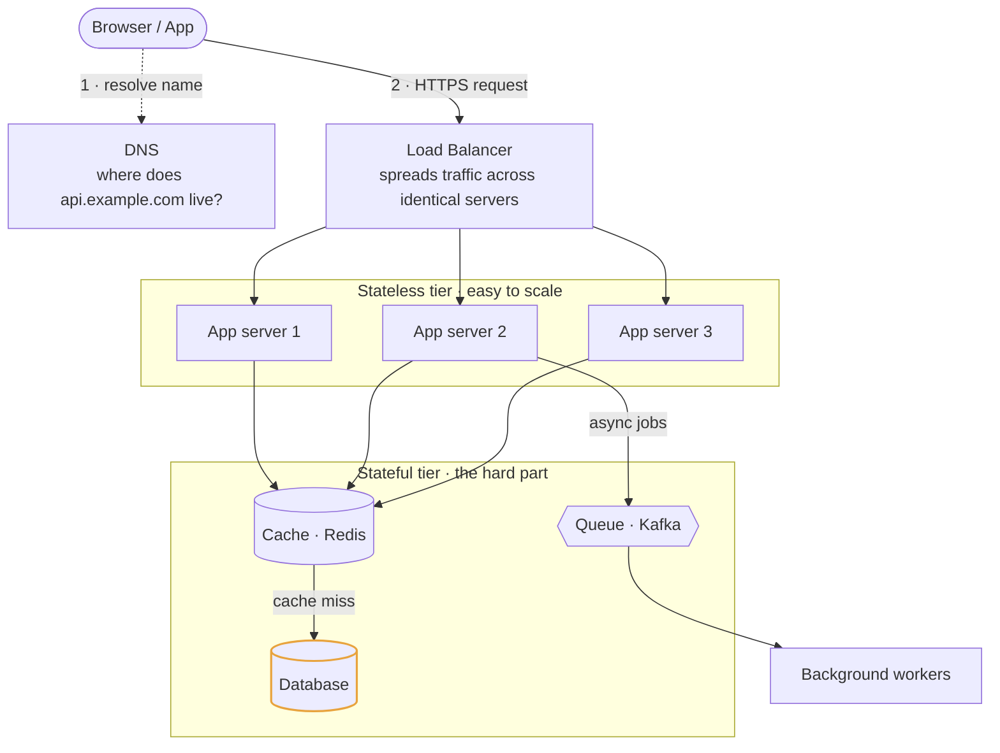

# Module 1: Foundations

Before you can design a system, you need vocabulary for what a system *is* and what makes it slow, expensive, or fragile.

---

## 1.1 The basic shape of a web system

Almost every system you'll be asked to design is a variation on this:



<details>
<summary>Plain-text version of this diagram</summary>

```text
                    ┌──────────┐
   [Browser/App] ───│   DNS    │  "where does api.example.com live?"
        │           └──────────┘
        │  HTTPS request
        v
   ┌─────────────┐
   │ Load        │   spreads traffic across many identical servers
   │ Balancer    │
   └──────┬──────┘
          │
    ┌─────┴─────┬───────────┐
    v           v           v
 [App srv 1] [App srv 2] [App srv 3]     <- the "stateless" tier
    │           │           │
    └─────┬─────┴───────────┘
          v
   ┌─────────────┐      ┌──────────┐
   │  Cache      │      │  Queue   │  -> [background workers]
   │  (Redis)    │      │  (Kafka) │
   └──────┬──────┘      └──────────┘
          v
   ┌─────────────┐
   │  Database   │  <- the "stateful" tier, the hard part
   └─────────────┘
```

</details>

**The key insight:** the app servers are easy. You can add a hundred of them in an afternoon. Everything hard in system design lives in the boxes that hold state — the database, the cache, the queue — because state can't simply be duplicated without raising questions about which copy is correct.

---

## 1.2 Latency vs throughput

These get confused constantly. They are not the same thing and improving one can hurt the other.

- **Latency** is *how long one operation takes*. "This API call returns in 40 milliseconds."
- **Throughput** is *how many operations complete per unit time*. "This service handles 50,000 requests per second."

An analogy: a highway. Latency is how long your individual car takes to drive from A to B. Throughput is how many cars per hour the highway moves. Adding lanes increases throughput without making any individual car faster. Raising the speed limit reduces latency. They're independent dials.

**Why this matters in interviews:** batching is the classic trade. If you batch 100 database writes into one round trip, throughput goes way up (fewer network round trips, less per-request overhead) but latency for the first item in the batch goes up too, because it now waits for 99 friends before being sent. Whenever you propose batching, say out loud that you're trading latency for throughput.

### Percentiles, and why averages lie

Never describe latency as an average. Use percentiles:

- **p50 (median)**: half of requests are faster than this
- **p95**: 95% of requests are faster than this
- **p99**: 99% are faster; the slowest 1% are worse

Why averages lie: imagine 99 requests at 10ms and 1 request at 5,000ms. The average is ~60ms, which sounds fine and describes exactly zero of your actual requests. Meanwhile 1% of your users had a 5-second wait.

**Tail latency amplification** is the reason p99 matters more than you'd think. If a single page load makes 10 backend calls in parallel and each has a 1% chance of being slow, the chance that *at least one* is slow is about 1 - 0.99^10 ≈ 9.6%. So a 1% backend tail becomes a ~10% user-visible tail. At companies like Google and Amazon this is a first-class concern, and mentioning it in an interview is a strong senior signal.

---

## 1.3 Latency numbers you should have rough intuition for

You don't need to memorize these exactly. You need the *orders of magnitude*, because they determine architecture.

| Operation | Rough time | Relative feel |
|---|---|---|
| L1 cache reference | 1 ns | baseline |
| Main memory (RAM) reference | 100 ns | 100x slower than L1 |
| Read 1 MB sequentially from RAM | ~10 µs | — |
| SSD random read | ~100 µs | 1,000x slower than RAM |
| Read 1 MB from SSD | ~200 µs | — |
| Network round trip within same datacenter | ~500 µs | — |
| Disk (spinning HDD) seek | ~10 ms | 100,000x slower than RAM |
| Network round trip across continents | ~150 ms | — |

**The takeaways that actually drive design:**

1. **RAM is ~1000x faster than SSD, which is ~100x faster than spinning disk.** This is the entire justification for caching. When you say "put Redis in front of the database," what you mean is "serve from RAM instead of disk."
2. **Cross-continent network calls are ~150ms, and that's physics.** Light in fiber takes roughly 60ms to cross the Atlantic and back. You cannot optimize this away with better code. The only fix is to *not make the call* — put a copy of the data near the user (CDN, regional replicas). This is why global systems are multi-region.
3. **Sequential reads massively beat random reads** on both disk and SSD. This is why databases use B-trees and LSM-trees, why Kafka is fast (it writes sequentially to an append-only log), and why "scan a range" is cheap while "look up a million random keys" is expensive.

---

## 1.4 Vertical vs horizontal scaling

**Vertical scaling (scaling up)**: buy a bigger machine. More CPU cores, more RAM, faster disks.

- Pros: zero code changes. Your app doesn't know or care. No distributed systems problems.
- Cons: there's a ceiling (the biggest machine money can buy). Cost grows superlinearly — the top-end machine costs far more than 4x a machine 1/4 its size. And it's a single point of failure: one machine, one power supply, one thing to die.

**Horizontal scaling (scaling out)**: add more machines and spread work across them.

- Pros: effectively unlimited ceiling. Commodity hardware is cheap. Natural redundancy — if one of fifty machines dies, you lose 2% of capacity, not 100%.
- Cons: you now have a distributed system. Machines must coordinate. Data must be partitioned or replicated. Every problem in Modules 2 and 3 exists *because* of horizontal scaling.

**The practical reality to state in an interview:** scale the stateless tier horizontally without hesitation — that's the easy part. Scale the *database* vertically as long as you can, because sharding a database is genuinely painful, and only shard when you've exhausted vertical scaling, read replicas, and caching. Candidates who reach for sharding on slide one look inexperienced.

---

## 1.5 Stateless vs stateful services

A **stateless** service holds no per-user data between requests. Every request carries everything needed to process it (usually a token identifying the user). Any server can handle any request.

A **stateful** service remembers things between requests — a user's session stored in that specific server's memory, an open WebSocket connection, a file on local disk.

**Why statelessness is the goal:**

```
STATEFUL (bad for scaling):
  User A's session lives in server 2's memory.
  -> User A MUST always be routed to server 2 ("sticky sessions")
  -> Server 2 dies -> User A is logged out
  -> Can't add/remove servers freely
  -> Load balancing is constrained

STATELESS (good):
  Session data lives in Redis / a token / a database.
  -> Any server can serve any request
  -> A server dies -> traffic silently shifts, nobody notices
  -> Add servers at will; autoscaling works
```

The move is to **push state down into a shared store** (Redis for sessions, a database for data, object storage for files), so the compute tier stays disposable. "I'd keep the application tier stateless and externalize session state to Redis so I can autoscale freely" is a sentence worth having ready.

**The exception you should name:** WebSocket gateways are inherently stateful because they hold an open connection to a specific user. You handle this with a connection registry (a lookup table of user → which gateway node holds their connection) so other services can route messages to the right node. More on this in Module 7.

---

## 1.6 Load balancing

A load balancer sits in front of your servers and distributes incoming requests. It's also where health checking lives: it stops sending traffic to servers that fail health checks.

### Layer 4 vs Layer 7

- **L4 (transport layer)**: routes based on IP address and port. It doesn't look inside the request. Very fast, very cheap, but dumb — it can't route `/api/images` differently from `/api/checkout`.
- **L7 (application layer)**: parses the HTTP request. Can route by path, header, cookie, or hostname. Enables things like sending `/video/*` to a specialized fleet. Slower and more CPU-hungry, but far more capable. Most modern setups use L7.

### Algorithms

| Algorithm | How it works | When to use it |
|---|---|---|
| **Round robin** | Requests go to each server in turn | Uniform servers, uniform request cost |
| **Weighted round robin** | Bigger servers get proportionally more | Mixed hardware generations |
| **Least connections** | Send to the server with the fewest open connections | Requests have highly variable duration |
| **Least response time** | Combines connection count and observed latency | Sensitive to uneven server performance |
| **Consistent hashing** | Hash a key (e.g. user ID) to pick a server, stably | When you *want* the same user to hit the same node — cache locality, stateful nodes |
| **Random with two choices** | Pick two servers at random, send to the less loaded one | Surprisingly effective; avoids the herd effects of "always pick least loaded" |

"Random with two choices" is a nice thing to know: naive least-connections can cause herding, where every load balancer simultaneously decides the same idle server is the best choice and stampedes it. Picking two at random and taking the better one avoids this while getting most of the benefit.

### The load balancer itself is a single point of failure

If you draw one box labeled "Load Balancer" and move on, a good interviewer will ask what happens when it dies. The answers:

- Run load balancers in an **active-passive pair** with a floating/virtual IP that fails over.
- Use **DNS round robin** to hand out multiple load balancer IPs.
- Use **anycast**, where the same IP is announced from multiple locations and network routing sends users to the nearest one.
- In practice, use your cloud provider's managed load balancer, which does all of this internally.

---

## 1.7 The proxy family (and how they differ)

These four terms get used loosely. Know the distinction:

- **Forward proxy**: sits in front of *clients*, makes requests on their behalf. Used for corporate egress filtering, anonymity.
- **Reverse proxy**: sits in front of *servers*, receives requests on their behalf. Handles TLS termination, compression, static file serving, and request routing. Nginx is the canonical example. A load balancer is a kind of reverse proxy.
- **API gateway**: a reverse proxy with product features bolted on — authentication, rate limiting, request validation, usage metering, request aggregation across microservices. Covered in Module 7.
- **CDN**: a globally distributed network of reverse proxies that cache content close to users. Covered in Module 4.

---

## 1.8 Back-of-the-envelope estimation

You will be asked to size a system. The point is not arithmetic accuracy — it's whether your numbers *drive a decision*.

### The units to have memorized

| Quantity | Bytes |
|---|---|
| 1 KB | 10³ |
| 1 MB | 10⁶ |
| 1 GB | 10⁹ |
| 1 TB | 10¹² |
| 1 PB | 10¹⁵ |

Seconds in a day: **86,400**, but round to **10⁵** for mental math. This is the single most useful estimation shortcut.

### A worked example

*"Design a URL shortener. Size it."*

```
Assume 100 million new URLs created per day.

WRITE throughput:
  100M / 10^5 sec  =  1,000 writes/sec
  Peak (assume 3x):   3,000 writes/sec

READ throughput:
  Assume 100:1 read:write ratio (links get clicked more than created)
  = 100,000 reads/sec average

STORAGE:
  Per record: short_code(7B) + long_url(~100B) + user_id(8B) + created_at(8B)
             + overhead  ≈  500 bytes
  Per day:    100M × 500B = 50 GB/day
  Per year:   50 GB × 365 ≈ 18 TB/year
  5 years:    ~90 TB

BANDWIDTH:
  Reads: 100,000/sec × 500B = 50 MB/sec
```

**Now use the numbers.** This is the step candidates skip:

- 3,000 writes/sec is comfortably within one well-tuned relational database's capability. So don't shard on day one.
- 90 TB over five years does *not* fit on one machine. So you will eventually need sharding or a distributed store. Say that you'd design the schema to be shardable (partition by short code hash) even if you launch unsharded.
- The 100:1 read:write ratio is the important number. It says: this is a read-heavy system, so aggressive caching is the highest-leverage optimization. A cache holding the hottest 20% of URLs might serve 80%+ of traffic.

That last paragraph is what separates a senior answer from a junior one. The arithmetic is the setup; the conclusions are the answer.

---

## 1.9 Availability math

Availability is usually expressed in "nines":

| Nines | Availability | Downtime per year | Downtime per month |
|---|---|---|---|
| 2 nines | 99% | 3.65 days | 7.2 hours |
| 3 nines | 99.9% | 8.77 hours | 43.8 min |
| 4 nines | 99.99% | 52.6 min | 4.4 min |
| 5 nines | 99.999% | 5.26 min | 26 sec |

**Two rules that matter:**

**Dependencies multiply.** If your service calls three others, each 99.9% available, and you need all three, your ceiling is 0.999³ ≈ 99.7%. Every synchronous dependency you add lowers your maximum achievable availability. This is a strong argument for making non-critical calls asynchronous, or for degrading gracefully when a dependency is down (Module 8).

**Redundancy adds nines.** Two independent components each 99% available, where you only need *one* to work, gives 1 - (0.01 × 0.01) = 99.99%. This is why redundancy is the universal answer to availability questions. The catch is the word *independent* — two servers in the same rack sharing a power supply are not independent, which is why cloud providers push you across availability zones.

---

## Interview checklist for this module

- [ ] Can you state latency vs throughput and give an example where they trade off?
- [ ] Do you talk in p99, not averages?
- [ ] Can you justify caching using the RAM-vs-disk speed gap?
- [ ] Do you scale stateless tiers horizontally and defer database sharding?
- [ ] Do your estimates end in a *decision*, not just a number?
- [ ] Do you notice when a design has a single point of failure?
