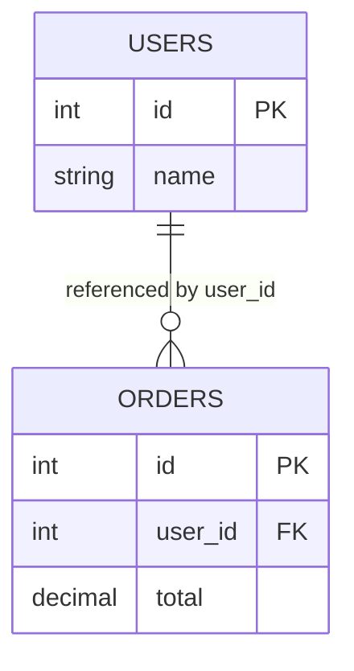
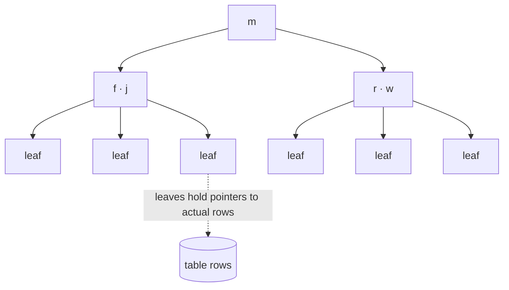
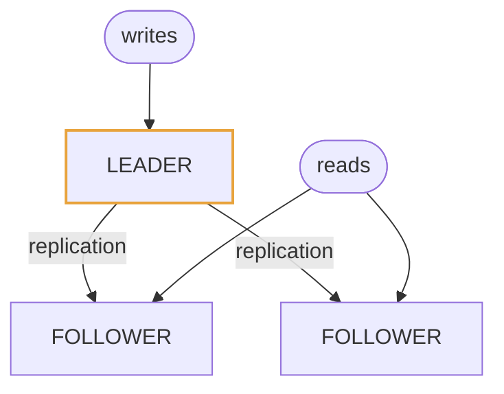
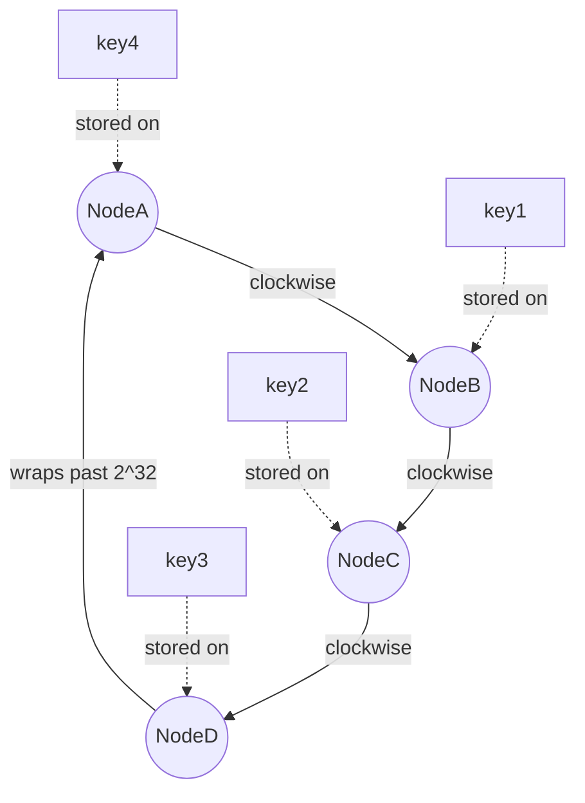

# Module 2: Data Storage

The database is where system design gets hard. This module covers how data is stored, indexed, copied, and split.

---

## 2.1 Relational (SQL) databases

A relational database stores data in **tables** — rows and columns with a fixed **schema** (a declared structure: this column is an integer, that one is a string, this one can't be null).

Its defining feature is the **join**: because data is stored *normalized* (each fact in exactly one place, with references between tables), you can combine tables at query time.



<details>
<summary>Plain-text version of this diagram</summary>

```text
users                     orders
┌────┬─────────┐         ┌────┬─────────┬────────┐
│ id │ name    │         │ id │ user_id │ total  │
├────┼─────────┤         ├────┼─────────┼────────┤
│ 1  │ Alice   │◄────────┤ 10 │    1    │ 42.00  │
│ 2  │ Bob     │         │ 11 │    1    │ 17.50  │
└────┴─────────┘         │ 12 │    2    │ 99.00  │
                          └────┴─────────┴────────┘
     "Alice" is stored ONCE. Orders reference her by id.
```

</details>

**Normalization** means eliminating duplicated data. If Alice changes her name, you update one row. Without normalization you'd update every order that stored her name, and if you missed one you'd have inconsistent data.

**Denormalization** is deliberately duplicating data to make reads faster — storing the user's name directly on the order row so you don't need a join. You trade write complexity and storage for read speed. This is a recurring theme: denormalization is what fan-out-on-write (Module 6) and caching (Module 4) both fundamentally are.

**When to pick relational:** complex queries with joins and aggregations, data with genuine relationships, workloads needing multi-row transactions (money movement, inventory, bookings), and anywhere the access patterns will change over time. Relational databases are flexible at query time because the schema doesn't lock you into one access path.

Modern relational systems (PostgreSQL, MySQL) scale much further than interview folklore suggests. A single well-tuned Postgres instance handles tens of thousands of writes per second and terabytes of data. Don't discard it reflexively.

---

## 2.2 NoSQL databases

"NoSQL" isn't one thing. It's four different families that share only "not a traditional relational database."

### Key-value stores
*(Redis, DynamoDB in simple mode, Memcached)*

A giant hash map: `key → blob`. You can get, set, and delete by key. You cannot query by value.

```
"user:1234"        → {name: "Alice", email: "a@x.com"}
"session:abc987"   → {user_id: 1234, expires: ...}
"counter:views:42" → 19823
```

Extremely fast, trivially partitionable (hash the key, pick a node). Used for caches, session stores, counters, feature flags, rate limiter state.

### Wide-column stores
*(Cassandra, DynamoDB, HBase, Bigtable)*

The one most relevant to interviews. Data is organized as:

```
PARTITION KEY  +  SORT KEY(s)  →  columns

user_id=1234 │ timestamp=2026-09-14T10:00 │ {event: "comment", repo: "..."}
user_id=1234 │ timestamp=2026-09-14T10:05 │ {event: "mention", repo: "..."}
user_id=1234 │ timestamp=2026-09-14T11:22 │ {event: "ci_fail", repo: "..."}
user_id=5678 │ timestamp=2026-09-14T09:00 │ {event: "review", repo: "..."}
```

The **partition key** decides which machine the data lives on. The **sort key** orders rows *within* that partition. This gives you one killer access pattern: "give me the most recent N rows for this partition key," served by reading a contiguous, already-sorted run of data from one machine. No scatter-gather, no join, no sorting at query time.

That's exactly the shape of a notification inbox, a chat history, a user's timeline, or a time-series metric stream. Whenever the access pattern is "recent items belonging to one entity," wide-column is the natural fit, and you should say so with that justification rather than just naming Cassandra.

**The critical constraint:** you must design the schema *around* your queries. You can't easily ask a new question later. If you need the same data sorted two ways, you store it twice. In relational you design the data and query it however; in wide-column you design the query and store data to match.

### Document stores
*(MongoDB, CouchDB)*

Store JSON-like documents. Flexible schema — different documents in the same collection can have different fields. Good when records are naturally self-contained and nested (a product catalog entry with variable attributes; a CMS article with arbitrary blocks). Supports querying on fields, unlike pure key-value.

### Graph databases
*(Neo4j, Neptune)*

Store nodes and edges, optimized for traversal: "friends of friends of friends," "shortest path," "who is connected to whom." In a relational database that's a self-join repeated N times, which degrades badly. Graph databases make it cheap. Relevant for social graphs, fraud rings, recommendation engines, dependency graphs.

---

## 2.3 How to actually choose

Do not say "NoSQL because it scales." That's the answer that gets probed and collapses. Reason from access patterns:

| If you need... | Pick |
|---|---|
| Multi-row transactions, strong invariants (money, inventory) | Relational |
| Ad-hoc queries, joins, reporting, evolving query needs | Relational |
| "Recent N items for one entity," massive write volume | Wide-column |
| Simple get/set by key, sub-millisecond, ephemeral | Key-value |
| Self-contained nested records, flexible fields | Document |
| Relationship traversal is the core query | Graph |
| Full-text search, relevance ranking, fuzzy matching | Search engine (Module 9) |
| Large binary files (images, video, backups) | Object storage (Module 9) |

**Polyglot persistence** is the real-world answer: one system uses several. Postgres for accounts and billing, Cassandra for the activity feed, Redis for sessions, Elasticsearch for search, S3 for uploads. Saying this shows you understand that "which database" is a per-workload question, not a per-company one.

---

## 2.4 Indexes

An index is a separate data structure that makes lookups fast, at the cost of storage and slower writes.

Without an index, finding all rows where `email = 'a@x.com'` requires reading every row — a **full table scan**, O(n). With an index on `email`, the database does an O(log n) lookup.

The standard implementation is a **B-tree**: a balanced tree with high fan-out, so even a billion rows is only ~4 levels deep, meaning ~4 disk reads instead of millions.



<details>
<summary>Plain-text version of this diagram</summary>

```text
                 [ m ]
               /       \
        [ f | j ]      [ r | w ]
        /   |   \      /   |   \
     ...  ...  ...   ...  ...  ...     <- leaves contain pointers to actual rows
```

</details>

**The costs, which you should mention when you propose an index:**

- Every index must be updated on every insert, update, and delete. Five indexes means a single-row insert does six writes. Indexes make reads fast and writes slow.
- Indexes consume storage, often a significant fraction of the table size.

**Concepts worth knowing by name:**

- **Composite index**: an index on `(a, b)` in that order. It can serve queries filtering on `a`, or on `a AND b`, but *not* on `b` alone — think of it like a phone book sorted by (last name, first name). You can't find everyone named "James" without scanning.
- **Covering index**: an index that contains all columns the query needs, so the database never has to go fetch the actual row. Dramatically faster.
- **Clustered index**: the table itself is physically stored in index order (this is what the primary key does in MySQL/InnoDB). There can be only one, since data can only be laid out one way.
- **LSM-tree** (Log-Structured Merge tree): the alternative to B-trees, used by Cassandra, RocksDB, LevelDB. Writes go to an in-memory structure and are flushed to disk as sorted files, which are periodically merged ("compacted"). Result: writes are sequential and extremely fast; reads may need to check several files, so they're somewhat slower. **B-tree = read-optimized, LSM-tree = write-optimized.** That one sentence is usually enough for an interview, and explains why write-heavy systems favor Cassandra-family stores.

---

## 2.5 Replication

Replication means keeping copies of the same data on multiple machines. It buys three things: **availability** (a replica takes over when the primary dies), **read scalability** (spread reads across copies), and **locality** (put a copy near the user).

### Leader–follower (primary–replica)



<details>
<summary>Plain-text version of this diagram</summary>

```text
        writes
          │
          v
    ┌──────────┐
    │  LEADER  │ ──replication──┬──────────┐
    └──────────┘                v          v
                          ┌─────────┐ ┌─────────┐
                          │FOLLOWER │ │FOLLOWER │
                          └─────────┘ └─────────┘
                               ^           ^
                               └─ reads ───┘
```

</details>

All writes go to the leader. The leader streams its change log to followers. Reads can go to any node.

**Synchronous replication**: the leader waits for the follower to confirm before acknowledging the write to the client. No data loss on failover, but the write is as slow as your slowest follower, and if a follower is down, writes stall.

**Asynchronous replication**: the leader acknowledges immediately and ships changes in the background. Fast, and a dead follower doesn't block anything — but if the leader dies before the changes propagate, those writes are lost.

**Semi-synchronous** is the common compromise: wait for *one* follower to confirm, let the rest lag.

### Replication lag, and the bugs it causes

With async replication, a follower is always slightly behind. This produces a classic and very interviewable bug:

> A user posts a comment (write → leader). The page reloads and reads from a follower that hasn't received it yet. **Their own comment has vanished.**

This violates **read-your-own-writes consistency**. Fixes, in increasing order of cost:

1. Route reads to the leader for a short window after that user writes.
2. Route reads for data the user owns to the leader always.
3. Track a logical timestamp of the user's last write and only read from replicas that have caught up past it.

Related guarantees you should be able to name:

- **Monotonic reads**: a user never sees time go backwards (read from replica A which is current, then replica B which is stale, and data appears to un-happen). Fixed by pinning each user to a consistent replica.
- **Consistent prefix reads**: causally related writes are seen in order (you never see the answer before the question). Relevant in sharded systems where related writes land on different partitions.

### Multi-leader and leaderless

- **Multi-leader**: several nodes accept writes, typically one per region. Great for write latency and cross-region availability, but introduces **write conflicts** — two regions editing the same record. You need a conflict resolution strategy: last-write-wins (simple, loses data), application-level merge, or CRDTs (data types mathematically designed to merge without conflict, used by collaborative editors).
- **Leaderless** (Dynamo-style, used by Cassandra): the client writes to several nodes at once and reads from several at once, using **quorums** to decide what's correct. Covered in Module 3.

---

## 2.6 Sharding (partitioning)

Replication copies the *same* data. Sharding splits *different* data across machines. You shard when one machine can no longer hold the data or absorb the write volume.

```
REPLICATION: every node has everything
  Node1: [A B C D]   Node2: [A B C D]   Node3: [A B C D]

SHARDING: each node has a slice
  Node1: [A B]       Node2: [C D]       Node3: [E F]
```

### Sharding strategies

**Range-based**: split by value ranges. Users A–F on shard 1, G–M on shard 2, etc.
- Pro: range queries stay efficient ("all users between M and P" hits one shard).
- Con: **hotspots**. Real data isn't uniformly distributed — far more surnames start with S than X. Worse, if you range-shard by timestamp, *all current writes* hit the newest shard while older shards idle. This is a classic trap.

**Hash-based**: compute `hash(key) % N` and use the result to pick a shard.
- Pro: near-perfect even distribution.
- Con: range queries now hit every shard (scatter-gather). And resharding is brutal — see below.

**Directory-based**: a lookup service maps key → shard.
- Pro: total flexibility, easy to move individual keys, easy to rebalance.
- Con: the directory is an extra hop and a potential single point of failure. It must itself be replicated and cached.

**Geographic**: shard by user region. Good for data residency laws (GDPR) and latency, awkward for users who travel or for cross-region queries.

### Why naive modulo hashing breaks

Suppose you have 4 shards and use `hash(key) % 4`. Now you add a fifth shard. Every key's destination changes from `% 4` to `% 5`, so roughly **80% of your data must move**. During that migration, your cache is useless and your database is saturated. This is the problem consistent hashing solves.

---

## 2.7 Consistent hashing

The idea: map both the *keys* and the *nodes* onto the same circular space (a "ring") of hash values from 0 to 2³²-1. A key belongs to the first node encountered moving clockwise from the key's position.



<details>
<summary>Plain-text version of this diagram</summary>

```text
                    0 / 2^32
                        │
              NodeA ────┼──── key1
                   ╱    │    ╲
                  ╱     │     ╲ NodeB
            key4 │      ●      │
                  ╲           ╱  key2
              NodeD ╲       ╱
                      ────────  NodeC
                         key3

  key1 -> NodeB   (first node clockwise)
  key2 -> NodeC
  key3 -> NodeD
  key4 -> NodeA
```

</details>

**Now add NodeE between NodeB and NodeC.** Only the keys that sat between NodeB and NodeE move — roughly `1/N` of the data. Nothing else is disturbed. Removing a node is equally surgical: only its keys move, to the next node clockwise.

**The refinement: virtual nodes.** With only a handful of physical nodes placed randomly on the ring, the arcs between them will be uneven, so some nodes get far more data than others. The fix is to place each physical node at many positions on the ring (say 150 "virtual nodes" each). Averaging over 150 random placements makes the distribution smooth. Virtual nodes also let you weight heterogeneous hardware — give a bigger machine more virtual nodes.

**Where consistent hashing appears:** Cassandra and DynamoDB's partitioning, Memcached client libraries, CDN edge selection, and any load balancer that needs sticky routing. If an interviewer asks "how do you add a shard without downtime," this is the answer.

---

## 2.8 Hot partitions and the celebrity problem

Even with perfect hashing, one *key* can be too popular. If you partition by `repo_id` and one repo is Linux with millions of watchers, that single partition receives orders of magnitude more traffic than any other. No amount of adding nodes helps, because all that traffic maps to one partition.

Mitigations:

- **Key salting / composite keys**: split the hot key into `repo:123#bucket0` … `repo:123#bucketN`, spreading it across partitions. Reads must now query all buckets and merge — you've traded read complexity for write distribution.
- **Dedicated caching** for hot keys, absorbing reads before they reach storage.
- **Special-case handling**: treat celebrity entities with a different code path entirely. This is exactly the hybrid fan-out strategy in Module 6.

Identifying the hot-partition risk in your own design, unprompted, is one of the highest-value things you can do in an interview.

---

## 2.9 Choosing a partition key: the checklist

When you say "I'd partition by X," be ready to defend it on four axes:

1. **Cardinality** — are there enough distinct values to spread across many nodes? Partitioning by `country` gives you ~200 partitions, badly skewed. Partitioning by `user_id` gives you millions, evenly.
2. **Distribution** — is traffic per key roughly even, or are there celebrities?
3. **Query alignment** — do your most common queries include this key? If not, every query becomes a scatter-gather across all shards.
4. **Growth** — does it avoid monotonic hotspots? Timestamps and auto-increment IDs concentrate all new writes on one shard.

---

## Interview checklist for this module

- [ ] Can you justify a database choice from access patterns, not buzzwords?
- [ ] Can you explain what a partition key and sort key do, and why that suits feed-like reads?
- [ ] Can you explain replication lag and the read-your-own-writes bug?
- [ ] Can you explain why `hash % N` breaks on resharding, and how consistent hashing fixes it?
- [ ] Do you proactively flag hot-partition risk in your own partition key choice?
- [ ] Do you mention that indexes slow down writes when you propose one?
