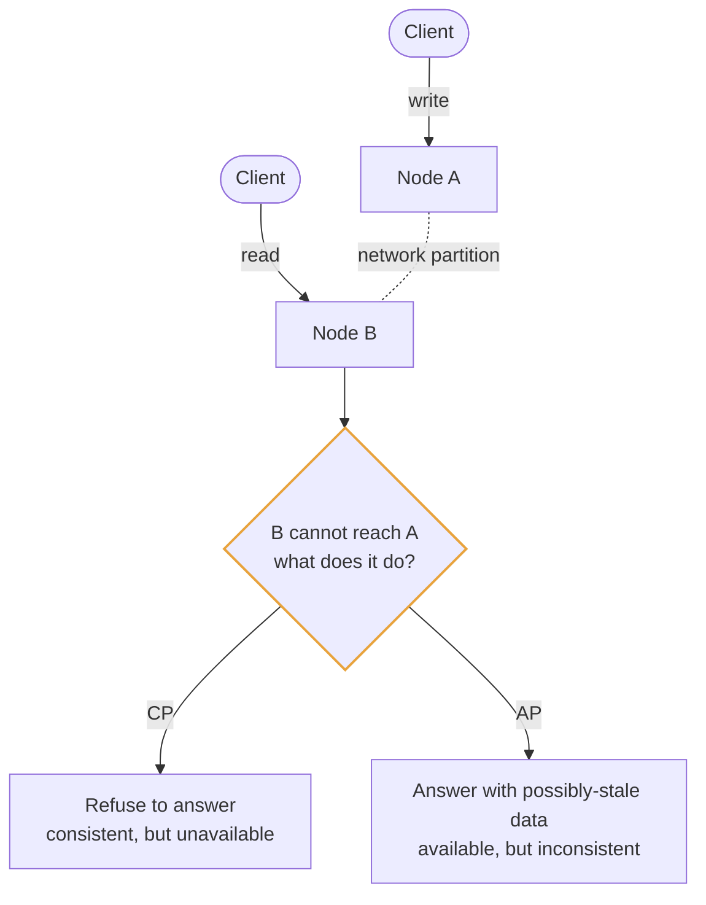
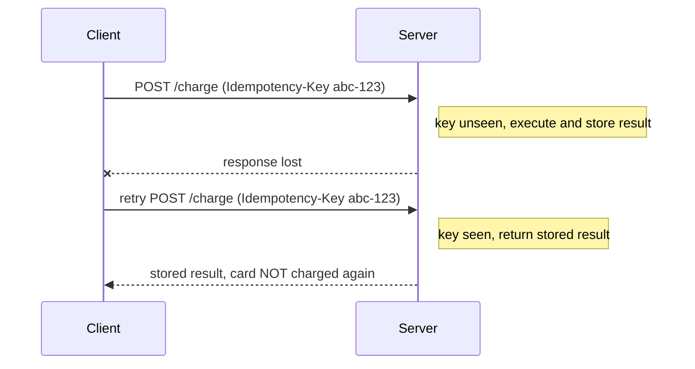
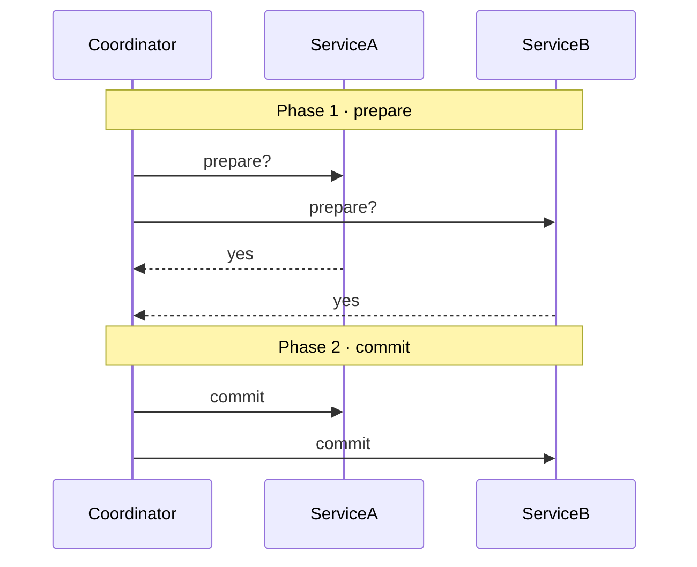
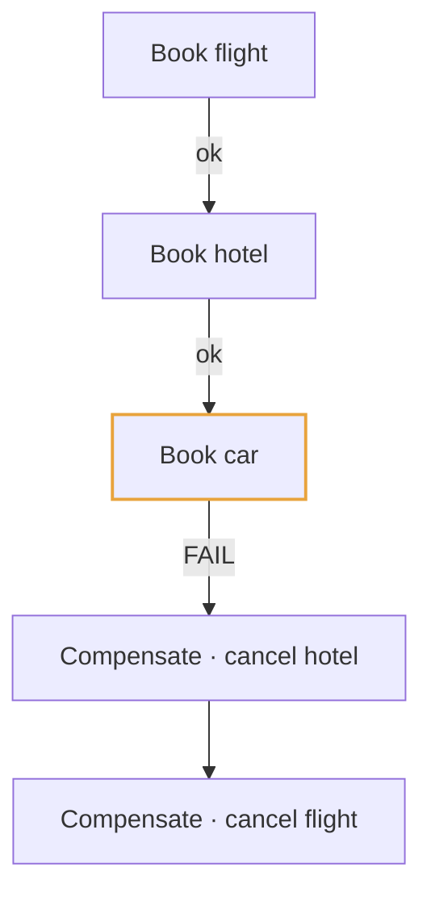

# Module 3: Consistency and Distributed Systems Theory

This is the module that makes senior candidates sound senior. The ideas are abstract, so every one is grounded below.

---

## 3.1 Why any of this exists

The moment you have more than one copy of data on more than one machine connected by a network, three unpleasant facts apply:

1. **Networks fail.** Packets drop, links partition, a switch dies. Two halves of your system can each be alive and unable to talk to the other.
2. **You cannot distinguish "slow" from "dead."** If node B doesn't answer node A, B might be crashed, or overloaded, or the network between them might be broken while B happily serves other traffic. A has no way to tell.
3. **Clocks disagree.** Machine clocks drift. "Which write happened first" is not a question physics answers cleanly across machines.

Everything below is a strategy for making useful guarantees despite these facts.

---

## 3.2 CAP theorem

CAP states that during a **network partition**, a distributed system must choose between consistency and availability.

- **C — Consistency** (here meaning *linearizability*): every read sees the most recent write. The system behaves as if there's one copy.
- **A — Availability**: every request to a non-failed node gets a non-error response.
- **P — Partition tolerance**: the system keeps working despite messages being lost between nodes.

**The most common misstatement:** "pick two of three." That's wrong and interviewers notice. Networks partition whether you like it or not, so **P is not optional**. The real statement is: *when a partition happens, you must choose C or A.*



**How to use this in an interview:** don't recite the theorem. Make the choice and justify it from product requirements.

- *"For the notification inbox I'd choose AP. Showing a slightly stale unread count for two seconds is invisible to users; refusing to load the page is not."*
- *"For the payment ledger I'd choose CP. Double-spending money is unacceptable, so I'd rather return an error and retry."*

That framing — naming the business consequence of each failure mode — is what scores.

### PACELC: the more honest version

CAP only describes behavior *during* a partition, which is rare. PACELC extends it:

> **If Partition, choose Availability or Consistency; Else, choose Latency or Consistency.**

The "else" half is the one that governs your system 99.99% of the time. Even with a healthy network, strong consistency costs latency, because the nodes must coordinate before answering. Every synchronous cross-node agreement is a round trip you're paying for on every request. Mentioning PACELC signals you understand the trade-off exists in normal operation, not just during outages.

---

## 3.3 The spectrum of consistency models

Consistency isn't binary. From strongest (and slowest) to weakest (and fastest):

| Model | Guarantee | Cost |
|---|---|---|
| **Linearizable / strong** | Reads always return the latest committed write; system appears as one copy | Coordination on every operation; highest latency; unavailable during partitions |
| **Sequential** | All nodes see operations in the same order, but that order may lag real time | Cheaper than linearizable |
| **Causal** | If A caused B, everyone sees A before B; unrelated operations may be seen in any order | Much cheaper; often enough in practice |
| **Read-your-own-writes** | You always see your own writes; others may lag | Cheap, achieved by routing |
| **Monotonic reads** | You never see time go backwards | Cheap, achieved by replica pinning |
| **Eventual** | If writes stop, all replicas eventually converge. No guarantee about when. | Cheapest, highest availability |

**"Eventual consistency" is not a euphemism for "broken."** It's a real guarantee: convergence. The engineering question is whether the convergence window is acceptable for the use case, and whether users can observe anomalies during it. A like counter that's off by three for two seconds is fine. A bank balance that's off by three for two seconds is not.

The senior move is to apply *different models to different data in the same system*: strong consistency for the account balance, eventual for the activity feed, causal for the comment thread.

---

## 3.4 ACID vs BASE

**ACID** describes traditional transactional guarantees:

- **Atomicity** — all operations in a transaction succeed or none do. Transfer money: debit and credit both happen, or neither. There is no state where money vanished.
- **Consistency** (different meaning from CAP's C!) — the transaction moves the database from one valid state to another, respecting constraints like foreign keys and uniqueness.
- **Isolation** — concurrent transactions don't see each other's partial work. The strongest level, serializability, means the result is as if they ran one at a time.
- **Durability** — once committed, it survives a crash. Usually via a write-ahead log flushed to disk.

**Isolation levels** are worth knowing because they're a latency/correctness dial:

| Level | Prevents | Still allows |
|---|---|---|
| Read uncommitted | nothing much | dirty reads (seeing uncommitted data) |
| Read committed | dirty reads | non-repeatable reads (same query, different answer within one transaction) |
| Repeatable read | non-repeatable reads | phantom reads (new rows appearing in a range) |
| Serializable | everything | (slowest) |

**BASE** is the contrasting philosophy of AP systems:
- **Basically Available** — the system responds, even if degraded
- **Soft state** — state may change without input as replicas converge
- **Eventual consistency** — convergence is guaranteed, timing is not

---

## 3.5 Quorums

In leaderless systems (Cassandra, Dynamo), there's no single authority. Instead the client writes to and reads from *several* replicas, and uses counting to establish correctness.

Define:
- **N** = number of replicas holding each piece of data
- **W** = number that must acknowledge a write for it to count as successful
- **R** = number that must respond to a read

**The rule: if `W + R > N`, the read set and write set must overlap by at least one node, so at least one node in your read has the latest write.** That gives strong consistency.

```
N = 3 replicas:  [ R1 ][ R2 ][ R3 ]

W=2, R=2  ->  W+R = 4 > 3  ->  guaranteed overlap
   write went to R1,R2
   read hits    R2,R3  -> R2 has it. Correct.

W=1, R=1  ->  W+R = 2 < 3  ->  no overlap guarantee
   write went to R1
   read hits    R3      -> stale. Fast, but eventually consistent.
```

The dial this gives you:
- **W=N, R=1**: fast reads, slow writes, write unavailable if any replica is down. Good for read-heavy, rarely-written data.
- **W=1, R=N**: fast writes, slow reads. Good for write-heavy logging.
- **W=R=⌈(N+1)/2⌉** (e.g. 2 of 3): balanced, the common default.

**Supporting mechanisms to name:**
- **Read repair**: when a read detects that some replicas are stale, it writes the fresh value back to them. Consistency is repaired as a side effect of normal traffic.
- **Hinted handoff**: if a target replica is down during a write, a different node accepts the write and holds a "hint" to forward it when the node returns. Improves write availability.
- **Anti-entropy / Merkle trees**: a background process compares replicas efficiently (hashing tree structures so you only transfer differing ranges) and reconciles differences.

---

## 3.6 Consensus: Paxos and Raft

Quorums handle single-value replication. **Consensus** is the harder problem of getting a group of nodes to agree on an *ordered sequence* of values despite failures. It's what you need for leader election, distributed locks, and configuration that must be globally correct.

**Raft** is the one to be able to describe, because it's designed for comprehensibility:

1. Nodes are in one of three states: **follower**, **candidate**, or **leader**.
2. Followers expect regular heartbeats from the leader. If a follower's randomized election timeout expires with no heartbeat, it becomes a candidate and requests votes.
3. A candidate that receives votes from a **majority** becomes leader. Randomized timeouts make simultaneous candidacies rare, and if a split vote happens, the round simply retries.
4. All writes go to the leader, which appends to its log and replicates to followers. Once a **majority** have persisted an entry, it is **committed** and can be applied.

**Why majorities:** a majority in a group of N can only exist on one side of any partition. This structurally prevents split-brain (two nodes both believing they're leader and both accepting writes). It's also why consensus clusters have odd sizes — 3, 5, 7. A 3-node cluster tolerates 1 failure; 5 tolerates 2. Going even (4 nodes) tolerates the same 1 failure as 3 while costing more, so it's strictly worse.

**Where you'll actually meet consensus:** ZooKeeper, etcd, and Consul are consensus-backed coordination services. Kubernetes stores its state in etcd. Kafka uses a controller elected this way. You almost never implement consensus — you *use* a system that provides it. The right interview move is: *"I'd use etcd/ZooKeeper for leader election here rather than building it, since consensus is easy to get subtly wrong."*

---

## 3.7 Idempotency

An operation is **idempotent** if performing it multiple times has the same effect as performing it once.

- `SET balance = 100` is idempotent.
- `ADD 50 TO balance` is **not** — running it twice adds 100.

**Why this matters constantly:** in a distributed system you can never be sure a request succeeded. You send a payment request; the network times out. Did it go through and the response was lost, or did it never arrive? You cannot know. Your only options are to retry (risking a double charge) or not retry (risking a lost payment). Idempotency makes retrying safe, which makes the whole problem go away.

**How to make things idempotent:**

1. **Idempotency keys.** The client generates a unique ID per logical operation and sends it with the request. The server records processed keys and, on seeing a repeat, returns the original result instead of re-executing. This is exactly how Stripe's API works.



2. **Natural idempotency by design.** Prefer "set state to X" over "increment." Prefer "ensure this row exists" (upsert) over "insert."
3. **Deduplication on consume.** Message queues deliver at-least-once, so consumers store processed message IDs and skip duplicates. The dedupe store needs a TTL so it doesn't grow forever.

Whenever you draw a retry arrow or a message queue in a design, immediately say how consumers stay idempotent. This is one of the most reliable ways to demonstrate distributed-systems maturity.

---

## 3.8 Distributed transactions

You need to change data in two places (two databases, or two microservices) and want all-or-nothing semantics.

### Two-phase commit (2PC)

A coordinator asks all participants "can you commit?" (prepare phase). If all say yes, it tells them all to commit. If any says no, it tells them all to abort.



**Why it's avoided in practice:** it's a **blocking** protocol. Between "yes" and "commit," each participant holds locks and cannot proceed independently. If the coordinator dies in that window, participants are stuck holding locks indefinitely. Availability of the whole system becomes the product of every participant's availability. It's rarely the right call across service boundaries.

### The saga pattern

Instead of one distributed transaction, run a sequence of *local* transactions, each with a defined **compensating action** that undoes it.



You give up atomicity and isolation. There are intermediate states where the flight is booked but the hotel isn't, and other transactions can observe them. In exchange you get availability and no distributed locking. Compensations must themselves be idempotent and retryable.

Sagas come in two flavors:
- **Orchestration**: a central coordinator service drives the steps. Easier to understand and debug; the orchestrator is a dependency.
- **Choreography**: each service listens for events and reacts. More decoupled; harder to trace what's happening overall.

### The transactional outbox

A very common practical problem: you need to update your database *and* publish an event. These are two systems, so one can succeed while the other fails.

The outbox pattern solves it: within the same local database transaction, write the business data *and* insert a row into an `outbox` table. A separate process reads the outbox and publishes to the message broker, marking rows as sent. Now there's only one transaction, atomicity holds, and publishing is at-least-once (hence: idempotent consumers).

This is a very strong thing to bring up when an interviewer asks "what if the database write succeeds but the Kafka publish fails?"

---

## 3.9 Time, ordering, and clocks

You cannot reliably order events across machines by wall-clock timestamp, because clocks drift and NTP corrections can make time jump backwards.

- **Lamport timestamps**: each node keeps a counter, increments on every event, and attaches it to messages; receivers set their counter to `max(local, received) + 1`. This gives a total order consistent with causality — if A caused B, A's timestamp is lower. It cannot tell you whether two events were *concurrent*.
- **Vector clocks**: each node tracks a vector of counters, one per node. This *can* detect concurrency, which is how Dynamo-style systems identify conflicting writes that need resolution.
- **Last-write-wins (LWW)**: resolve conflicts by timestamp. Simple, and silently discards data when clocks are skewed. Say this cost out loud if you propose LWW.
- **TrueTime** (Google Spanner): uses GPS and atomic clocks to bound clock uncertainty, then deliberately *waits out* the uncertainty interval before committing. This is how Spanner offers externally consistent global transactions — it buys consistency with hardware and latency.

---

## Interview checklist for this module

- [ ] Can you state CAP correctly (P is mandatory) and *choose* CP or AP with business justification?
- [ ] Can you mention PACELC's latency-vs-consistency trade in normal operation?
- [ ] Can you explain `W + R > N` and dial it for a read-heavy vs write-heavy workload?
- [ ] Can you describe Raft leader election and why majorities prevent split-brain?
- [ ] Do you specify an idempotency strategy every time you add retries or a queue?
- [ ] Can you argue for a saga over 2PC and explain the compensating actions?
- [ ] Can you name the outbox pattern when asked about dual writes?
