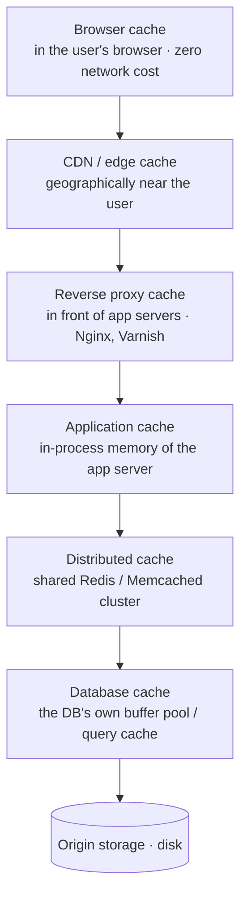

# Module 4: Caching

Caching is the highest-leverage optimization in most systems, and the source of the most confusing bugs.

---

## 4.1 What a cache is and why it works

A cache is a small, fast store holding a copy of data whose authoritative home is somewhere slower.

It works because real access patterns are not uniform. They exhibit:

- **Temporal locality** — data accessed recently is likely to be accessed again soon.
- **Spatial locality** — data near recently-accessed data is likely to be accessed.
- **Power-law distribution (the 80/20 rule)** — a small fraction of items receive the overwhelming majority of requests. On a social site, a tiny number of posts generate most views.

This is why a cache holding 1% of your data can serve 90% of your reads. The metric for this is **hit rate**: the fraction of requests served from cache.

The performance argument, from Module 1: RAM is roughly 1,000x faster than SSD and 100,000x faster than spinning disk. A cache hit costs microseconds; a database query costs milliseconds.

**Effective latency = (hit_rate × cache_latency) + (miss_rate × source_latency)**

With a 95% hit rate, 1ms cache, 50ms database: `0.95(1) + 0.05(50) = 3.45ms` average, down from 50ms. Note how brutally sensitive this is to hit rate. Dropping to 80% gives `0.8(1) + 0.2(50) = 10.8ms`, three times worse. Small hit-rate regressions cause large latency regressions, which is why cache hit rate is a primary monitoring metric.

---

## 4.2 Where caches live



Each layer closer to the user is faster but harder to invalidate — you cannot reach into a user's browser and delete something. This is why cache TTLs get shorter as you move toward the origin, and why you use content hashing in filenames (`app.a3f9c2.js`) for browser-cached assets: instead of invalidating, you change the URL.

### Local (in-process) vs distributed cache

| | In-process | Distributed (Redis) |
|---|---|---|
| Latency | nanoseconds, no network | ~0.5ms, network hop |
| Capacity | limited to one server's RAM | scales across a cluster |
| Consistency | each server has its own copy, which can diverge | one shared copy |
| On deploy | cold, must warm up | survives app restarts |

A common production pattern is both: a small in-process cache in front of Redis, for the very hottest keys. Be ready to note the cost — per-server caches can serve different values to different users for a short window.

---

## 4.3 Caching patterns (read paths)

### Cache-aside (lazy loading) — the default

The application manages the cache explicitly.

```
  read(key):
     value = cache.get(key)
     if value exists:            # HIT
         return value
     value = db.query(key)       # MISS
     cache.set(key, value, ttl)
     return value
```

- Pros: only requested data is cached, so no wasted memory. If the cache dies, the system still works — just slower. Simple to reason about.
- Cons: every miss pays the full latency of cache lookup *plus* database query. Cold starts are slow. The application code contains the caching logic, so it can be applied inconsistently.

### Read-through

The cache itself sits in the data path and fetches from the database on a miss. The application just asks the cache. Same behavior as cache-aside, but the logic lives in the cache layer/library rather than scattered through application code.

### Write-through

Every write goes to the cache *and* the database synchronously before the write is acknowledged.

- Pros: the cache is never stale.
- Cons: every write pays both latencies. And you cache data that may never be read, wasting memory. Usually paired with a TTL to evict never-read entries.

### Write-behind (write-back)

Writes go to the cache and are acknowledged immediately; the cache flushes to the database asynchronously, often batching.

- Pros: extremely fast writes, and write batching reduces database load dramatically. Excellent for high-volume, low-value writes like view counters.
- Cons: **data loss window**. If the cache node dies before flushing, those writes are gone. Only acceptable when you can tolerate losing recent writes, or when the cache is itself persistent/replicated.

### Write-around

Writes go only to the database, bypassing the cache; the cache is populated later on read.

- Pros: avoids flooding the cache with write-heavy data that's rarely read.
- Cons: a read immediately following a write is a guaranteed miss.

**How to choose, in one line each:** cache-aside for general read-heavy workloads; write-through when staleness is unacceptable and writes are infrequent; write-behind for high-volume counters where some loss is tolerable; write-around for write-heavy, read-rarely data.

---

## 4.4 Eviction policies

Caches are bounded. When full, something must go.

- **LRU (Least Recently Used)** — evict whatever hasn't been touched longest. The sensible default; matches temporal locality. Implemented with a hash map plus a doubly linked list, giving O(1) get and put. This is a frequent coding-interview question in its own right.
- **LFU (Least Frequently Used)** — evict the least-accessed item. Better for stable popularity distributions, but suffers from *cache pollution*: an item that was hugely popular last year keeps a high count and never gets evicted. Fixed with aging/decay.
- **FIFO** — evict the oldest inserted. Simple, ignores access patterns, generally worse than LRU.
- **TTL-based** — entries expire after a fixed time regardless of use. Usually combined with one of the above.
- **Random** — surprisingly decent and extremely cheap; Redis uses approximated LRU sampled over random keys rather than exact LRU, because maintaining exact LRU metadata costs memory.

---

## 4.5 Invalidation: the actual hard part

> "There are only two hard things in computer science: cache invalidation and naming things." — Phil Karlton

The problem: the database changed, the cache didn't, and now users see stale data.

**Strategies:**

1. **TTL (expiry)** — accept staleness for a bounded window. Simple, self-healing, requires no coordination. The right default for most things. The question to answer is "how stale can this be?" — and for most product data, the honest answer is "30 seconds is fine," which makes this easy.

2. **Explicit invalidation on write** — when you update the database, delete the cache key. Simple, but there's a race: between the database write and the cache delete, readers can repopulate the cache with the *old* value, leaving it stale indefinitely.

3. **Write-through** — update both together, eliminating staleness at the cost of write latency.

4. **Change-data-capture (CDC)** — tail the database's replication log (with a tool like Debezium) and invalidate cache keys as changes appear. This is robust because it catches *every* write, including ones made by other services or by hand. It's a strong answer when an interviewer presses on invalidation correctness.

**Delete, don't update.** When invalidating, prefer deleting the key over writing the new value into it. Two concurrent updates writing to a cache can land out of order, leaving the *older* value cached permanently. Deleting is idempotent and forces the next reader to fetch fresh.

---

## 4.6 The three classic cache failure modes

These have names. Knowing the names is a cheap, strong signal.

### Cache stampede / thundering herd

A hot key expires. A thousand concurrent requests all miss simultaneously and all hit the database for the same value. The database falls over.

```
   t=0   key "homepage" expires
   t=0   1000 requests arrive -> all MISS -> 1000 identical DB queries
                                             ↓
                                        database dies
```

Fixes:
- **Request coalescing / single-flight**: the first request to miss acquires a lock; the others wait for its result. One database query serves all thousand.
- **Probabilistic early expiration**: as a key approaches its TTL, each request has a small, rising chance of refreshing it early. Refreshes get spread out in time rather than all firing at the expiry instant.
- **Stale-while-revalidate**: serve the expired value immediately while refreshing in the background. Users never wait; data is briefly stale.
- **TTL jitter**: add randomness to TTLs so keys written at the same time don't all expire at the same time.

### Cache penetration

Requests for keys that **don't exist anywhere** — often malicious. Every request misses the cache, hits the database, finds nothing, caches nothing, and repeats. The cache provides zero protection.

Fixes:
- **Cache the negative result** (store a null marker with a short TTL).
- **Bloom filter** in front of the cache to cheaply reject keys that definitely don't exist. See Module 9.

### Cache avalanche

A large number of keys expire at the same moment (or the cache cluster restarts), and the entire read load lands on the database at once.

Fixes: TTL jitter, warming the cache before serving traffic, and circuit breakers / rate limiting in front of the database so it degrades rather than collapses (Module 8).

---

## 4.7 Redis vs Memcached

The two names you'll be asked about.

| | Memcached | Redis |
|---|---|---|
| Data types | strings only | strings, lists, sets, sorted sets, hashes, streams, bitmaps, HyperLogLog |
| Persistence | none | optional snapshots (RDB) and append-only log (AOF) |
| Replication | none built in | primary/replica, plus Redis Cluster sharding |
| Threading | multithreaded | primarily single-threaded for command execution |
| Extras | — | pub/sub, Lua scripting, transactions, TTL per key, atomic ops |

Memcached is a simpler, purely volatile cache. Redis is effectively a data-structure server that is often *used* as a cache. Redis's sorted sets in particular are the standard implementation for leaderboards, rate limiters (sliding window), and priority queues — worth mentioning by name when those come up.

**Redis being single-threaded is a real design consideration:** individual commands are atomic (no locking needed), which is why `INCR` is a safe distributed counter. But one slow command (`KEYS *` on a large database) blocks everything. Never run unbounded commands in production.

---

## 4.8 CDNs

A **Content Delivery Network** is a globally distributed set of caching servers. A user in London hits a London edge node instead of your origin in Virginia, cutting ~150ms of round-trip latency (Module 1: that latency is physics, and the only fix is proximity).

**Pull CDN**: the edge fetches from your origin on the first request for a URL and caches the result. Zero setup, first request per region is slow.

**Push CDN**: you upload content to the CDN proactively. Better for large files with predictable demand (video releases, game patches); requires you to manage what's there.

**What to cache at the edge:** static assets (JS, CSS, images, fonts, video), and increasingly, cacheable API responses and whole pages for anonymous users.

**Cache control mechanics worth naming:**
- `Cache-Control: max-age=31536000, immutable` for content-hashed assets
- `ETag` / `If-None-Match` for conditional requests that return `304 Not Modified` with no body, saving bandwidth even on a revalidation
- **Cache key** design: by default the URL, but you may need to vary by device type or language, and every dimension you vary on multiplies the number of cached copies and lowers hit rate
- **Purging** is slow and eventually consistent across hundreds of edge locations, which is why versioned URLs beat purging

CDNs also absorb DDoS traffic and terminate TLS close to users, which shortens the handshake. Both are worth a sentence.

---

## Interview checklist for this module

- [ ] Do you justify caching with the read:write ratio from your estimation step?
- [ ] Can you name and choose between cache-aside, write-through, and write-behind?
- [ ] Can you explain LRU and why exact LRU is often approximated?
- [ ] Can you name stampede, penetration, and avalanche, and give a fix for each?
- [ ] Do you say "delete the key" rather than "update the key" on invalidation?
- [ ] Do you mention hit rate as a monitored metric?
- [ ] Do you put a CDN in front of static assets without being asked?
