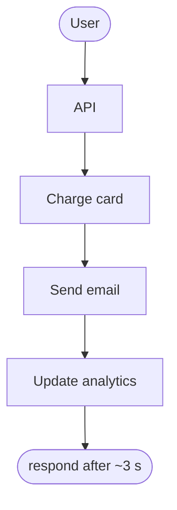
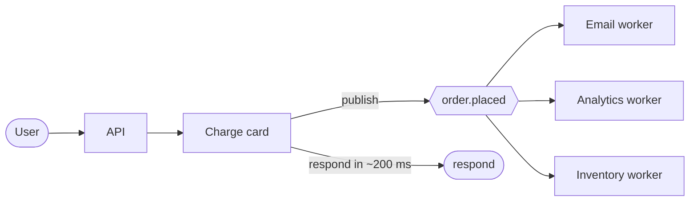
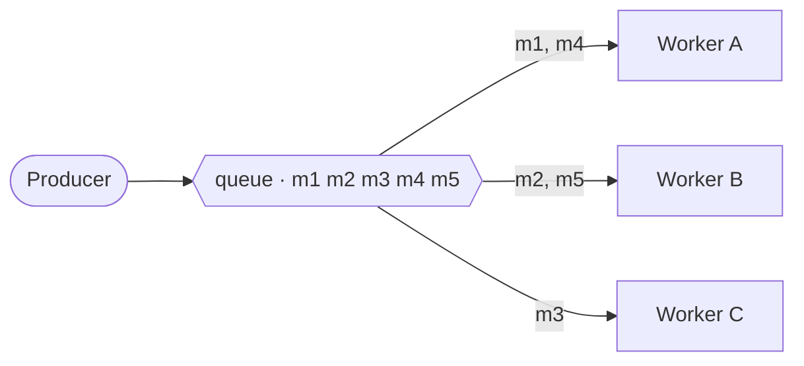
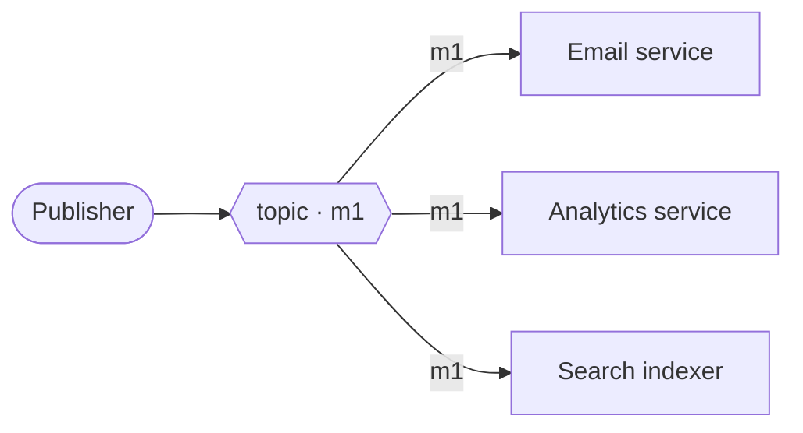
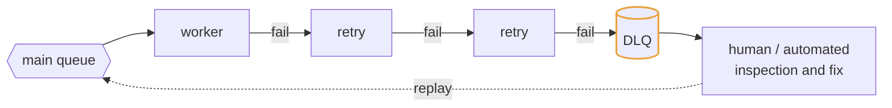
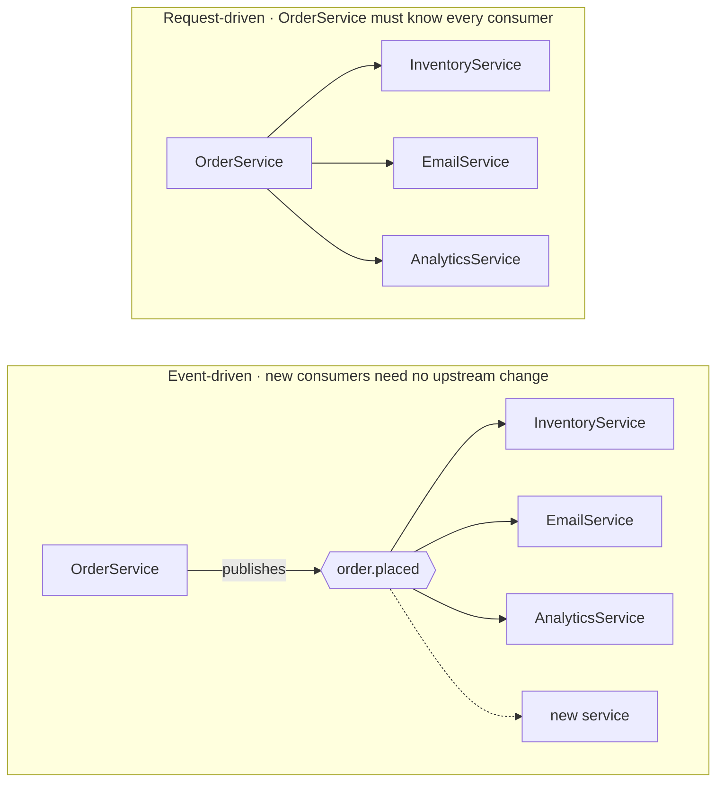
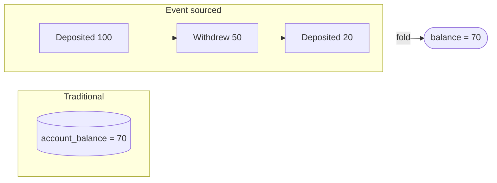
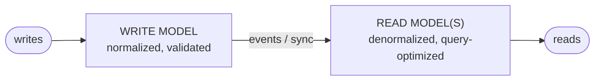

# Module 5: Asynchronous Messaging and Event-Driven Architecture

This module covers queues, pub/sub, event buses, Kafka, delivery guarantees, retries, dead letter queues, backpressure, and the architectural patterns built on them.

---

## 5.1 Synchronous vs asynchronous, and why async exists

**Synchronous**: the caller waits for the callee to finish.



<details>
<summary>Plain-text version of this diagram</summary>

```text
  User ──► API ──► Charge card ──► Send email ──► Update analytics ──► respond
          (user waits for ALL of this: ~3 seconds)
```

</details>

Three problems here:
1. **Latency** — the user waits for work they don't care about (analytics).
2. **Coupling of availability** — if the email service is down, the entire purchase fails. Per Module 1's availability math, every synchronous dependency multiplies down your availability ceiling.
3. **No load absorption** — a traffic spike hits every downstream service simultaneously at full force.

**Asynchronous**: the caller hands work off and returns immediately.



<details>
<summary>Plain-text version of this diagram</summary>

```text
  User ──► API ──► Charge card ──► publish "order.placed" ──► respond (200ms)
                                          │
                                          ├──► Email worker
                                          ├──► Analytics worker
                                          └──► Inventory worker
```

</details>

Now the user waits only for what's essential. The email service being down delays emails; it doesn't break checkout. And a spike queues up instead of overwhelming workers.

**The cost**, which you must acknowledge: you lose immediate feedback (did the email actually send?), you gain eventual consistency (analytics lag reality), debugging gets harder (no single stack trace spanning the flow), and you now need retries, dead letter queues, idempotency, and monitoring of queue depth. Async is not free; it's a trade.

**The rule of thumb to state:** do synchronously only what the user's response depends on. Everything else goes async.

---

## 5.2 The three messaging shapes

These terms are used loosely in the wild. Be precise.

### Message queue (point-to-point, work distribution)

One message is consumed by exactly **one** consumer. Multiple consumers form a pool that shares the work.



<details>
<summary>Plain-text version of this diagram</summary>

```text
  Producer ──► [ m1 m2 m3 m4 m5 ] ──┬──► Worker A  (gets m1, m4)
                                     ├──► Worker B  (gets m2, m5)
                                     └──► Worker C  (gets m3)
```

</details>

Purpose: **distributing work**. Adding workers increases throughput. Examples: RabbitMQ, AWS SQS, Celery.

### Publish/subscribe (fan-out, broadcast)

One message is delivered to **every** interested subscriber. Each subscriber gets its own copy.



<details>
<summary>Plain-text version of this diagram</summary>

```text
                          ┌──► Email service      (gets m1)
  Publisher ──► [ m1 ] ───┼──► Analytics service  (gets m1)
                          └──► Search indexer     (gets m1)
```

</details>

Purpose: **notifying multiple independent consumers**. The publisher doesn't know or care who's listening, which is the decoupling benefit. Examples: Redis pub/sub, AWS SNS, Google Pub/Sub, and Kafka (via consumer groups).

### Event bus / event streaming platform

An event bus is the infrastructure that carries events between producers and consumers, typically supporting both patterns and adding **durability and replay**. Kafka is the canonical example.

The distinction that matters: a traditional queue **deletes** a message once consumed. A **log-based** system like Kafka keeps messages for a retention period and tracks each consumer's *position*. This means you can add a new consumer months later and have it read the entire history, or reset a buggy consumer's position and reprocess. That capability — replay — is why Kafka is the default choice for event-driven architectures and the thing worth calling out in an interview.

---

## 5.3 Kafka, explained properly

```
  TOPIC: "order.events"

  Partition 0: [ e0 ][ e1 ][ e2 ][ e3 ][ e4 ] ──► (append only, ordered)
                                    ▲
                          consumer-group-A offset = 3

  Partition 1: [ e0 ][ e1 ][ e2 ]
                        ▲
              consumer-group-A offset = 2

  Partition 2: [ e0 ][ e1 ][ e2 ][ e3 ]
```

**Topic** — a named stream of events, like a table name.

**Partition** — a topic is split into partitions, each an append-only, strictly ordered log stored on disk. Partitions are the unit of parallelism *and* of ordering.

**Offset** — each message's sequential position within its partition. Consumers track their offset. This is what makes replay possible: seeking backwards is just setting a number.

**Ordering guarantee — this is the part candidates get wrong:** Kafka guarantees ordering **within a partition only**, never across partitions. So if you need all events for a given order (or user, or account) processed in order, you must ensure they land on the same partition — done by setting the **partition key** to that entity's ID. `hash(order_id) % num_partitions` picks the partition, so the same order always maps to the same partition.

The trade-off this creates: ordering requires key affinity, and key affinity can create hot partitions (Module 2). If one key is enormously more active than others, its partition becomes a bottleneck and you can't spread it out without giving up ordering.

**Consumer group** — a set of consumers cooperating to read a topic. Each partition is assigned to exactly one consumer in the group.

- This implies a ceiling: **you cannot have more useful consumers in a group than there are partitions.** With 4 partitions and 10 consumers, 6 sit idle. Partition count is therefore a capacity decision made up front, and increasing it later disturbs key-to-partition mapping.
- Multiple *different* groups each get a full copy of the stream — that's how Kafka does pub/sub. The email service and the analytics service are separate consumer groups on the same topic.
- **Rebalancing** happens when a consumer joins or dies: partitions are redistributed. During a rebalance, consumption pauses briefly — worth knowing as an operational wrinkle.

**Durability** — partitions are replicated across brokers. One replica is the leader, the others are followers. `acks=all` means a producer waits for all in-sync replicas before considering the write durable (slow, safe); `acks=1` waits for the leader only (fast, can lose data if the leader dies before replication); `acks=0` doesn't wait at all.

**Retention** — messages persist for a configured time (e.g. 7 days) or size, regardless of consumption. **Log compaction** is an alternative mode that keeps only the latest message per key forever, effectively turning the topic into a durable changelog of current state.

**Why Kafka is fast** (a good detail to drop): it writes sequentially to an append-only log, which is dramatically faster than random writes even on SSDs, and it uses zero-copy transfer from disk to network, avoiding user-space copies.

---

## 5.4 Delivery semantics

| Guarantee | Meaning | Cost |
|---|---|---|
| **At-most-once** | Message delivered 0 or 1 times. Never duplicated, may be lost. | Cheapest. Acknowledge before processing. |
| **At-least-once** | Delivered 1 or more times. Never lost, may be duplicated. | Acknowledge after processing. **The practical default.** |
| **Exactly-once** | Delivered precisely once. | Expensive, requires transactional coordination, only works within specific system boundaries. |

**The key insight to state in interviews:** exactly-once delivery is essentially impossible across arbitrary system boundaries, because the acknowledgment itself can be lost. What you actually build is **at-least-once delivery plus idempotent consumers**, which produces exactly-once *effects*. That distinction — delivery vs effect — is the mature framing.

```
  AT-MOST-ONCE:            AT-LEAST-ONCE:
    receive                   receive
    ack        ◄── crash      process      ◄── crash here = redelivery
    process        = lost     ack
```

Kafka does offer "exactly-once semantics" via transactions, but scoped to Kafka-to-Kafka processing. The moment you write to an external database or call a third-party API, you're back to at-least-once and needing idempotency (Module 3.7).

---

## 5.5 Retries, backoff, and dead letter queues

Things fail. A downstream API times out, a database is briefly unavailable, a record is temporarily locked. Most of these are **transient** and succeed on retry.

### Retry with exponential backoff and jitter

Retrying immediately makes things worse — a struggling service gets hammered by everyone's retries at once. Instead, wait progressively longer:

```
  attempt 1: fail -> wait 1s
  attempt 2: fail -> wait 2s
  attempt 3: fail -> wait 4s
  attempt 4: fail -> wait 8s
  attempt 5: fail -> DEAD LETTER QUEUE
```

**Jitter is mandatory, not optional.** Without randomness, a thousand clients that all failed at the same instant will all retry at exactly 1s, then all at 2s, creating synchronized thundering herds forever. Adding random jitter (e.g. `wait = random(0, base × 2^attempt)`) spreads them out. This is a small detail that reliably impresses.

**Only retry idempotent or idempotency-keyed operations,** and only retry *retryable* errors. A 500 or a timeout is worth retrying. A 400 (malformed request) will fail identically forever and retrying it is pure waste.

### Dead letter queue (DLQ)

A DLQ is a separate queue that holds messages which have exhausted their retries.



<details>
<summary>Plain-text version of this diagram</summary>

```text
  main queue ──► worker ──fail──► retry ──fail──► retry ──fail──► [ DLQ ]
                                                                     │
                                                          human/automated
                                                          inspection, fix,
                                                          and replay
```

</details>

Why it exists: without a DLQ, a single "poison pill" message (one that crashes the consumer every time) blocks the queue forever, because the consumer keeps picking it up, dying, and restarting. The DLQ gets the bad message out of the way so the rest of the traffic flows.

**What to say about DLQs in an interview:**
- Messages go to a DLQ, they are never silently dropped.
- **DLQ depth is an alert**, not a dashboard. A non-empty DLQ means real work was not done.
- You need a **replay mechanism** to reprocess DLQ messages after fixing the bug.
- Include enough context in the message (original payload, error, attempt count, timestamps) that a human can diagnose it later.

---

## 5.6 Backpressure and flow control

**Backpressure** is what happens when a downstream component can't keep up with an upstream one. Without handling, the queue grows unboundedly, memory fills, latency climbs, and things fall over.

Strategies, from best to worst:

1. **Buffer** — that's what the queue is for. Absorbs spikes. Works only if the imbalance is temporary; a sustained mismatch just grows the buffer forever.
2. **Scale consumers** — autoscale worker count on queue depth or consumer lag. The standard answer for a durable throughput increase.
3. **Throttle producers** — signal upstream to slow down. Clean, but requires the protocol to support it and the producer to cooperate.
4. **Load shed** — deliberately drop low-priority work to protect high-priority work. Better to drop analytics events than checkout events. Say which you'd shed.
5. **Rate limit at the edge** — reject excess requests before they enter the system at all (Module 7).

**Consumer lag** (how far behind the head of the log a consumer is) is the single most important metric for a queue-based system. Rising lag is the early warning that precedes every incident. Name it when asked what you'd monitor.

---

## 5.7 Event-driven architecture

An architecture where services communicate primarily by **producing and consuming events** rather than calling each other directly.



<details>
<summary>Plain-text version of this diagram</summary>

```text
  REQUEST-DRIVEN (services call each other):
    OrderService ──► InventoryService
                 ──► EmailService
                 ──► AnalyticsService
    Order service must know about all three. Adding a fourth
    consumer means changing OrderService.

  EVENT-DRIVEN:
    OrderService ──publishes──► "order.placed" ──┬──► InventoryService
                                                  ├──► EmailService
                                                  ├──► AnalyticsService
                                                  └──► (new service, no change upstream)
```

</details>

**Benefits:** producers don't know their consumers, so you add capabilities without modifying existing services. Services fail independently. Traffic spikes are absorbed by the log. Events are a durable audit trail.

**Costs, which you should volunteer:** no single place shows the whole flow, so debugging requires distributed tracing. Eventual consistency becomes pervasive. Schema evolution is a real discipline problem — once ten consumers depend on an event's shape, changing it is dangerous. Use a **schema registry** with compatibility rules (add optional fields, never remove or repurpose existing ones) and version your events.

### Commands vs events

A distinction worth drawing:
- A **command** is an instruction to do something: `SendEmail`. It has one intended handler, and the sender expects it to be carried out.
- An **event** is a statement of fact about the past: `OrderPlaced`. It has zero or more interested parties, and the publisher has no expectations about what happens next.

Naming events in the past tense (`order.placed`, not `place.order`) is a small thing that signals you understand the difference.

---

## 5.8 Event sourcing

Instead of storing current state, store the **full sequence of events** that produced it. Current state is derived by replaying them.



<details>
<summary>Plain-text version of this diagram</summary>

```text
  TRADITIONAL:  account_balance = 70

  EVENT SOURCED:
     [ Deposited 100 ]
     [ Withdrew 50  ]
     [ Deposited 20  ]
     ──► fold ──► balance = 70
```

</details>

**Benefits:** complete audit history for free (crucial in finance and healthcare), ability to reconstruct state at any past point in time ("what did this look like last Tuesday?"), ability to build entirely new read models by replaying history, and natural debugging of how a bad state came to be.

**Costs:** the event log grows forever, so you need **snapshots** (periodically store a computed state so replay starts from there rather than the beginning). Querying is awkward — "all accounts with balance over 1000" requires a separate read model. And events are immutable, so fixing a mistake means appending a *compensating* event, not editing history. It is a heavyweight pattern; use it where the audit trail is genuinely the point.

---

## 5.9 CQRS (Command Query Responsibility Segregation)

Separate the model used for **writes** from the model used for **reads**.



<details>
<summary>Plain-text version of this diagram</summary>

```text
       writes                              reads
         │                                   ▲
         v                                   │
  ┌────────────┐    events/sync    ┌──────────────────┐
  │ WRITE MODEL│ ─────────────────►│ READ MODEL(S)     │
  │ normalized │                    │ denormalized,     │
  │ validated  │                    │ query-optimized   │
  └────────────┘                    └──────────────────┘
```

</details>

Why: reads and writes have genuinely different requirements. Writes need validation, normalization, and transactional integrity. Reads need denormalized, pre-joined shapes and often 100x the throughput. Forcing one model to serve both means compromising on both.

With CQRS you can have several read models from one write model — a Postgres table for detailed lookups, an Elasticsearch index for search, a Redis cache for hot counts — each fed from the same event stream and each optimized for its query.

**The cost:** the read model lags the write model. A user who writes and immediately reads may not see their change. You handle this with read-your-own-writes techniques (Module 2.5) or by returning the expected result optimistically from the write response.

CQRS pairs naturally with event sourcing but does not require it. Bringing up CQRS when asked "how do you support both complex search and high-volume writes" is a strong move.

---

## 5.10 Choosing the right messaging technology

| Need | Reach for |
|---|---|
| Simple background jobs, work distribution | SQS, RabbitMQ, Celery |
| High-throughput event streaming with replay | Kafka, Pulsar, Kinesis |
| Broadcast to many services, no replay needed | SNS, Redis pub/sub, Google Pub/Sub |
| Ordered processing per entity | Kafka with partition key = entity ID |
| Scheduled / delayed jobs | SQS delay queues, a scheduler service, Redis sorted sets keyed by run time |
| Priority work | Separate queues per priority tier (most brokers have weak native priority support) |

A nuance worth knowing: RabbitMQ-style brokers do complex routing and per-message acknowledgment well, and delete on consume. Kafka does high-throughput ordered streams with replay. They are not interchangeable, and saying *why* you picked one is better than naming either.

---

## Interview checklist for this module

- [ ] Do you split the flow into "what the user waits for" vs "what goes async"?
- [ ] Can you distinguish queue (one consumer) from pub/sub (all consumers)?
- [ ] Can you explain Kafka partitions, offsets, consumer groups, and the within-partition-only ordering guarantee?
- [ ] Do you say "at-least-once plus idempotent consumers" instead of claiming exactly-once?
- [ ] Do you specify retry with exponential backoff *and jitter*, plus a DLQ?
- [ ] Do you name consumer lag as the metric you'd alert on?
- [ ] Can you discuss event schema evolution and a schema registry?
- [ ] Can you explain CQRS and name its staleness cost?
