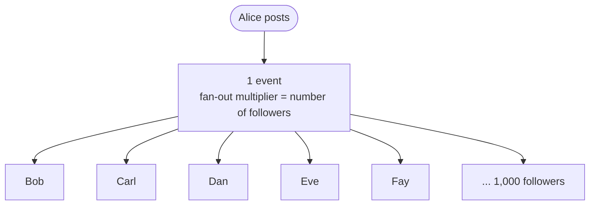
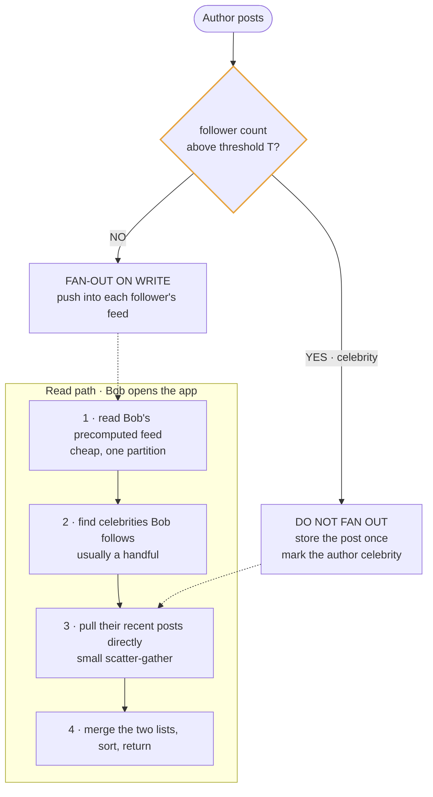
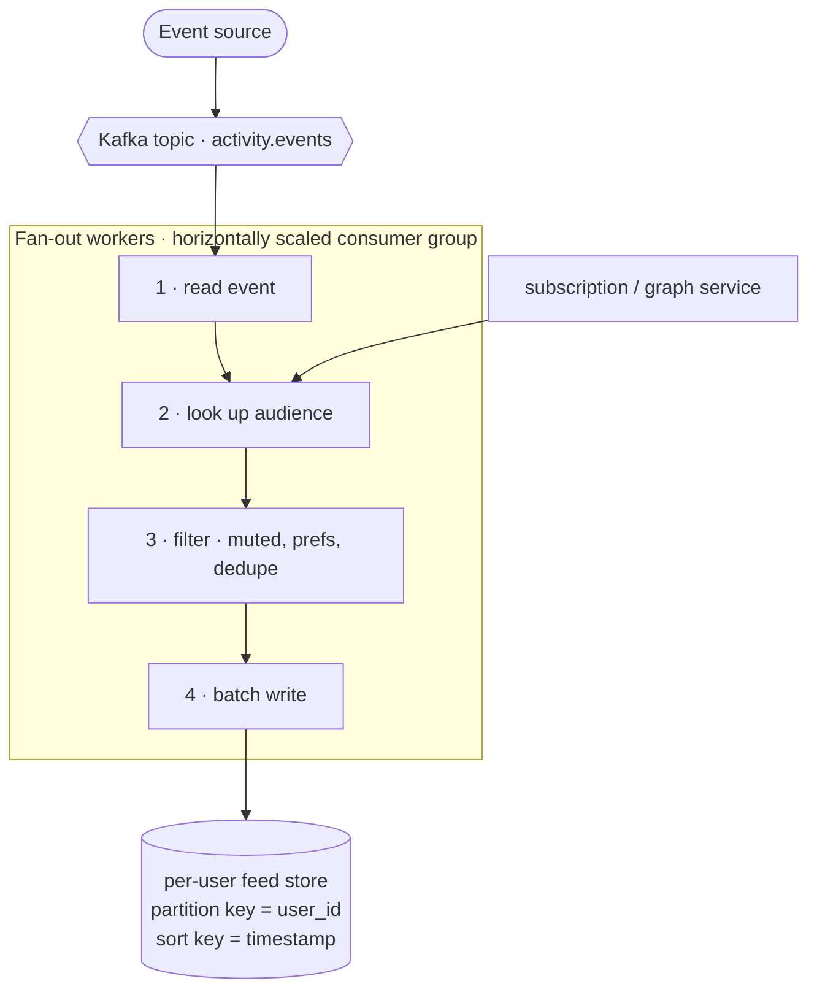

# Module 6: Fan-out, Feeds, and Timelines

This is the single most reused pattern family in system design interviews. Twitter timelines, Instagram feeds, Slack notifications, GitHub notifications, LinkedIn updates, YouTube subscriptions, ride-status updates — all the same problem wearing different clothes.

---

## 6.1 The shape of the problem

One event happens. Many people need to know about it.



<details>
<summary>Plain-text version of this diagram</summary>

```text
      Alice posts
           │
           ▼
   ┌───────────────┐
   │  1 event      │
   └───────┬───────┘
           │  fan-out multiplier = number of followers
   ┌───┬───┼───┬───┬───┐
   ▼   ▼   ▼   ▼   ▼   ▼
  Bob Carl Dan Eve Fay ... (1,000 followers)
```

</details>

The **fan-out multiplier** is the ratio of downstream deliveries to upstream events. It's the number that determines your entire architecture. With a multiplier of 10, everything is easy. With a multiplier of 100 million (a celebrity posting), naive approaches fall apart.

The core question is always: **when do you do the work of matching events to recipients — at write time or at read time?**

---

## 6.2 Fan-out on write (push model)

When the event happens, immediately compute the full recipient list and write a copy of the notification/post reference into each recipient's personal feed.

```
  Alice posts
      │
      ▼
  Look up Alice's 1,000 followers
      │
      ▼
  Write 1,000 rows:
     feed:bob    <- post_123
     feed:carl   <- post_123
     feed:dan    <- post_123
     ... (997 more)

  Later, Bob opens the app:
     SELECT * FROM feed WHERE user_id = 'bob' ORDER BY ts DESC LIMIT 50
     -> one partition, pre-sorted, ~1ms. Done.
```

**Why this is attractive:** reads become trivially cheap. Bob's feed is already assembled and sits in one partition, sorted. This matters enormously because reads vastly outnumber writes — most users open the app far more often than they post. You're moving work from the frequent operation to the rare one.

This is **precomputation**, and it's the same fundamental idea as caching (Module 4) and denormalization (Module 2). Pay once at write, save repeatedly at read.

**Costs:**
- Write amplification: 1 post becomes N writes. Storage cost is N copies of a reference.
- Write latency and spikes: a post by someone with a million followers generates a million writes.
- Stale membership: if Bob follows Alice *after* she posts, her post isn't in his feed, because the fan-out already happened. You need backfill logic.
- Wasted work: you fan out to inactive users who will never read it.

---

## 6.3 Fan-out on read (pull model)

Store the event once. When a user opens their feed, look up who they follow and gather the recent items on demand.

```
  Alice posts -> ONE write:  posts[post_123] = {...}

  Bob opens the app:
     1. Get Bob's following list (500 accounts)
     2. Fetch recent posts from each
     3. Merge, sort by time, take top 50
     -> expensive scatter-gather at read time
```

**Why this is attractive:** writes are O(1) regardless of audience size. No write amplification, no storage duplication, no stale-membership problem (the following list is read fresh every time), and no wasted work for inactive users.

**Costs:** read latency is high and variable. You're doing a scatter-gather across hundreds of partitions, then a merge sort, every single time someone refreshes. For a read-heavy product this is exactly backwards.

---

## 6.4 The comparison, condensed

| | Fan-out on write (push) | Fan-out on read (pull) |
|---|---|---|
| Work happens at | write time | read time |
| Read latency | very low, single partition | high, scatter-gather + merge |
| Write cost | O(followers) | O(1) |
| Storage | N copies of a reference | one copy |
| Late-joining follower | needs backfill | automatic |
| Deleting a post | must remove from N feeds | delete one row |
| Inactive users | wasted work | no waste |
| Best when | fan-out is small, reads dominate | fan-out is huge, or reads are rare |

---

## 6.5 The celebrity problem, and the hybrid answer

Here is the tension. Fan-out on write is right for almost everyone, because a typical user has a modest number of followers. But a celebrity with 100 million followers generates 100 million writes per post. At even a modest posting rate this dominates your entire write capacity, and it arrives as an enormous spike, and it creates a hot partition on the read path too.

Meanwhile fan-out on read is wrong for almost everyone, because it makes the common case (an ordinary user opening the app) slow.

**The hybrid is the answer, and volunteering it unprompted is the highest-value thing you can do in this class of question:**



<details>
<summary>Plain-text version of this diagram</summary>

```text
  ┌──────────────────────────────────────────────────────┐
  │ Is the author's follower count above threshold T?    │
  └──────────────┬───────────────────────┬───────────────┘
                 │ NO                    │ YES (celebrity)
                 ▼                       ▼
     FAN-OUT ON WRITE            DO NOT FAN OUT
     push into each              just store the post once
     follower's feed             and mark the author "celebrity"

  ─────────────────────────────────────────────────────────

  READ PATH (Bob opens the app):
     1. Read Bob's precomputed feed        (cheap, one partition)
     2. Identify which celebrities Bob follows  (usually a handful)
     3. Pull their recent posts directly   (small scatter-gather)
     4. Merge the two lists, sort, return
```

</details>

The insight is that these two costs are inversely distributed. A user follows many ordinary accounts (so precomputing is worth it) but only a few celebrities (so pulling at read time is cheap). The hybrid picks the cheap side of each.

**Details an interviewer may probe:**
- **Where is the threshold T?** Not a fixed number to memorize. Explain that you'd set it empirically where the cost of fanning out exceeds the cost of merging at read, and that it's a tunable operational knob, not a constant in code.
- **Doesn't the merge cost grow if a user follows many celebrities?** Yes. Cap it, or cache the celebrity's recent-posts list aggressively — one cached list serves all 100 million followers, which is exactly the leverage you want.
- **What about active vs inactive users?** A further refinement: only fan out to users active in the last 30 days. Everyone else gets fan-out on read when they return. This can eliminate the majority of fan-out writes, since most registered users are dormant.

---

## 6.6 The fan-out service itself



<details>
<summary>Plain-text version of this diagram</summary>

```text
  [ Event source ] ──► Kafka topic "activity.events"
                             │
                             ▼
                  ┌─────────────────────┐
                  │  Fan-out workers     │  (horizontally scaled, consumer group)
                  │                      │
                  │  1. read event       │
                  │  2. look up audience │ ◄── subscription service / graph service
                  │  3. filter (muted,   │
                  │     prefs, dedupe)   │
                  │  4. batch write      │
                  └──────────┬───────────┘
                             ▼
                  [ per-user feed store ]
                    partition key = user_id
                    sort key      = timestamp
```

</details>

Design points worth stating:

- **Batch the writes.** Writing 1,000 rows one at a time is 1,000 round trips. Batch into chunks of a few hundred.
- **Make it idempotent.** The event stream is at-least-once, so the same event may be processed twice. Use `(user_id, event_id)` as the primary key so a duplicate write is a harmless overwrite (Module 3.7).
- **Isolate large fan-outs.** A single huge fan-out job can starve small ones behind it in the same partition. Either split large jobs into chunked sub-tasks, or route them to a separate queue so ordinary notifications aren't delayed behind a celebrity's burst. This is priority isolation, and it's a mature detail.
- **Cap the feed length.** Nobody scrolls back 10,000 items. Keep the most recent ~1,000 per user and let older items be served from a cold path or not at all. Without a cap, storage grows without bound.
- **Handle deletes and edits.** If a post is deleted, you now have N stale references. The usual solution is to *not* delete from every feed but instead filter at read time by checking the post still exists (or checking a tombstone set), accepting a slightly more expensive read to avoid an enormous delete fan-out.

---

## 6.7 Ranking, and why it changes the design

Everything above assumes reverse-chronological order. Real feeds rank by predicted relevance.

This changes things:
- The feed store now holds *candidates*, not the final order. Ranking happens at read time over a candidate set.
- A typical pipeline is **candidate generation** (a few thousand items from various sources) → **filtering** (already seen, blocked, muted) → **scoring** (an ML model producing a relevance score per item) → **ordering and diversity rules** (don't show five posts from the same author in a row).
- Scoring thousands of items per request is expensive, so features are precomputed and cached, and scoring often happens in two stages: a cheap model narrows thousands to hundreds, then an expensive model ranks those.

In an interview, it is usually correct to say "I'll assume reverse-chronological for the core design, and treat ranking as a layer I'd add at read time over the candidate set." That scopes the problem sensibly while showing you know the real version exists.

---

## 6.8 Notification-specific concerns

Notifications are feeds with extra requirements. Worth having ready:

- **Deduplication and collapsing.** If ten people like your post, send one notification saying "10 people liked your post," not ten notifications. Implement with a time-windowed aggregation: hold notifications of the same type on the same entity for a few minutes and merge them.
- **Multi-channel delivery with preferences.** In-app, email, push, SMS each have different latency tolerances and cost. Users configure per-type, per-channel preferences. Check preferences *at delivery time*, not fan-out time, so preference changes take effect immediately.
- **Digests.** Rather than emailing on every event, batch into hourly or daily digests. This is a queue with a scheduled drain, and it massively reduces cost and annoyance.
- **Quiet hours and rate caps.** Never send push notifications at 3am local time; cap the number per user per day. Requires knowing the user's timezone and tracking per-user send counts.
- **Unread counts.** Counting rows on every page load is expensive. Maintain a counter in Redis with atomic `INCR`/`DECR`, accept that it can drift, and periodically reconcile it against the source of truth.
- **Read state sync across devices.** Marking read on a phone must reflect on the desktop, which means read state lives server-side and is pushed to connected clients.

---

## 6.9 Mapping this pattern onto other prompts

| Prompt | What plays the role of "post" | What plays "followers" |
|---|---|---|
| Design Twitter | tweet | followers |
| Design Instagram feed | photo | followers |
| Design Slack | message | channel members |
| Design GitHub notifications | PR comment / CI result | repo watchers, mentioned users |
| Design YouTube subscriptions | video upload | subscribers |
| Design a stock price alert system | price tick | users with matching alert rules |
| Design Uber rider updates | driver location update | the one rider (fan-out = 1, so this is a different problem — say so) |

That last row matters: recognizing when a problem is *not* a fan-out problem is as valuable as recognizing when it is. Uber's hard problem is geospatial matching (Module 9), not fan-out.

---

## Interview checklist for this module

- [ ] Do you compute the fan-out multiplier during estimation and let it drive the design?
- [ ] Can you explain push vs pull and their read/write cost asymmetry?
- [ ] Do you propose the hybrid *before* being asked about celebrities?
- [ ] Can you explain why the hybrid works (many ordinary follows, few celebrity follows)?
- [ ] Do you mention the active-user optimization?
- [ ] Do you address deletes, feed length caps, and idempotent fan-out writes?
- [ ] Can you scope ranking out explicitly rather than ignoring it?
