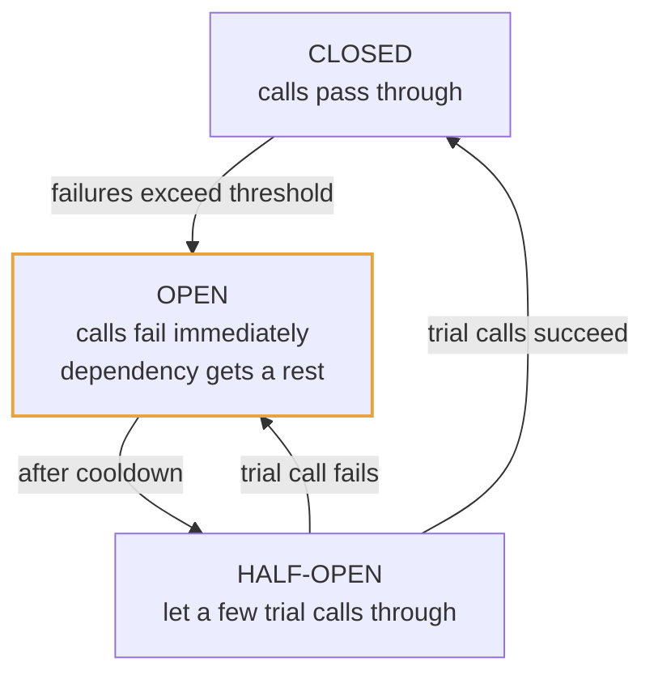

# Module 8: Reliability and Operations

Designing the happy path is table stakes. Senior interviews are largely about what happens when things break.

---

## 8.1 SLI, SLO, SLA

Three terms that are constantly mixed up.

- **SLI (Service Level Indicator)** — a *measurement*. "p99 latency of the checkout endpoint." "Percentage of requests returning non-5xx."
- **SLO (Service Level Objective)** — an internal *target* for an SLI. "p99 latency under 200ms, 99.9% of the time, measured over 30 days."
- **SLA (Service Level Agreement)** — a *contract* with customers, including consequences (refunds, credits) for missing it. SLAs are always looser than SLOs, deliberately, so you have margin before you owe anyone money.

**Error budget** is the operational tool that makes SLOs useful. If your SLO is 99.9% availability over 30 days, you have ~43 minutes of allowed downtime. That's your budget. Spend it on risky deploys and new features; when it's exhausted, freeze risky changes and spend the remainder of the period on stability. This reframes reliability from "never fail" (impossible, and infinitely expensive) to "fail within an agreed budget," which is both achievable and lets you move fast when you're ahead.

Saying "I'd set an SLO of X and use the error budget to govern release risk" is a strong, senior-sounding thing to say.

---

## 8.2 Failure modes to design for

Assume all of these will happen:

- A single server dies (routine; happens constantly at scale)
- An entire availability zone goes down (power, network)
- An entire region goes down (rare, but does happen)
- A dependency becomes slow rather than dead (worse than dead, see below)
- The network partitions
- A bad deploy ships a crash bug
- Traffic spikes 10x unexpectedly
- A single customer's workload degrades everyone else's (noisy neighbor)
- Data gets corrupted or accidentally deleted

**Slow is worse than dead.** If a dependency returns errors instantly, you fail fast and move on. If it hangs for 30 seconds, your threads/connections pile up waiting, your own service exhausts its resources, and you go down too even though you're healthy. This is **cascading failure**, and it's why timeouts and circuit breakers exist.

---

## 8.3 Redundancy and failover

**Redundancy** means having more than one of everything. From Module 1: two independent components at 99% each give 99.99% combined when either alone suffices.

Configurations:
- **Active-active**: all instances serve traffic. Capacity is fully utilized and failover is instant (the load balancer just stops sending to the dead one). Requires the instances to be interchangeable.
- **Active-passive**: a standby sits idle and takes over on failure. Simpler for stateful systems, but you pay for idle capacity and failover takes time (detection + promotion).

**Failover mechanics for a database:**
1. Detect the primary is dead (health check failures, missed heartbeats)
2. Elect/promote a replica to primary (via consensus, Module 3.6)
3. Redirect clients to the new primary (DNS update, proxy reconfiguration, or a service-discovery change)

Two dangers to name:
- **Split-brain**: the old primary wasn't actually dead, just unreachable, and now two nodes accept writes. Prevented by requiring a majority quorum to elect a leader, and by **fencing** (the new leader increments an epoch number; storage rejects writes carrying an old epoch).
- **Data loss**: with async replication, writes acknowledged by the old primary but not yet replicated are lost on promotion. This is a deliberate trade you should name when you choose async replication.

**Availability zones and regions.** An AZ is an isolated datacenter with independent power and networking; a region is a group of nearby AZs. Spreading across AZs is cheap and standard (low inter-AZ latency). Spreading across regions gives disaster tolerance and user proximity but introduces cross-region latency of 50-150ms, which forces you to confront consistency directly. Multi-region active-active with a single writable dataset is one of the genuinely hard problems in the field; a common pragmatic answer is regional read replicas with writes routed to a home region.

**RPO and RTO** are the vocabulary for disaster recovery: **Recovery Point Objective** is how much data you can afford to lose (determines backup/replication frequency), **Recovery Time Objective** is how long you can afford to be down (determines whether you need warm standby or can restore from backup).

---

## 8.4 Timeouts, retries, circuit breakers, bulkheads

These four form the standard resilience toolkit. They work together.

### Timeouts

Every network call must have a timeout. A call with no timeout is a resource leak waiting for a bad day.

Set the timeout from the dependency's observed p99, not from guesswork. And make timeouts **shorter as you go deeper** in the call chain, so an inner call doesn't outlive the outer request that's waiting for it. Better still, propagate a **deadline** ("this whole request must finish by T") so every hop knows how much time remains and can abandon work that's already pointless.

### Retries (recap from Module 5.5, with cautions)

Retry with exponential backoff **and jitter**, only for idempotent or idempotency-keyed operations, and only for retryable errors.

**The retry amplification danger:** if every layer retries 3 times and you have 3 layers, one user request becomes 27 backend calls. During an incident, retries generate a load multiplier that prevents recovery. Mitigate by retrying at only one layer, capping total attempts, and using a **retry budget** (e.g. retries may not exceed 10% of total request volume; beyond that, fail fast).

### Circuit breaker

Borrowed from electrical engineering: when a dependency is clearly broken, **stop calling it** for a while.



- **Closed**: normal. Requests flow; failures are counted.
- **Open**: the failure rate crossed a threshold. Requests fail instantly without attempting the call. This does two things: your own threads stop piling up waiting, and the struggling dependency gets relief instead of being hammered by a service that refuses to give up.
- **Half-open**: after a cooldown, allow a small number of probe requests. If they succeed, close; if they fail, open again.

When the breaker is open you need a **fallback**: serve stale cached data, return a degraded response, queue the work for later, or return a clear error. Say which.

### Bulkhead

Named for ship compartments: isolate resources so one failure can't sink everything.

Concretely, if all calls share one thread pool or connection pool, a single slow dependency consumes the entire pool and every unrelated request also fails. Give each dependency its own bounded pool. Now a slow dependency exhausts only its own compartment.

The same idea applies at higher levels: separate queues per priority, separate service instances per tenant tier, separate clusters for critical vs non-critical workloads.

---

## 8.5 Graceful degradation and load shedding

**Graceful degradation** means the system loses capability rather than availability. Rank features by criticality and decide in advance what gets dropped:

- Recommendations service down → show a generic popular-items list instead of erroring the page
- Personalization down → serve the anonymous cached version
- Search down → show browse categories
- Image resizing down → serve the original

**Load shedding** means deliberately rejecting some work to keep the rest healthy. When you're over capacity, serving 70% of requests correctly beats serving 100% of them slowly and then collapsing. Shed by priority: drop analytics before checkout, drop free tier before paid, drop retries before first attempts.

**Admission control / concurrency limiting** is the mechanism: cap the number of in-flight requests and reject beyond it. Counter-intuitively, a queue that grows without bound is worse than rejecting early, because by the time you process a request the client has already timed out and retried. Work on already-abandoned requests is pure waste.

---

## 8.6 Health checks

- **Liveness**: "is this process alive?" If it fails, restart the instance. Keep it dumb — if liveness checks dependencies, one database blip triggers a restart of your whole fleet, which is a spectacular way to turn a small problem into an outage.
- **Readiness**: "is this instance ready to serve traffic?" This *may* check dependencies. A failing readiness check removes the instance from the load balancer without killing it, so it can recover and rejoin.
- **Startup**: gives slow-starting applications time to initialize before liveness checks begin.

Also design for **graceful shutdown**: on receiving a termination signal, stop accepting new requests, finish in-flight ones, deregister from the load balancer, then exit. Without this, every deploy drops requests.

---

## 8.7 Observability

The three pillars, plus what each is actually for:

- **Metrics** — numeric time series (request rate, error rate, latency percentiles, queue depth, CPU). Cheap to store, great for dashboards and alerts, but aggregated, so they tell you *that* something is wrong, not *why*.
- **Logs** — discrete events with detail. Expensive at volume, invaluable for diagnosis. Use **structured logging** (JSON with consistent fields) so logs are queryable rather than grep-able, and always include a correlation/request ID.
- **Traces** — the path of one request across all services, with timing per hop. This is what tells you which of twelve services ate 400ms. Implemented by propagating a trace ID through every call (OpenTelemetry is the standard).

```
  TRACE for one request:
  ├─ api-gateway            [====                          ] 12ms
  ├─ auth-service           [ ==                           ]  8ms
  ├─ order-service          [   ==========================  ] 340ms
  │   ├─ postgres query     [    ====                      ]  45ms
  │   └─ inventory-service  [        ====================== ] 280ms  ◄── the culprit
  └─ response
```

### What to alert on

The key principle: **alert on symptoms users feel, not on causes.** High CPU is not an incident if users are fine. The "four golden signals" are the standard starting set:

1. **Latency** (p99, split by success vs failure — slow errors and slow successes are different problems)
2. **Traffic** (requests per second)
3. **Errors** (rate of failed requests)
4. **Saturation** (how full the most constrained resource is)

For queue-based systems, add **consumer lag** and **DLQ depth**. For caches, add **hit rate**. For replicated databases, add **replication lag**.

Every alert should be actionable. Alerts that fire routinely and get ignored are worse than no alerts, because they train people to ignore the page that matters.

---

## 8.8 Deployment strategies

| Strategy | How it works | Trade-off |
|---|---|---|
| **Rolling** | Replace instances in batches | No extra cost; both versions run simultaneously, so changes must be backward-compatible |
| **Blue-green** | Stand up a full parallel environment, switch traffic at once | Instant rollback; costs 2x infrastructure during the switch |
| **Canary** | Send a small percentage of traffic to the new version, watch metrics, ramp up | Limits blast radius; needs good metrics and takes longer |
| **Feature flags** | Ship code dark, enable at runtime per user/segment | Decouples deploy from release; flag debt accumulates if not cleaned up |

**The database migration rule that matters in interviews:** schema changes must be backward-compatible, because during any rollout, old and new code run against the same database. The safe pattern is **expand-migrate-contract**:

1. **Expand** — add the new column (nullable), deploy code that writes to both old and new
2. **Migrate** — backfill existing rows
3. **Contract** — deploy code that reads only the new column, then drop the old one

Each step is independently reversible. Doing it in one step means a rollback breaks production.

---

## 8.9 Autoscaling

Scale on the metric that reflects your actual bottleneck:
- CPU-bound services → CPU utilization
- I/O-bound services → concurrent request count
- Queue consumers → **queue depth or consumer lag**, which is much better than CPU because it reflects work waiting rather than work being done

Things to name:
- **Scale up fast, scale down slowly.** Aggressive scale-down causes flapping (thrash between adding and removing instances) and leaves you under-provisioned when the next spike arrives.
- **Cooldown periods** prevent reacting to noise.
- **Warm-up time is real.** If instances take 3 minutes to become ready, reactive autoscaling is always 3 minutes behind the spike. For predictable patterns (daily peaks, scheduled events), use **predictive/scheduled scaling** instead.
- **Autoscaling can't save you from a dependency bottleneck.** Adding app servers when the database is the constraint just adds more load to the database. Know where your bottleneck actually is.

---

## 8.10 Security essentials

Enough to not sound naive; interviews rarely go deep, but a missing mention is noticed.

- **Authentication vs authorization**: who you are, vs what you may do.
- **JWT vs session tokens**: JWTs are self-contained and verifiable without a lookup, which makes them scale well, but they cannot easily be revoked before expiry. Mitigate with short lifetimes plus refresh tokens, or a revocation list. Sessions require a lookup but are revocable instantly.
- **Encryption in transit** (TLS everywhere, including service-to-service) and **at rest** (disk/database encryption, with keys in a managed KMS).
- **Password storage**: never plaintext, never fast hashes. Use bcrypt, scrypt, or Argon2 with a per-user salt. The slowness is the feature.
- **Principle of least privilege**: every service gets only the permissions it needs.
- **Input validation** at the boundary; parameterized queries to prevent SQL injection.
- **PII handling**: know what personal data you store, encrypt it, limit access, support deletion (GDPR right to erasure — which is genuinely hard in event-sourced and heavily replicated systems, and is a good thing to flag).
- **Rate limiting and DDoS protection** at the edge (Module 7).
- **Secrets management**: never in source code; use a secrets manager with rotation.

---

## Interview checklist for this module

- [ ] Do you state an SLO and mention error budgets?
- [ ] Do you put a timeout on every external call and explain deadline propagation?
- [ ] Can you explain the circuit breaker's three states and why open state helps the *dependency*?
- [ ] Do you mention retry amplification as a danger, not just retries as a fix?
- [ ] Can you name a specific graceful degradation for each non-critical dependency in your design?
- [ ] Do you distinguish liveness from readiness?
- [ ] Do you name the four golden signals plus system-specific metrics?
- [ ] Can you describe expand-migrate-contract for a schema change?
