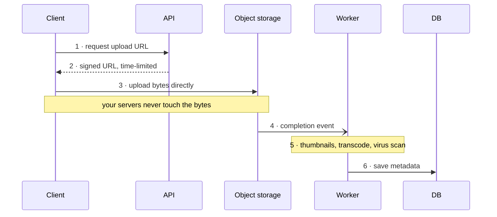

# Module 9: Specialized Building Blocks

Components that appear repeatedly in specific problem classes. Each is a concept you can name to short-circuit a lot of explanation.

---

## 9.1 Search and inverted indexes

The problem: find all documents containing the word "distributed." A database `LIKE '%distributed%'` scans every row and cannot use an index. Useless at scale.

The solution is an **inverted index**: instead of mapping document → words, map word → documents.

```
  FORWARD (how documents are stored):
     doc1 -> "the quick brown fox"
     doc2 -> "the lazy brown dog"

  INVERTED (how they're searched):
     "the"    -> [doc1, doc2]
     "quick"  -> [doc1]
     "brown"  -> [doc1, doc2]
     "fox"    -> [doc1]
     "lazy"   -> [doc2]
     "dog"    -> [doc2]

  Query "brown fox" -> intersect [doc1,doc2] ∩ [doc1] = [doc1]
```

The pipeline that builds this:
1. **Tokenization** — split text into terms
2. **Normalization** — lowercase, strip punctuation, handle accents
3. **Stop word removal** — optionally drop "the," "a," "of" (though modern engines often keep them for phrase queries)
4. **Stemming/lemmatization** — reduce "running," "runs," "ran" to a common root so they match each other

**Ranking** is the other half. **TF-IDF** (term frequency × inverse document frequency) captures the intuition that a term is important to a document if it appears often *in that document* but rarely *across the corpus*. **BM25** is the refined version used in practice. Real systems layer learned ranking models on top.

**Sharding and replication for search:** the index is split across shards (usually by document), a query is broadcast to all shards, each returns its top K, and a coordinator merges them. This is scatter-gather, and it means search latency is bounded by your slowest shard — a good place to mention tail latency from Module 1.

**Near-real-time indexing:** new documents aren't searchable instantly. Engines like Elasticsearch buffer writes and refresh the searchable view periodically (by default about once per second). Say this explicitly — "search results will lag writes by about a second" — rather than implying instant consistency.

**When to use a search engine vs a database:** use the search engine for full-text relevance, fuzzy matching, faceting, and typo tolerance. Keep the database as the source of truth and feed the index from the event stream (Module 5). Never make the search index your primary store.

**Autocomplete / typeahead** is a related classic, usually solved with a **trie** (prefix tree) holding the top completions at each node, cached in memory, and rebuilt offline from query logs.

---

## 9.2 Object / blob storage

For large binary files (images, video, backups, logs), do not use a database. Use object storage: S3, GCS, Azure Blob.

Properties: effectively unlimited capacity, very high durability (S3 advertises eleven nines) achieved through internal replication and erasure coding, cheap per gigabyte, and accessed over HTTP by key. The trade-off is higher per-request latency than a database and no query capability beyond key lookup and prefix listing.

**The standard pattern to describe for uploads:**



The point of step 3 is that routing gigabytes through your application servers is wasteful and turns them into a bandwidth bottleneck. Presigned URLs are the answer, and knowing them is a reliable positive signal.

Related mechanics worth naming: **multipart upload** for large files (upload in chunks, resume on failure), **lifecycle policies** to move old objects to cheaper cold tiers automatically, and putting a **CDN in front** for reads.

Store the *metadata* in your database and the *bytes* in object storage. This split is almost always correct.

---

## 9.3 Batch vs stream processing

**Batch**: process a large, bounded dataset at once, on a schedule.
- High throughput, simple to reason about, easy to reprocess, can do global aggregations
- High latency — results are hours old
- Tools: Spark, Hadoop/MapReduce, data warehouse jobs

**Stream**: process events continuously as they arrive.
- Low latency, results within seconds
- Harder — you must handle out-of-order events, late arrivals, and unbounded state
- Tools: Flink, Kafka Streams, Spark Structured Streaming

**MapReduce**, worth understanding as the mental model even though the framework is dated:
```
  MAP:      transform each input record into key-value pairs
              (in parallel across many machines)
  SHUFFLE:  group all values by key, moving data across the network
  REDUCE:   aggregate the values for each key
```
The shuffle is the expensive part, because it's the only step requiring all-to-all network transfer. Knowing that the shuffle dominates cost is the useful insight.

### Windowing in stream processing

To aggregate an unbounded stream you need windows:
- **Tumbling** — fixed, non-overlapping intervals (every 5 minutes)
- **Sliding** — fixed size, overlapping (last 5 minutes, evaluated every minute)
- **Session** — grouped by activity with a gap timeout (a user's browsing session)

**Event time vs processing time** is the subtle part. An event that *happened* at 10:00 might *arrive* at 10:07 because a phone was offline. Windowing by processing time puts it in the wrong bucket. Windowing by event time is correct but requires waiting for stragglers, which is what **watermarks** do — a watermark asserts "we believe all events before time T have arrived," triggering window computation, with a policy for what to do with anything later.

### Lambda and Kappa architectures

- **Lambda**: run a batch layer (accurate, slow) and a speed layer (fast, approximate) in parallel and merge at query time. Downside: you maintain the same logic twice, in two systems, and they drift.
- **Kappa**: use only a stream processor; reprocess history by replaying the log when you need to recompute. Simpler, and practical precisely because log-based brokers (Module 5) retain history.

---

## 9.4 Bloom filters

A probabilistic data structure answering "is this element in the set?" with two possible answers: **definitely not**, or **probably yes**. It never gives a false negative; it can give a false positive.

```
  Bit array of size m, k independent hash functions.

  ADD "apple":  set bits at h1("apple"), h2("apple"), h3("apple")
     [0 1 0 0 1 0 0 1 0 0]
         ▲     ▲     ▲

  CHECK "grape": any of its bits are 0  -> DEFINITELY NOT PRESENT
  CHECK "apple": all of its bits are 1  -> PROBABLY PRESENT
                 (could be a collision of other elements' bits)
```

Why it's valuable: it uses a tiny fraction of the memory that storing the actual elements would, so you can keep it in RAM in front of an expensive lookup. The false positive rate is tunable by adjusting bit array size and hash count; roughly 10 bits per element gives about 1% false positives.

**Where it shows up:**
- **Cache penetration defense** (Module 4.6): reject lookups for keys that definitely don't exist before hitting the database
- **LSM-tree storage engines**: check whether a key might be in a given SST file before reading it from disk, saving enormous numbers of disk reads
- **"Have you seen this URL before"** in crawlers, and duplicate detection in general
- **CDN caching decisions**: only cache an object after it's been requested twice, tracked cheaply

The limitation: you cannot delete elements (clearing bits would break other entries). Counting Bloom filters and cuckoo filters address this.

Related structure worth naming: **HyperLogLog**, which estimates the *cardinality* of a set (how many unique items) in a few kilobytes regardless of set size, with a few percent error. Used for unique visitor counts where exactness isn't needed.

---

## 9.5 Distributed unique ID generation

You need unique IDs across many machines. Options:

**Auto-increment in a database** — simple, but it's a single point of contention and a bottleneck, and doesn't work across shards.

**UUID v4 (random)** — generated locally with no coordination, guaranteed unique in practice. Two problems: 128 bits is large, and randomness means IDs are unordered, so inserting them into a B-tree index scatters writes across the whole index instead of appending at the end. That destroys write locality. (UUID v7 fixes this by making the leading bits a timestamp — worth knowing as the modern answer.)

**Snowflake** — the standard interview answer. A 64-bit integer partitioned as:

| Field | Sign | Timestamp | Machine | Sequence |
|---|---|---|---|---|
| Bits | 1 | 41 | 10 | 12 |
| Meaning | unused sign bit | milliseconds, ~69 years | 1,024 machines | 4,096 IDs per ms per machine |

Properties: no coordination needed at generation time (each machine has its own ID), roughly time-sortable (because the timestamp is the high-order bits, so IDs increase over time and index inserts stay sequential), and compact at 64 bits.

The caveats to raise: machine IDs must be assigned uniquely, usually via a coordination service like ZooKeeper at startup; and **clock skew or clock rollback breaks it**, so the generator must detect a backwards clock and refuse to issue IDs rather than risk duplicates.

**Ticket server / range allocation** — a central service hands out blocks of IDs (e.g. 1000 at a time) that each machine consumes locally. Fewer coordination round trips than per-ID, but gaps appear when a machine dies with an unused block.

A design note worth making: sequential IDs leak business information (a competitor can register two accounts an hour apart and infer your signup rate). For public-facing identifiers, use an opaque or random-looking ID even if you use sequential ones internally.

---

## 9.6 Geospatial indexing

For "find things near me" queries. A naive `WHERE distance(lat, lng, user) < 5km` computes distance for every row — a full scan.

**Geohash** encodes a latitude/longitude pair into a string, where each additional character subdivides the grid, so **nearby points share a common prefix**.

```
  "gcpv"    ~ 20 km cell
  "gcpvj"   ~ 2.4 km cell
  "gcpvj0"  ~ 600 m cell

  Query "everything near gcpvj0" becomes a PREFIX SEARCH,
  which any ordinary index can serve efficiently.
```

This turns a 2D proximity problem into a 1D string prefix problem, which is the whole trick.

The wrinkle to mention: two points can be geographically adjacent but sit on opposite sides of a cell boundary and share no prefix. The fix is to query the target cell **plus its eight neighbors**, then filter by true distance.

**Alternatives:**
- **Quadtree** — recursively subdivide space into four quadrants, splitting further only where density is high. Adapts to uneven distribution (dense cities, empty ocean) better than a fixed grid.
- **S2 (Google)** — projects the sphere onto a cube and uses a space-filling Hilbert curve, giving better locality properties and handling poles and the antimeridian correctly.
- **R-tree** — indexes bounding rectangles; standard in PostGIS for arbitrary shapes, not just points.

**The moving-objects problem** (Uber, delivery tracking): drivers update location every few seconds, so the index is under constant write pressure. The usual approach is to keep current locations in an in-memory store (Redis geospatial commands use a sorted set keyed by geohash) rather than a disk-backed index, accept that positions are a few seconds stale, and persist the history separately to a time-series or object store for analytics.

---

## 9.7 Other components worth being able to name

- **Service discovery** — how services find each other's addresses in a dynamic environment. Client-side (the client queries a registry like Consul/etcd and picks an instance) or server-side (a load balancer or DNS abstracts it). Kubernetes does this with cluster DNS and Services.
- **Service mesh** — a sidecar proxy (Envoy) next to every service instance, handling retries, timeouts, circuit breaking, mTLS, and telemetry uniformly, outside application code. Mentioning it shows awareness that Module 8's resilience patterns can be infrastructure rather than library concerns.
- **Distributed locks** — needed when exactly one worker may do something. Implemented with Redis (`SET key value NX PX ttl`, with a unique token so only the owner can release it) or a consensus store. Always set a TTL so a dead holder doesn't deadlock the system forever, and know that the TTL introduces a correctness gap (the holder may be paused by GC past its TTL while still believing it holds the lock). For genuine correctness, use **fencing tokens**: a monotonically increasing number issued with the lock, which the protected resource checks and uses to reject stale holders.
- **Leader election** — pick one node to do singleton work (a scheduler, a compactor). Use a consensus store rather than rolling your own.
- **Configuration and feature flag service** — runtime configuration without deploys, with the caveat that it becomes a critical dependency and needs local caching and safe defaults for when it's unreachable.
- **Data warehouse / OLAP vs OLTP** — OLTP is your transactional database, optimized for many small reads and writes. OLAP (Snowflake, BigQuery, Redshift) is columnar, optimized for scanning billions of rows to compute aggregates. Never run analytics queries against your production OLTP database; pipe data into a warehouse via CDC or ETL.

---

## Interview checklist for this module

- [ ] Can you explain an inverted index and say that search lags writes by ~1 second?
- [ ] Do you use presigned URLs so uploads bypass your application servers?
- [ ] Can you explain event time vs processing time, and watermarks?
- [ ] Can you explain a Bloom filter's asymmetric guarantee and name two uses?
- [ ] Can you draw the Snowflake ID layout and explain why timestamp-leading matters for indexes?
- [ ] Can you explain how geohash turns proximity into a prefix search, and the boundary caveat?
- [ ] Do you know to route analytics to a warehouse rather than the production database?
