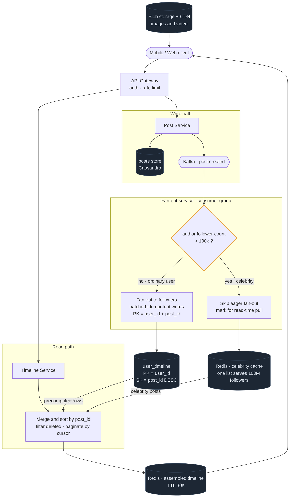

# 01 — Twitter / Instagram Feed

## Primary concepts and the hard part

**Concepts:** fan-out on write vs read, hybrid fan-out, wide-column storage, caching, denormalization, cursor pagination, read:write skew.

**The hard part they're probing:** the celebrity problem. A design that only works for the median user is a fail. They want to see you recognize that fan-out cost is bimodal and split the code path.

---

## Requirements

**Functional**
- Post a tweet/photo (text + optional media)
- Follow / unfollow a user
- View home timeline (posts from people you follow, reverse-chronological)
- View a user's own profile timeline

**Non-functional**
- Read-heavy: assume ~100:1 read:write
- Home timeline load p99 < 200ms
- Availability over consistency — a 5-second-stale timeline is fine, a failed load is not
- Eventually consistent; posts appear within a few seconds

**Out of scope (say this):** DMs, search, ML ranking, ads, notifications.

**Scale assumptions**
```
300M DAU · 
Posts:    50M/day    → ~500/sec  (peak 3x = 1,500/sec)
Timeline reads:              → ~150,000/sec
Avg followers:  ~200         → fan-out multiplier 200
Celebrity max:  100M followers
Post row: ~300B → 50M × 300B = 15 GB/day of posts
Feed rows: 50M × 200 = 10B rows/day of references (~50B each = 500 GB/day)
```
**Conclusion drawn:** 10B feed writes/day is the whole problem. That number is what forces the hybrid.

---

## API / Model

```
POST /v1/posts                      {text, media_ids}        → post_id
GET  /v1/timeline/home?cursor=&limit=50
GET  /v1/users/{id}/posts?cursor=&limit=50
POST /v1/users/{id}/follow
DEL  /v1/users/{id}/follow
```

```
posts          PK: post_id (Snowflake, time-sortable)
               author_id, text, media_urls, created_at, reply_to

social_graph   PK: follower_id   SK: followee_id     (who I follow)
               PK: followee_id   SK: follower_id     (who follows me — second table,
                                                      denormalized for fan-out lookup)

user_timeline  PK: user_id       SK: post_id DESC     ← the precomputed feed
               post_id, author_id          (reference only, not the post body)

users          PK: user_id
               name, follower_count, is_celebrity (bool, derived from count)
```

Two directions of the social graph are stored separately because fan-out needs "who follows X" while the UI needs "who does X follow". Same data, two access patterns, two tables. That's Module 2 in action.

---

## High-level architecture



<details>
<summary>Plain-text version of this diagram</summary>

```text
                                      ┌──────────────┐
   [Mobile / Web]───────────────────► │   CDN        │  media (images, video)
          │                            └──────────────┘
          │ HTTPS                             ▲
          ▼                                   │
   ┌──────────────┐                    ┌──────────────┐
   │ API Gateway  │  authn, rate limit │ Blob Storage │  S3, presigned upload
   └──────┬───────┘                    └──────────────┘
          │                                   ▲
    ┌─────┴──────────────────────┐            │ direct upload
    ▼                            ▼            │
┌────────────┐            ┌────────────┐      │
│ WRITE PATH │            │ READ PATH  │      │
│ Post Svc   │            │ Timeline   │──────┘
└─────┬──────┘            │ Service    │
      │                   └──────┬─────┘
      │ 1. write post            │
      ▼                          │
┌──────────────┐                 │
│ posts store  │◄────────────────┼── hydrate post bodies
│ (Cassandra)  │                 │
└─────┬────────┘                 │
      │ 2. emit event            │
      ▼                          │
┌───────────────────────┐        │
│ Kafka "post.created"  │        │
└──────────┬────────────┘        │
           │                     │
           ▼                     │
┌────────────────────────────┐   │
│   FAN-OUT SERVICE          │   │
│   (consumer group, scaled) │   │
│                            │   │
│  ┌──────────────────────┐  │   │
│  │ author.follower_count│  │   │
│  │      > 100k ?        │  │   │
│  └───┬──────────────┬───┘  │   │
│      │ NO           │ YES  │   │
│      ▼              ▼      │   │
│  fan out to      DO NOTHING│   │
│  followers       (pull at  │   │
│  (batched        read time)│   │
│   writes)                  │   │
└──────┬─────────────────────┘   │
       │                          │
       ▼                          │
┌────────────────────┐            │
│  user_timeline     │◄───────────┤ A. read precomputed feed
│  PK=user_id        │            │
│  SK=post_id DESC   │            │
│  (Cassandra)       │            │
└────────────────────┘            │
                                   │
┌────────────────────┐            │
│ Celebrity Cache    │◄───────────┤ B. pull celebrity recent posts
│ Redis: celeb_id →  │            │    (one cached list serves
│  [recent 100 posts]│            │     all their followers)
└────────────────────┘            │
                                   │
                            ┌──────▼──────────┐
                            │  MERGE + SORT   │
                            │  A ∪ B by ts    │
                            │  filter deleted │
                            │  paginate       │
                            └──────┬──────────┘
                                   ▼
                            ┌─────────────┐
                            │ Redis cache │  hot users' assembled
                            │ timeline:uid│  timeline, TTL ~30s
                            └─────────────┘
```

</details>

**Read path in words:** Timeline Service checks Redis for an assembled timeline. On miss, it reads the user's precomputed `user_timeline` rows (cheap, single partition), separately fetches recent posts from the handful of celebrities that user follows (cached, so near-free), merges the two lists by post_id descending, hydrates post bodies, and caches the result for 30 seconds.

---

## Trade-offs and deep dives

**Why fan-out on write is the base case.** Reads outnumber writes 100:1. Precomputing moves work from the frequent operation to the rare one. Read becomes a single-partition sequential scan on a sorted key: ~1ms.

**Why it can't be the only case.** 100M followers × even a few posts/day saturates the write path and arrives as a spike. There is no amount of horizontal scaling that makes 100M synchronous writes a good idea for one post.

**Why the hybrid works.** The costs are inversely distributed. A user follows *many* ordinary accounts (so precomputation pays off) but only a *few* celebrities (so read-time merge is cheap). You pick the cheap side of each. And a celebrity's recent-posts list is one cache entry serving 100M readers — the highest leverage cache in the system.

**Threshold T is a tunable, not a constant.** Set it empirically where fan-out cost exceeds merge cost. Expect it to differ by product.

**Active-user optimization.** Only fan out to users active in the last ~30 days. Most registered accounts are dormant; this can eliminate the majority of feed writes. Dormant users get a full read-time rebuild when they return.

**Deletes.** Don't fan out deletions — that's another N writes. Filter at read time by checking a tombstone set, or by verifying the post still exists during hydration. Trade a slightly more expensive read for avoiding a huge delete fan-out.

**Feed length cap.** Keep ~800-1,000 refs per user. Nobody scrolls further; without a cap storage grows unbounded.

**Idempotent fan-out.** Kafka is at-least-once, so the same post may be fanned out twice. `PK=(user_id, post_id)` makes a duplicate write a harmless overwrite.

**Pagination.** Cursor-based on `post_id` (Snowflake IDs are time-sortable, so the ID *is* the cursor). Offset pagination would break as new posts shift positions.

**Late follow.** If Bob follows Alice after she posted, her post isn't in his feed. Either backfill her recent posts into his timeline on follow, or accept it and let it resolve going forward. Backfill-on-follow is the better UX and is a bounded, small job.

---

## Possible follow-up questions

- *A celebrity's follower count crosses the threshold mid-life. What happens?* Their old posts were fanned out, new ones aren't. You need both paths to coexist; the merge handles it naturally since duplicates dedupe by post_id.
- *How do you add ML ranking?* The feed store becomes a *candidate* set. Ranking happens at read time: generate candidates → filter seen/blocked → score with a cheap model → rescore top few hundred with an expensive model → apply diversity rules. Features precomputed and cached.
- *How do you handle a user who follows 50,000 accounts?* Fan-out on write is unaffected (it's the author's follower count that matters, not the reader's following count). The read-time celebrity merge is what grows — cap the number of celebrity lists you merge.
- *Retweets/reposts?* Store as a post referencing the original. Fan out the repost; hydrate the original at read time. Dedupe if multiple people you follow repost the same thing.
- *How do you keep the timeline cache warm?* Pre-warm on login/app-open signals, and use stale-while-revalidate so users never wait for a rebuild.
- *What breaks first at 10x?* Fan-out worker throughput, then the `user_timeline` write volume. Mitigations: raise the celebrity threshold, tighten the active-user window, shard fan-out workers by author.
