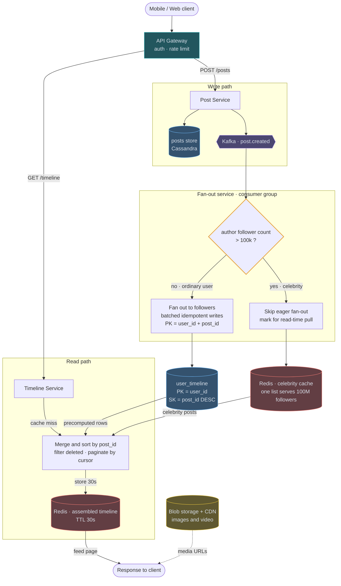
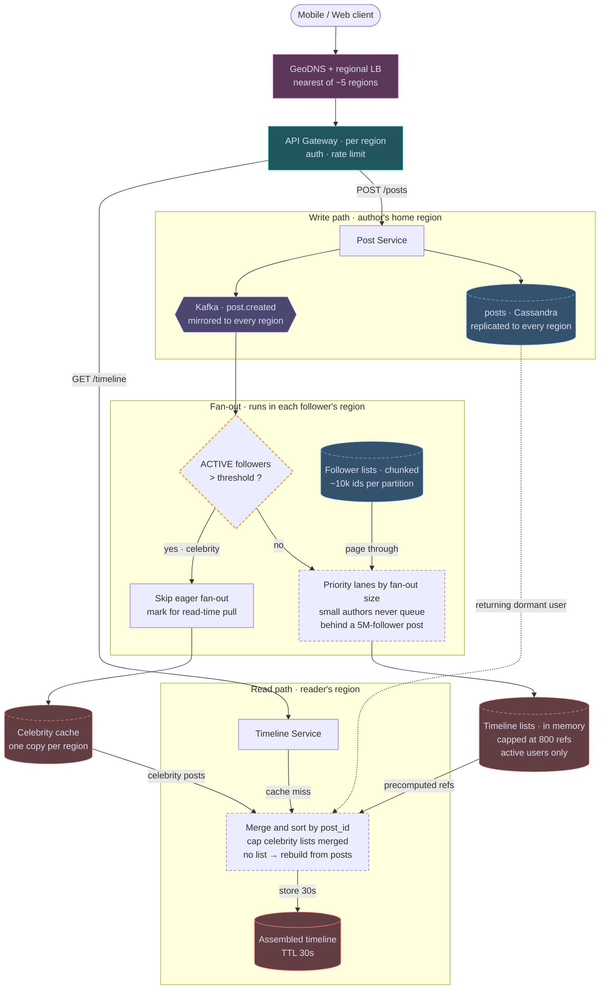

# 01 — Twitter / Instagram Feed

## API / Model

```api
POST /v1/posts || {text, media_ids} || 201 post_id
GET /v1/timeline/home?cursor=&limit=50 || || 200 home feed page
GET /v1/users/{id}/posts?cursor=&limit=50 || || 200 user's posts
POST /v1/users/{id}/follow || || 204
DEL /v1/users/{id}/follow || || 204
```

```erd
# Users and posts
users || is_celebrity is a bool derived from follower_count
+ user_id || bigint || PK
+ name || text
+ follower_count || bigint
+ is_celebrity || boolean
posts || post_id is a Snowflake, so it is time-sortable
+ post_id || bigint || PK
+ author_id || bigint || → users
+ text || text
+ media_urls || list<text>
+ created_at || timestamp
+ reply_to || bigint || null → posts
# Graph and feed · denormalized for reads
social_graph || who I follow
+ follower_id || bigint || PK → users
+ followee_id || bigint || SK → users
social_graph (reverse) || who follows me; a second, denormalized table for fan-out lookup
+ followee_id || bigint || PK → users
+ follower_id || bigint || SK → users
user_timeline || the precomputed feed; references only, not the post body
+ user_id || bigint || PK → users
+ post_id || bigint || SK DESC → posts
+ author_id || bigint || → users
```

Two directions of the social graph are stored separately because fan-out needs "who follows X" while the UI needs "who does X follow". Same data, two access patterns, two tables. That's Module 2 in action.

---

## High-level architecture

<!-- tab: Today · ~150k reads/s -->



The feed is a write path and a read path behind one API Gateway. They never call each other: the write path fills two stores, and the read path merges them.

1. The client's `POST /posts` passes the API Gateway, which handles auth and rate limiting, and reaches the Post Service.
2. The Post Service writes the post to the posts store in Cassandra and publishes `post.created` to Kafka, then returns without waiting for fan-out.
3. The Fan-out service, running as a consumer group, reads the event and checks whether the author has more than 100k followers.
4. For an ordinary author, it fans out to followers with batched, idempotent writes, adding one reference row per follower to `user_timeline`, keyed by `user_id` and sorted by `post_id` descending.
5. For a celebrity, it skips eager fan-out. The post lands in the Redis celebrity cache instead, where one list serves every follower at read time.

Reads never wait on fan-out. A `GET /timeline` reaches the Timeline Service, which touches only what the write path left behind, `user_timeline` rows and the celebrity cache, and keeps each merged page in the Redis assembled timeline for 30 seconds. Images and video bypass both paths: the response carries media URLs, and the client loads the bytes from Blob storage + CDN.

**Read path in words:** Timeline Service checks Redis for an assembled timeline. On miss, it reads the user's precomputed `user_timeline` rows (cheap, single partition), separately fetches recent posts from the handful of celebrities that user follows (cached, so near-free), merges the two lists by post_id descending, hydrates post bodies, and caches the result for 30 seconds.

<!-- tab: At 10x · ~1.5M reads/s -->



Same product at 10x the traffic. A 100x jump would mean more daily users than there are people online, so 10x (roughly the largest social apps today) is the realistic next tier. Dashed outlines mark what's new or reshaped compared with today's design.

| | Today | At 10x |
|---|---|---|
| Daily active users | 300M | ~3B |
| Posts at peak | 1,500/sec | 15,000/sec |
| Timeline reads | ~150k/sec | ~1.5M/sec |
| Feed writes | 10B/day | ~100B/day, ~3.5M/sec at peak |
| Largest account | 100M followers | ~500M followers |
| Regions | 1 | ~5 |

**What changes, and the number that forces it**

1. **One region → about five.** At 3B users the audience is everywhere, and a 200ms p99 can't absorb a cross-ocean round trip on every timeline load. Each region serves reads from its own timeline lists and caches. Posts are written in the author's home region, and both the posts table and `post.created` are replicated to every other region. Snowflake IDs already carry datacenter bits, so IDs stay unique without coordination.
2. **Fan-out runs where the follower lives.** Each region's fan-out consumers read the mirrored topic and only write timelines for followers homed in that region. A post from Tokyo to followers in São Paulo crosses the ocean once, as one event, not as millions of timeline writes.
3. **The threshold counts active followers.** ~3.5M timeline writes/sec at peak is what breaks first, as the 10x follow-up predicts. Deciding eager vs pull on *active* followers removes most of it, because a dormant follower never gets a row: a 50M-follower account with 2M daily actives fans out like a 2M one.
4. **Priority lanes by fan-out size.** A post to millions of active followers takes minutes of worker time. Routing authors into lanes by fan-out size, each with its own worker pool, means an ordinary user's post reaches their 200 followers in seconds even while a large post is still fanning out. It's the same bulkhead idea as the notification design.
5. **Timelines move to capped in-memory lists.** A timeline is only ever appended to, trimmed at 800, and read whole, so a replicated in-memory list store (the shape Twitter ran on Redis) beats Cassandra rows for both writes and reads. Only active users keep a list: ~1B users × 800 refs × ~20 bytes is ~16 TB of RAM before replication, split across regions by where users live. A returning dormant user's timeline is rebuilt from the posts table on first load.
6. **Follower lists are chunked.** A 500M-follower reverse graph in one partition is a hot, unbounded row. Splitting each list into partitions of ~10k ids lets fan-out workers page through it in parallel and keeps every partition a normal size.
7. **The read-time merge gets a cap.** Once more accounts sit on the pull side, a user following hundreds of them would merge hundreds of lists per load. The merge takes only the few dozen celebrity lists with the most recent posts, and quieter ones surface on the next refresh of the assembled cache.

**What stays the same**

The hybrid itself: fan-out on write for ordinary authors, merge at read time for large ones. Fan-out writes stay idempotent on `(user_id, post_id)`, pagination stays cursor-based on Snowflake IDs, deletes are still filtered at read time rather than fanned out, and media bytes still come from blob storage and the CDN, never through app servers. At 10x the same split is simply applied per region and per lane.

<!-- /tabs -->

---
