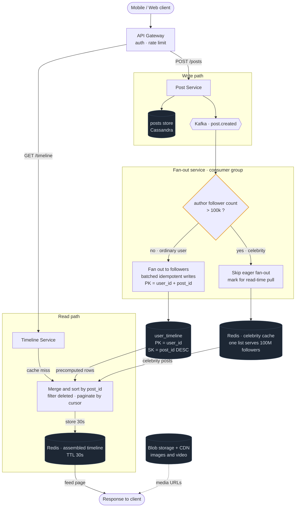

# 01 — Twitter / Instagram Feed

## API / Model

```api
POST /v1/posts || {text, media_ids} || 201 post_id
GET /v1/timeline/home?cursor=&limit=50 || || 200 home feed page
GET /v1/users/{id}/posts?cursor=&limit=50 || || 200 user's posts
POST /v1/users/{id}/follow || || 204
DEL /v1/users/{id}/follow || || 204
```

```schema
posts || PK: post_id || author_id, text, media_urls, created_at, reply_to || post_id is a Snowflake, so it is time-sortable
social_graph || PK: follower_id SK: followee_id || || who I follow
social_graph (reverse) || PK: followee_id SK: follower_id || || who follows me; a second, denormalized table for fan-out lookup
user_timeline || PK: user_id SK: post_id DESC || post_id, author_id || the precomputed feed; references only, not the post body
users || PK: user_id || name, follower_count, is_celebrity || is_celebrity is a bool derived from follower_count
```

Two directions of the social graph are stored separately because fan-out needs "who follows X" while the UI needs "who does X follow". Same data, two access patterns, two tables. That's Module 2 in action.

---

## High-level architecture



<details>
<summary>Plain-text version of this diagram</summary>

```text
                                      ┌──────────────┐
   [Mobile / Web]───────────────────► │   CDN        │  media (images, video)
          │                            └──────────────┘
          │ HTTPS                             ▲
          ▼                                   │
   ┌──────────────┐                    ┌──────────────┐
   │ API Gateway  │  authn, rate limit │ Blob Storage │  S3, presigned upload
   └──────┬───────┘                    └──────────────┘
          │                                   ▲
    ┌─────┴──────────────────────┐            │ direct upload
    ▼                            ▼            │
┌────────────┐            ┌────────────┐      │
│ WRITE PATH │            │ READ PATH  │      │
│ Post Svc   │            │ Timeline   │──────┘
└─────┬──────┘            │ Service    │
      │                   └──────┬─────┘
      │ 1. write post            │
      ▼                          │
┌──────────────┐                 │
│ posts store  │◄────────────────┼── hydrate post bodies
│ (Cassandra)  │                 │
└─────┬────────┘                 │
      │ 2. emit event            │
      ▼                          │
┌───────────────────────┐        │
│ Kafka "post.created"  │        │
└──────────┬────────────┘        │
           │                     │
           ▼                     │
┌────────────────────────────┐   │
│   FAN-OUT SERVICE          │   │
│   (consumer group, scaled) │   │
│                            │   │
│  ┌──────────────────────┐  │   │
│  │ author.follower_count│  │   │
│  │      > 100k ?        │  │   │
│  └───┬──────────────┬───┘  │   │
│      │ NO           │ YES  │   │
│      ▼              ▼      │   │
│  fan out to      DO NOTHING│   │
│  followers       (pull at  │   │
│  (batched        read time)│   │
│   writes)                  │   │
└──────┬─────────────────────┘   │
       │                          │
       ▼                          │
┌────────────────────┐            │
│  user_timeline     │◄───────────┤ A. read precomputed feed
│  PK=user_id        │            │
│  SK=post_id DESC   │            │
│  (Cassandra)       │            │
└────────────────────┘            │
                                   │
┌────────────────────┐            │
│ Celebrity Cache    │◄───────────┤ B. pull celebrity recent posts
│ Redis: celeb_id →  │            │    (one cached list serves
│  [recent 100 posts]│            │     all their followers)
└────────────────────┘            │
                                   │
                            ┌──────▼──────────┐
                            │  MERGE + SORT   │
                            │  A ∪ B by ts    │
                            │  filter deleted │
                            │  paginate       │
                            └──────┬──────────┘
                                   ▼
                            ┌─────────────┐
                            │ Redis cache │  hot users' assembled
                            │ timeline:uid│  timeline, TTL ~30s
                            └─────────────┘
```

</details>

**Read path in words:** Timeline Service checks Redis for an assembled timeline. On miss, it reads the user's precomputed `user_timeline` rows (cheap, single partition), separately fetches recent posts from the handful of celebrities that user follows (cached, so near-free), merges the two lists by post_id descending, hydrates post bodies, and caches the result for 30 seconds.

---
