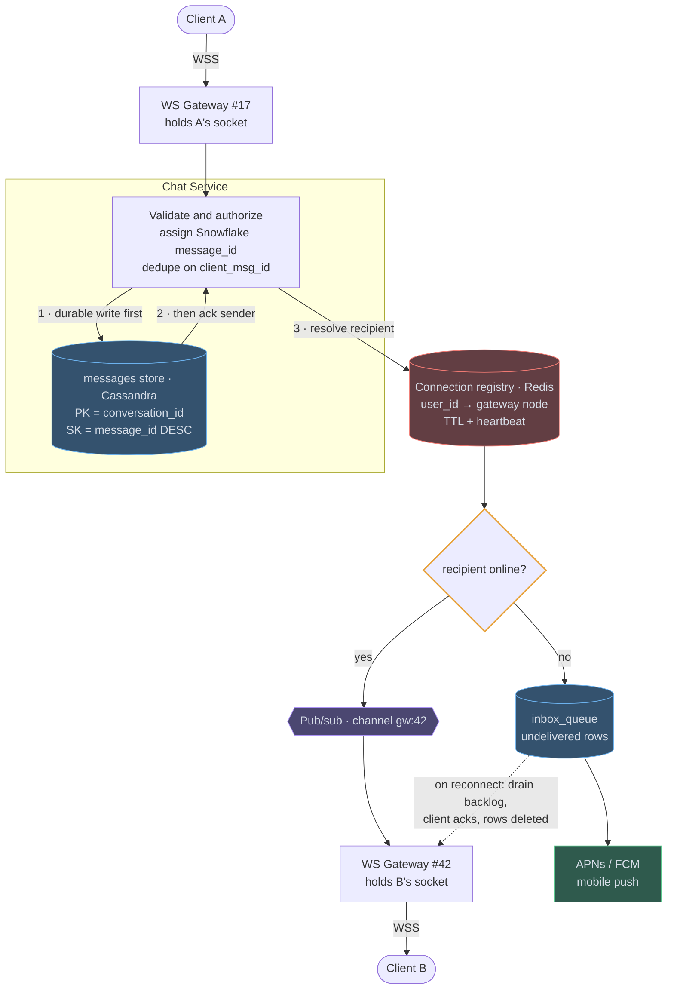
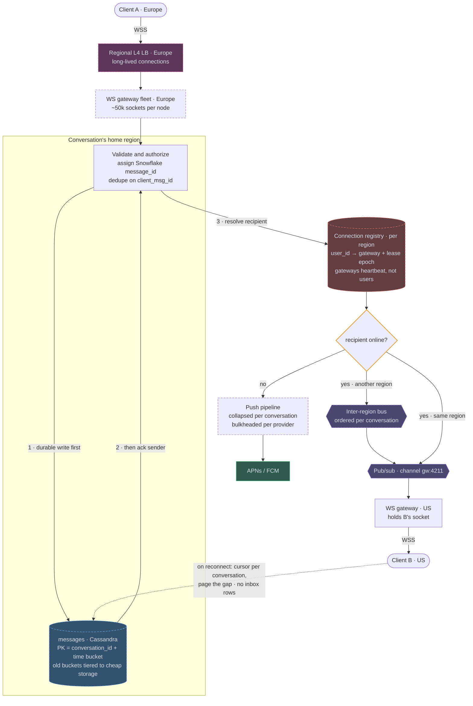

# 02 — Chat / Slack / WhatsApp

## API / Model

```api
# WebSocket · auth via token in handshake
WS wss://chat.example.com/connect || || 101
+ → client sends: {type:"send", client_msg_id, conv_id, body}
+ ← server sends: {type:"message"|"receipt"|"presence", ...}
# REST · history and setup
GET /v1/conversations?cursor= || || 200 conversation list
GET /v1/conversations/{id}/messages?cursor=&limit=50 || || 200 message page
POST /v1/conversations || {member_ids[]} || 201 conversation_id
POST /v1/conversations/{id}/read || {up_to_msg_id} || 204
```

```schema
messages || PK: conversation_id SK: message_id (Snowflake, DESC) || sender_id, body, created_at, type || one partition per conversation = ordered, cheap range reads
conversations || PK: conversation_id || type (dm|group), member_count, last_message_id ||
members || PK: user_id SK: conversation_id || last_read_msg_id, muted, joined_at || powers "my conversation list" and unread counts
inbox_queue || PK: user_id SK: message_id || undelivered messages only || offline delivery buffer; rows deleted on ack
```

---

## High-level architecture

<!-- tab: Today · 50M sockets -->



The design puts a stateless Chat Service between two stateful gateways: one holds the sender's socket and one holds the recipient's. A Redis connection registry links them, and every message is stored before anyone is told about it.

1. Client A sends the message over WSS to WS Gateway #17, which holds A's socket and forwards it to the Chat Service. The Chat Service validates and authorizes it, assigns a Snowflake `message_id`, dedupes on `client_msg_id`, and writes it to the messages store, where it lands in the `conversation_id` partition.
2. Only after that write succeeds does the Chat Service ack the sender.
3. It then resolves the recipient in the connection registry, which maps `user_id` to the gateway node holding that user's socket and expires stale entries through TTL and heartbeats.
4. If the recipient is online, the Chat Service publishes to that node's pub/sub channel, `gw:42`, so only WS Gateway #42 receives the message.
5. WS Gateway #42 pushes it to Client B over B's socket.

When the recipient is offline, the message is written to `inbox_queue` as an undelivered row instead, and APNs / FCM sends a mobile push. When B reconnects, the gateway drains that backlog to the client, B acks, and the rows are deleted.

<!-- tab: At 10x · 500M sockets -->



Same product at 10x the traffic. At 100x, 50M concurrent sockets would become 5B, more than the number of smartphones in use, so 10x (a WhatsApp-sized service) is the meaningful next tier. Dashed outlines mark what's new or reshaped compared with today's design.

| | Today | At 10x |
|---|---|---|
| Daily active users | 500M | ~3B |
| Concurrent connections | 50M | 500M |
| Messages at peak | 4M/sec | 40M/sec |
| Message storage | 20 TB/day | 200 TB/day |
| Gateway nodes | ~1,000 | ~10,000 |
| Regions | 1 | ~6 |

**What changes, and the number that forces it**

1. **Gateways: ~1,000 → ~10,000, in the user's nearest region.** A socket held across an ocean adds ~150ms to every frame, and a reconnect storm there crosses continents. Each region runs its own gateway fleet behind L4 load balancers, sized for the reconnect storm after a regional failure rather than for steady traffic.
2. **Registry heartbeats move from users to gateways.** With 500M entries on a 30-second TTL, per-user heartbeats alone would be ~17M registry writes/sec, a large fraction of the message rate. Each entry instead records its gateway's lease epoch. A gateway renews one lease every few seconds; when it dies, its epoch expires and every entry pointing at it is treated as stale at lookup. The registry is written only on connect and disconnect, and it's sharded per region.
3. **Every conversation gets a home region.** Ordering needs a single place that assigns IDs for a conversation, so the Snowflake `message_id` and the durable write happen in its home region, usually where it was created. Senders elsewhere forward to it and pay one inter-region hop before the ack, about 100ms, still inside the 500ms budget. Delivery to recipients in other regions goes over an inter-region bus, ordered per conversation.
4. **`inbox_queue` is replaced by cursor sync.** At any moment most of 3B users are offline, and writing an inbox row for every undelivered message nearly doubles writes on the hottest path. Clients already track their highest `message_id` per conversation, so on reconnect they page the gap straight from the messages store, and a per-user unread pointer decides what to push. This is the "sync from cursor" follow-up promoted to the only offline path.
5. **Message storage is tiered.** At 200 TB/day, keeping every time bucket on hot Cassandra nodes is the storage bill. Buckets older than ~30 days move to cheaper columnar files in object storage, because nearly all reads are recent. Scrolling far back in history gets slower.
6. **Mobile push becomes its own pipeline.** Hundreds of millions of offline recipients hit APNs and FCM rate limits. Pushes are collapsed per conversation ("12 new messages") and bulkheaded per provider, borrowing the notification design's delivery tier.

**What stays the same**

Durable before ack, `client_msg_id` idempotency, and ordering by server-assigned ID within a conversation. Gateways still hold only sockets, pub/sub still targets the one gateway holding a recipient rather than broadcasting, and very large channels are still pulled on open rather than pushed to every member.

<!-- /tabs -->

---
