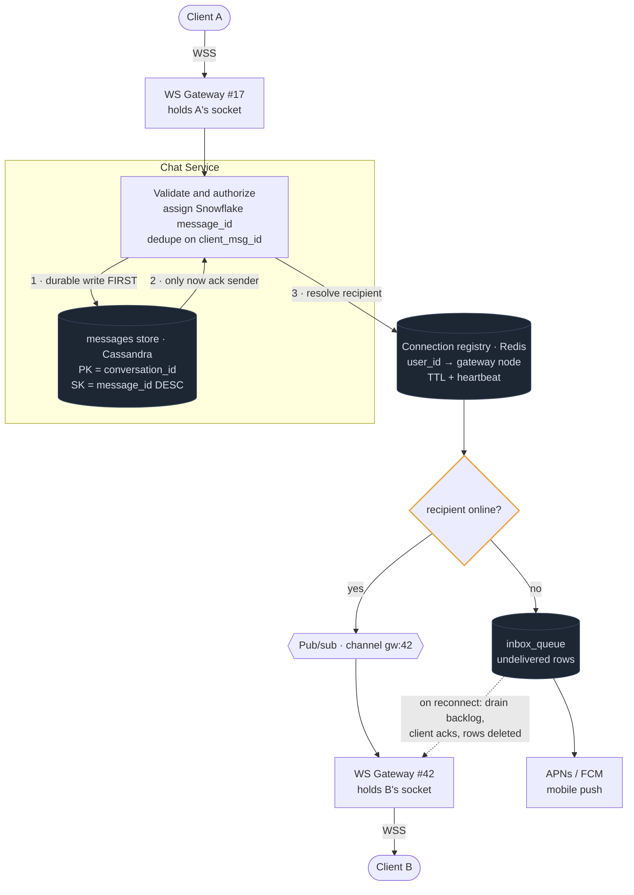

# 02 — Chat / Slack / WhatsApp

## Primary concepts and the hard part

**Concepts:** WebSockets, connection registry, pub/sub routing, message ordering, offline delivery, wide-column storage, fan-out (small), push notifications.

**The hard part they're probing:** you have 50 stateful gateway nodes and a message for Alice. How does the sender's request find the node holding Alice's socket? And what happens when Alice is offline?

---

## Requirements

**Functional**
- 1:1 and group messaging
- Real-time delivery to online users
- Offline users receive messages on reconnect
- Delivery receipts: sent → delivered → read
- Online/presence status
- Message history with pagination

**Non-functional**
- Delivery latency p99 < 500ms for online users
- Messages must never be lost (durable before ack)
- Consistent ordering *within a conversation*
- Availability over global consistency

**Out of scope:** voice/video calls, E2E encryption key exchange (mention it exists), file transfer specifics, search.

**Scale**
```
500M DAU · 50M concurrent connections
Messages: 100B/day → ~1.2M/sec avg, 4M/sec peak
Msg row ~200B → 20 TB/day
Connections per gateway node: ~50k → need ~1,000 gateway nodes
```
**Conclusion:** 50M concurrent sockets means the gateway tier is its own scaling problem, separate from storage. That's why it's drawn as a distinct tier.

---

## API / Model

```
WebSocket  wss://chat.example.com/connect        (auth via token in handshake)
  → client sends: {type:"send", client_msg_id, conv_id, body}
  ← server sends: {type:"message"|"receipt"|"presence", ...}

REST (history & setup)
GET  /v1/conversations?cursor=
GET  /v1/conversations/{id}/messages?cursor=&limit=50
POST /v1/conversations                {member_ids[]}
POST /v1/conversations/{id}/read      {up_to_msg_id}
```

```
messages        PK: conversation_id   SK: message_id (Snowflake, DESC)
                sender_id, body, created_at, type
                ← single partition per conversation = ordered, cheap range read

conversations   PK: conversation_id
                type (dm|group), member_count, last_message_id

members         PK: user_id           SK: conversation_id
                last_read_msg_id, muted, joined_at
                ← "my conversation list" + unread computation

inbox_queue     PK: user_id           SK: message_id     (undelivered only)
                ← offline delivery buffer, rows deleted on ack
```

---

## High-level architecture



<details>
<summary>Plain-text version of this diagram</summary>

```text
 [Client A]                                              [Client B]
     │  persistent WSS                     persistent WSS  │
     ▼                                                     ▼
┌─────────────────┐                              ┌─────────────────┐
│  L4 Load Bal.   │  (sticky, long-lived conns)  │  L4 Load Bal.   │
└────────┬────────┘                              └────────┬────────┘
         ▼                                                 ▼
┌────────────────────┐                          ┌────────────────────┐
│  WS GATEWAY  #17   │                          │  WS GATEWAY  #42   │
│  holds A's socket  │                          │  holds B's socket  │
└─────┬──────────────┘                          └──────────▲─────────┘
      │ 1. inbound message                                 │ 6. push to B
      ▼                                                    │
┌─────────────────────────────────────────────────────┐   │
│               CHAT SERVICE                           │   │
│  · validate, authorize (is A in this conversation?)  │   │
│  · assign message_id (Snowflake) → ORDERING          │   │
│  · dedupe on client_msg_id (idempotency)             │   │
└───┬──────────────────────────────────────┬──────────┘   │
    │ 2. DURABLE WRITE FIRST               │              │
    ▼                                       │              │
┌──────────────────┐                        │              │
│  messages store  │  Cassandra             │              │
│  PK=conv_id      │  partitioned by conv   │              │
│  SK=msg_id DESC  │                        │              │
└──────────────────┘                        │              │
    │ 3. ack to sender (only after durable) │              │
    │                                        │              │
    │           4. resolve recipients        ▼              │
    │        ┌──────────────────────────────────────┐      │
    │        │  CONNECTION REGISTRY (Redis)          │      │
    │        │  user_id → gateway_node_id            │      │
    │        │  TTL + heartbeat (dead nodes expire)  │      │
    │        └───────────┬──────────────────────────┘      │
    │                    │                                  │
    │     ┌──────────────┴───────────────┐                 │
    │     │ ONLINE?                       │                 │
    │     ├───────────────┬───────────────┤                 │
    │     │ YES           │ NO            │                 │
    │     ▼               ▼               │                 │
    │  ┌──────────────┐ ┌─────────────────────┐            │
    │  │ PUB/SUB      │ │  inbox_queue write  │            │
    │  │ (Redis/Kafka)│ │  + push notification│            │
    │  │ channel:     │ └──────────┬──────────┘            │
    │  │  gw:42       │            ▼                        │
    │  └──────┬───────┘   ┌──────────────────┐             │
    │         │ 5.        │  APNs / FCM      │             │
    │         └───────────┼──► mobile push   │             │
    │                     └──────────────────┘             │
    │                                                       │
    └───────────────────────────────────────────────────────┘

          ON RECONNECT (B comes back online):
          ┌────────────────────────────────────────┐
          │ B connects → gateway registers in      │
          │ registry → drains inbox_queue for B    │
          │ → sends backlog → B acks → rows deleted│
          └────────────────────────────────────────┘
```

</details>

---

## Trade-offs and deep dives

**Ordering.** Message order is defined by the server-assigned Snowflake ID, not by client timestamps (clocks lie, networks reorder). Because all messages in a conversation share a partition key, they are stored in one ordered log. Clients sort by `message_id`, which is monotonic per conversation. Ordering *across* conversations doesn't matter and isn't guaranteed.

**Durability before ack.** The sender gets "sent" only after the message is committed to storage. If you ack on receipt at the gateway and the gateway dies, the message vanishes with a checkmark showing. Never ack before durable.

**Idempotency.** Client generates `client_msg_id` (a UUID). Retries on flaky mobile networks reuse it. Server dedupes, so a retry returns the original `message_id` rather than creating a duplicate. This is the single most important detail for mobile chat.

**Why a connection registry and not "just broadcast to all gateways".** Broadcasting every message to 1,000 gateways is 1,000x write amplification on the pub/sub layer. The registry turns a broadcast into a targeted publish. Cost: an extra Redis lookup and a consistency window when a user reconnects to a different node (handled by TTL + the fact that a stale publish simply finds no socket and falls through to the offline path).

**Gateway nodes are stateful — accept it, then contain it.** This violates the stateless ideal from Module 1. Contain it by keeping *only* the socket on the node; all durable state lives elsewhere. A gateway dying just means clients reconnect and re-register.

**Group chat fan-out.** Slack channels with 50,000 members are the celebrity problem again. For small groups, push to each member. For very large channels, don't push to everyone — clients that have the channel open subscribe to a channel-level pub/sub topic, and everyone else pulls on open. Same hybrid shape as the feed.

**Presence is expensive.** Naive presence (broadcast every status change to everyone who might care) is a fan-out explosion. Mitigations: only compute presence for conversations the user currently has open, batch updates on a few-second interval, and treat presence as best-effort/lossy. Say out loud that presence is the most over-engineered part of most chat designs.

**Read receipts.** Store `last_read_msg_id` per (user, conversation) rather than a per-message read flag. One row updated instead of N. Unread count = count of messages with id > last_read_msg_id, which is a bounded range scan, or a cached counter.

**Storage partitioning risk.** A busy channel is a hot partition. Bound partition size by bucketing the key: `PK = (conversation_id, time_bucket)`. Reads for recent history hit the newest bucket.

**E2E encryption.** If required, the server stores ciphertext only and cannot do server-side search, previews, or moderation. Say this trade explicitly — it removes features, not just adds security.

---

## Possible follow-up questions

- *How do you guarantee exactly-once display?* You don't guarantee exactly-once delivery — you dedupe on `message_id` client-side. At-least-once + idempotent rendering.
- *What if a client is on a flaky network and misses pushes?* Client tracks its highest received `message_id` per conversation and sends it on reconnect; server replies with everything after it. This "sync from cursor" model is more robust than relying on the inbox queue alone.
- *How do you scale to 50M concurrent connections?* ~50k connections per node is the practical ceiling (file descriptors, memory per socket). So ~1,000 nodes, autoscaled on connection count, fronted by an L4 balancer. Connection *establishment* rate is its own bottleneck — thundering-herd reconnects after a deploy need jittered backoff on the client.
- *Message editing and deletion?* Append a new event referencing the original; clients apply it. Don't mutate history in place — it breaks the append-only ordering model.
- *How does search work?* Separate path entirely: CDC from the messages store into Elasticsearch, per-workspace index. Never search the primary store.
- *Multi-device?* The registry maps `user_id → [list of connections]`, not one. Deliver to all; read state syncs server-side so all devices converge.
