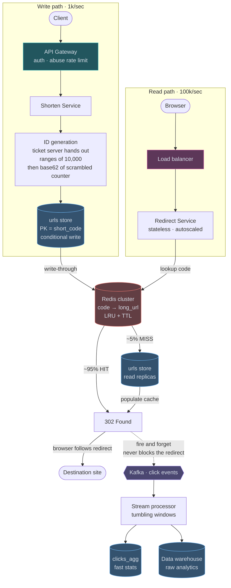
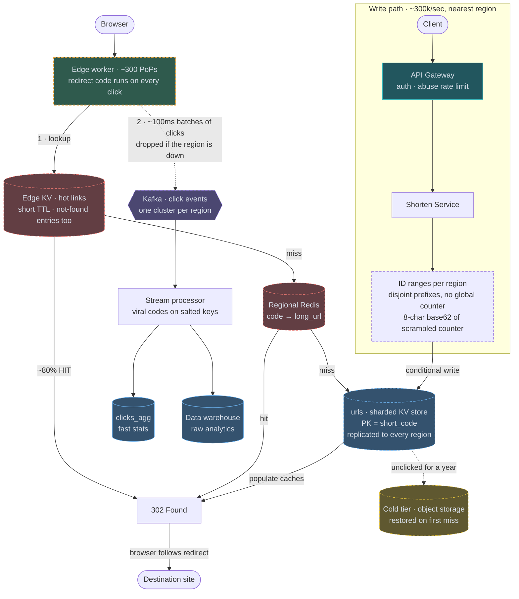

# 03 — URL Shortener (TinyURL / bit.ly)

## API / Model

```api
POST /v1/urls || {long_url, custom_alias?, expires_at?} || 201 {short_url}
GET /{code} || || 302 410 redirect to long_url || 410 Gone once the link has expired
GET /v1/urls/{code}/stats || || 200 click analytics
```

```erd
# Links
urls || 7-char base62 partition key, uniformly hashed
+ short_code || text || PK
+ long_url || text
+ created_at || timestamp
+ expires_at || timestamp || null
+ creator_id || bigint
+ is_custom || boolean
# Click analytics
clicks_raw || append-only: Kafka → object storage / warehouse || event log
+ short_code || text || → urls
+ ts || timestamp
+ ip_country || text
+ referrer || text
+ user_agent || text
+ device || text
clicks_agg
+ short_code || text || PK → urls
+ date || date || SK
+ count || bigint
+ top_countries || map<text,int>
+ top_referrers || map<text,int>
```

Note the partition key: `short_code` is effectively random (base62 of a hashed/encoded counter), so it distributes perfectly with no hot-partition risk. That's a rare gift — say so.

---

## High-level architecture

<!-- tab: Today · 100k redirects/s -->



The shortener is two paths joined by one Redis cluster: a write path at about 1k requests per second that creates links, and a read path at about 100k that redirects them. A separate analytics pipeline hangs off the redirect.

1. A client's `POST /v1/urls` passes the API Gateway, which applies auth and an abuse rate limit, and reaches the Shorten Service.
2. ID generation takes the next number from a range of 10,000 that the ticket server handed out, scrambles it, and encodes it as a base62 `short_code`.
3. The urls store saves the row with a conditional write on `short_code`, and write-through copies the mapping from code to `long_url` into the Redis cluster.
4. Later, a browser's `GET /{code}` goes through the Load balancer to the Redirect Service, which is stateless and autoscaled and looks the code up in the Redis cluster.
5. About 95% of lookups hit and return 302 Found straight away. The other 5% read the urls store read replicas, populate the cache, and then return the 302.
6. The browser follows the redirect to the destination site.

Every 302 also fires a click event to Kafka and returns without waiting for it. A stream processor groups those events into tumbling windows and writes to two places: `clicks_agg`, which serves the stats API, and the data warehouse, which keeps raw analytics.

<!-- tab: At 100x · 10M redirects/s -->



Same product at 100x the traffic. Dashed outlines mark what's new or reshaped compared with today's design.

| | Today | At 100x |
|---|---|---|
| Creates at peak | 3,000/sec | 300,000/sec |
| Redirects | 100k/sec | 10M/sec |
| Storage over 5 years | ~90 TB | ~9 PB |
| Codes created | 100M/day | 10B/day |
| 7-char key space lasts | ~95 years | under 1 year |
| Where redirects are answered | a few regions | ~300 edge locations |

**What changes, and the number that forces it**

1. **Codes grow from 7 to 8 characters.** At ~10B creates/day, the 3.5 trillion 7-char codes run out in under a year. 62^8 is ~218 trillion, about 60 years at this rate. Existing 7-char links keep working, because a code's length is part of the code.
2. **Redirects move to the edge.** 10M redirects/sec served from a few regions can't hold a 50ms p99 for users far from them. An edge worker in each CDN point of presence answers from a small edge key-value store of hot links. Unlike caching the 302 response itself, the worker runs on every click, so analytics survive: this resolves the "should the CDN cache redirects?" trade-off instead of giving something up.
3. **Clicks are batched at the edge.** 10M events/sec sent one at a time would double the edge's own request volume. Workers buffer ~100ms of clicks and ship batches to the regional Kafka, dropping them if the region is unreachable, because redirect availability still outranks analytics completeness. Viral codes get salted partition keys so one link can't pin one partition.
4. **ID ranges are carved per region.** Creates go to the nearest region, and a round trip to one global ticket server would put an ocean on the write path. Each region's ticket server hands out ranges from its own prefix, so codes stay unique with no cross-region coordination.
5. **Storage becomes a sharded KV store with a cold tier.** ~9 PB over five years is well past "plan for partitioning". The urls table lives in a multi-region key-value store hash-partitioned on `short_code`, which is still a perfectly uniform key. Links nobody has clicked in a year move to object storage and are restored on their first miss.
6. **Not-found answers stop at the edge.** At this volume, scanners guessing codes are real load. Caching "not found" for a short TTL at the edge, plus per-IP limits on 404s, keeps enumeration from reaching the regions at all.

**What stays the same**

302 over 301, a scrambled counter so codes can't be enumerated, analytics that never block a redirect, a conditional write for custom aliases, and TTL expiry returning 410. The 10x follow-up already says this design scales almost linearly; at 100x each piece just moves closer to the user, and the key space gets one more character.

<!-- /tabs -->

---
