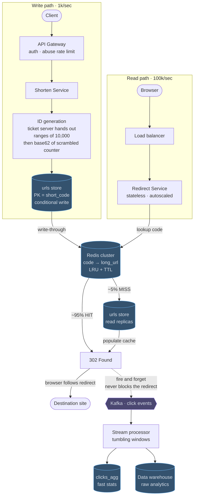

# 03 — URL Shortener (TinyURL / bit.ly)

## API / Model

```api
POST /v1/urls || {long_url, custom_alias?, expires_at?} || 201 {short_url}
GET /{code} || || 302 410 redirect to long_url || 410 Gone once the link has expired
GET /v1/urls/{code}/stats || || 200 click analytics
```

```schema
urls || PK: short_code || long_url, created_at, expires_at, creator_id, is_custom || 7-char base62 partition key, uniformly hashed
clicks_raw || || short_code, ts, ip_country, referrer, user_agent, device || append-only: Kafka → object storage / warehouse
clicks_agg || PK: short_code SK: date || count, top_countries, top_referrers ||
```

Note the partition key: `short_code` is effectively random (base62 of a hashed/encoded counter), so it distributes perfectly with no hot-partition risk. That's a rare gift — say so.

---

## High-level architecture



<details>
<summary>Plain-text version of this diagram</summary>

```text
                           ═══ WRITE PATH (1k/sec) ═══

  [Client] ──POST /v1/urls──► ┌──────────────┐
                               │ API Gateway  │ authn, rate limit (abuse control)
                               └──────┬───────┘
                                      ▼
                          ┌────────────────────────┐
                          │   SHORTEN SERVICE       │
                          │                         │
                          │  custom alias?          │
                          │   YES → check uniqueness│
                          │   NO  → get ID ─────────┼──┐
                          │        encode base62    │  │
                          └───────────┬─────────────┘  │
                                      │                │
                                      │    ┌───────────▼─────────────┐
                                      │    │  ID GENERATION           │
                                      │    │  ┌────────────────────┐  │
                                      │    │  │ Option A: Snowflake│  │
                                      │    │  │  64-bit, local, no │  │
                                      │    │  │  coordination      │  │
                                      │    │  ├────────────────────┤  │
                                      │    │  │ Option B: Ticket   │  │
                                      │    │  │  server hands out  │  │
                                      │    │  │  ranges of 10,000  │  │
                                      │    │  │  → local increment │  │
                                      │    │  └────────────────────┘  │
                                      │    │  then: base62(id ⊕ salt) │
                                      │    │        → non-sequential  │
                                      │    └──────────────────────────┘
                                      ▼
                        ┌──────────────────────────┐
                        │  urls store              │
                        │  key-value / Cassandra   │
                        │  PK = short_code         │
                        │  (conditional write to   │
                        │   guarantee uniqueness)  │
                        └────────────┬─────────────┘
                                     │ write-through
                                     ▼
                        ┌──────────────────────────┐
                        │  Redis cache             │
                        └──────────────────────────┘


                        ═══ READ PATH (100k/sec) ═══

  [Browser] ──GET /abc1234──► ┌──────────────┐
                               │     CDN      │  cache 302 w/ short TTL
                               └──────┬───────┘  (optional; see trade-offs)
                                      │ miss
                                      ▼
                               ┌──────────────┐
                               │ Load Balancer│
                               └──────┬───────┘
                                      ▼
                        ┌──────────────────────────┐
                        │   REDIRECT SERVICE        │  stateless, autoscaled
                        └──────────┬───────────────┘
                                   │
                        ┌──────────▼───────────┐
                        │  Redis cluster        │   ~95% HIT
                        │  code → long_url      │   LRU + TTL
                        └──────┬───────┬────────┘
                          HIT  │       │ MISS (~5%)
                               │       ▼
                               │  ┌──────────────────┐
                               │  │  urls store      │
                               │  │  (read replicas) │
                               │  └────────┬─────────┘
                               │           │ populate cache
                               │           ▼
                               │      ┌──────────┐
                               └─────►│ 302 Found│──► browser follows
                                      └────┬─────┘
                                           │ fire-and-forget (async!)
                                           ▼
                                ┌────────────────────┐
                                │ Kafka "click"      │
                                └─────────┬──────────┘
                                          ▼
                        ┌────────────────────────────────┐
                        │  Stream processor (Flink)       │
                        │  tumbling windows → aggregates  │
                        └──────┬──────────────┬───────────┘
                               ▼              ▼
                     ┌────────────────┐  ┌──────────────┐
                     │  clicks_agg    │  │ Data warehouse│
                     │  (fast stats)  │  │ (raw, BigQuery)│
                     └────────────────┘  └──────────────┘
```

</details>

The shortener is two paths joined by one Redis cluster: a write path at about 1k requests per second that creates links, and a read path at about 100k that redirects them. A separate analytics pipeline hangs off the redirect.

1. A client's `POST /v1/urls` passes the API Gateway, which applies auth and an abuse rate limit, and reaches the Shorten Service.
2. ID generation takes the next number from a range of 10,000 that the ticket server handed out, scrambles it, and encodes it as a base62 `short_code`.
3. The urls store saves the row with a conditional write on `short_code`, and write-through copies the mapping from code to `long_url` into the Redis cluster.
4. Later, a browser's `GET /{code}` goes through the Load balancer to the Redirect Service, which is stateless and autoscaled and looks the code up in the Redis cluster.
5. About 95% of lookups hit and return 302 Found straight away. The other 5% read the urls store read replicas, populate the cache, and then return the 302.
6. The browser follows the redirect to the destination site.

Every 302 also fires a click event to Kafka and returns without waiting for it. A stream processor groups those events into tumbling windows and writes to two places: `clicks_agg`, which serves the stats API, and the data warehouse, which keeps raw analytics.

---
