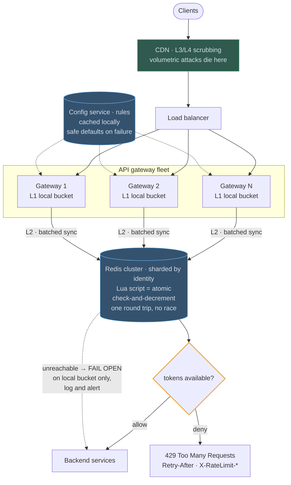

# 04 — Distributed Rate Limiter

## API / Model

```api
# Internal check · called by the gateway, not a public API
allow(identity, endpoint) || || {allowed: bool, remaining: int, reset_at: ts, retry_after: int}
# Rule configuration
PUT /admin/limits || {scope, identity_tier, endpoint_pattern, limit, window_sec, burst} || 200
# Over the limit
429 Too Many Requests || || || sent with the X-RateLimit-* and Retry-After headers
```

```schema
# Redis keys
rl:{identity}:{endpoint}:{window} || || counter or token-bucket state || TTL = window length, so keys clean themselves up; no GC job needed
# Rules · config service, cached locally with 30s refresh
tier || || {limit, window, burst, endpoint_overrides{}} ||
# Response headers
X-RateLimit-Limit || || requests allowed per window ||
X-RateLimit-Remaining || || requests left in the current window ||
X-RateLimit-Reset || || when the window resets ||
Retry-After || || 30 || seconds to wait before retrying
```

TTL-based expiry is worth pointing out: the counters garbage-collect themselves, so there's no cleanup job and memory is bounded by *active* identities, not total identities.

---

## High-level architecture



<details>
<summary>Plain-text version of this diagram</summary>

```text
                        ┌────────────────────────────┐
  [Clients] ──────────► │  CDN / L3-L4 DDoS scrubbing │ (volumetric attacks die here)
                        └─────────────┬──────────────┘
                                       ▼
                        ┌────────────────────────────┐
                        │      Load Balancer          │
                        └─────────────┬──────────────┘
          ┌────────────────────────────┼────────────────────────────┐
          ▼                            ▼                            ▼
  ┌───────────────┐            ┌───────────────┐            ┌───────────────┐
  │ API GATEWAY 1 │            │ API GATEWAY 2 │            │ API GATEWAY N │
  │               │            │               │            │               │
  │ ┌───────────┐ │            │ ┌───────────┐ │            │ ┌───────────┐ │
  │ │ L1: local │ │            │ │ L1: local │ │            │ │ L1: local │ │
  │ │ in-memory │ │            │ │ in-memory │ │            │ │ in-memory │ │
  │ │ bucket    │ │            │ │ bucket    │ │            │ │ bucket    │ │
  │ │ (fast     │ │            │ │           │ │            │ │           │ │
  │ │  path)    │ │            │ │           │ │            │ │           │ │
  │ └─────┬─────┘ │            │ └─────┬─────┘ │            │ └─────┬─────┘ │
  └───────┼───────┘            └───────┼───────┘            └───────┼───────┘
          │                            │                            │
          │  L2: sync to shared state (batched / on threshold)      │
          └────────────┬───────────────┴────────────┬───────────────┘
                       ▼                            ▼
          ┌──────────────────────────────────────────────────┐
          │       REDIS CLUSTER (sharded by identity hash)     │
          │                                                    │
          │   Lua script = ATOMIC check-and-decrement          │
          │   ┌──────────────────────────────────────────┐    │
          │   │ local tokens = redis.call(GET, key)       │    │
          │   │ refill based on elapsed time              │    │
          │   │ if tokens >= 1 then                       │    │
          │   │    decrement; return ALLOW                │    │
          │   │ else return DENY, retry_after             │    │
          │   └──────────────────────────────────────────┘    │
          │   (single round trip, no read-modify-write race)   │
          └────────────────────┬─────────────────────────────┘
                               │
                    ┌──────────┴──────────┐
              ALLOW │                      │ DENY
                    ▼                      ▼
        ┌──────────────────┐     ┌───────────────────────┐
        │ forward to        │     │  429 Too Many Requests │
        │ backend services  │     │  Retry-After: 30       │
        └──────────────────┘     │  X-RateLimit-*         │
                                  └───────────────────────┘

                  ┌────────────────────────────────────┐
                  │  CONFIG SERVICE (rules)             │
                  │  pushed/polled to gateways, cached  │
                  │  locally w/ safe defaults on failure│
                  └────────────────────────────────────┘

        ══ FAILURE MODE ══
        Redis unreachable → FAIL OPEN on local bucket only
        (serve traffic, log, alert) — protecting availability
        over perfect enforcement. State this choice explicitly.
```

</details>

Limits are enforced in two layers inside the API gateway fleet: an L1 local bucket in every gateway, and a Redis cluster that holds the shared count. Volumetric attacks are dropped before traffic reaches either layer.

1. Client traffic first passes CDN L3/L4 scrubbing, and the Load balancer spreads what is left across the gateways.
2. The gateway finds the rule for the caller's identity and endpoint in its local copy of the Config service rules.
3. It checks the caller's L1 local bucket in memory, with no network call.
4. Every N requests or X milliseconds, the L2 batched sync reconciles that bucket with the Redis cluster, which is sharded by identity. A Lua script there runs the check-and-decrement atomically in one round trip, so every gateway works from the same global count.
5. If the bucket, as of its last sync, has a token, the request is allowed and goes to Backend services. If not, the gateway returns 429 Too Many Requests with `Retry-After` and the `X-RateLimit-*` headers.

Two flows run beside the request path. The Config service distributes rule changes to the gateways, which cache them and fall back to safe defaults when it is unreachable, so a limit can change without a deploy. The dotted edge from Redis to Backend services is the failure path: when Redis is unreachable, gateways keep enforcing their local buckets, let traffic through, and log and alert.

---
