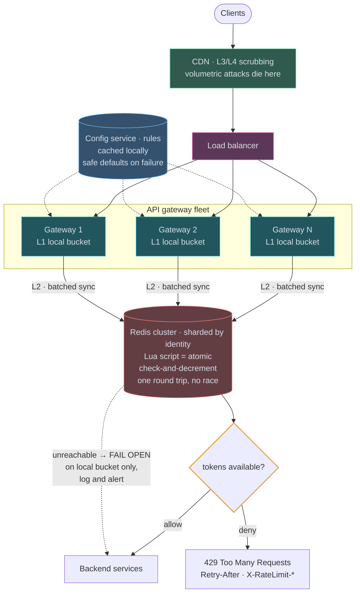
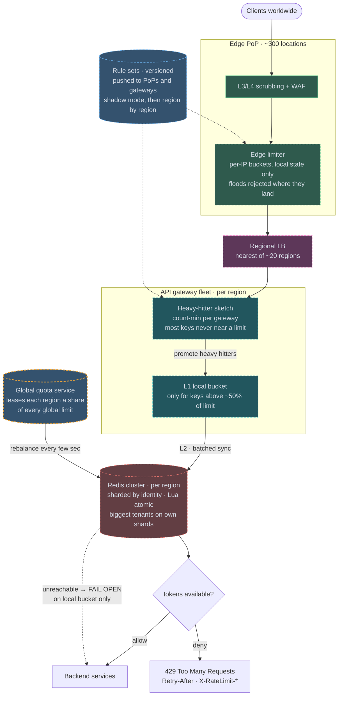

# 04 — Distributed Rate Limiter

## API / Model

```api
# Internal check · called by the gateway, not a public API
allow(identity, endpoint) || || {allowed: bool, remaining: int, reset_at: ts, retry_after: int}
# Rule configuration
PUT /admin/limits || {scope, identity_tier, endpoint_pattern, limit, window_sec, burst} || 200
# Over the limit
429 Too Many Requests || || || sent with the X-RateLimit-* and Retry-After headers
```

```schema
# Redis keys
rl:{identity}:{endpoint}:{window} || || counter or token-bucket state || TTL = window length, so keys clean themselves up; no GC job needed
# Rules · config service, cached locally with 30s refresh
tier || || {limit, window, burst, endpoint_overrides{}} ||
# Response headers
X-RateLimit-Limit || || requests allowed per window ||
X-RateLimit-Remaining || || requests left in the current window ||
X-RateLimit-Reset || || when the window resets ||
Retry-After || || 30 || seconds to wait before retrying
```

TTL-based expiry is worth pointing out: the counters garbage-collect themselves, so there's no cleanup job and memory is bounded by *active* identities, not total identities.

---

## High-level architecture

<!-- tab: Today · 1M req/s -->



Limits are enforced in two layers inside the API gateway fleet: an L1 local bucket in every gateway, and a Redis cluster that holds the shared count. Volumetric attacks are dropped before traffic reaches either layer.

1. Client traffic first passes CDN L3/L4 scrubbing, and the Load balancer spreads what is left across the gateways.
2. The gateway finds the rule for the caller's identity and endpoint in its local copy of the Config service rules.
3. It checks the caller's L1 local bucket in memory, with no network call.
4. Every N requests or X milliseconds, the L2 batched sync reconciles that bucket with the Redis cluster, which is sharded by identity. A Lua script there runs the check-and-decrement atomically in one round trip, so every gateway works from the same global count.
5. If the bucket, as of its last sync, has a token, the request is allowed and goes to Backend services. If not, the gateway returns 429 Too Many Requests with `Retry-After` and the `X-RateLimit-*` headers.

Two flows run beside the request path. The Config service distributes rule changes to the gateways, which cache them and fall back to safe defaults when it is unreachable, so a limit can change without a deploy. The dotted edge from Redis to Backend services is the failure path: when Redis is unreachable, gateways keep enforcing their local buckets, let traffic through, and log and alert.

<!-- tab: At 100x · 100M req/s -->



Same limiter at 100x the traffic, which is roughly what the largest edge networks see. Dashed outlines mark what's new or reshaped compared with today's design.

| | Today | At 100x |
|---|---|---|
| Requests | 1M/sec | 100M/sec |
| Active identities | ~50M | ~1B |
| Bucket state if every key had one | ~2.5 GB | ~50 GB |
| Redis syncs, one per ~100 requests | ~10k/sec | ~1M/sec |
| Where traffic lands | a few regions | ~300 edge PoPs, ~20 regions |

**What changes, and the number that forces it**

1. **Per-IP limits move to the edge.** At 100M requests/sec a large share of traffic is abusive, and hauling it to a region just to reject it pays for bandwidth and gateway capacity twice. Coarse per-IP buckets run in the CDN's edge PoPs with local state only, so floods and scrapers are rejected where they land. Per-key and per-user limits stay in the regions, where identity is known.
2. **Most keys stop getting a bucket.** Of ~1B active identities, the vast majority never come near their limit, yet each bucket would cost memory and a stream of Redis syncs. Each gateway runs a count-min sketch to spot heavy hitters, and only keys above ~50% of their limit get a real token bucket and join the sync. Sync volume now tracks the keys that matter, not all of them. A key that jumps from idle to over-limit inside one sketch window slips through briefly, which the bounded-overshoot contract already allows.
3. **Redis goes regional, and global limits become leases.** One Redis for a global limit would put a cross-region round trip in every sync. Each region runs its own cluster, and a global quota service leases each region a share of every global limit, rebalanced every few seconds by observed demand. Overshoot is bounded by `regions × lease slack`, a number you can still compute and state. Correctness-critical limits ("one free trial per account") stay exact by checking one home region synchronously.
4. **The biggest tenants get their own shards.** At 100x, a single large customer sends more traffic than whole regions did before. Their keys live on dedicated Redis shards (or sub-buckets `key#0..#N`), so one tenant's burst can't raise latency for everyone sharing a shard.
5. **Rules are pushed as versions, not polled.** 30-second polling from ~300 PoPs and thousands of gateways is a load pattern of its own, and a bad rule would reach everywhere at once. Rule sets become versioned artifacts, pushed through the same channel as edge config, run in shadow mode, then rolled out region by region.

**What stays the same**

Token bucket as the default algorithm, Lua scripts for atomic check-and-decrement, identity-sharded Redis, fail open on local buckets while alerting, 429 with `Retry-After`, and layered limits: IP at the edge, API key at the gateway, user at the service. What changes is where each layer runs and how much state it bothers to keep.

<!-- /tabs -->

---
