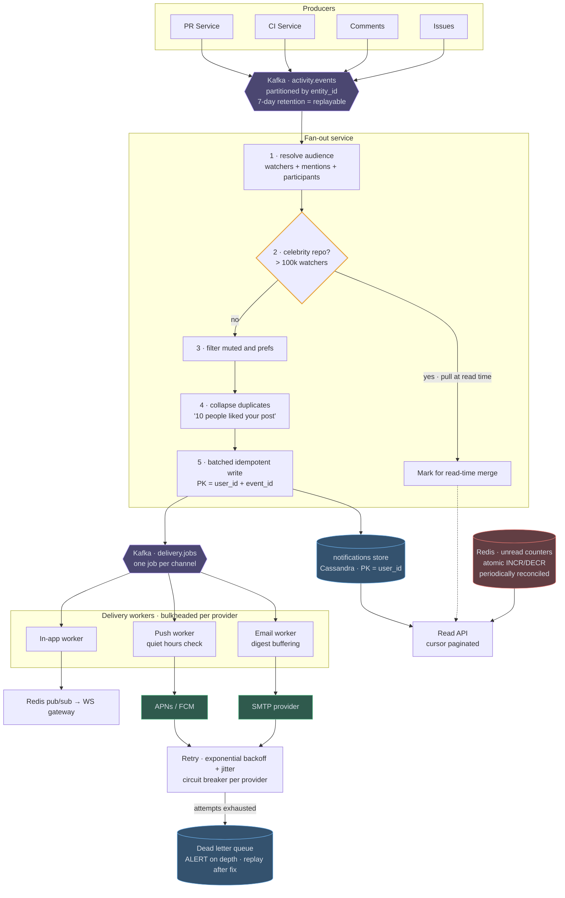
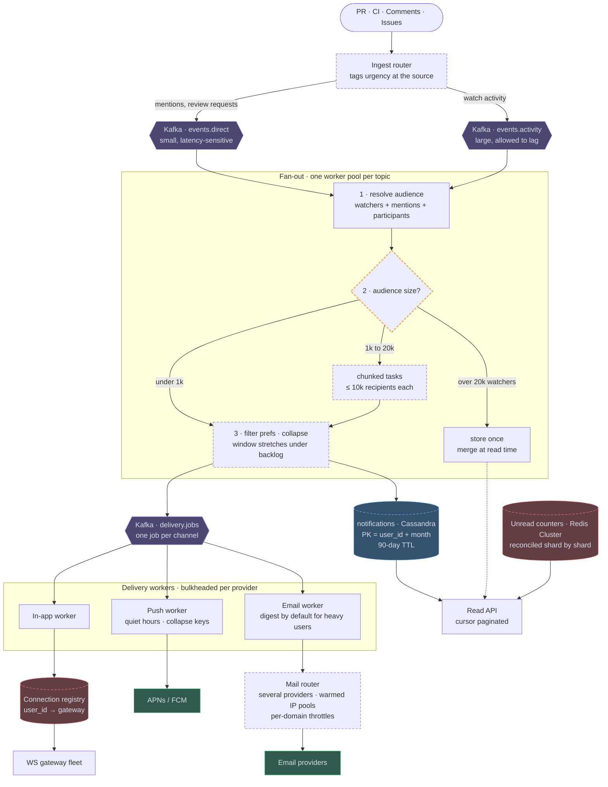

# 05 — Notification System (GitHub / multi-channel)

## API / Model

```api
POST /internal/events || || 202 || producers only; separate from the user API
GET /v1/notifications?cursor=&filter=unread || || 200 notification page
POST /v1/notifications/{id}/read || || 204
POST /v1/notifications/read-all || || 204
PUT /v1/preferences || {type, channels[], digest_frequency} || 200
POST /v1/repos/{id}/mute || || 204
```

```erd
# Routing
subscriptions || fan-out lookup direction
+ repo_id || bigint || PK
+ user_id || bigint || SK
+ type || watching | participating | mentioned
+ muted || boolean
preferences
+ user_id || bigint || PK
+ channels || map<type,channels>
+ quiet_hours || time range
+ timezone || text
+ digest_freq || text
# Inbox
notifications || notification_id is a Snowflake; the unique constraint is the idempotency key
+ user_id || bigint || PK
+ notification_id || bigint || SK DESC
+ event_id || uuid
+ type || text
+ entity_ref || text
+ read || boolean
+ created_at || timestamp
+ UNIQUE (user_id, event_id)
unread:{user_id} || unread count per user; atomic INCR / DECR || Redis
+ count || int
# Delivery
delivery_log || dedupe and observability
+ notification_id || bigint || PK → notifications.notification_id
+ channel || text || PK
+ status || text
+ attempts || int
+ last_error || text || null
```

---

## High-level architecture

<!-- tab: Today · 50k events/s -->



Events pass through two Kafka topics: `activity.events` feeds the Fan-out service, and `delivery.jobs` feeds delivery workers that are bulkheaded per provider. The notifications store and the Read API sit beside that pipeline as each user's inbox.

1. The PR Service, CI Service, Comments and Issues publish to Kafka `activity.events`, partitioned by `entity_id`. The Fan-out service consumes it and resolves the audience: watchers, mentions and participants.
2. It checks whether the event belongs to a celebrity repo with more than 100k watchers. If it does, the service writes nothing per user and marks the event for read-time merge.
3. For every other event, it filters the audience by mutes and preferences.
4. It collapses duplicates, so ten likes become one "10 people liked your post" notification.
5. It makes one batched, idempotent write keyed by `user_id` and `event_id` to the notifications store, and puts one job per channel on Kafka `delivery.jobs`.
6. The In-app worker, Push worker and Email worker each take their own jobs. The in-app worker sends through Redis pub/sub to the WS gateway, the push worker checks quiet hours before calling APNs / FCM, and the email worker buffers digests before calling the SMTP provider.

Failed provider calls go to the retry stage, which backs off exponentially with jitter behind a circuit breaker per provider. Jobs that run out of attempts land in the dead letter queue, which alerts on depth and is replayed after a fix. On the read side, the Read API pages through the notifications store by cursor, merges celebrity-repo events at read time, and takes badge counts from the Redis unread counters.

<!-- tab: At 10x · 500k events/s -->



Same product at 10x the traffic. At 100x the peak would be 50M deliveries/sec, far beyond what email and push providers accept from anyone, so 10x is the tier where the design is still recognisably this one. Dashed outlines mark what's new or reshaped compared with today's design.

| | Today | At 10x |
|---|---|---|
| Events at peak | 50k/sec | 500k/sec |
| Deliveries at peak | 500k/sec | 5M/sec |
| Notification records | ~2 TB/day | ~20 TB/day |
| Biggest repo | 500k watchers | 5M watchers |
| Read-time merge threshold | 100k watchers | 20k watchers |

**What changes, and the number that forces it**

1. **One topic becomes two, split by urgency.** At 500k events/sec, a CI storm or a viral repo can put minutes of backlog on a single topic, and a direct @mention waits behind it. The ingest router tags each event at the source: mentions and review requests go to a small, latency-sensitive topic with its own fan-out pool, and watch activity goes to a large topic that is allowed to lag. Priority isolation becomes part of the topology.
2. **Fan-out splits by audience size.** Small audiences go straight through. Mid-sized ones (1k to 20k) are chunked into tasks of at most 10k recipients, so no single job holds a partition hostage. And the read-time merge threshold drops from 100k watchers to 20k: at 5M deliveries/sec, eager fan-out for mid-size repos is what saturates the workers first, just as the 10x follow-up predicts.
3. **Collapse windows stretch under backlog.** When consumer lag rises, the collapse window for low-priority types grows from minutes toward an hour, so a storm produces "38 new comments on PR #412" rather than 38 notifications and 38 emails. Lag is the input signal, and direct notifications never stretch.
4. **Email goes through a mail router.** Tens of millions of emails a day exceed what one provider will accept, and mailbox providers throttle per sending domain and IP reputation. A mail router spreads traffic across several providers and warmed dedicated IP pools, applies per-destination-domain throttles, and switches heavy recipients to digests by default. One provider's outage or throttling now shifts traffic instead of filling the DLQ.
5. **The inbox gets bounded.** 20 TB/day kept forever is a storage bill for notifications nobody opens. Partitions become `(user_id, month)`, so a heavy user's inbox isn't one enormous partition, and rows expire after 90 days via TTL.
6. **In-app delivery needs a registry.** With millions of open tabs, one Redis pub/sub can no longer carry every user's channel. A connection registry maps each user to their gateway, the same shape as the chat design, and unread counters move to a sharded Redis Cluster reconciled shard by shard.

**What stays the same**

At-least-once delivery with the `(user_id, event_id)` idempotency key, preferences checked at delivery time rather than fan-out time, bulkheads and circuit breakers per provider, retries with backoff into an alerting DLQ, and Kafka replay after a consumer bug. The pipeline shape is unchanged; it just gains lanes.

<!-- /tabs -->

---
