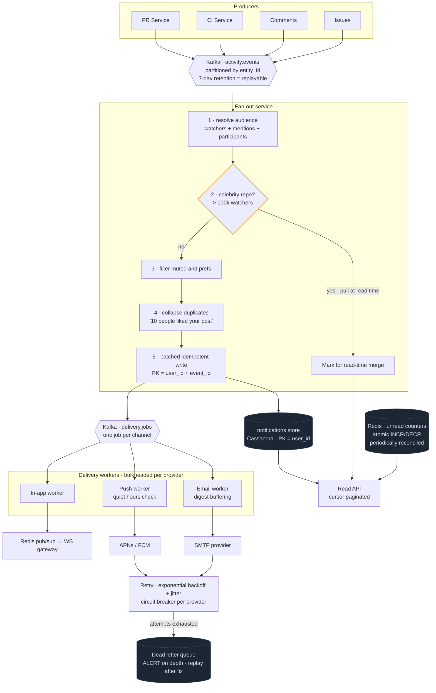

# 05 — Notification System (GitHub / multi-channel)

## Primary concepts and the hard part

**Concepts:** event-driven architecture, pub/sub, fan-out, at-least-once + idempotency, retry with backoff, dead letter queues, multi-channel delivery, preference filtering, deduplication/collapsing, digests.

**The hard part they're probing:** third-party delivery channels (APNs, FCM, SMTP) fail constantly and are rate limited. How do you guarantee nothing is lost, nothing is duplicated visibly, and one flaky provider doesn't take down the rest?

---

## Requirements

**Functional**
- Producers (PR service, CI, comments) emit events
- Match events to interested recipients (watchers, mentions, participants)
- Deliver via in-app inbox, email, mobile push
- Per-user, per-type, per-channel preferences; mute threads and repos
- Mark read/unread, unread counts
- Collapse related notifications ("10 people liked your post")
- Email digests instead of per-event mail

**Non-functional**
- In-app delivery within seconds; email/push within minutes is fine
- Never silently drop a notification
- At-least-once delivery with no *visible* duplicates
- Availability over consistency (stale unread count is acceptable)

**Out of scope:** ML ranking of notifications, spam classification.

**Scale**
```
Events:     5,000/sec avg, 50,000/sec peak (a big repo goes viral, CI storm)
Fan-out:    ~10 recipients avg; "celebrity repos" up to 500k watchers
Deliveries: 50k-500k/sec at peak
Records:    ~0.5 KB → ~2 TB/day
```
**Conclusion:** the peak fan-out multiplier is what sizes the fan-out worker fleet, and the 500k-watcher case forces the same hybrid as the feed design.

---

## API / Model

```
POST /internal/events                    (producers; separate from user API)
GET  /v1/notifications?cursor=&filter=unread
POST /v1/notifications/{id}/read
POST /v1/notifications/read-all
PUT  /v1/preferences                     {type, channels[], digest_frequency}
POST /v1/repos/{id}/mute
```

```
subscriptions   PK: repo_id    SK: user_id     (fan-out lookup direction)
                type (watching|participating|mentioned), muted

notifications   PK: user_id    SK: notification_id (Snowflake DESC)
                event_id, type, entity_ref, read, created_at
                UNIQUE (user_id, event_id)  ← idempotency key

preferences     PK: user_id
                per-type channel map, quiet_hours, timezone, digest_freq

delivery_log    PK: (notification_id, channel)
                status, attempts, last_error       ← dedupe + observability

unread_counts   Redis: unread:{user_id} → int (atomic INCR/DECR)
```

---

## High-level architecture



<details>
<summary>Plain-text version of this diagram</summary>

```text
 ┌────────────┐ ┌────────────┐ ┌────────────┐ ┌────────────┐
 │ PR Service │ │ CI Service │ │ Comments   │ │ Issues     │   PRODUCERS
 └─────┬──────┘ └─────┬──────┘ └─────┬──────┘ └─────┬──────┘
       └──────────────┴───────┬───────┴──────────────┘
                              ▼
        ┌────────────────────────────────────────────┐
        │   KAFKA  topic: activity.events             │
        │   partitioned by entity_id (ordering per    │
        │   PR/issue); 7-day retention → REPLAYABLE   │
        └───────────────────┬────────────────────────┘
                            ▼
   ┌────────────────────────────────────────────────────────┐
   │              FAN-OUT SERVICE (consumer group)            │
   │                                                          │
   │  1. resolve audience ──► [Subscription Service]          │
   │       watchers + @mentions + thread participants         │
   │                                                          │
   │  2. is repo a "celebrity" (>100k watchers)?              │
   │       YES → skip eager fan-out, mark for read-time pull  │
   │       NO  → continue                                     │
   │                                                          │
   │  3. filter: muted? preference off? actor == recipient?   │
   │                                                          │
   │  4. COLLAPSE: same type + same entity within window      │
   │       → merge into one "N people did X"                  │
   │                                                          │
   │  5. batched idempotent write, PK=(user_id, event_id)     │
   └───────┬──────────────────────────────────┬──────────────┘
           │                                   │
           ▼                                   ▼
  ┌──────────────────────┐        ┌────────────────────────────┐
  │  notifications store  │        │  KAFKA topic: delivery.jobs │
  │  Cassandra            │        │  (one job per channel)      │
  │  PK=user_id           │        └──────┬────────┬────────┬───┘
  │  SK=notif_id DESC     │               │        │        │
  └──────────┬───────────┘    ┌───────────┘        │        └───────────┐
             │                 ▼                    ▼                    ▼
             │        ┌────────────────┐  ┌────────────────┐  ┌────────────────┐
             │        │ IN-APP WORKER  │  │  PUSH WORKER   │  │  EMAIL WORKER  │
             │        │                │  │                │  │                │
             │        │ check prefs at │  │ quiet hours?   │  │ digest mode?   │
             │        │ DELIVERY time  │  │ device tokens  │  │  → buffer      │
             │        └───────┬────────┘  └───────┬────────┘  └───────┬────────┘
             │                │                    │                   │
             │                ▼                    ▼                   ▼
             │      ┌──────────────────┐  ┌────────────────┐  ┌────────────────┐
             │      │ Redis pub/sub    │  │  APNs / FCM    │  │  SMTP provider │
             │      │  → WS gateway    │  │  (3rd party,   │  │  (3rd party,   │
             │      │  → live client   │  │   rate limited)│  │   rate limited)│
             │      └──────────────────┘  └───────┬────────┘  └───────┬────────┘
             │                                     │                   │
             │            ┌────────────────────────┴───────────────────┘
             │            ▼
             │   ┌──────────────────────────────────────────┐
             │   │  RETRY:  exponential backoff + JITTER      │
             │   │   1s → 2s → 4s → 8s → 16s                  │
             │   │   circuit breaker per provider (bulkhead)  │
             │   └────────────────┬─────────────────────────┘
             │                     │ exhausted
             │                     ▼
             │            ┌─────────────────────┐
             │            │  DEAD LETTER QUEUE  │  ← ALERT on depth
             │            │  payload + error +  │    replay after fix
             │            │  attempt count      │
             │            └─────────────────────┘
             │
             ▼
     ┌────────────────────┐        ┌─────────────────────────┐
     │ READ API           │◄───────│ Redis: unread counters   │
     │ cursor-paginated   │        │ atomic INCR/DECR, drift  │
     │ merge: own feed +  │        │ reconciled periodically  │
     │ celebrity pull     │        └─────────────────────────┘
     └────────────────────┘
```

</details>

---

## Trade-offs and deep dives

**Why Kafka and not a plain queue.** Replay. If the fan-out consumer ships a bug that drops a category of notification, you reset the offset and reprocess. If you add a fifth delivery channel next quarter, it reads history from day one. A queue that deletes on consume gives you none of that.

**Delivery guarantee framing.** Say it precisely: *at-least-once delivery with idempotent consumers, producing exactly-once effects.* The dedupe key is `(user_id, event_id)` as the storage primary key for the notification, and `(notification_id, channel)` in the delivery log so a retried job that already sent an email doesn't send a second one.

**Check preferences at delivery time, not fan-out time.** If a user mutes a thread after the fan-out ran but before the email worker fires, the mute should take effect. Filtering at write time bakes in a stale decision. Small detail, real product consequence.

**Collapsing / deduplication.** Ten likes should be one notification. Implement as a short time-windowed aggregation keyed by `(recipient, type, entity)`: hold for N minutes, merge arrivals, then emit. This is a windowed stream operation, and it also protects the email provider from a burst.

**Bulkheads per provider.** APNs, FCM, and SMTP each get their own worker pool, their own queue, and their own circuit breaker. When SMTP is degraded, push notifications must keep flowing. Sharing a thread pool across providers means one bad provider stalls everything — this is the bulkhead pattern and it's worth naming.

**Provider rate limits force batching.** A CI storm generating 100k email jobs will get you throttled or blocked by your email provider. Two mitigations: batch into digests (one email covering many events) and apply a leaky bucket in front of the provider so output is smooth regardless of input burstiness.

**Digests are a scheduled drain.** Buffer events per user, and a scheduler fires hourly/daily to render and send one email. Requires the user's timezone so "daily at 9am" means their 9am.

**Quiet hours and caps.** Never push at 3am local; cap pushes per user per day. Needs per-user timezone and a counter. Cheap to implement, big product win, and shows you're thinking about the human on the other end.

**Unread counts.** Counting rows on every page load is a range scan per request. Maintain a Redis counter with atomic `INCR`/`DECR`, accept that it drifts (missed decrements, race conditions), and run a periodic reconciliation job against the store. Say the drift is acceptable because this is an AP system — the failure mode is a badge showing 3 instead of 2.

**Celebrity repos.** Same hybrid as the feed: above a watcher threshold, don't fan out. Store the event once, and merge it in at read time for users who watch that repo. One cached "recent events for repo X" list serves all 500k watchers.

**Large fan-out jobs must not block small ones.** A 500k-recipient job sitting in a partition starves ordinary notifications behind it. Either chunk large jobs into sub-tasks or route them to a separate low-priority queue. Priority isolation.

**What to monitor.** Kafka consumer lag (the leading indicator), DLQ depth (alert, not dashboard), per-provider delivery success rate and latency, fan-out worker error rate, and end-to-end p99 from event emitted to in-app delivery.

---

## Possible follow-up questions

- *A user both watches the repo and is @mentioned — two notifications?* Dedupe during fan-out on `event_id`; if both paths generate a notification, the unique constraint on `(user_id, event_id)` collapses them. Prefer the higher-priority reason when choosing the display text.
- *How do you backfill after a consumer outage?* Reset the consumer group offset to before the outage and reprocess. Idempotent writes make reprocessing safe — this is exactly why idempotency and replay are designed together.
- *What if the notification store write succeeds but the delivery job publish fails?* Transactional outbox: write the notification and an outbox row in one transaction, and have a separate publisher drain the outbox. Removes the dual-write problem.
- *How do you handle expired device tokens?* APNs/FCM return them in feedback responses; mark the token dead and stop using it. Otherwise your invalid-token error rate grows forever and pollutes your delivery metrics.
- *How do you support a new channel (SMS, Slack)?* Add a consumer group on `delivery.jobs` and a preference field. Nothing upstream changes — that's the payoff of event-driven architecture.
- *What breaks first at 10x?* Fan-out worker throughput and the per-provider rate limits. The store scales linearly by user_id partitioning.
