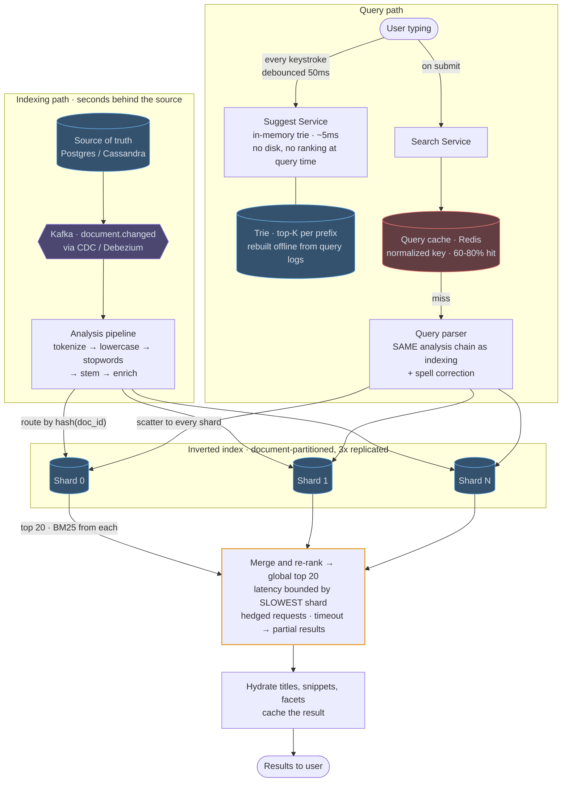
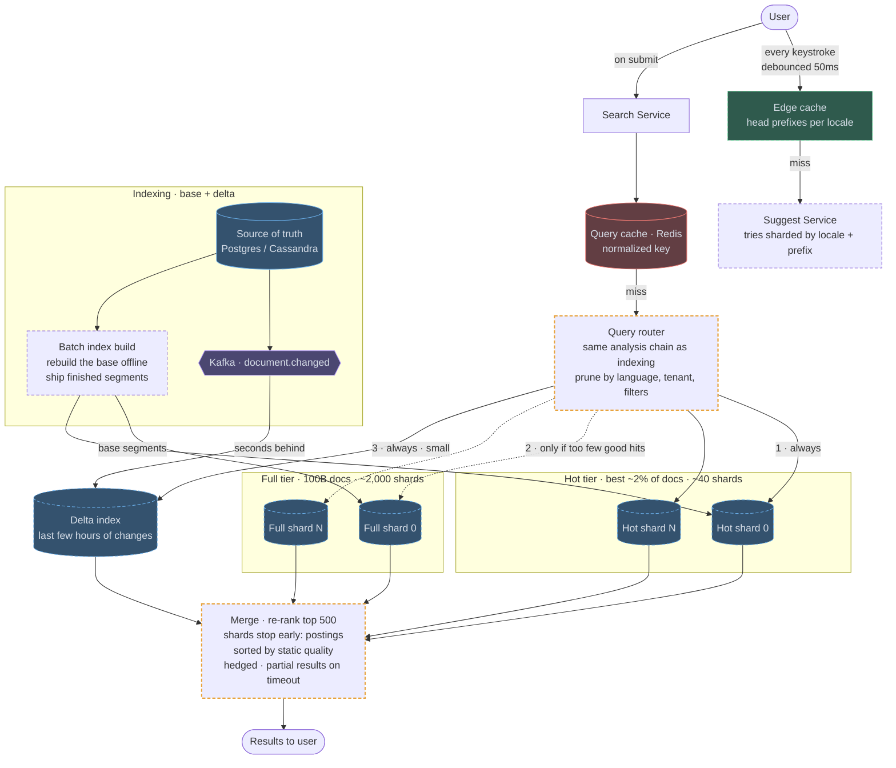

# 06 — Search / Autocomplete (Typeahead)

## API / Model

```api
GET /v1/search?q=&filters=&sort=&cursor=&limit=20 || || 200 ranked results
GET /v1/suggest?q=&limit=10 || || 200 completions || separate service, separate SLA
```

```schema
# Inverted index · per shard
term → posting list || || "distributed" → [(doc1, tf=3, pos[...]), (doc7, tf=1), (doc22, tf=5)] ||
# Doc store · hydration and display fields
doc_id || || {title, snippet, url, metadata} ||
# Trie · typeahead, in memory
trie node || || top-K completions by popularity || cached on every node
# Source of truth
Postgres / Cassandra || || || the index is derived, never authoritative
```

---

## High-level architecture

<!-- tab: Today · 1B docs -->



The design has an indexing path that keeps the inverted index a few seconds behind the source of truth, and a query path with two services: the Search Service for submitted queries and the Suggest Service for keystrokes. Only search touches the index shards.

1. When the user submits a query, the Search Service checks the Redis query cache under a normalized key, and 60-80% of queries are answered there.
2. On a miss, the Query parser runs the same analysis chain used at index time, plus spell correction.
3. The parser scatters the query to every shard. The index is document-partitioned, so each shard holds a complete index for its share of documents.
4. Each shard scores its matches with BM25 and returns its top 20.
5. The gather step merges and re-ranks those lists into the global top 20, using hedged requests and a timeout so one slow shard can only cost partial results.
6. Hydrate adds titles, snippets and facets, caches the result, and returns it to the user.

Typeahead runs beside this. Every keystroke, debounced by 50ms, goes to the Suggest Service, which walks an in-memory trie of top-K completions per prefix in about 5ms; the trie is rebuilt offline from query logs. Documents reach the shards through the indexing path: changes in the source of truth flow through CDC into Kafka `document.changed`, the analysis pipeline tokenizes, lowercases, drops stopwords, stems and enriches them, and each document goes to the shard chosen by `hash(doc_id)`.

<!-- tab: At 100x corpus · 100B docs -->



Same engine over a 100x larger corpus. Query volume here is already web-search sized, so this tab grows the index 100x and queries about 3x. Dashed outlines mark what's new or reshaped compared with today's design.

| | Today | At 100x corpus |
|---|---|---|
| Documents | 1B | 100B |
| Index size | ~1 TB | ~100 TB |
| Shards at ~50 GB each | ~20 | ~2,000 |
| Search queries | 100k/sec | ~300k/sec |
| Typeahead | 500k/sec | ~1.5M/sec |

**What changes, and the number that forces it**

1. **Scattering to every shard stops working.** With ~2,000 shards, some shard is always slow, so p99 becomes roughly "the worst shard of the moment". Hedged requests contained tail amplification at 20 shards; at 2,000 nothing below works unless a query touches far fewer shards.
2. **A hot tier answers most queries.** Quality and popularity are power-law, so a small tier holding the best ~2% of documents (~40 shards) contains the top results for most queries. The router always asks the hot tier and only fans out to the full tier when the hot tier returns too few strong hits, which in practice means rare, long-tail queries. Most queries now touch dozens of shards, not thousands.
3. **The router prunes shards.** Full-tier shards are partitioned by values queries commonly filter on (language, tenant, category), hashed by `doc_id` within each partition. A query carrying those filters goes only to the matching shards. Still document-partitioned, but by a key the router can use.
4. **Shards stop early.** Posting lists are sorted by a static quality score, so a shard can stop once it has enough strong candidates instead of scoring every match. The gather step re-ranks the top ~500 with the expensive signals. The cost is that a relevant document with a low static score can be cut before it's ever scored.
5. **Indexing splits into a base and a delta.** Rebuilding 100B documents through the change stream one update at a time would take weeks. A batch job rebuilds the base index offline from the source of truth and ships finished segments to shards, while recent changes go into a small real-time delta index that every query also reads. Freshness stays in seconds, and a mapping change becomes a scheduled rebuild rather than an emergency.
6. **Typeahead moves toward the edge.** At ~1.5M keystrokes/sec, the head prefixes for each locale are served from edge caches, and tries are sharded by locale and leading prefix so every Suggest node holds a bounded trie.

**What stays the same**

The index is derived and never the source of truth. Index-time and query-time analysis stay identical, ranking is still BM25 layered with business signals, the query cache still normalizes keys, and partial results still beat a spinner. Sharding stays document-partitioned rather than term-partitioned.

<!-- /tabs -->

---
