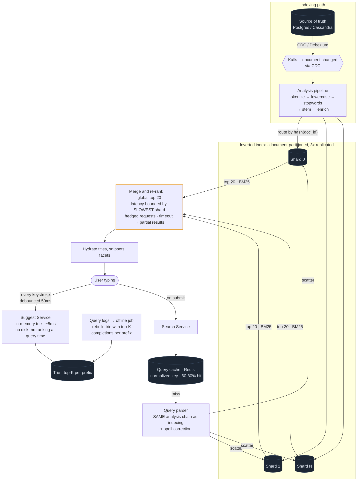

# 06 — Search / Autocomplete (Typeahead)

## Primary concepts and the hard part

**Concepts:** inverted index, tokenization and stemming, TF-IDF/BM25 ranking, scatter-gather sharding, tail latency, near-real-time indexing, tries, CDC pipelines, caching.

**The hard part they're probing:** two things. (1) Search is a scatter-gather — your latency is bounded by your slowest shard, so tail latency dominates. (2) The search index is *not* your source of truth; you must explain how it stays in sync and that it lags.

---

## Requirements

**Functional**
- Full-text search over documents (products, posts, repos)
- Typeahead suggestions as the user types
- Filters/facets (category, date range, price)
- Relevance ranking, pagination
- Typo tolerance

**Non-functional**
- Typeahead p99 < 100ms (it fires on every keystroke)
- Search p99 < 300ms
- Index freshness: new documents searchable within ~seconds
- Read-heavy, high query volume

**Out of scope:** personalization/learned ranking models, image search.

**Scale**
```
Documents:    1B
Queries:      100,000/sec search
Typeahead:    500,000/sec (fires per keystroke — 5x search volume!)
Index size:   1B docs × ~1KB indexed → ~1 TB → ~20 shards of 50 GB
Query cache hit rate: 60-80% (head queries are extremely repetitive)
```
**Conclusion:** typeahead is a *higher-volume, lower-latency* problem than search itself. It needs a completely different data structure (in-memory trie), not the search cluster. Recognizing that is half the answer.

---

## API / Model

```
GET /v1/search?q=&filters=&sort=&cursor=&limit=20
GET /v1/suggest?q=&limit=10                     ← separate service, separate SLA
```

```
INVERTED INDEX (per shard)
  term → posting list
    "distributed" → [(doc1, tf=3, pos[...]), (doc7, tf=1), (doc22, tf=5)]

DOC STORE (for hydration / display fields)
  doc_id → {title, snippet, url, metadata}

TRIE (typeahead, in memory)
  each node caches top-K completions by popularity

SOURCE OF TRUTH
  Postgres / Cassandra  ← index is DERIVED, never authoritative
```

---

## High-level architecture



<details>
<summary>Plain-text version of this diagram</summary>

```text
   ═══════════════ INGESTION / INDEXING PATH ═══════════════

  ┌──────────────────┐
  │ Source of truth  │  (Postgres, Cassandra — the real data)
  └────────┬─────────┘
           │ CDC (Debezium) or app-emitted events
           ▼
  ┌──────────────────────────────┐
  │  Kafka: document.changed      │
  └────────┬─────────────────────┘
           ▼
  ┌────────────────────────────────────────────────┐
  │        INDEXING PIPELINE                        │
  │   tokenize → lowercase → strip punctuation →    │
  │   remove stopwords → stem ("running"→"run") →   │
  │   build posting entries → enrich (popularity,   │
  │   recency, quality signals)                     │
  └────────────────┬───────────────────────────────┘
                   │ route by hash(doc_id)
     ┌─────────────┼─────────────┬─────────────┐
     ▼             ▼             ▼             ▼
 ┌────────┐   ┌────────┐   ┌────────┐   ┌────────┐
 │Shard 0 │   │Shard 1 │   │Shard 2 │ …│Shard 19│     each replicated 3x
 │inverted│   │inverted│   │inverted│   │inverted│
 │ index  │   │ index  │   │ index  │   │ index  │
 └────────┘   └────────┘   └────────┘   └────────┘
   ▲ refresh interval ~1s → NEW DOCS NOT INSTANTLY SEARCHABLE

           ┌──────────────────────────────┐
           │ Query log → offline job →     │
           │ rebuild TRIE with top-K       │──► pushed to Suggest nodes
           │ completions per prefix        │    (hourly/daily)
           └──────────────────────────────┘


   ═══════════════════ QUERY PATH ═══════════════════

  [User types "dist..."]
         │
         ├─────────────────────────────┐
         │ every keystroke              │ on submit
         ▼                              ▼
  ┌────────────────────┐      ┌──────────────────────┐
  │ SUGGEST SERVICE     │      │   SEARCH SERVICE      │
  │ (in-memory TRIE)    │      └──────────┬───────────┘
  │ ~5ms, no disk       │                 │
  │ debounced client-   │                 ▼
  │ side (~50ms)        │      ┌──────────────────────┐
  └────────────────────┘      │  Query cache (Redis)  │ 60-80% HIT
                               │  normalized query key │
                               └──────────┬───────────┘
                                          │ MISS
                                          ▼
                               ┌──────────────────────┐
                               │  QUERY PARSER         │
                               │  same analysis chain  │
                               │  as indexing (MUST    │
                               │  match, or nothing    │
                               │  ever matches)        │
                               │  + spell correction   │
                               └──────────┬───────────┘
                                          │
                        ┌─────── SCATTER ─┴──────────┐
                        ▼         ▼         ▼        ▼
                   ┌────────┐┌────────┐┌────────┐┌────────┐
                   │Shard 0 ││Shard 1 ││Shard 2 ││Shard 19│
                   │ top 20 ││ top 20 ││ top 20 ││ top 20 │
                   │ BM25   ││ BM25   ││ BM25   ││ BM25   │
                   └────┬───┘└────┬───┘└───┬────┘└───┬────┘
                        └─────────┴── GATHER ┴───────┘
                                     ▼
                        ┌──────────────────────────┐
                        │  MERGE + RE-RANK          │
                        │  global top 20            │
                        │  ⚠ latency = SLOWEST shard│
                        │  → hedged requests, timeout│
                        │    + partial results       │
                        └────────────┬─────────────┘
                                     ▼
                        ┌──────────────────────────┐
                        │  HYDRATE from doc store   │
                        │  titles, snippets, images │
                        └────────────┬─────────────┘
                                     ▼
                              results + facets
```

</details>

---

## Trade-offs and deep dives

**Why an inverted index at all.** `WHERE body LIKE '%distributed%'` cannot use a B-tree index (leading wildcard) and scans every row. The inverted index flips the mapping so lookup is O(1) on the term plus a posting-list intersection. For a multi-word query, intersect the posting lists, starting with the *shortest* one to minimize work.

**Index-time and query-time analysis must be identical.** If you stem at index time but not at query time, a search for "running" won't match the indexed token "run". This is the single most common real-world search bug and a good thing to mention.

**Ranking: TF-IDF → BM25.** TF-IDF says a term matters if it's frequent in this document but rare in the corpus. BM25 adds saturation (the 50th occurrence of a word adds less than the 2nd) and document-length normalization (so long documents don't win by accident). Then layer business signals — recency, popularity, quality — as a weighted combination or a learned model.

**Sharding by document, not by term.**
- *Document-partitioned* (standard): each shard holds a complete index for its subset of documents. Every query hits every shard (scatter-gather), but each shard's work is small and the system is easy to grow.
- *Term-partitioned*: each shard holds all postings for a subset of terms. A single-term query hits one shard, but multi-term queries require shipping huge posting lists across the network, and popular terms create brutal hotspots. Almost always the wrong choice — worth knowing so you can reject it with a reason.

**Tail latency is the defining constraint.** With 20 shards, your p99 is roughly the p99 of the *maximum* of 20 samples, which is far worse than any single shard's p99 (Module 1's tail amplification). Mitigations to name:
- **Hedged requests**: after waiting the p95 latency, send a duplicate request to another replica and take whichever answers first.
- **Timeout with partial results**: return what you have from 19 shards rather than waiting for the 20th. Search users tolerate slightly worse results far better than a spinner.
- **Replica load balancing** away from slow nodes.

**Near-real-time, not real-time.** Engines buffer writes in memory and periodically flush to a new immutable segment (Elasticsearch refreshes ~once per second by default). Segments are later merged in the background. So there is a ~1s window where a written document isn't searchable. Say this out loud; claiming instant searchability is a credibility hit. If a user must see their own new item immediately, special-case it from the source of truth rather than tightening the refresh interval globally.

**Typeahead is a different system.** Requirements differ on every axis: 5x the query volume, 10x tighter latency, and only prefixes matter. So:
- Use an in-memory **trie** with the top-K completions precomputed and stored at each node, so a lookup is a walk down the prefix with no ranking work at query time.
- Rebuild it offline from query logs (hourly or daily) — suggestions don't need to be fresh to the second.
- **Debounce on the client** (~50ms) and cancel in-flight requests when the user keeps typing. This alone cuts backend load by more than half.
- Cache aggressively at the edge; prefix distribution is extremely head-heavy.

**Typo tolerance.** Edit-distance matching is expensive over 1B docs. Practical approaches: precomputed common misspelling → correction mappings from query logs, n-gram indexes for fuzzy matching, and "did you mean" suggestions rather than silently expanding the query.

**Query cache.** Normalize the query (lowercase, sort filters, strip whitespace) before using it as a cache key, or you'll cache the same query a dozen ways. Head queries repeat enormously, so hit rates of 60-80% are realistic and this is the cheapest latency win available.

**The index is derived, always.** Feed it from CDC or an event stream, never make it the write path's dependency, and be able to rebuild it from scratch by replaying. If the index is corrupted or the mapping changes, you reindex — which is only possible because the source of truth is elsewhere.

---

## Possible follow-up questions

- *How do you reindex 1B documents with no downtime?* Build a new index alongside the old, replay from the source of truth, then atomically swap an alias from old to new. Keep the old around briefly for rollback.
- *How do faceted counts work?* Aggregate per shard during the scan and merge the counts. Exact counts on high-cardinality facets are expensive; approximate counts (or top-N only) are the usual compromise.
- *How do you handle permissions/private documents?* Filter at query time by an access-control field in the index, or run a separate per-tenant index. Post-filtering after ranking breaks pagination, so filter during the scan.
- *Deep pagination (page 500)?* Scatter-gather with a large offset means every shard returns 10,000 results to be merged. Use cursor/`search_after` semantics instead, or cap depth — most search products cap at ~1,000 results and that's an acceptable product decision.
- *How would you add personalization?* A second ranking stage: retrieve top ~500 with BM25, then rescore with a model using user features. Two-stage retrieval keeps the expensive model off the full corpus.
- *What breaks first at 10x?* Typeahead QPS and the scatter-gather fan-out. Fix typeahead with edge caching and more suggest replicas (it's cheap to replicate, being read-only); fix search by adding shards, accepting that more shards worsens tail latency and needs hedging.
