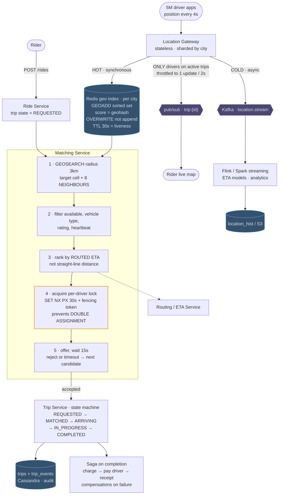

# 07 — Uber / Delivery Tracking (Proximity + Matching)

## API / Model

```api
# Driver · persistent WS or frequent POST
POST /v1/drivers/location || {driver_id, lat, lng, heading, ts} || 202
WS driver stream || || 101 || receives trip offers
# Rider
POST /v1/rides || {pickup, dropoff} || 201 ride_id
GET /v1/rides/{id} || || 200 status
WS rider stream || || 101 || receives driver position updates
```

```schema
# Redis · hot, in-memory, current state only
geo:{city_id} || || GEOADD sorted set, geohash score || driver positions
driver:{id}:status || || available | offered | on_trip || kept alive by a TTL heartbeat
lock:driver:{id} || || SET NX PX || assignment mutex
# Cassandra · persistent
trips || PK: trip_id || rider, driver, state, timestamps, fare ||
trip_events || PK: trip_id SK: ts || state transitions || audit trail
location_hist || PK: (driver_id, day) SK: ts || positions || cold path, analytics only
```

---

## High-level architecture



<details>
<summary>Plain-text version of this diagram</summary>

```text
 ═══════════ LOCATION INGEST (1.25M writes/sec) ═══════════

  [Driver apps] ──WS/HTTP──► ┌──────────────────────┐
     5M devices              │  LOCATION GATEWAY     │ stateless, autoscaled
     every 4s                │  validate, rate limit │ sharded by city
                              └──────────┬───────────┘
                                          │
                  ┌───────────────────────┴────────────────────┐
                  │ HOT PATH (synchronous)   COLD PATH (async)  │
                  ▼                                     ▼
      ┌────────────────────────────┐        ┌────────────────────────┐
      │  REDIS GEO INDEX            │        │ Kafka: location.stream │
      │  per-city sorted set         │        └───────────┬────────────┘
      │  GEOADD geo:sf driver_123    │                    ▼
      │  score = geohash(lat,lng)    │        ┌────────────────────────┐
      │                              │        │ Flink / Spark Streaming │
      │  ⚠ overwrite, not append —   │        │  → trip replay, ETA     │
      │    old positions worthless   │        │    models, analytics    │
      │  TTL 30s → dead drivers      │        └───────────┬────────────┘
      │    self-evict                │                    ▼
      └──────────┬─────────────────┘        ┌────────────────────────┐
                 │                            │ location_hist / S3     │
                 │                            └────────────────────────┘
                 │
 ═══════════════ MATCHING ═══════════════
                 │
  [Rider] ──POST /rides──► ┌──────────────────────┐
                            │   RIDE SERVICE        │
                            │   create trip (state= │
                            │   REQUESTED)          │
                            └──────────┬───────────┘
                                        ▼
                     ┌──────────────────────────────────────┐
                     │        MATCHING SERVICE               │
                     │                                       │
                     │ 1. GEOSEARCH geo:sf BYRADIUS 3km      │
                     │      → candidate drivers (geohash     │
                     │        prefix + 8 NEIGHBOR cells)     │
                     │                                       │
                     │ 2. filter: status==available,         │
                     │      vehicle type, rating, heartbeat  │
                     │                                       │
                     │ 3. rank: real ETA (not straight-line) │
                     │      ──► [Routing / ETA Service]      │
                     │                                       │
                     │ 4. ┌──────────────────────────────┐   │
                     │    │ ACQUIRE LOCK per driver       │   │
                     │    │ SET lock:driver:123 NX PX 30s │   │
                     │    │ ← prevents DOUBLE ASSIGNMENT  │   │
                     │    └──────────────────────────────┘   │
                     │ 5. offer → wait for accept (15s)      │
                     │    reject/timeout → release lock,     │
                     │    try next candidate                 │
                     └──────────────┬───────────────────────┘
                                     │ accepted
                                     ▼
                     ┌──────────────────────────────────────┐
                     │  TRIP SERVICE  (state machine)        │
                     │  REQUESTED→MATCHED→ARRIVING→          │
                     │  IN_PROGRESS→COMPLETED                │
                     │  each transition → trip_events (audit)│
                     └───────┬──────────────────────┬───────┘
                             │                       │
                             ▼                       ▼
                ┌─────────────────────┐   ┌────────────────────────┐
                │ Kafka: trip.events  │   │  SAGA on completion:    │
                │  → notifications     │   │   charge → pay driver → │
                │  → analytics         │   │   receipt               │
                │  → pricing           │   │  compensations on fail  │
                └─────────────────────┘   └────────────────────────┘

 ═══════════ LIVE TRACKING (rider watches driver) ═══════════

  [Rider WS] ◄── WS GATEWAY ◄── pub/sub channel: trip:{trip_id}
                                        ▲
                                        │ throttled to ~1 update/2s
                            Location Gateway publishes ONLY for
                            drivers currently on an active trip
                            (not all 5M drivers — critical filter)
```

</details>

Two workloads meet in this design: a constant stream of driver positions through the Location Gateway, and rider requests that go through matching and become trips. The Redis geo index is where they connect.

1. A rider's `POST /rides` creates a trip in the Ride Service with state `REQUESTED` and hands it to the Matching Service, which runs GEOSEARCH on the Redis geo index within 3 km, covering the target cell and its 8 neighbours.
2. It filters candidates by availability, vehicle type, rating and heartbeat.
3. It ranks the rest by routed ETA from the Routing / ETA Service rather than by straight-line distance.
4. It acquires a per-driver lock with `SET NX PX` and a 30-second expiry, plus a fencing token, so the driver can't be assigned twice.
5. It offers the trip and waits 15 seconds. A reject or timeout moves it to the next candidate.
6. Once a driver accepts, the Trip Service runs the state machine from `MATCHED` through `ARRIVING` and `IN_PROGRESS` to `COMPLETED`, records each change in `trips` and `trip_events`, and starts the saga on completion: charge, pay the driver, send the receipt.

The geo index is fed by the location paths. Every 4 seconds a driver's position reaches the Location Gateway, which overwrites that driver's entry synchronously, with a 30-second TTL that doubles as liveness, and sends the ping asynchronously to Kafka `location.stream`. Flink / Spark streaming turns that stream into ETA models and analytics and writes history to `location_hist` in S3. For drivers on an active trip only, the gateway also publishes to `trip:{id}`, throttled to one update every 2 seconds, which the rider's live map subscribes to.

---
