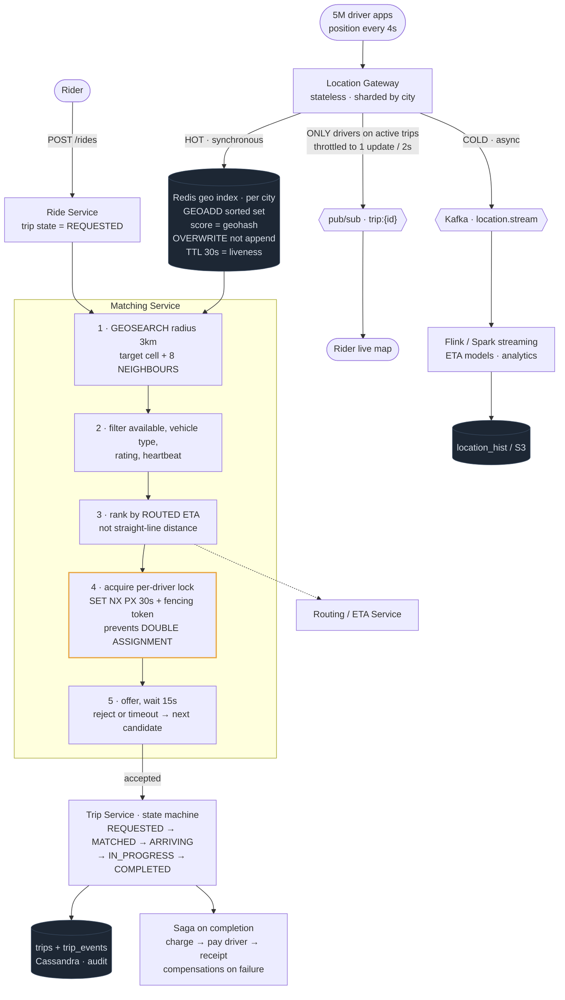

# 07 — Uber / Delivery Tracking (Proximity + Matching)

## Primary concepts and the hard part

**Concepts:** geospatial indexing (geohash/S2/quadtree), high-frequency location writes, in-memory state, matching under contention, WebSockets for live tracking, stream processing, distributed locking, sagas.

**The hard part they're probing:** two distinct problems glued together. (1) Millions of drivers writing location every 4 seconds destroys any disk-backed index. (2) Matching is a contention problem — two riders must not be assigned the same driver. Candidates who only solve the geospatial half miss the harder half.

---

## Requirements

**Functional**
- Drivers publish location continuously
- Rider requests a ride from A to B
- System finds nearby available drivers and offers the trip
- Driver accepts; rider sees live driver position until pickup and dropoff
- Trip lifecycle: requested → matched → en route → in progress → completed → paid

**Non-functional**
- Match within a few seconds
- Location freshness ~5 seconds (stale-but-recent is fine)
- Never double-assign a driver (strong consistency at the assignment point only)
- High availability; a region outage must not take down other regions

**Out of scope:** pricing/surge algorithms, routing/ETA computation internals (treat as a service), fraud.

**Scale**
```
Drivers online:     5M
Location updates:   every 4s → 5M/4 = 1.25M writes/sec   ← the headline number
Ride requests:      10,000/sec
Location payload:   ~100B → 125 MB/sec sustained
```
**Conclusion:** 1.25M writes/sec of ephemeral data that is worthless after 10 seconds. That single fact dictates an in-memory store for current position, with history written asynchronously to a separate cold path. Anyone proposing a disk-backed geospatial index here has missed the point.

---

## API / Model

```api
# Driver · persistent WS or frequent POST
POST /v1/drivers/location || {driver_id, lat, lng, heading, ts} || 202
WS driver stream || || 101 || receives trip offers
# Rider
POST /v1/rides || {pickup, dropoff} || 201 ride_id
GET /v1/rides/{id} || || 200 status
WS rider stream || || 101 || receives driver position updates
```

```schema
# Redis · hot, in-memory, current state only
geo:{city_id} || || GEOADD sorted set, geohash score || driver positions
driver:{id}:status || || available | offered | on_trip || kept alive by a TTL heartbeat
lock:driver:{id} || || SET NX PX || assignment mutex
# Cassandra · persistent
trips || PK: trip_id || rider, driver, state, timestamps, fare ||
trip_events || PK: trip_id SK: ts || state transitions || audit trail
location_hist || PK: (driver_id, day) SK: ts || positions || cold path, analytics only
```

---

## High-level architecture



<details>
<summary>Plain-text version of this diagram</summary>

```text
 ═══════════ LOCATION INGEST (1.25M writes/sec) ═══════════

  [Driver apps] ──WS/HTTP──► ┌──────────────────────┐
     5M devices              │  LOCATION GATEWAY     │ stateless, autoscaled
     every 4s                │  validate, rate limit │ sharded by city
                              └──────────┬───────────┘
                                          │
                  ┌───────────────────────┴────────────────────┐
                  │ HOT PATH (synchronous)   COLD PATH (async)  │
                  ▼                                     ▼
      ┌────────────────────────────┐        ┌────────────────────────┐
      │  REDIS GEO INDEX            │        │ Kafka: location.stream │
      │  per-city sorted set         │        └───────────┬────────────┘
      │  GEOADD geo:sf driver_123    │                    ▼
      │  score = geohash(lat,lng)    │        ┌────────────────────────┐
      │                              │        │ Flink / Spark Streaming │
      │  ⚠ overwrite, not append —   │        │  → trip replay, ETA     │
      │    old positions worthless   │        │    models, analytics    │
      │  TTL 30s → dead drivers      │        └───────────┬────────────┘
      │    self-evict                │                    ▼
      └──────────┬─────────────────┘        ┌────────────────────────┐
                 │                            │ location_hist / S3     │
                 │                            └────────────────────────┘
                 │
 ═══════════════ MATCHING ═══════════════
                 │
  [Rider] ──POST /rides──► ┌──────────────────────┐
                            │   RIDE SERVICE        │
                            │   create trip (state= │
                            │   REQUESTED)          │
                            └──────────┬───────────┘
                                        ▼
                     ┌──────────────────────────────────────┐
                     │        MATCHING SERVICE               │
                     │                                       │
                     │ 1. GEOSEARCH geo:sf BYRADIUS 3km      │
                     │      → candidate drivers (geohash     │
                     │        prefix + 8 NEIGHBOR cells)     │
                     │                                       │
                     │ 2. filter: status==available,         │
                     │      vehicle type, rating, heartbeat  │
                     │                                       │
                     │ 3. rank: real ETA (not straight-line) │
                     │      ──► [Routing / ETA Service]      │
                     │                                       │
                     │ 4. ┌──────────────────────────────┐   │
                     │    │ ACQUIRE LOCK per driver       │   │
                     │    │ SET lock:driver:123 NX PX 30s │   │
                     │    │ ← prevents DOUBLE ASSIGNMENT  │   │
                     │    └──────────────────────────────┘   │
                     │ 5. offer → wait for accept (15s)      │
                     │    reject/timeout → release lock,     │
                     │    try next candidate                 │
                     └──────────────┬───────────────────────┘
                                     │ accepted
                                     ▼
                     ┌──────────────────────────────────────┐
                     │  TRIP SERVICE  (state machine)        │
                     │  REQUESTED→MATCHED→ARRIVING→          │
                     │  IN_PROGRESS→COMPLETED                │
                     │  each transition → trip_events (audit)│
                     └───────┬──────────────────────┬───────┘
                             │                       │
                             ▼                       ▼
                ┌─────────────────────┐   ┌────────────────────────┐
                │ Kafka: trip.events  │   │  SAGA on completion:    │
                │  → notifications     │   │   charge → pay driver → │
                │  → analytics         │   │   receipt               │
                │  → pricing           │   │  compensations on fail  │
                └─────────────────────┘   └────────────────────────┘

 ═══════════ LIVE TRACKING (rider watches driver) ═══════════

  [Rider WS] ◄── WS GATEWAY ◄── pub/sub channel: trip:{trip_id}
                                        ▲
                                        │ throttled to ~1 update/2s
                            Location Gateway publishes ONLY for
                            drivers currently on an active trip
                            (not all 5M drivers — critical filter)
```

</details>

---

## Trade-offs and deep dives

**Why geohash, and the boundary trap.** Geohash encodes lat/lng into a string where nearby points share a prefix, turning a 2D proximity query into a 1D prefix scan any index can serve. The trap: two points can be 10 metres apart but sit either side of a cell boundary and share no prefix. **Always query the target cell plus its 8 neighbours**, then filter by true distance. Forgetting this produces a system that mysteriously can't find the driver parked across the street.

**Geohash vs quadtree vs S2.**
- *Geohash*: dead simple, works with any string-prefix index, fixed grid so dense cities and empty ocean get the same treatment.
- *Quadtree*: subdivides only where density is high, adapting to uneven distribution. Better for wildly varying density, more complex to maintain under constant updates.
- *S2*: projects the sphere onto a cube with a Hilbert curve; better locality, handles poles and the antimeridian correctly. What Uber and Google actually use.

For an interview, geohash with an explicit mention of S2 and the density caveat is a complete answer.

**Why Redis and not a database.** These writes are overwrites of ephemeral state with a useful lifetime of seconds. Durability is not required — if Redis loses a position, the driver publishes a new one four seconds later. Writing 1.25M/sec to a disk-backed store to hold data you'll throw away is the wrong trade. Persist to Kafka asynchronously for analytics, and keep the two paths separate.

**Cells are the natural shard key.** Partition Redis by city or region. All matching queries are local to a region, so no cross-shard scatter-gather. This also gives you regional fault isolation for free: San Francisco going down doesn't touch London. Say this explicitly — it's a strong availability argument.

**The matching contention problem.** This is the part most candidates miss. Two rider requests in the same neighbourhood will surface overlapping candidate lists. Without a mutex, both get offered the same driver. Use a short-TTL distributed lock (`SET lock:driver:{id} {token} NX PX 30000`) around the offer window, release it on accept-elsewhere, reject, or timeout. The TTL is the safety net so a crashed matcher doesn't strand a driver forever.

Be ready for the honest caveat: Redis locks are not a correctness guarantee under pause-and-resume scenarios (a matcher can be GC-paused past its TTL while believing it holds the lock). The fix is a **fencing token** — a monotonically increasing number issued with the lock that the trip service checks, rejecting any assignment carrying a stale token. Alternatively, make the final assignment a conditional write on the trip row (`UPDATE ... WHERE driver_id IS NULL`), so the database is the arbiter of record. That conditional write is the simplest correct answer and worth offering.

**Consistency, scoped narrowly.** Almost everything here is AP — driver positions, ETAs, nearby-driver lists can all be a few seconds stale with no harm. Exactly one operation needs strong consistency: the driver assignment. Isolating strong consistency to a single narrow operation, instead of applying it system-wide, is the mature design instinct.

**Straight-line distance is not ETA.** A driver 500m away across a river is 15 minutes away. Rank candidates by routed ETA from a routing service, not by geohash distance. Use geo distance only to generate the candidate set cheaply, then rank properly on a small set. That two-stage pattern (cheap retrieval, expensive ranking) is the same shape as search.

**Live tracking must be filtered.** Publishing all 5M drivers' positions to a pub/sub layer would be catastrophic. Only drivers on an active trip publish to a `trip:{id}` channel, and only the one rider subscribes. Throttle to ~1 update per 2 seconds; the map interpolates between points for smoothness. This turns an impossible fan-out into a fan-out of 1.

**Trip completion is a saga.** Charging the rider, paying the driver, and issuing a receipt span multiple services. Use a saga with compensating actions (refund on payout failure) rather than a distributed transaction, and make each step idempotent.

**Driver liveness.** A TTL on the Redis entry means a driver whose app crashed silently disappears from the index within 30 seconds. No cleanup job, no stale offers to phones that aren't listening. TTL-as-liveness is an elegant detail worth calling out.

---

## Possible follow-up questions

- *Surge pricing?* A stream job computes supply/demand ratio per cell over a sliding window, writes a multiplier per cell to Redis, and the pricing service reads it at quote time. Note that pricing must be locked at quote time, not recomputed at charge time.
- *What if no drivers are within 3km?* Expand the radius progressively (3 → 5 → 10km), then queue the request and retry as drivers become available, with an honest wait estimate to the rider.
- *Driver accepts but then cancels?* Return the trip to the matching pool, release the lock, penalize acceptance-rate metrics, and re-run matching excluding that driver.
- *Batched matching instead of greedy?* Greedy first-come matching is locally optimal but globally worse. Collecting requests over a few-second window and solving a bipartite assignment (Hungarian algorithm) produces better global outcomes at the cost of added latency. Uber does a version of this — a strong thing to raise unprompted.
- *How do you handle a whole region's Redis failing?* Drivers re-publish within 4 seconds, so the index self-heals almost immediately. That's a nice property of ephemeral state: recovery is automatic. In-flight trips are unaffected because they live in Cassandra.
- *Food delivery differences?* One courier serves multiple orders (batching), and there's a third party (the restaurant) with its own state machine and prep-time estimates. The geospatial and matching cores are identical.
