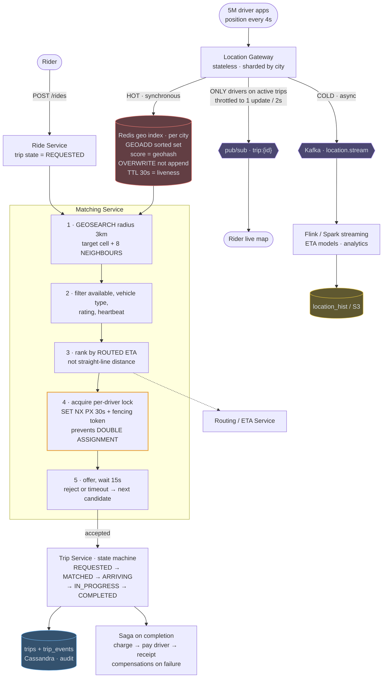
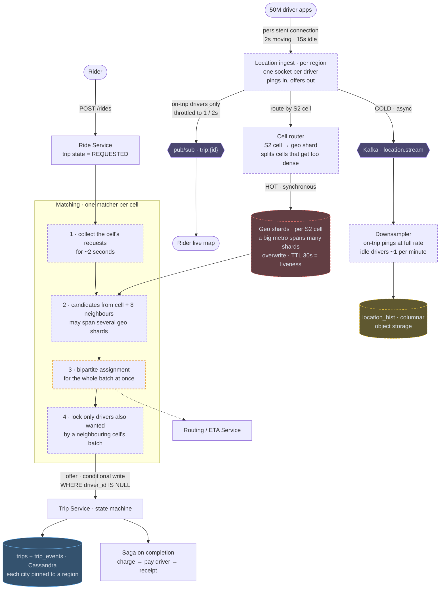

# 07 — Uber / Delivery Tracking (Proximity + Matching)

## API / Model

```api
# Driver · persistent WS or frequent POST
POST /v1/drivers/location || {driver_id, lat, lng, heading, ts} || 202
WS driver stream || || 101 || receives trip offers
# Rider
POST /v1/rides || {pickup, dropoff} || 201 ride_id
GET /v1/rides/{id} || || 200 status
WS rider stream || || 101 || receives driver position updates
```

```schema
# Redis · hot, in-memory, current state only
geo:{city_id} || || GEOADD sorted set, geohash score || driver positions
driver:{id}:status || || available | offered | on_trip || kept alive by a TTL heartbeat
lock:driver:{id} || || SET NX PX || assignment mutex
# Cassandra · persistent
trips || PK: trip_id || rider, driver, state, timestamps, fare ||
trip_events || PK: trip_id SK: ts || state transitions || audit trail
location_hist || PK: (driver_id, day) SK: ts || positions || cold path, analytics only
```

---

## High-level architecture

<!-- tab: Today · 1.25M pings/s -->



Two workloads meet in this design: a constant stream of driver positions through the Location Gateway, and rider requests that go through matching and become trips. The Redis geo index is where they connect.

1. A rider's `POST /rides` creates a trip in the Ride Service with state `REQUESTED` and hands it to the Matching Service, which runs GEOSEARCH on the Redis geo index within 3 km, covering the target cell and its 8 neighbours.
2. It filters candidates by availability, vehicle type, rating and heartbeat.
3. It ranks the rest by routed ETA from the Routing / ETA Service rather than by straight-line distance.
4. It acquires a per-driver lock with `SET NX PX` and a 30-second expiry, plus a fencing token, so the driver can't be assigned twice.
5. It offers the trip and waits 15 seconds. A reject or timeout moves it to the next candidate.
6. Once a driver accepts, the Trip Service runs the state machine from `MATCHED` through `ARRIVING` and `IN_PROGRESS` to `COMPLETED`, records each change in `trips` and `trip_events`, and starts the saga on completion: charge, pay the driver, send the receipt.

The geo index is fed by the location paths. Every 4 seconds a driver's position reaches the Location Gateway, which overwrites that driver's entry synchronously, with a 30-second TTL that doubles as liveness, and sends the ping asynchronously to Kafka `location.stream`. Flink / Spark streaming turns that stream into ETA models and analytics and writes history to `location_hist` in S3. For drivers on an active trip only, the gateway also publishes to `trip:{id}`, throttled to one update every 2 seconds, which the rider's live map subscribes to.

<!-- tab: At 10x · 12.5M pings/s -->



Same product at 10x. At 100x there would be 500M drivers online, more than the world's taxi and courier workforce, so 10x (rides, food and parcels on one platform) is the realistic tier. Dashed outlines mark what's new or reshaped compared with today's design.

| | Today | At 10x |
|---|---|---|
| Drivers online | 5M | 50M |
| Location pings at a flat 4s | 1.25M/sec | 12.5M/sec |
| Ride requests | 10k/sec | 100k/sec |
| Raw location payload | 125 MB/sec | 1.25 GB/sec |
| Drivers in the densest metro | tens of thousands | hundreds of thousands |

**What changes, and the number that forces it**

1. **Ping rate adapts to what the driver is doing.** At a flat 4-second interval, most of 12.5M writes/sec would come from parked drivers. Drivers on a trip or heading to a pickup ping every 2 seconds, idle and stationary drivers every 15, and the app sends immediately after a large position change. Most online drivers are idle at any moment, so this removes a large share of the writes without making any match worse.
2. **Persistent connections replace a POST per ping.** At this rate, per-request overhead (TLS, headers, load-balancer work) costs more than the 100-byte payload. Drivers hold one connection to regional ingest, which also pushes trip offers back down the same socket.
3. **City shards split into S2 cells.** The densest metros now have hundreds of thousands of drivers online, more writes than one Redis sorted set on one node can take. A cell router maps S2 cells to geo shards and splits a cell when it gets too dense, so a search over a cell and its neighbours may touch a few shards. Regional fault isolation still holds, because cells never span regions.
4. **Matching goes batched, one matcher per cell.** At 100k ride requests/sec, overlapping candidate lists become the norm and most lock attempts collide. Each cell's matcher collects requests for ~2 seconds and solves the batch as one bipartite assignment, the approach from the batched-matching follow-up. That gives better global matches and removes contention inside the cell, since one matcher owns it. Locks are only needed for drivers a neighbouring cell's batch also wants. The cost is up to ~2 seconds added to time-to-match.
5. **The conditional write is still the arbiter.** `WHERE driver_id IS NULL` on the trip row stays the final word, so a race at a cell border costs a retry and never a double assignment.
6. **Location history is downsampled.** 1.25 GB/sec of raw pings mostly records cars that aren't moving. On-trip pings are kept at full rate for fares, disputes and ETA training; idle pings are thinned to about one per minute before landing in columnar files in object storage.

**What stays the same**

Current position lives in memory and is overwritten, never appended, with TTL as liveness. Candidates are still ranked by routed ETA rather than straight-line distance, only on-trip drivers publish live position to `trip:{id}`, and trip completion is still a saga with compensations.

<!-- /tabs -->

---
