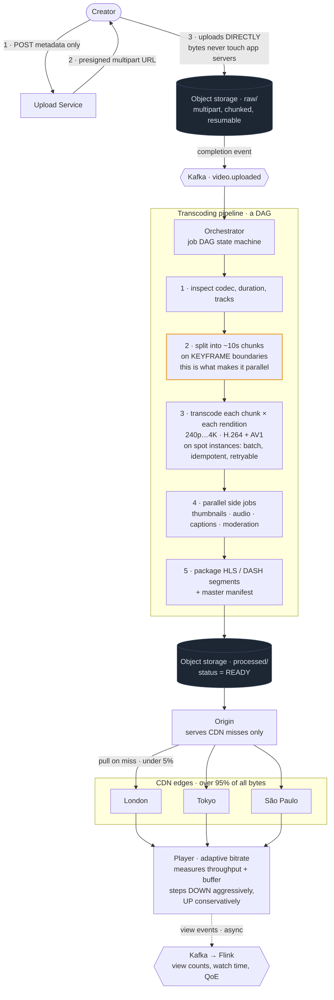

# 08 — Video Streaming (YouTube / Netflix)

## Primary concepts and the hard part

**Concepts:** object storage, presigned/resumable uploads, batch transcoding pipeline, CDN strategy, adaptive bitrate streaming, chunking, DAG-based job orchestration, metadata vs bytes separation.

**The hard part they're probing:** understanding that video bytes never touch your application servers — not on upload, not on playback. Everything is object storage and CDN. The system you actually build is a metadata service plus a transcoding pipeline.

---

## Requirements

**Functional**
- Upload a video (large files, resumable over flaky connections)
- Transcode to multiple resolutions and bitrates
- Stream with adaptive quality based on network conditions
- Browse, search, view counts, recommendations (treat as separate services)
- Thumbnails, captions/subtitles

**Non-functional**
- Playback start time < 2s, minimal rebuffering
- Upload must survive network interruption
- Extremely read-heavy and bandwidth-dominated
- Global audience → latency is physics, must serve from nearby

**Out of scope:** DRM specifics, recommendation ML, live streaming (mention how it differs).

**Scale**
```
Uploads:     500 hours of video/minute
Views:       5B/day → ~60,000 concurrent streams/sec initiated
Bandwidth:   this is the real number —
             5M concurrent viewers × 5 Mbps = 25 Tbps
Storage:     1 hour of source ≈ 5 GB; × ~6 renditions ≈ 15 GB stored
             500 hr/min × 15 GB = huge → petabyte scale, tiered
```
**Conclusion:** 25 Tbps cannot come from your origin. **>95% of delivery must be CDN.** Your origin's job is to be the cache-miss backstop, nothing more. This single number justifies the entire architecture.

---

## API / Model

```
POST /v1/videos                      {title, desc}      → {video_id, upload_url}
PUT  <presigned S3 url>              (direct, multipart, resumable)
POST /v1/videos/{id}/complete        {parts[]}          → triggers pipeline
GET  /v1/videos/{id}                                    → metadata + manifest URL
GET  <cdn>/videos/{id}/master.m3u8                      → ABR manifest
GET  <cdn>/videos/{id}/720p/seg_0042.ts                 → a media segment
POST /v1/videos/{id}/view                               → async view event
```

```
videos       PK: video_id
             owner, title, description, duration, status
             (UPLOADING|PROCESSING|READY|FAILED), created_at

renditions   PK: video_id  SK: (resolution, codec)
             manifest_path, bitrate, size, ready

jobs         PK: job_id — video_id, stage, state, attempts
             (transcode DAG state)

views_raw    → Kafka → stream aggregation → views_agg
```

Note what is *not* in the database: the video bytes. Metadata in the database, bytes in object storage, delivery via CDN. That split is the whole design.

---

## High-level architecture



<details>
<summary>Plain-text version of this diagram</summary>

```text
 ═══════════════════ UPLOAD PATH ═══════════════════

  [Creator]
     │ 1. POST /v1/videos  (metadata only)
     ▼
  ┌─────────────────┐    2. returns PRESIGNED multipart URL
  │ Upload Service  │───────────────────────┐
  └─────────────────┘                        │
     │                                        │
     │ 3. client uploads DIRECTLY ────────────┘
     │    (bytes NEVER touch app servers)
     ▼
  ┌──────────────────────────────────┐
  │   OBJECT STORAGE  (S3) — raw/     │
  │   · multipart: chunked, resumable │
  │   · retry only the failed part    │
  └──────────────┬───────────────────┘
                  │ 4. completion event
                  ▼
  ┌──────────────────────────────────┐
  │  Kafka: video.uploaded            │
  └──────────────┬───────────────────┘
                  ▼
 ═══════════ TRANSCODING PIPELINE (a DAG) ═══════════

  ┌───────────────────────────────────────────────────────────┐
  │              ORCHESTRATOR (job DAG state machine)          │
  └───┬───────────────────────────────────────────────────────┘
      │
      ▼
  ┌──────────────┐
  │ 1. INSPECT   │  probe codec, duration, resolution, audio tracks
  └──────┬───────┘
         ▼
  ┌──────────────┐
  │ 2. SPLIT     │  cut source into ~10s CHUNKS
  └──────┬───────┘  ← this is what makes transcoding parallel
         │
    ┌────┴─────┬──────────┬──────────┬──────────┐
    ▼          ▼          ▼          ▼          ▼
 ┌───────┐ ┌───────┐ ┌───────┐ ┌───────┐ ┌───────┐
 │chunk0 │ │chunk1 │ │chunk2 │ │chunk3 │ │chunkN │   FAN-OUT to
 └───┬───┘ └───┬───┘ └───┬───┘ └───┬───┘ └───┬───┘   worker fleet
     │         │         │         │         │        (spot/preemptible
     ▼         ▼         ▼         ▼         ▼         instances — jobs
 ┌─────────────────────────────────────────────┐       are retryable,
 │ 3. TRANSCODE each chunk × each rendition    │       so cheap compute
 │    240p 360p 480p 720p 1080p 4K             │       is fine)
 │    codecs: H.264 (compat) + AV1/VP9 (size)  │
 └───────────────────┬─────────────────────────┘
                      ▼
 ┌─────────────────────────────────────────────┐
 │ 4. PARALLEL SIDE-JOBS                       │
 │    · thumbnails (sprite sheet for scrubbing)│
 │    · audio extraction + normalization       │
 │    · captions (ASR) / subtitle burn-in      │
 │    · content moderation / copyright match   │
 └───────────────────┬─────────────────────────┘
                      ▼
 ┌─────────────────────────────────────────────┐
 │ 5. PACKAGE  → HLS / DASH segments +          │
 │    master manifest listing every rendition   │
 └───────────────────┬─────────────────────────┘
                      ▼
 ┌─────────────────────────────────────────────┐
 │ 6. WRITE to OBJECT STORAGE (processed/)      │
 │    + update videos.status = READY            │
 │    + notify creator                          │
 └───────────────────┬─────────────────────────┘
                      │
 ═══════════════════ PLAYBACK PATH ═══════════════════
                      ▼
              ┌────────────────┐
              │ Origin (S3)     │  ← only serves CDN MISSES (<5%)
              └───────┬────────┘
                      │ pull on miss
       ┌──────────────┴───────────────┬──────────────────┐
       ▼                               ▼                  ▼
 ┌────────────┐               ┌────────────┐      ┌────────────┐
 │ CDN EDGE   │               │ CDN EDGE   │      │ CDN EDGE   │
 │ London     │               │ Tokyo      │      │ São Paulo  │
 └─────┬──────┘               └─────┬──────┘      └─────┬──────┘
       │  >95% of all bytes served here                  │
       ▼                             ▼                    ▼
  ┌──────────────────────────────────────────────────────────┐
  │                    PLAYER (ABR logic)                     │
  │                                                           │
  │  1. GET master.m3u8  → list of renditions                 │
  │  2. start at a conservative bitrate                       │
  │  3. measure download speed + buffer level each segment    │
  │  4. step UP if buffer healthy, DOWN aggressively if not   │
  │                                                           │
  │  [240p][360p][480p][720p][1080p]  ← switches mid-stream   │
  │            ▲▲▲                      at segment boundaries │
  │        network dip                                        │
  └──────────────────────────────────────────────────────────┘
                      │
                      ▼ view events (async, fire-and-forget)
              ┌────────────────┐
              │ Kafka → Flink  │ → view counts, watch time, QoE metrics
              └────────────────┘
```

</details>

---

## Trade-offs and deep dives

**Presigned URLs, and why they matter.** If uploads route through your application servers, those servers become a bandwidth bottleneck and you pay for the traffic twice. A presigned URL is a time-limited, permission-scoped credential that lets the client write directly to object storage. Your service authorizes, then gets out of the way. Same idea in reverse for playback: never proxy bytes.

**Multipart upload.** A 5 GB upload over a mobile connection will fail. Multipart splits it into parts uploaded independently; a failed part is retried alone rather than restarting from zero. The client also gets parallelism. This is table stakes for any large-file system, not a video-specific trick.

**Why chunk before transcoding.** Transcoding a 2-hour film serially takes hours. Splitting into ~10-second chunks lets 1,000 workers transcode in parallel, cutting wall-clock time to minutes. It also makes failure cheap: a crashed worker loses 10 seconds of work, not the whole job. This is MapReduce applied to video, and the parallelism argument is the main insight the interviewer wants.

Chunks must split on **keyframe boundaries**, or the pieces won't decode independently and won't reassemble cleanly. Good detail to drop.

**Spot instances are the right compute.** Transcoding is batch, idempotent, retryable, and not latency-sensitive. That profile is exactly what preemptible/spot capacity is for, at a large discount. Saying this shows cost awareness, which senior interviews do reward.

**Adaptive bitrate (ABR), explained properly.** The video is encoded at several quality levels, each cut into aligned segments. A manifest lists them. The player measures throughput and buffer depth and picks the next segment's quality. Because segments are aligned and independently decodable, it can switch mid-playback without interrupting.

The asymmetry worth mentioning: players step **down aggressively and up conservatively**, because a rebuffer is far more damaging to perceived quality than a few seconds of lower resolution. That's a product-informed engineering decision.

**HLS vs DASH.** HLS is Apple's, universally supported, historically `.ts` segments. DASH is the open standard, codec-agnostic. Real services ship both, or use CMAF so one set of segments serves both. Know the names; don't spend time here.

**CDN strategy.** Push popular content proactively to edges before demand (a new season release is predictable); pull for the long tail. Netflix goes further with Open Connect — appliances placed inside ISP networks, so bytes never cross the public internet backbone. Mention it as the logical endpoint of "put the data near the user."

**Storage tiering.** View distribution is extreme power-law: a tiny fraction of videos get almost all views. Keep hot content in standard storage and on CDN, move cold content to infrequent-access or archive tiers automatically via lifecycle policies. Also consider storing fewer renditions for cold content — you can re-transcode on demand if a five-year-old video suddenly trends.

**View counts are not a database increment.** 5B/day of `UPDATE videos SET views = views + 1` would melt any database, and every view is a hot row on a popular video. Instead: fire an event to Kafka, aggregate in a stream processor over tumbling windows, and write periodic aggregates. The displayed count is approximate and delayed by seconds. That's fine, and saying it's fine (rather than trying to make it exact) is the correct answer.

**Live streaming differs.** Same chunking and ABR, but transcoding must happen in real time with a latency budget of seconds, there's no batch parallelism (chunks arrive as they're recorded), and you need low-latency protocols (LL-HLS, WebRTC) plus origin-shield layers to protect against thundering herds when a stream starts.

---

## Possible follow-up questions

- *How do you resume an interrupted upload?* Client asks which parts the server already has, uploads only the missing ones, then calls complete. Object storage tracks parts natively.
- *How do you detect copyrighted content?* Compute perceptual fingerprints of audio and video during the pipeline and match against a reference index. It's a separate, expensive stage that can run asynchronously after publishing, flagging retroactively.
- *A video goes viral in one region.* The CDN absorbs it — that's the point. If the origin sees a spike of cache misses, add an origin shield (a mid-tier cache between edges and origin) so 100 edges produce one origin fetch instead of 100.
- *How do you handle 4K/HDR?* More renditions, larger segments, and a codec decision (AV1 gives much better compression than H.264 but costs far more CPU to encode — a classic compute-vs-bandwidth trade you can spell out).
- *What's the failure mode if transcoding fails halfway?* The DAG tracks per-chunk state; retry failed chunks only. If a rendition can't be produced, publish with the renditions that succeeded and backfill — availability of *some* quality beats blocking the whole video.
- *How do you do per-user resume ("continue watching")?* Small, high-frequency writes of playback position keyed by (user, video). Batch them client-side (every 10s, plus on pause/exit) rather than every second.
