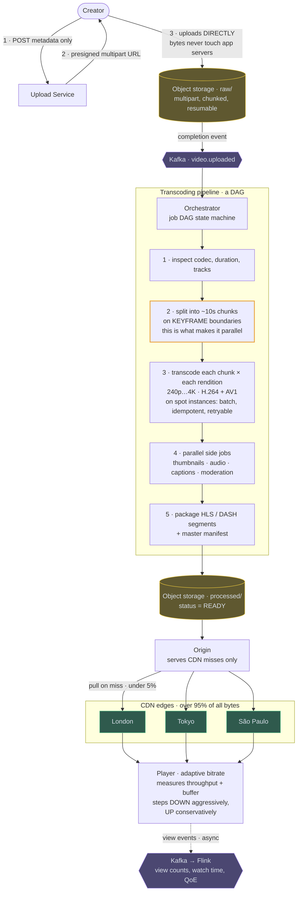
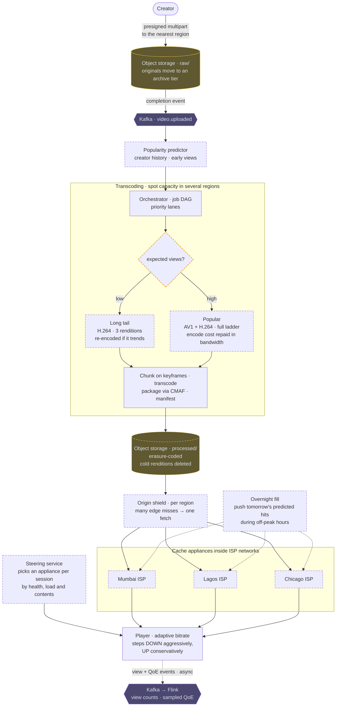

# 08 — Video Streaming (YouTube / Netflix)

## API / Model

```api
POST /v1/videos || {title, desc} || 201 {video_id, upload_url}
PUT <presigned S3 url> || || 200 || direct, multipart, resumable
POST /v1/videos/{id}/complete || {parts[]} || 202 || triggers the processing pipeline
GET /v1/videos/{id} || || 200 metadata + manifest URL
GET <cdn>/videos/{id}/master.m3u8 || || 200 ABR manifest
GET <cdn>/videos/{id}/720p/seg_0042.ts || || 200 media segment
POST /v1/videos/{id}/view || || 202 || async view event
```

```schema
videos || PK: video_id || owner, title, description, duration, status, created_at || status: UPLOADING | PROCESSING | READY | FAILED
renditions || PK: video_id SK: (resolution, codec) || manifest_path, bitrate, size, ready ||
jobs || PK: job_id || video_id, stage, state, attempts || transcode DAG state
views_raw || || Kafka → stream aggregation → views_agg ||
```

Note what is *not* in the database: the video bytes. Metadata in the database, bytes in object storage, delivery via CDN. That split is the whole design.

---

## High-level architecture

<!-- tab: Today · 25 Tbps -->



Metadata and bytes take different routes. The Upload Service handles only metadata and upload URLs, while the video itself goes from the creator to object storage, through a transcoding DAG, and out to viewers from CDN edges.

1. The creator posts the video's metadata, and nothing else, to the Upload Service.
2. The Upload Service returns a presigned multipart URL.
3. The creator uploads the file directly to object storage under `raw/`, in parts that can each be retried and resumed.
4. The completed upload emits an event to Kafka `video.uploaded`, and the Orchestrator runs the transcoding pipeline as a job DAG state machine:
   1. Inspect the codec, duration and tracks.
   2. Split the source into chunks of about 10 seconds on keyframe boundaries.
   3. Transcode each chunk into each rendition, from 240p to 4K in H.264 and AV1, on spot instances.
   4. Run the side jobs: thumbnails, audio, captions and moderation.
   5. Package HLS / DASH segments and a master manifest.
5. The packaged output is written to object storage under `processed/`, and the video's status becomes `READY`.

Playback runs the other way, and it doesn't touch the app servers either. The player requests segments from a CDN edge such as London, Tokyo or São Paulo, and the edges serve over 95% of all bytes. On a miss, an edge pulls the segment from the Origin, which exists only to serve those misses from `processed/`. The player measures throughput and buffer depth to choose the bitrate of each next segment, and sends view events asynchronously to Kafka and Flink for view counts, watch time and QoE.

<!-- tab: At 10x · 250 Tbps -->



Same product at 10x. At 100x the service would push 2.5 Pbps of video, which stops being a system design and becomes a telecom build-out, so this tab uses 10x. Dashed outlines mark what's new or reshaped compared with today's design.

| | Today | At 10x |
|---|---|---|
| Upload rate | 500 hours/min | 5,000 hours/min |
| Concurrent viewers | 5M | 50M |
| Egress | 25 Tbps | 250 Tbps |
| New stored video, ~15 GB per hour | ~11 PB/day | ~110 PB/day |

**What changes, and the number that forces it**

1. **The edge moves inside ISPs.** At 250 Tbps, paying a commercial CDN per gigabyte becomes the dominant cost of the business. Cache appliances are placed inside ISP networks, which host them happily because the traffic no longer crosses their own transit links. Bytes travel from a box in the viewer's ISP, never across the backbone. It's the Open Connect endpoint that today's CDN trade-off already points at.
2. **Appliances are filled overnight, by prediction.** Appliance disks are limited, and pulling every miss during prime time hammers the shield. A fill job pushes tomorrow's predicted popular titles into each appliance during off-peak hours, while the long tail still pulls on miss.
3. **A steering service chooses the edge.** DNS-based routing can't tell that an appliance is full, unhealthy or missing a title. The player asks a steering service, which picks an appliance for each session by health, load and what that appliance actually holds.
4. **An origin shield tier becomes mandatory.** With thousands of appliances, a new release's first wave of misses would multiply into origin fetches. A regional shield collapses them, so many edges produce one origin fetch per segment, as the viral-video follow-up describes.
5. **The encoding ladder depends on expected views.** AV1 saves a lot of bandwidth but costs far more CPU to encode. At 5,000 hours uploaded per minute, encoding everything in AV1 at a full ladder is a compute bill that never pays back for videos nobody watches. A popularity predictor decides: likely hits get AV1 plus H.264 at the full ladder, and the long tail gets H.264 at a few renditions, re-encoded if it starts to trend.
6. **Storage is erasure-coded and pruned.** ~110 PB/day of new renditions can't be kept at 3x replication. Processed renditions are erasure-coded, originals move to an archive tier, and the renditions of videos that went cold are deleted and regenerated from the original on demand.

**What stays the same**

Video bytes never touch the application servers. Uploads are still presigned, multipart and resumable, transcoding is still chunked on keyframes and run on spot capacity, players still step down fast and up slowly, and view counts still come from a stream aggregation rather than database increments.

<!-- /tabs -->

---
