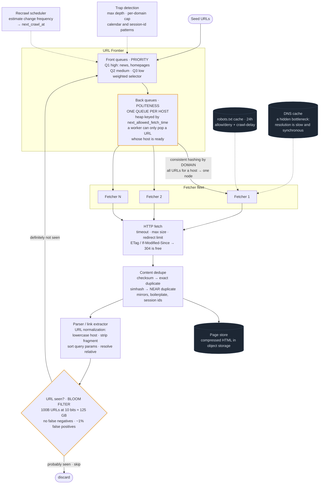

# 09 — Web Crawler

## Primary concepts and the hard part

**Concepts:** frontier queue design, Bloom filters, politeness and per-domain rate limiting, consistent hashing, DNS caching, content deduplication, trap detection, prioritized scheduling, backpressure.

**The hard part they're probing:** politeness. Crawling fast is easy; crawling fast *without hammering any single domain* is the real constraint, and it forces a queue design where URLs are grouped by host rather than processed FIFO. The second probe is dedupe at a scale where you cannot store the set of seen URLs in memory naively.

---

## Requirements

**Functional**
- Start from seed URLs, discover and fetch pages, extract links, repeat
- Respect `robots.txt` and crawl-delay
- Avoid re-crawling identical content
- Recrawl pages on a schedule proportional to how often they change
- Store fetched content for downstream indexing

**Non-functional**
- Politeness: never more than ~1 concurrent request per host, with delay
- Throughput: billions of pages, thousands of fetches/sec
- Robust: must survive malformed HTML, infinite redirects, crawler traps
- Extensible: new content types and extractors

**Out of scope:** the search index itself (that's design 06), JavaScript rendering (mention the cost), ranking.

**Scale**
```
Pages to crawl:     10B
Target rate:        10,000 pages/sec  → 10B / 10k = ~11 days for a full pass
Avg page:           ~100 KB HTML → 1 GB/sec ingest → ~85 TB/day raw
URLs seen (dedupe): 100B+ URLs → storing them as strings ≈ 10+ TB
                    → Bloom filter at 10 bits/URL ≈ 125 GB, fits in RAM across a cluster
```
**Conclusion:** the URL-seen set is too large to store literally in memory. That fact alone justifies a Bloom filter, and this is the canonical place to introduce one.

---

## API / Model

Internal system, so the "API" is the queue contracts:

```api
# Queue contracts
frontier.push(url, priority, discovered_at)
frontier.pop(worker_id) || || url || politeness-aware
content.put(url, html, fetched_at, checksum)
```

```schema
url_seen || || Bloom filter, in RAM and sharded || a backing store confirms positives
robots_cache || || domain → parsed rules || TTL ~24h
dns_cache || || hostname → IPs || TTL honors the DNS record
page_store || PK: url_hash || html, headers, fetched_at, http_status, content_checksum || html is compressed, in object storage
content_hash || || simhash / checksum → canonical_url || near-duplicate detection
domain_state || || domain → last_fetch_ts, crawl_delay, error_rate, politeness_budget ||
schedule || PK: url_hash || next_crawl_at, change_frequency_estimate ||
```

---

## High-level architecture



<details>
<summary>Plain-text version of this diagram</summary>

```text
                      ┌──────────────────┐
                      │   SEED URLS      │
                      └────────┬─────────┘
                               ▼
  ┌───────────────────────────────────────────────────────────────┐
  │                        URL FRONTIER                            │
  │                                                                │
  │   ┌──────────────────────────────────────────────────────┐    │
  │   │  FRONT QUEUES — PRIORITY                              │    │
  │   │   Q1 (high: news, homepages, frequently changing)     │    │
  │   │   Q2 (medium)                                         │    │
  │   │   Q3 (low: deep pages, rarely changing)               │    │
  │   │   selector picks by weighted probability              │    │
  │   └───────────────────────┬──────────────────────────────┘    │
  │                            ▼                                   │
  │   ┌──────────────────────────────────────────────────────┐    │
  │   │  BACK QUEUES — POLITENESS  (one queue PER HOST)        │    │
  │   │                                                        │    │
  │   │   host:example.com   → [u1, u2, u3 ...]               │    │
  │   │   host:wikipedia.org → [u4, u5 ...]                   │    │
  │   │   host:blog.io       → [u6 ...]                       │    │
  │   │                                                        │    │
  │   │   ┌────────────────────────────────────────────┐      │    │
  │   │   │ HEAP keyed by next_allowed_fetch_time      │      │    │
  │   │   │  example.com   → t=10:00:03                │      │    │
  │   │   │  wikipedia.org → t=10:00:01  ◄── pop this  │      │    │
  │   │   │  blog.io       → t=10:00:07                │      │    │
  │   │   └────────────────────────────────────────────┘      │    │
  │   │   ⚠ THIS is the key design: a worker never pulls a    │    │
  │   │     URL whose host isn't ready. Politeness is         │    │
  │   │     structural, not a check bolted on afterwards.     │    │
  │   └───────────────────────┬──────────────────────────────┘    │
  └───────────────────────────┼───────────────────────────────────┘
                               │ consistent hashing by DOMAIN →
                               │ all URLs for a host go to ONE worker node
        ┌──────────────────────┼──────────────────────┐
        ▼                      ▼                      ▼
  ┌───────────┐          ┌───────────┐          ┌───────────┐
  │ FETCHER 1 │          │ FETCHER 2 │          │ FETCHER N │
  └─────┬─────┘          └─────┬─────┘          └─────┬─────┘
        │                       │                      │
        │  ┌────────────────────┴──────────────────┐  │
        │  ▼                                        ▼  │
        │ ┌──────────────┐              ┌──────────────┐
        │ │ robots.txt   │              │  DNS CACHE    │
        │ │ cache (24h)  │              │  ← DNS is a   │
        │ │ allow/deny + │              │    hidden     │
        │ │ crawl-delay  │              │    bottleneck;│
        │ └──────────────┘              │    resolve is │
        │                                │    slow & syn│
        │                                └──────────────┘
        ▼
  ┌──────────────────────────────────────────────┐
  │  HTTP FETCH                                   │
  │   timeout, max size cap, redirect limit (~5), │
  │   respect ETag/Last-Modified → 304 = free     │
  └────────────────────┬─────────────────────────┘
                        ▼
  ┌──────────────────────────────────────────────┐
  │  CONTENT DEDUPE                               │
  │   checksum → exact duplicate?                 │
  │   simhash  → NEAR-duplicate? (boilerplate,    │
  │              mirrors, session-id URLs)        │
  │   if dup → record canonical, DON'T re-extract │
  └────────────────────┬─────────────────────────┘
                        ▼
  ┌──────────────────────────────────────────────┐
  │  STORE: object storage (compressed HTML)      │
  │         + metadata row                        │
  └────────────────────┬─────────────────────────┘
                        ▼
  ┌──────────────────────────────────────────────┐
  │  PARSER / LINK EXTRACTOR                      │
  │   normalize URLs (lowercase host, strip       │
  │   fragments, sort query params, resolve       │
  │   relative paths) ← normalization prevents    │
  │   millions of "different" identical URLs      │
  └────────────────────┬─────────────────────────┘
                        ▼
  ┌──────────────────────────────────────────────┐
  │  URL SEEN? — BLOOM FILTER                     │
  │                                               │
  │   "definitely not seen"  → enqueue            │
  │   "probably seen"        → skip               │
  │                                               │
  │   100B URLs @ 10 bits ≈ 125 GB, sharded       │
  │   false positives (~1%) mean we skip a few    │
  │   real pages — acceptable; false NEGATIVES    │
  │   are impossible, which is the property we    │
  │   actually need                               │
  └────────────────────┬─────────────────────────┘
                        │ new URLs
                        └──────────► back to FRONTIER

  ┌──────────────────────────────────────────────┐
  │  TRAP DETECTION (runs alongside)              │
  │   · max URL depth / length                    │
  │   · per-domain page cap                       │
  │   · calendar/session-id pattern detection     │
  │   · repeated near-identical content on a host │
  └──────────────────────────────────────────────┘

  ┌──────────────────────────────────────────────┐
  │  RECRAWL SCHEDULER                            │
  │   estimate change frequency from history      │
  │   → next_crawl_at; re-enqueue when due        │
  └──────────────────────────────────────────────┘
```

</details>

---

## Trade-offs and deep dives

**The frontier is the whole design.** A naive FIFO queue will happily hand ten workers ten URLs from the same domain simultaneously, which is a denial-of-service attack against that site and gets you blocked. The two-level structure fixes this: front queues encode **priority**, back queues encode **politeness** (one per host), and a heap ordered by `next_allowed_fetch_time` means a worker can only ever pop a URL whose host is ready. Politeness becomes a structural property rather than a check you might forget.

**Consistent hashing by domain.** Route all URLs for a host to the same worker node. Now politeness state (last fetch time, crawl delay, robots rules) is local — no distributed coordination per fetch. Consistent hashing means adding or removing a node moves only ~1/N of domains rather than reshuffling everything.

**Bloom filter: why it's exactly right here.** You need "have I seen this URL?" over 100B URLs. Storing them costs 10+ TB. A Bloom filter at ~10 bits per element costs ~125 GB and answers in O(1) from RAM. Its guarantee is asymmetric: **no false negatives, ~1% false positives**. Translated to this problem: you will never re-crawl a page you've already crawled (which would be a correctness/politeness problem), but you will occasionally skip a page you haven't (which costs you ~1% coverage). That's the right direction for the error to point, and saying so demonstrates you understand *why* the structure fits rather than just naming it.

The limitation to mention: you can't delete from a Bloom filter, so a URL can never be "un-seen". Handle recrawls through the scheduler, not by removing from the filter.

**URL normalization prevents an explosion.** `Example.com/Page?b=2&a=1#section` and `example.com/page?a=1&b=2` are the same resource. Without normalization (lowercase host, drop fragment, sort query params, resolve relative paths, strip known tracking params), you'll enqueue millions of duplicates and your Bloom filter fills with noise.

**Content dedupe is separate from URL dedupe.** Different URLs frequently serve identical content (mirrors, print views, session IDs in the path). Exact checksums catch identical bytes; **simhash** catches *near*-duplicates where only boilerplate differs. Detecting near-duplicates is what keeps the downstream index from being 40% junk.

**Crawler traps.** Infinite calendars (`/calendar?date=2099-12-31` linking to the next day forever), session IDs generating unlimited unique URLs, and deliberately deep link structures. Defenses: cap URL depth and length, cap pages per domain, detect repeating path patterns, and monitor the ratio of new-URLs-discovered to useful-content-found per domain. A domain generating a million URLs and no new content is a trap.

**DNS is a hidden bottleneck.** Resolution is a synchronous network call that can take 50-200ms, and at 10,000 fetches/sec a naive crawler spends most of its time in DNS. Cache aggressively (respecting TTLs), run your own resolvers, and resolve asynchronously ahead of fetch time.

**Conditional requests are free pages.** Send `If-Modified-Since`/`If-None-Match` on recrawls. A `304 Not Modified` costs almost no bandwidth and confirms freshness. For a recrawl-heavy workload this is a large efficiency win.

**Recrawl scheduling.** Not all pages change at the same rate. Estimate change frequency from observed history (a news homepage changes hourly; a 2009 forum post never will) and set `next_crawl_at` accordingly. Budget crawl capacity between *discovery* (new pages) and *freshness* (recrawls) — they compete for the same fetchers, and how you split is a product decision.

**Politeness beyond rate.** Respect `robots.txt` and its `Crawl-delay`. Send a descriptive `User-Agent` with a contact URL. Back off automatically on 429/503 responses and rising error rates from a host. Being a well-behaved crawler is not just etiquette — sites block badly-behaved ones, which costs you coverage.

**JavaScript rendering.** Many modern pages are empty without executing JS. Rendering requires a headless browser, which is roughly 10-100x the CPU and memory of a plain fetch. The practical answer is a two-tier approach: plain fetch for everything, and route only pages detected as JS-dependent (empty body, known SPA frameworks) to a smaller rendering fleet. Flag the cost explicitly rather than hand-waving it.

**Backpressure.** If parsers fall behind fetchers, the frontier grows unboundedly. Monitor queue depth and throttle fetchers when it exceeds a threshold. The frontier is also persistent — it must survive restarts, so it's backed by durable storage, not just memory.

---

## Possible follow-up questions

- *How do you crawl 10B pages and finish?* You don't "finish" — it's continuous. Prioritize by estimated value (PageRank-like authority, change frequency, business need) so the most useful fraction is always fresh.
- *What if the Bloom filter's false positive rate degrades?* It rises as the filter fills. Size it for the projected URL count, and shard by URL hash so each shard's load is bounded. Rotate to a rebuilt, larger filter periodically from the authoritative URL store.
- *How do you handle a site that blocks you?* Detect via error-rate monitoring, back off exponentially, and maintain a per-domain reputation score. Never route around a block with proxies — that's both hostile and a fast way to get legally involved.
- *How do you distribute this across regions?* Crawl from the region nearest the content where possible (lower latency, better geo-served content), but keep the frontier and dedupe state globally consistent via domain-based partitioning.
- *Duplicate detection at 10B scale — isn't simhash comparison O(n²)?* Yes, naively. Use LSH (locality-sensitive hashing) to bucket similar hashes so you only compare within small candidate sets.
- *What breaks first at 10x?* DNS resolution and the parser fleet, usually before the fetchers. The frontier's heap operations also become a contention point and may need per-shard frontiers rather than one global structure.
