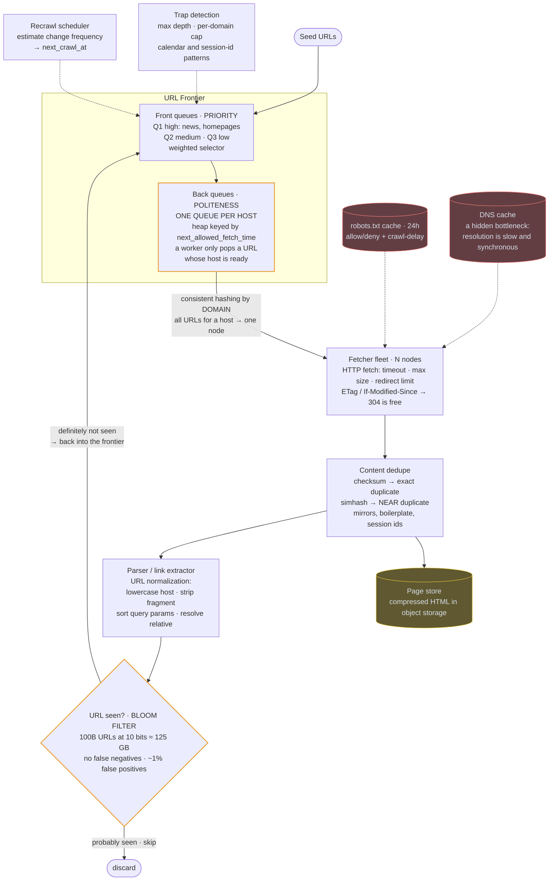
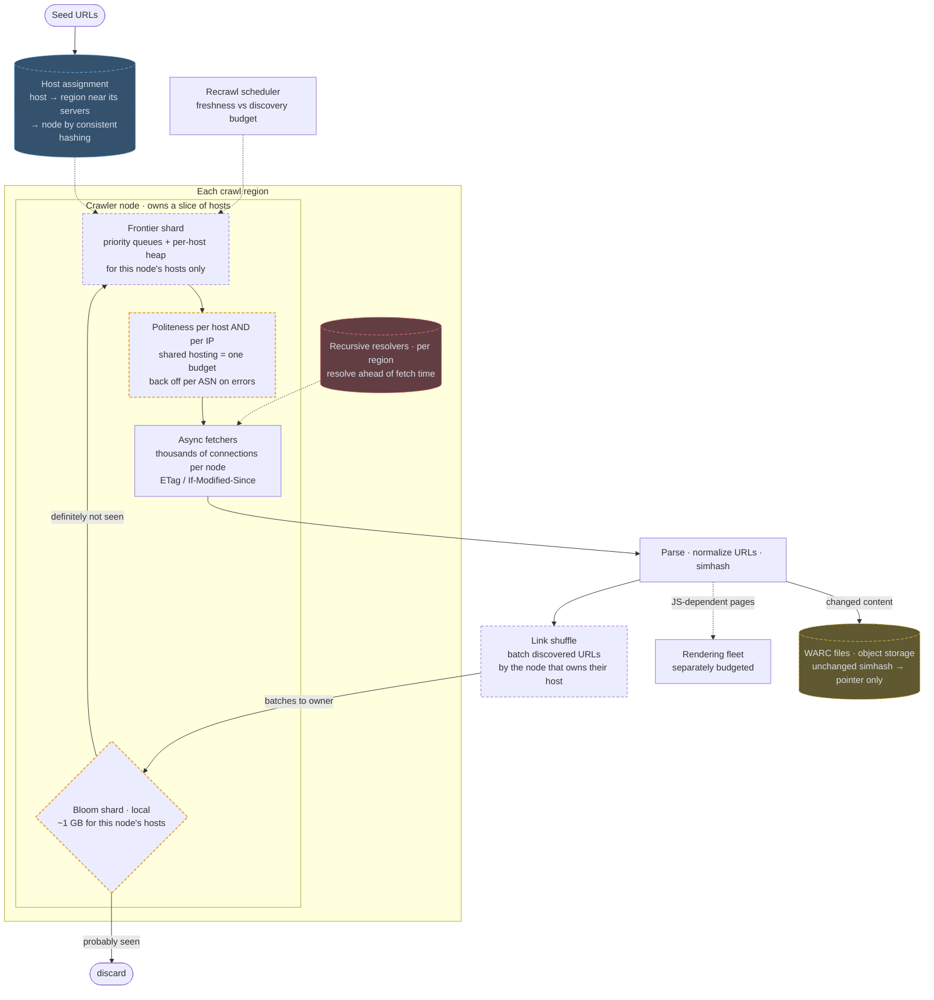

# 09 — Web Crawler

## API / Model

Internal system, so the "API" is the queue contracts:

```api
# Queue contracts
frontier.push(url, priority, discovered_at)
frontier.pop(worker_id) || || url || politeness-aware
content.put(url, html, fetched_at, checksum)
```

```erd
# Frontier
url_seen || in RAM and sharded; a backing store confirms positives || Bloom filter
schedule
+ url_hash || bytes || PK → page_store
+ next_crawl_at || timestamp
+ change_frequency_estimate || interval
domain_state
+ domain || text || PK
+ last_fetch_ts || timestamp
+ crawl_delay || interval
+ error_rate || float
+ politeness_budget || int
# Caches
robots_cache || TTL ~24h || cache
+ domain || text || PK
+ rules || parsed rules
dns_cache || TTL honors the DNS record || cache
+ hostname || text || PK
+ ips || list<inet>
# Content
page_store || html is compressed, in object storage
+ url_hash || bytes || PK
+ html || object ref
+ headers || map<text,text>
+ fetched_at || timestamp
+ http_status || int
+ content_checksum || bytes || → content_hash
content_hash || simhash or checksum, for near-duplicate detection
+ checksum || bytes || PK
+ canonical_url || text
```

---

## High-level architecture

<!-- tab: Today · 10k pages/s -->



The crawler is a loop around the URL Frontier: URLs leave it, pages are fetched and parsed, and new links go back in. Politeness lives inside the frontier, and duplicates are caught twice, once by content and once by URL.

1. Seed URLs enter the front queues, which order work by priority (Q1 high for news and homepages, Q2 medium, Q3 low) through a weighted selector.
2. URLs then move to the back queues, one per host. A heap keyed by `next_allowed_fetch_time` lets a worker pop a URL only when its host is ready.
3. Consistent hashing by domain sends all of a host's URLs to the same node in the fetcher fleet, which reads the robots.txt cache for rules and crawl-delay, and the DNS cache for addresses.
4. The fetcher makes the HTTP request with a timeout, a size cap and a redirect limit, and sends ETag / If-Modified-Since so an unchanged page costs only a 304.
5. Content dedupe checks a checksum for exact duplicates and a simhash for near duplicates, and the page is written to the page store as compressed HTML.
6. The parser / link extractor pulls out links and normalizes each URL: lowercase host, strip fragment, sort query params, resolve relative paths.
7. The Bloom filter checks every normalized URL. A URL that is definitely not seen goes back into the front queues, and one that is probably seen is discarded.

Two jobs feed the frontier from the side. Trap detection enforces a maximum depth and a per-domain cap and catches calendar and session-id patterns, so runaway URL spaces don't flood the queues. The recrawl scheduler estimates how often each page changes and puts it back into the front queues at its `next_crawl_at`.

<!-- tab: At 100x · 1M pages/s -->



Same crawler at 100x the fetch rate: a full pass over 100B known pages in about a day instead of eleven days for 10B. Dashed outlines mark what's new or reshaped compared with today's design.

| | Today | At 100x |
|---|---|---|
| Fetch rate | 10k pages/sec | 1M pages/sec |
| Known pages | 10B | 100B |
| URLs seen | 100B+ | ~1T |
| Bloom filter at 10 bits/URL | ~125 GB | ~1.25 TB |
| Raw ingest | ~85 TB/day | ~8.6 PB/day |
| Full pass | ~11 days | ~1 day |

**What changes, and the number that forces it**

1. **The frontier is sharded along with its hosts.** One global heap popping 1M URLs/sec becomes a contention point before anything else, as the 10x follow-up warns. Each crawler node owns a slice of hosts by consistent hashing and holds their frontier queues, politeness state and seen-set together. Popping a URL, checking politeness and checking "seen" are all local memory operations.
2. **The seen-set shards with the frontier.** ~1T URLs at 10 bits each is ~1.25 TB, too much to sit behind a network call for every extracted link. Partitioning the Bloom filter by host puts ~1 GB on each node, right next to the frontier that needs it.
3. **Discovered links are shuffled in batches.** Most links point at other hosts, which belong to other nodes. The parser groups discovered URLs by owning node and ships them in batches, and the owner does the Bloom check and enqueue. It's a MapReduce-style shuffle, not a network call per link.
4. **Politeness counts IPs, not just hostnames.** At 1M pages/sec, thousands of small sites on one shared-hosting IP would each get their own "one request at a time" budget and together overwhelm the machine. Budgets apply per host and per IP, and error rates trigger backoff per ASN.
5. **Crawling runs in several regions.** Fetching a Brazilian site from Virginia adds latency to every request and sees the wrong geo-served content. Hosts are assigned to the region closest to their servers, and each region runs its own recursive resolvers that resolve ahead of fetch time. DNS is otherwise the first thing to break.
6. **Only changed content is stored.** 8.6 PB/day of raw HTML is mostly pages that didn't change since the last crawl. When a recrawl's simhash matches the stored version, only a pointer and the fetch time are recorded; changed pages are written as compressed WARC files to object storage.

**What stays the same**

The two-level frontier that makes politeness structural, consistent hashing by domain, a Bloom filter that never re-crawls a seen URL, URL normalization, trap detection, conditional requests that make unchanged pages nearly free, and JavaScript rendering on its own smaller fleet. The loop is identical; it's just partitioned so that almost nothing in it crosses the network per URL.

<!-- /tabs -->

---
