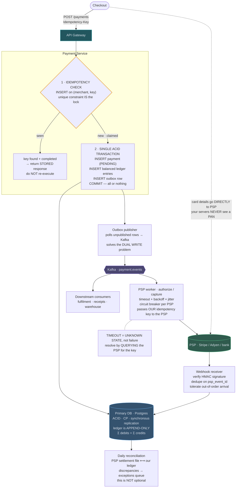
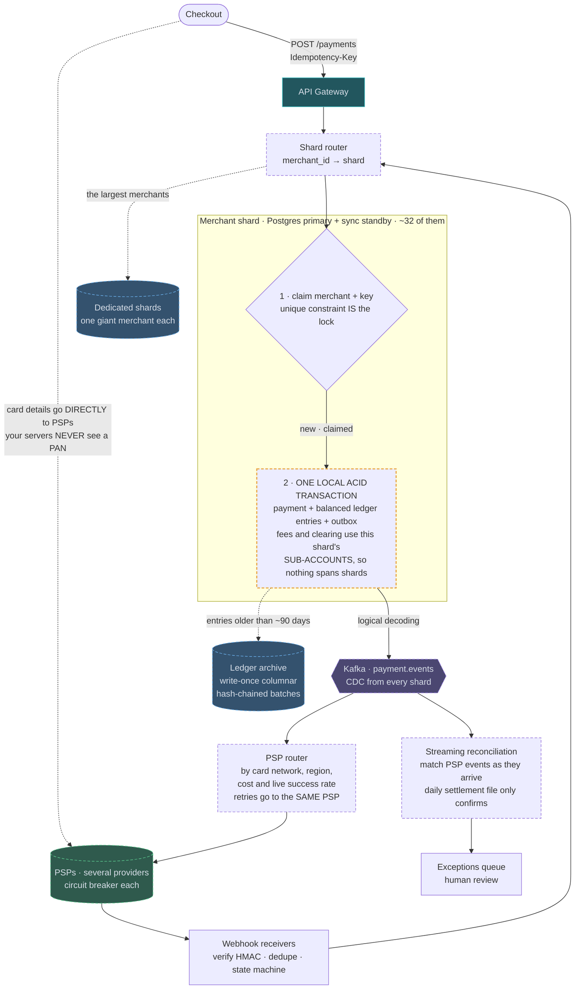

# 10 — Payment System

## API / Model

```api
POST /v1/payments || Idempotency-Key: <uuid> || 201 payment || the Idempotency-Key header is mandatory
+ {order_id, amount, currency, payment_method_token, capture: true|false}
POST /v1/payments/{id}/capture || {amount} || 200
POST /v1/payments/{id}/refund || Idempotency-Key: <uuid>  {amount, reason} || 201 refund
GET /v1/payments/{id} || || 200 payment
POST /v1/webhooks/psp || || 200 || inbound from the processor, signed
```

```schema
idempotency_keys || PK: (merchant_id, key) || request_hash, response_body, status, created_at || TTL 24h; the single most important table in the system
payments || PK: payment_id || order_id, amount, currency, state, psp_ref, created_at ||
+ states: PENDING → AUTHORIZED → CAPTURED → SETTLED
+                ↘ FAILED    ↘ REFUNDED / PARTIALLY_REFUNDED
ledger_entries || PK: entry_id || transaction_id, account_id, direction (DEBIT|CREDIT), amount_minor_units (INTEGER, never float), currency, created_at || immutable and append-only; Σ debits = Σ credits per transaction_id
accounts || PK: account_id || type (customer|merchant|fees|psp_clearing) || balance is derived from the ledger, cached with periodic reconciliation
outbox || PK: id || aggregate_id, event_type, payload, published (bool) ||
psp_events || PK: psp_event_id || || dedupe of inbound webhooks
```

Two details worth stating unprompted: **amounts are integers in minor units** (cents), never floats — `0.1 + 0.2 != 0.3` is a real bug that costs real money. And **ledger entries are immutable**; a correction is a new compensating entry, never an UPDATE.

---

## High-level architecture

<!-- tab: Today · 10k tx/s -->



Every payment is committed to the Primary DB before anything talks to the processor. From there, an outbox feeds Kafka, a PSP worker calls the PSP, and webhooks carry the result back into the same database.

1. Checkout sends `POST /payments` with an `Idempotency-Key` through the API Gateway, and the Payment Service claims the key with an INSERT on `(merchant, key)`. If the key has been seen and the payment completed, the service returns the stored response and does nothing else.
2. For a new key, one ACID transaction inserts the payment as `PENDING`, its balanced ledger entries and an outbox row, and commits them to the Primary DB together.
3. The outbox publisher polls for unpublished rows and publishes them to Kafka `payment.events`.
4. The PSP worker consumes the event and calls the PSP to authorize or capture, with timeouts, backoff with jitter and a circuit breaker per PSP. It sends our idempotency key along, and after a timeout it queries the PSP for that key instead of guessing.
5. The PSP reports the outcome to the webhook receiver, which verifies the HMAC signature and dedupes on `psp_event_id` before updating the Primary DB.

Card details never enter this flow. Checkout sends them straight to the PSP, and the payment request carries only `payment_method_token`. Other consumers of `payment.events` handle fulfilment, receipts and the warehouse, independently of the PSP worker. Once a day, reconciliation compares the PSP settlement file with the ledger and sends any discrepancy to an exceptions queue.

<!-- tab: At 10x · 100k tx/s -->



Same system at 10x. 100k transactions/sec is around the peak the largest wallets report on their biggest shopping day; 100x would be beyond any payment platform's recorded peak, so 10x is the ceiling worth designing for. Dashed outlines mark what's new or reshaped compared with today's design.

| | Today | At 10x |
|---|---|---|
| Transactions at peak | 10k/sec | 100k/sec |
| Ledger writes at peak | 20k/sec | 200k/sec |
| Ledger entries per day | ~600M | ~6B |
| Databases | 1 primary + standby | ~32 merchant shards, each primary + standby |
| Payment processors | 1–2 | several, chosen per transaction |

**What changes, and the number that forces it**

1. **One primary → shards keyed by merchant.** 200k ledger writes/sec with synchronous replication is past a single Postgres primary. Shard by `merchant_id`, the follow-up's answer, with each shard a primary plus synchronous standby. The idempotency key is already `(merchant_id, key)`, so the claim lands on the same shard as the payment it protects.
2. **Platform accounts are split across shards.** This is the trap in sharding a ledger: every payment also moves money into platform accounts (fees, PSP clearing), which would make every transaction cross-shard. Instead, each shard holds its own sub-accounts for fees and clearing, so the payment, both sides of every entry and the outbox row commit in one local ACID transaction. The platform's balance is the sum of its sub-accounts. Moving money between sub-accounts on different shards is rare and scheduled, and runs as a saga with balanced entries on each side.
3. **Giant merchants get their own shards.** On a big sale day, one marketplace can exceed a whole shard's capacity. The router pins the largest merchants to dedicated shards.
4. **Outbox polling → CDC.** Polling for unpublished rows on ~32 shards at this rate is constant load on the primaries. Logical decoding streams each shard's outbox into Kafka with no polling queries at all.
5. **Several processors, routed per transaction.** 100k transactions/sec is too much revenue to hang on one processor's rate limits, pricing and outages. A PSP router chooses a provider for each transaction by card network, region, cost and live authorization success rate, with a circuit breaker per provider. Our idempotency key still travels to whichever PSP is chosen, and a retry after a timeout goes back to the *same* PSP and queries it first: failing over mid-payment to a different processor is exactly how double charges happen.
6. **Reconciliation becomes streaming.** A daily line-by-line comparison over ~6B entries finds problems a day late. Processor events are matched against the ledger as they arrive, and the daily settlement file now confirms what's already been matched rather than discovering discrepancies.
7. **Old ledger entries leave Postgres.** Seven years of ~6B entries a day doesn't belong on OLTP primaries. Entries older than ~90 days move to write-once columnar storage in hash-chained batches, so tampering is detectable, and balances are served from snapshots plus recent entries.

**What stays the same**

Consistency over availability. The idempotency claim is still a unique insert, a timeout is still an unknown state resolved by querying, every transaction still sums to zero, sagas still beat two-phase commit, webhooks are still verified and deduped, amounts are still integers in minor units, and card numbers still never touch our servers. Sharding is added exactly where the 10k/sec version said it would be, and not a transaction earlier.

<!-- /tabs -->

---
