# 11 — Ticketmaster / Booking System

## API / Model

```api
GET /v1/events/{id} || || 200 event + availability summary
GET /v1/events/{id}/seats?section= || || 200 seat map || cached, may be stale
POST /v1/events/{id}/holds || Idempotency-Key  {seat_ids[]} || 201 409 hold_id, expires_at || 409 Conflict when a seat is already held
POST /v1/holds/{id}/checkout || Idempotency-Key  {payment_token} || 201 booking_id
DEL /v1/holds/{id} || || 204 || release early
GET /v1/queue/status || || 200 waiting room position
```

```schema
events || PK: event_id || venue, datetime, on_sale_at, status ||
seats || PK: (event_id, seat_id) || section, row, number, price_tier, state, held_by (session), hold_expires_at, version || state: AVAILABLE | HELD | SOLD; version enables optimistic locking
holds || PK: hold_id || event_id, seat_ids[], user_id, created_at, expires_at, state || TTL ~10 min
bookings || PK: booking_id || hold_id, user_id, seat_ids[], payment_id, state ||
inventory_ga || PK: (event_id, tier) || total, sold || counter for general admission
```

The `state` field on `seats` plus a `version` column is the whole concurrency-control story. Everything else is supporting cast.

---

## High-level architecture

```mermaid
flowchart TB
    Rush([500,000 users hit buy<br/>at 10:00:00 sharp]) --> CDNEdge[CDN · static seat maps]
    CDNEdge --> Queue

    subgraph WR ["Virtual waiting room — the key defence"]
        direction TB
        Queue["Signed queue token on arrival<br/>Redis sorted set · score = arrival ts"]
        Waiting["WAITING · 490,000<br/>position and ETA shown"]
        Admit["Admit at a CONTROLLED RATE<br/>e.g. 1,000/sec — matched to what<br/>the booking tier can actually handle"]
        Admitted["ADMITTED · 10,000<br/>token grants ~10 min access"]
        Queue --> Waiting --> Admit --> Admitted
    end

    Admitted --> GW[API Gateway<br/>no valid queue token, no entry]

    GW --> Browse

    Browse[("Browse path · Redis seat map<br/>TTL 2-5s · INTENTIONALLY STALE<br/>the map is a hint,<br/>truth is decided at hold time")]

    subgraph BOOK ["Booking path · contended"]
        direction TB
        Hold["1 · HOLD SEATS<br/>BEGIN TRANSACTION<br/>SELECT … FOR UPDATE<br/>WHERE state = AVAILABLE<br/>locks acquired in SORTED ORDER<br/>to avoid deadlock"]
        Verdict{"all available?"}
        Ok["UPDATE state = HELD<br/>set held_by and expires_at<br/>INSERT hold · COMMIT"]
        Conflict["ROLLBACK → 409<br/>suggest nearby alternatives"]
        Checkout["2 · CHECKOUT within 10 min · SAGA<br/>verify hold → charge → seats SOLD<br/>→ issue tickets<br/>compensate: refund + release"]
        Hold --> Verdict
        Verdict -- "yes" --> Ok --> Checkout
        Verdict -- "no" --> Conflict
    end

    GW --> Hold

    Checkout --> DB
    Ok --> DB
    DB[("Primary DB · Postgres<br/>ACID · CP<br/>SHARDED BY EVENT so one hot<br/>on-sale can't degrade the platform")]

    DB --> Sweeper["Hold expiry sweeper<br/>release where expires_at < now()<br/>ALSO checked at read time —<br/>never rely on the sweeper alone"]
    DB --> SeatEvents{{"Kafka · seat.events<br/>→ cache invalidate<br/>→ live seat map over WS"}}
    SeatEvents -.-> Browse

    classDef db fill:#34526e,stroke:#6cb2ee,color:#d7dee8
    classDef cache fill:#623e43,stroke:#f07a73,color:#d7dee8
    classDef queue fill:#4b4771,stroke:#ad94f7,color:#d7dee8
    classDef external fill:#2f5a4d,stroke:#5cc98f,color:#d7dee8
    classDef gateway fill:#22565e,stroke:#38bdc1,color:#d7dee8
    classDef hot stroke:#e8a33d,stroke-width:2px
    class DB db
    class Browse cache
    class Queue,Hold hot
    class SeatEvents queue
    class CDNEdge external
    class GW gateway

    click Queue href "/docs/04-caching" "Role: a waiting room that admits users at the rate booking can handle.<br/>Trade-off: users wait, but the booking path survives the on-sale spike."
    click Browse href "/docs/04-caching" "Role: a fast, deliberately stale seat map for browsing.<br/>Trade-off: a seat shown as free may already be held, and the hold step decides."
    click DB href "/docs/02-data-storage" "Role: the single authority on seat state, sharded by event.<br/>Trade-off: strict consistency caps write throughput on each event's shard."
    click SeatEvents href "/docs/05-async-messaging-and-event-driven" "Role: seat changes invalidate caches and refresh live seat maps.<br/>Trade-off: maps lag slightly, so clients must handle hold conflicts."
```



<details>
<summary>Plain-text version of this diagram</summary>

```text
        500,000 users hit "buy" at 10:00:00 sharp
                          │
                          ▼
  ┌──────────────────────────────────────────────────────────┐
  │              CDN  (static seat maps, event pages)         │
  └────────────────────────┬─────────────────────────────────┘
                            ▼
  ┌──────────────────────────────────────────────────────────┐
  │           VIRTUAL WAITING ROOM  ⚠ THE KEY DEFENCE          │
  │                                                            │
  │   All users → issued a signed queue token on arrival       │
  │   Redis sorted set: score = arrival timestamp              │
  │                                                            │
  │   ┌────────────────────────────────────────────────┐      │
  │   │ WAITING (490,000)                               │      │
  │   │  ▓▓▓▓▓▓▓▓▓▓▓▓▓▓▓▓▓▓▓▓▓▓▓▓▓▓▓▓▓▓▓▓▓▓▓▓▓▓▓▓      │      │
  │   │  position shown, ETA estimated                  │      │
  │   └────────────────────┬───────────────────────────┘      │
  │                         │ admit at a CONTROLLED RATE       │
  │                         │ (e.g. 1,000/sec — matched to     │
  │                         │  what the booking tier can       │
  │                         │  actually handle)                │
  │                         ▼                                  │
  │   ┌────────────────────────────────────────────────┐      │
  │   │ ADMITTED (10,000) — token grants ~10 min access │      │
  │   └────────────────────┬───────────────────────────┘      │
  └─────────────────────────┼─────────────────────────────────┘
                             ▼
  ┌──────────────────────────────────────────────────────────┐
  │                     API GATEWAY                           │
  │            validate queue token — no token, no entry       │
  └────────────────────────┬─────────────────────────────────┘
          ┌────────────────┴─────────────────┐
          ▼                                   ▼
  ┌────────────────────┐          ┌──────────────────────────┐
  │  BROWSE PATH        │          │   BOOKING PATH            │
  │  (read, cacheable)  │          │   (write, contended)      │
  │                     │          │                           │
  │ ┌─────────────────┐ │          │ ┌───────────────────────┐ │
  │ │ Redis: seat map │ │          │ │ 1. HOLD SEATS          │ │
  │ │ availability    │ │          │ │                        │ │
  │ │ TTL ~2-5s       │ │          │ │  BEGIN TRANSACTION     │ │
  │ │                 │ │          │ │  SELECT ... FOR UPDATE │ │
  │ │ ⚠ INTENTIONALLY │ │          │ │    WHERE seat_id IN () │ │
  │ │   STALE. Users  │ │          │ │    AND state=AVAILABLE │ │
  │ │   see "maybe    │ │          │ │  ← row locks, ordered  │ │
  │ │   available";   │ │          │ │    consistently to     │ │
  │ │   truth is      │ │          │ │    avoid DEADLOCK      │ │
  │ │   decided at    │ │          │ │                        │ │
  │ │   hold time     │ │          │ │  if all AVAILABLE:     │ │
  │ └─────────────────┘ │          │ │    UPDATE state=HELD,  │ │
  └────────────────────┘          │ │      held_by, expires  │ │
                                    │ │    INSERT hold          │ │
                                    │ │  COMMIT                │ │
                                    │ │  else ROLLBACK → 409   │ │
                                    │ └──────────┬────────────┘ │
                                    │             ▼              │
                                    │ ┌───────────────────────┐ │
                                    │ │ 2. CHECKOUT (≤10 min)  │ │
                                    │ │    SAGA:               │ │
                                    │ │    verify hold valid   │ │
                                    │ │      → charge payment  │ │
                                    │ │      → seats = SOLD    │ │
                                    │ │      → issue tickets   │ │
                                    │ │    compensate on fail: │ │
                                    │ │      refund + release  │ │
                                    │ └──────────┬────────────┘ │
                                    └─────────────┼─────────────┘
                                                   ▼
                              ┌────────────────────────────────┐
                              │   PRIMARY DB (Postgres)         │
                              │   single-writer per event       │
                              │   ACID, CP — correctness wins   │
                              │   partition/shard BY EVENT      │
                              │   (one hot event ≠ everyone's   │
                              │    problem)                     │
                              └────────────┬───────────────────┘
                                            │
                    ┌───────────────────────┼──────────────────┐
                    ▼                        ▼                  ▼
        ┌────────────────────┐  ┌────────────────────┐  ┌──────────────┐
        │ HOLD EXPIRY SWEEPER │  │ Kafka: seat.events │  │ Read replicas│
        │ periodic job:       │  │  → cache invalidate│  │ (browse only)│
        │  UPDATE seats       │  │  → live seat map   │  └──────────────┘
        │  SET state=AVAILABLE│  │    push via WS     │
        │  WHERE state=HELD   │  └────────────────────┘
        │  AND expires < now()│
        │ ⚠ also check expiry │
        │   at read time —    │
        │   never rely on the │
        │   sweeper alone     │
        └────────────────────┘
```

</details>

Buyers reach the application only through the virtual waiting room, which queues arrivals in a Redis sorted set under signed queue tokens and admits them at a controlled rate, about 1,000 per second, each for roughly 10 minutes. Behind the API Gateway, admitted users browse a deliberately stale Redis seat map and book against the Primary DB, which is sharded by event.

1. With a valid queue token, the API Gateway passes a hold request to the booking path. The transaction locks the chosen seats with `SELECT … FOR UPDATE`, taking the locks in sorted order. If every seat is still `AVAILABLE`, it marks them `HELD` with `held_by` and `expires_at`, inserts the hold and commits. If any seat is gone, it rolls back and returns 409 with nearby alternatives.
2. Within the 10-minute hold, checkout runs as a saga that verifies the hold, charges the buyer, marks the seats `SOLD` and issues tickets.
3. Every seat change in the Primary DB is published to Kafka `seat.events`, which invalidates the cached seat map and pushes live seat updates over WebSocket.

The browse path never takes a lock. Seat maps come from the CDN as static pages and from the Redis seat map, which has a TTL of 2-5 seconds and is refreshed by those seat events. Beside the booking path, the hold expiry sweeper scans the Primary DB and returns seats from expired holds to `AVAILABLE`.

---
