# 11 — Ticketmaster / Booking System

## API / Model

```api
GET /v1/events/{id} || || 200 event + availability summary
GET /v1/events/{id}/seats?section= || || 200 seat map || cached, may be stale
POST /v1/events/{id}/holds || Idempotency-Key  {seat_ids[]} || 201 409 hold_id, expires_at || 409 Conflict when a seat is already held
POST /v1/holds/{id}/checkout || Idempotency-Key  {payment_token} || 201 booking_id
DEL /v1/holds/{id} || || 204 || release early
GET /v1/queue/status || || 200 waiting room position
```

```schema
events || PK: event_id || venue, datetime, on_sale_at, status ||
seats || PK: (event_id, seat_id) || section, row, number, price_tier, state, held_by (session), hold_expires_at, version || state: AVAILABLE | HELD | SOLD; version enables optimistic locking
holds || PK: hold_id || event_id, seat_ids[], user_id, created_at, expires_at, state || TTL ~10 min
bookings || PK: booking_id || hold_id, user_id, seat_ids[], payment_id, state ||
inventory_ga || PK: (event_id, tier) || total, sold || counter for general admission
```

The `state` field on `seats` plus a `version` column is the whole concurrency-control story. Everything else is supporting cast.

---

## High-level architecture

<!-- tab: Today · 500k in the queue -->


Buyers reach the application only through the virtual waiting room, which queues arrivals in a Redis sorted set under signed queue tokens and admits them at a controlled rate, about 1,000 per second, each for roughly 10 minutes. Behind the API Gateway, admitted users browse a deliberately stale Redis seat map and book against the Primary DB, which is sharded by event.

1. With a valid queue token, the API Gateway passes a hold request to the booking path. The transaction locks the chosen seats with `SELECT … FOR UPDATE`, taking the locks in sorted order. If every seat is still `AVAILABLE`, it marks them `HELD` with `held_by` and `expires_at`, inserts the hold and commits. If any seat is gone, it rolls back and returns 409 with nearby alternatives.
2. Within the 10-minute hold, checkout runs as a saga that verifies the hold, charges the buyer, marks the seats `SOLD` and issues tickets.
3. Every seat change in the Primary DB is published to Kafka `seat.events`, which invalidates the cached seat map and pushes live seat updates over WebSocket.

The browse path never takes a lock. Seat maps come from the CDN as static pages and from the Redis seat map, which has a TTL of 2-5 seconds and is refreshed by those seat events. Beside the booking path, the hold expiry sweeper scans the Primary DB and returns seats from expired holds to `AVAILABLE`.

```mermaid
flowchart TB
    Fans([~5M fans · a 40-show tour on sale]) --> Edge["CDN edge · bot checks<br/>issues SIGNED queue tokens<br/>random number per arrival<br/>no central write"]
    Presale[("Verified-fan presale<br/>registration days before<br/>codes to a chosen subset")] -.-> Edge
    Edge --> Gate{"token number<br/>below admit cursor?"}
    Cursor[("Admit cursor · one per show<br/>raised at the rate booking absorbs")] --> Gate
    Gate -- "not yet · position shown at the edge" --> Edge
    Gate -- "admitted" --> GW[API Gateway<br/>no valid token, no entry]

    GW --> Counts[("Section counts · Redis<br/>available seats per section and price<br/>no per-seat map to millions of screens")]
    GW --> BestAvail

    subgraph BOOK ["Booking path · one shard per show"]
        direction TB
        BestAvail["1 · buyer picks section + price<br/>not individual seats"]
        Alloc["2 · allocator per section<br/>hands out best contiguous seats in order<br/>no competing row locks, no 409 storm"]
        Hold["3 · HOLD · seats HELD with expires_at<br/>INSERT hold · COMMIT"]
        Checkout["4 · checkout SAGA<br/>payment queue extends the hold<br/>while the PSP call waits"]
        BestAvail --> Alloc --> Hold --> Checkout
    end

    Hold --> DB
    Checkout --> DB
    DB[("Primary DB · Postgres<br/>ACID · CP · sharded by show<br/>40 shows = 40 isolated on-sales")]
    DB --> Sweeper["Hold expiry sweeper<br/>ALSO checked at read time"]
    DB --> SeatEvents{{"Kafka · seat.events<br/>→ section counts"}}
    SeatEvents -.-> Counts

    classDef db fill:#34526e,stroke:#6cb2ee,color:#d7dee8
    classDef cache fill:#623e43,stroke:#f07a73,color:#d7dee8
    classDef queue fill:#4b4771,stroke:#ad94f7,color:#d7dee8
    classDef external fill:#2f5a4d,stroke:#5cc98f,color:#d7dee8
    classDef gateway fill:#22565e,stroke:#38bdc1,color:#d7dee8
    classDef hot stroke:#e8a33d,stroke-width:2px
    classDef scaled stroke-dasharray:5 3
    class DB,Presale db
    class Counts,Cursor cache
    class SeatEvents queue
    class Edge external
    class GW gateway
    class Gate,Alloc hot
    class Edge,Presale,Gate,Cursor,Counts,BestAvail,Alloc,Checkout scaled

    click Edge href "/docs/04-caching" "Role: issues signed queue tokens with a random number at the CDN edge, with no central write.<br/>Trade-off: a signing key to rotate, and tokens must be bound to an account so they can't be shared."
    click Presale href "/docs/08-reliability-and-operations" "Role: verified-fan registration days before, with codes issued to a chosen subset.<br/>Trade-off: fans who miss registration can't join the main sale."
    click Gate href "/docs/08-reliability-and-operations" "Role: admits tokens whose number is below the show's admit cursor.<br/>Trade-off: a fan's position is only an estimate until the cursor reaches them."
    click Cursor href "/docs/04-caching" "Role: one number per show, raised at the rate booking can absorb.<br/>Trade-off: too high and contention returns; too low and seats sell slowly."
    click Counts href "/docs/04-caching" "Role: available seats per section and price, refreshed from seat events.<br/>Trade-off: no per-seat map while the rush lasts."
    click BestAvail href "/docs/03-consistency-and-distributed-systems" "Role: takes a section and price instead of specific seats.<br/>Trade-off: buyers lose seat choice during the rush."
    click Alloc href "/docs/03-consistency-and-distributed-systems" "Role: one allocator per section hands out the best remaining contiguous seats in order.<br/>Trade-off: a serial allocator caps throughput per section, which the admit cursor is sized for."
    click Checkout href "/docs/03-consistency-and-distributed-systems" "Role: the checkout saga, with a payment queue that extends holds while waiting.<br/>Trade-off: seats stay held longer when the processor is slow."
    click DB href "/docs/02-data-storage" "Role: the single authority on seat state, one shard per show.<br/>Trade-off: strict consistency caps writes per show, which is why admission exists."
```

<!-- tab: At 10x · 5M in the queue -->



Same product at 10x, roughly what the biggest stadium tours have drawn: millions of people in the queue at once for dozens of shows. 100x would put 50M people in one queue, more than any on-sale has seen, so 10x is the realistic tier. Dashed outlines mark what's new or reshaped compared with today's design.

| | Today | At 10x |
|---|---|---|
| Buyers at on-sale | 500k | ~5M |
| Request spike | 100k/sec | ~1M/sec |
| Seats on sale at once | 50k, one show | ~2M, a 40-show tour |
| Central writes per arrival | 1 Redis sorted-set insert | none |

**What changes, and the number that forces it**

1. **The waiting room moves to the edge.** With ~5M arrivals in the first seconds, the waiting room's own Redis sorted set becomes the thing that falls over. The CDN edge issues each arrival a signed token carrying a random queue number (random rather than arrival time, so network speed doesn't decide the order), and nothing central is written. Admission becomes one number per show, the admit cursor: tokens below it get in, and it rises at the rate booking can absorb. Each fan's position is computed at the edge from their own token.
2. **Presale registration flattens the spike.** The lottery from the fairness follow-up becomes the default for big tours. Verified fans register days before, codes go to a chosen subset, and the on-sale starts with a known audience instead of an unknown stampede. Bot filtering happens at registration, where it doesn't cost real buyers their conversion.
3. **Buyers pick a section; the server picks seats.** With millions of people choosing individual seats, most hold attempts collide on the same few best seats: row locks wait, and every 409 turns into an immediate retry. Best-available allocation lets the buyer choose a section and price, and one allocator per section hands out the best remaining contiguous seats serially. Contention moves from competing row locks to an orderly queue in front of an allocator that never conflicts with itself. The cost is less choice; pick-your-seat can reopen once the rush drains.
4. **Browsing shows counts, not seat maps.** Pushing live per-seat maps to millions of screens is a bigger fan-out than the sale itself. Admitted users see available seats per section and price, updated every few seconds from the seat event stream.
5. **Checkout queues payments and extends holds.** Selling ~2M seats in minutes runs into processor rate limits. Checkouts wait in a payment queue, and a hold's TTL is extended while its checkout is waiting there, so a slow processor never releases seats someone is paying for.
6. **Each show is its own isolated on-sale.** A 40-show tour is 40 simultaneous on-sales. Sharding by event already isolates their data; now each show also gets its own admit cursor and allocators, so a sold-out Saturday can't slow down Tuesday.

**What stays the same**

A seat can never be double-sold: holds are still ACID writes against Postgres, and hold expiry is still checked by both the sweeper and at read time. Display stays eventually consistent while the purchase stays strongly consistent, checkout is still a saga that retries issuance after a successful charge, and admission control still sits in front of the application tier. There is still no eventual consistency anywhere in the purchase path.

<!-- /tabs -->

---
