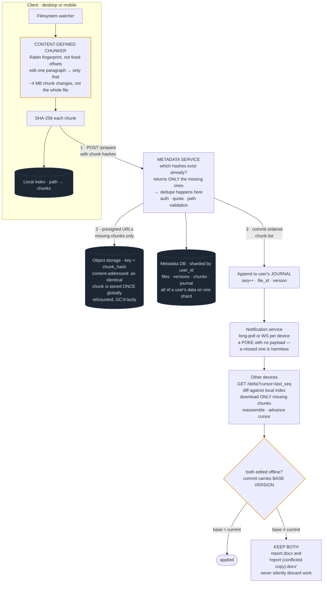

# 12 — Dropbox / Google Drive (File Sync)

## API / Model

```api
POST /v1/files/prepare || {path, chunk_hashes[]} || 200 {missing_chunks[]} || dedupe check
PUT <presigned url> || || 200 || upload only the missing chunks, in parallel
POST /v1/files/commit || {path, chunk_hashes[], size, mtime} || 201 {file_id, version}
GET /v1/delta?cursor= || || 200 changes since cursor || the sync primitive
GET /v1/files/{id}/versions || || 200 version list
POST /v1/shares || {file_id, user_id, permission} || 201
```

```schema
files || PK: (user_id, file_id) || path, size, mtime, current_version, is_deleted, parent_folder_id ||
versions || PK: (file_id, version) || chunk_list[] (ordered hashes), created_at, created_by, size ||
chunks || PK: chunk_hash || storage_url, size, refcount || SHA-256 of the content; global, content-addressed, shared across all users
devices || PK: (user_id, device_id) || last_sync_cursor, last_seen ||
journal || PK: user_id SK: seq || file_id, change_type, version, ts || monotonic seq; the delta feed clients read from
```

The `chunks` table being global and keyed by content hash is the whole dedupe story: if any user anywhere has already uploaded a chunk with that hash, nobody uploads it again.

---

## High-level architecture



<details>
<summary>Plain-text version of this diagram</summary>

```text
  ┌─────────────────────────────────────────────────────────────────┐
  │                        CLIENT (desktop/mobile)                    │
  │                                                                   │
  │  ┌──────────────┐   file changed on disk                          │
  │  │ WATCHER      │────────────────┐                                │
  │  │ (fs events)  │                 ▼                               │
  │  └──────────────┘   ┌────────────────────────────────────┐        │
  │                      │  CHUNKER — content-defined boundary│        │
  │                      │  (Rabin fingerprint, not fixed     │        │
  │                      │   offsets)                          │        │
  │                      │                                     │        │
  │                      │  FIXED-SIZE (naive):                │        │
  │                      │   insert 1 byte at start →          │        │
  │                      │   [c1][c2][c3][c4] ALL SHIFT →      │        │
  │                      │   every chunk hash changes → re-    │        │
  │                      │   upload entire file. BAD.          │        │
  │                      │                                     │        │
  │                      │  CONTENT-DEFINED:                   │        │
  │                      │   boundaries follow CONTENT, so     │        │
  │                      │   [c1][c2'][c3][c4] — only c2       │        │
  │                      │   changes. Upload 1 chunk. GOOD.    │        │
  │                      └────────────┬───────────────────────┘        │
  │                                    ▼                                │
  │                      ┌────────────────────────────────────┐        │
  │                      │  HASH each chunk (SHA-256)          │        │
  │                      └────────────┬───────────────────────┘        │
  │  ┌──────────────┐                 │                                │
  │  │ LOCAL INDEX  │◄────────────────┘                                │
  │  │ path→chunks  │                                                   │
  │  └──────────────┘                                                   │
  └────────────────────────────┬────────────────────────────────────────┘
                                │ 1. POST /prepare  {chunk_hashes[]}
                                ▼
  ┌──────────────────────────────────────────────────────────────────┐
  │                      METADATA SERVICE                              │
  │   · which of these hashes do we already have?                      │
  │   · returns ONLY the missing ones  ← DEDUPE HAPPENS HERE           │
  │   · authorization, quota, path validation                          │
  └───────┬──────────────────────────────────────────┬────────────────┘
           │ 2. presigned URLs for missing chunks only │
           ▼                                            ▼
  ┌──────────────────────────┐              ┌─────────────────────────┐
  │  OBJECT STORAGE (S3)      │              │  METADATA DB            │
  │  key = chunk_hash          │              │  files / versions /     │
  │  content-addressed →       │              │  chunks / journal       │
  │  identical chunk stored    │              │  sharded by user_id     │
  │  ONCE globally             │              │  (all of a user's data  │
  │                            │              │   on one shard = cheap  │
  │  client uploads DIRECTLY,  │              │   transactional deltas) │
  │  in parallel, resumable    │              └───────────┬─────────────┘
  └──────────────────────────┘                            │
           │ 3. POST /commit {ordered chunk list}         │
           └───────────────────────┬──────────────────────┘
                                    ▼
                        ┌───────────────────────────┐
                        │  append to user's JOURNAL  │
                        │  seq++ , file_id, version  │
                        └────────────┬──────────────┘
                                      ▼
                        ┌───────────────────────────┐
                        │  NOTIFICATION SERVICE      │
                        │  long-poll or WS per device│
                        │  "you have changes"        │
                        │  (no payload — just a poke)│
                        └────────────┬──────────────┘
                                      ▼
  ┌──────────────────────────────────────────────────────────────────┐
  │                      OTHER DEVICES                                 │
  │   GET /delta?cursor=<last_seq>                                     │
  │     → list of changed files + their chunk lists                    │
  │   diff against LOCAL index → determine missing chunks              │
  │   download ONLY those chunks from CDN/object storage               │
  │   reassemble → write to disk → advance cursor                      │
  └──────────────────────────────────────────────────────────────────┘

  ═══════════════ CONFLICT (both edit offline) ═══════════════

   Device A (offline)          Device B (offline)
    edits report.docx           edits report.docx
         │                            │
         └──────── both reconnect ────┘
                       ▼
        ┌──────────────────────────────────┐
        │ commit carries BASE VERSION       │
        │ first to arrive wins → v5          │
        │ second's base (v4) ≠ current (v5)  │
        │   → CONFLICT                       │
        │                                    │
        │ Resolution: KEEP BOTH              │
        │   report.docx            (v5)      │
        │   report (B's conflicted copy).docx│
        │                                    │
        │ ⚠ Never silently discard a user's  │
        │   work. Merging arbitrary binaries │
        │   is impossible; surfacing both is │
        │   the only honest answer.          │
        └──────────────────────────────────┘
```

</details>

---
