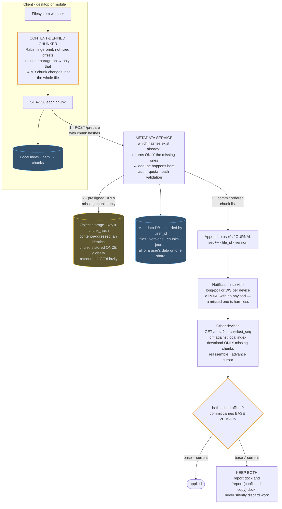
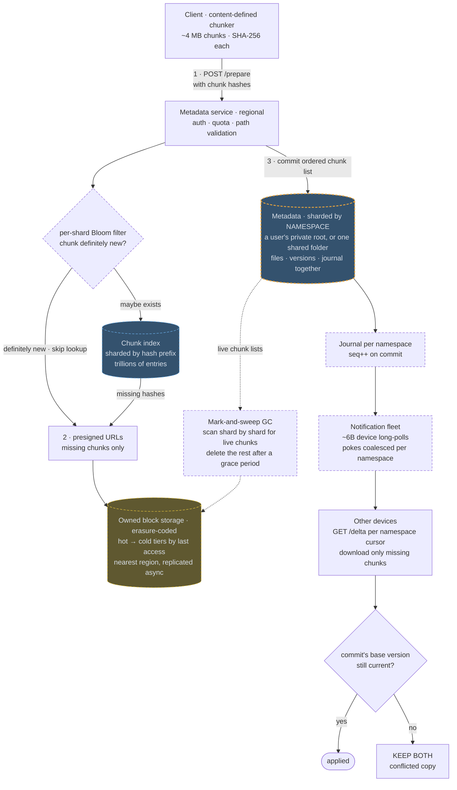

# 12 — Dropbox / Google Drive (File Sync)

## API / Model

```api
POST /v1/files/prepare || {path, chunk_hashes[]} || 200 {missing_chunks[]} || dedupe check
PUT <presigned url> || || 200 || upload only the missing chunks, in parallel
POST /v1/files/commit || {path, chunk_hashes[], size, mtime} || 201 {file_id, version}
GET /v1/delta?cursor= || || 200 changes since cursor || the sync primitive
GET /v1/files/{id}/versions || || 200 version list
POST /v1/shares || {file_id, user_id, permission} || 201
```

```schema
files || PK: (user_id, file_id) || path, size, mtime, current_version, is_deleted, parent_folder_id ||
versions || PK: (file_id, version) || chunk_list[] (ordered hashes), created_at, created_by, size ||
chunks || PK: chunk_hash || storage_url, size, refcount || SHA-256 of the content; global, content-addressed, shared across all users
devices || PK: (user_id, device_id) || last_sync_cursor, last_seen ||
journal || PK: user_id SK: seq || file_id, change_type, version, ts || monotonic seq; the delta feed clients read from
```

The `chunks` table being global and keyed by content hash is the whole dedupe story: if any user anywhere has already uploaded a chunk with that hash, nobody uploads it again.

---

## High-level architecture

<!-- tab: Today · 1 PB/day -->



Sync is split three ways: the client turns file changes into hashed chunks, the Metadata Service decides which chunks are missing and records versions, and object storage holds the bytes. Other devices find out about changes through the user's journal and a notification poke.

1. The filesystem watcher sees a change. The content-defined chunker splits the file into chunks of about 4 MB, the client hashes each one with SHA-256 and updates its local index, and then it sends the hashes with `POST /prepare`. The Metadata Service checks auth, quota and the path, and returns only the hashes it doesn't already have.
2. For those missing chunks it hands out presigned URLs, and the client uploads the bytes straight to object storage, where each chunk is stored under its `chunk_hash`.
3. The client commits the ordered chunk list. The Metadata Service writes the new version to the Metadata DB, on the user's shard, and appends an entry with the next `seq` to the user's journal.
4. The journal entry triggers the notification service, which pokes the user's other devices over long-poll or WebSocket without sending any payload.
5. Each device calls `GET /delta?cursor=last_seq`, compares the changes with its local index, downloads only the chunks it lacks, reassembles the file and advances its cursor.

The conflict branch applies to a device that edited the same file while offline. Its commit carries the base version it started from. If that is still the current version, the change is applied. If not, both files are kept: `report.docx` and `report (conflicted copy).docx`. In the background, object storage keeps a refcount on every chunk and deletes unreferenced chunks lazily.

<!-- tab: At 10x · 10 PB/day -->



Same product at 10x the data. 100x would mean more users than there are people, so this tab uses 10x the bytes and about 4x the users, with far larger shared workspaces. Dashed outlines mark what's new or reshaped compared with today's design.

| | Today | At 10x |
|---|---|---|
| Users | 500M | ~2B |
| Devices | ~1.5B | ~6B |
| Files | 100B | ~1T |
| Uploads | 1 PB/day | 10 PB/day |
| Largest shared folder | a team | a company of 100k+ people |

**What changes, and the number that forces it**

1. **Metadata shards by namespace, not by user.** Sharding by `user_id` assumed a user's files live with that user. At 10x, much of the data sits in shared folders used by tens of thousands of people at one company, and the "reference plus subscription" approach turns every commit into a fan-out across huge member lists. A namespace (a user's private root, or one shared folder) becomes the unit: its files, versions and journal live on one shard, a commit is still a single-shard transaction, and each device keeps one cursor per namespace it can see.
2. **The chunk index gets its own shards and a filter.** The global `chunks` table grows to trillions of entries and sits behind every `/prepare`. It's sharded by hash prefix (hashes are uniform, so there are no hot spots), and a Bloom filter on each shard answers "definitely new" for fresh content, so a brand-new video upload skips thousands of index lookups.
3. **Bytes move onto owned storage.** At 10 PB/day, renting object storage becomes one of the largest bills in the company. Chunks go to owned block storage with erasure coding (far less overhead than 3x replication), and chunks untouched for a year move to denser, higher-ratio codes; this is roughly the path Dropbox took with its own storage system. Uploads land in the nearest region, erasure-coded across its zones, and replicate to a second region asynchronously.
4. **Refcounts give way to mark-and-sweep.** Updating a global refcount on every commit and delete means a cross-shard write for every shared chunk, and one lost decrement leaks space while one doubled decrement deletes live data. Instead, a collector scans live chunk lists shard by shard, builds the live set, and deletes chunks that are absent from it and older than a generous grace period. It reclaims space slower, but it can only err toward keeping garbage.
5. **Notification becomes its own fleet.** ~6B devices holding long-polls means millions of idle connections per server. A dedicated notification fleet tracks which devices wait on which namespaces and coalesces pokes, so a burst of 500 commits to one team folder still produces a single poke per device.

**What stays the same**

Content-defined chunking so an edit only re-uploads the chunk it touches, content addressing by SHA-256, presigned direct uploads of missing chunks only, delta sync from a cursor, a notification that pokes rather than carries data, "keep both" on conflict, and soft deletes with a restore window. Metadata is still the hot path and bytes are still the volume problem; each just got its own dedicated scaling story.

<!-- /tabs -->

---
