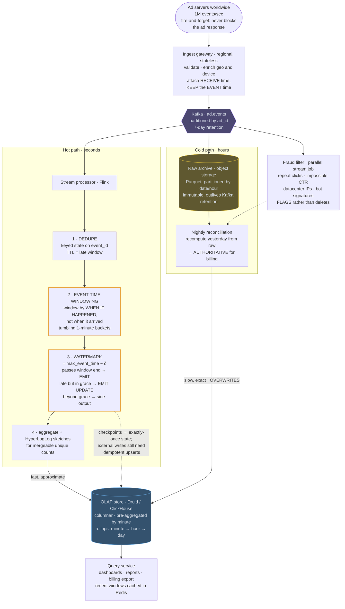
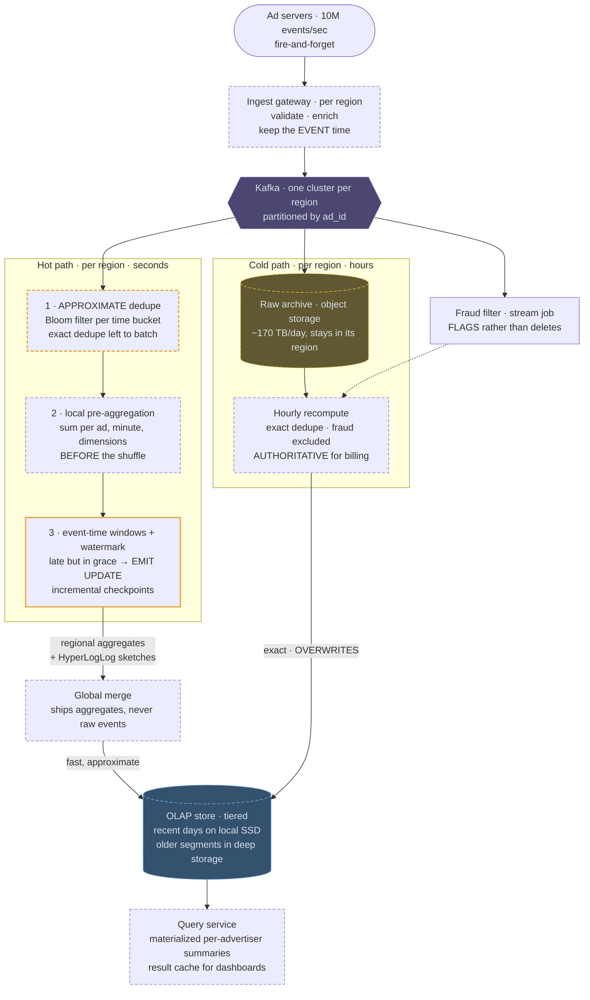

# 13 — Ad Click Aggregation / Real-Time Analytics

## API / Model

```api
POST /v1/events || {event_id, type, ad_id, user_id, ts, country, device} || 202 || fire-and-forget from the ad server; never blocks a page
GET /v1/stats?ad_id=&from=&to=&granularity=minute|hour|day&group_by=country || || 200 aggregated stats
GET /v1/campaigns/{id}/summary || || 200 campaign summary
```

```erd
# Raw · immutable, source of truth
ad.events || partitioned by ad_id, retention 7d || Kafka topic
+ event_id || uuid
+ type || impression | click
+ ad_id || bigint
+ user_id || uuid
+ ts || timestamp
+ country || text
+ device || text
raw archive || partitioned by date and hour; enables replay || object storage
# Dedupe state · stream processor
seen_events || TTL = watermark lag window || RocksDB
+ event_id || uuid || PK
+ seen || boolean
# Aggregates · OLAP, columnar
aggregates || Druid, ClickHouse or BigQuery
+ ad_id || bigint || PK
+ minute_bucket || timestamp || PK
+ country || text || PK
+ device || text || PK
+ impressions || bigint
+ clicks || bigint
+ unique_users || HLL sketch
+ spend || decimal
corrections || append-only record of adjustments, applied after a window closed
+ ad_id || bigint || → aggregates
+ minute_bucket || timestamp
+ delta || counts
+ created_at || timestamp
```

---

## High-level architecture

<!-- tab: Today · 1M events/s -->



Every event enters through one ingest path and then splits in two: a hot path in Flink produces approximate numbers within seconds, and a cold path recomputes exact numbers from the raw archive overnight. Both write to the same OLAP store.

1. Ad servers fire events at the regional ingest gateway without waiting for a reply. The gateway validates them, adds geo and device, stamps a receive time next to the event time, and writes to Kafka `ad.events`, partitioned by `ad_id`. Flink consumes the topic and dedupes on `event_id` first.
2. Event-time windowing puts each event in a tumbling 1-minute bucket by when it happened, not when it arrived.
3. The watermark, `max_event_time − δ`, decides when a bucket closes. Flink emits the bucket once the watermark passes its end, emits an update for a late event still within the grace period, and sends anything later to a side output.
4. Aggregation adds up counts and builds HyperLogLog sketches for unique counts, then writes the fast, approximate rows to the OLAP store.
5. The query service reads the OLAP store for dashboards, reports and the billing export, and caches recent windows in Redis.

The cold path reads the same topic. Raw events are archived as Parquet in object storage, partitioned by date and hour, and outlive Kafka's 7-day retention. Each night, reconciliation recomputes yesterday from the archive and overwrites the stream estimates in the OLAP store with the exact figures billing uses. In parallel, the fraud filter reads `ad.events` and flags suspicious clicks for that nightly run instead of deleting them.

<!-- tab: At 10x · 10M events/s -->



Same pipeline at 10x. 10M events/sec is in the range of the largest ad platforms, so 10x is the realistic next tier. Dashed outlines mark what's new or reshaped compared with today's design.

| | Today | At 10x |
|---|---|---|
| Events | 1M/sec | 10M/sec |
| Raw volume | ~17 TB/day | ~170 TB/day |
| Aggregate rows | ~1.4B/day | ~14B/day |
| Dedupe keys for a 1-hour late window | ~3.6B | ~36B |
| Dashboard queries | ~1,000/sec | ~10,000/sec |

**What changes, and the number that forces it**

1. **Exact dedupe leaves the stream.** Keyed state on every `event_id` across an hour-long late window is ~36B keys at 10x. Checkpoints get so large that recovering from a failure takes longer than the failure lasted. The stream keeps a Bloom filter per time bucket instead: cheap, approximate, and a rare false positive only drops a real click from the live number. Exact dedupe moves to the batch recompute, which billing already treats as authoritative.
2. **Aggregation starts before the shuffle.** Salting hot keys works for a few known viral ads; at 10x there are always some you didn't predict. Each task sums counts locally per `(ad, minute, dimensions)` before the network shuffle, so a viral ad sends a handful of partial aggregates to its partition instead of millions of raw events.
3. **The pipeline runs per region.** Shipping ~170 TB/day of raw events to one place costs a fortune in cross-region bandwidth and buys nothing. Each region runs its own Kafka, stream job and raw archive, and ships only aggregates. HyperLogLog sketches are mergeable, so global unique counts still work.
4. **The batch recompute goes hourly.** A nightly recompute over ~170 TB of raw events no longer fits in a night. Recomputing each hour from the archive, once that hour's late window has closed, delivers billing corrections within hours and keeps any failed run small.
5. **The OLAP store is tiered.** 14B+ aggregate rows a day on local SSD forever isn't affordable. Recent days stay on SSD; older segments live in deep object storage and load when queried, and minute → hour → day rollups kick in sooner.
6. **Dashboards read materialized summaries.** At ~10k queries/sec, most dashboard loads ask the same per-advertiser questions. Those summaries are materialized as windows close and served from a result cache, leaving the OLAP store for reports.

**What stays the same**

Windows by event time, not processing time. Watermarks, the three-tier late-data policy, idempotent upserts keyed by `(ad, window, dimensions)`, the same code for streaming and replay, an immutable raw archive, ingest that never blocks ad serving, and fraud that flags rather than deletes. The live number is still an estimate and the batch number is still the bill; only the boundary between them moved from nightly to hourly.

<!-- /tabs -->

---
