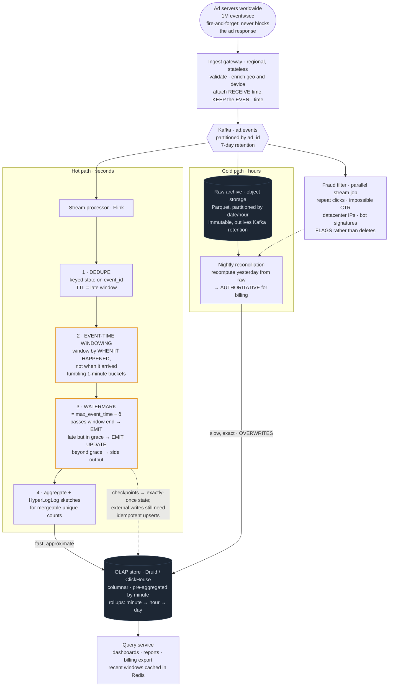

# 13 — Ad Click Aggregation / Real-Time Analytics

## Primary concepts and the hard part

**Concepts:** stream processing, event time vs processing time, watermarks, windowing, exactly-once semantics, Lambda vs Kappa architecture, OLAP storage, deduplication at extreme volume, backfill and reprocessing.

**The hard part they're probing:** **event time**. Clicks arrive late, out of order, and duplicated. Aggregating by arrival time is easy and wrong — it puts a click that happened at 10:00 into the 10:07 bucket, and advertisers are billed from these numbers. They want to see watermarks, late-data policy, and a story for correcting yesterday's totals.

---

## Requirements

**Functional**
- Ingest ad impression and click events
- Aggregate counts per (ad_id, minute), per campaign, per country/device
- Serve near-real-time dashboards (last few minutes)
- Serve historical reports (arbitrary ranges, arbitrary dimensions)
- Detect and exclude fraudulent/duplicate clicks
- Support billing — numbers must eventually be *exactly* right

**Non-functional**
- Ingest 1M events/sec, spiky
- Dashboard freshness: under ~1 minute
- Billing accuracy: exact, reconcilable, auditable
- Must tolerate late-arriving events (mobile offline, retries)
- Must support reprocessing after a bug

**Out of scope:** ad serving/auction (a different, latency-critical system), ML click prediction.

**Scale**
```
Events:       1M/sec → 86B/day
Event size:   ~200B → 17 TB/day raw
Cardinality:  1M ads × 1,440 minutes = 1.4B aggregate rows/day (before dimensions)
Query load:   dashboards ~1,000/sec; reports lower volume, heavier
```
**Conclusion:** raw events are too big to query directly and too valuable to discard. So: keep raw in cheap storage for reprocessing, serve queries from pre-aggregates. That split is the architecture.

---

## API / Model

```api
POST /v1/events || {event_id, type, ad_id, user_id, ts, country, device} || 202 || fire-and-forget from the ad server; never blocks a page
GET /v1/stats?ad_id=&from=&to=&granularity=minute|hour|day&group_by=country || || 200 aggregated stats
GET /v1/campaigns/{id}/summary || || 200 campaign summary
```

```schema
# Raw · immutable, source of truth
ad.events || || Kafka topic, partitioned by ad_id, retention 7d ||
raw archive || || S3 / object storage, partitioned by date and hour || enables replay
# Aggregates · OLAP, columnar (Druid / ClickHouse / BigQuery)
aggregates || PK: (ad_id, minute_bucket, country, device) || impressions, clicks, unique_users (HLL sketch), spend ||
# Dedupe state · stream processor, RocksDB-backed
event_id → seen || || || TTL = watermark lag window
# Late / correction log
corrections || || append-only record of adjustments || applied after a window closed
```

---

## High-level architecture



<details>
<summary>Plain-text version of this diagram</summary>

```text
  [Ad servers worldwide] ── 1M events/sec ──┐
     fire-and-forget, never block           │
     the ad response on analytics           │
                                             ▼
  ┌──────────────────────────────────────────────────────────┐
  │              INGEST GATEWAY (regional, stateless)         │
  │   validate, enrich (geo from IP, device parse),           │
  │   attach RECEIVE timestamp (keep the EVENT timestamp too) │
  └────────────────────────┬─────────────────────────────────┘
                            ▼
  ┌──────────────────────────────────────────────────────────┐
  │                 KAFKA: ad.events                          │
  │   partitioned by ad_id  → same ad always same partition   │
  │   (ordering per ad; enables per-key stateful processing)  │
  │   retention 7 days → REPLAYABLE                           │
  └──────┬───────────────────────────────────────┬───────────┘
          │                                       │
          │ HOT PATH (seconds)                    │ COLD PATH (hours)
          ▼                                       ▼
  ┌────────────────────────────┐      ┌──────────────────────────┐
  │   STREAM PROCESSOR (Flink)  │      │  ARCHIVE to OBJECT STORE  │
  │                             │      │  s3://raw/dt=/hr=         │
  │ ┌─────────────────────────┐ │      │  immutable, cheap,        │
  │ │ 1. DEDUPE               │ │      │  columnar (Parquet)       │
  │ │  keyed state on event_id│ │      └────────────┬─────────────┘
  │ │  TTL = late window      │ │                    │
  │ └───────────┬─────────────┘ │                    ▼
  │             ▼                │      ┌──────────────────────────┐
  │ ┌─────────────────────────┐ │      │  BATCH RECONCILIATION     │
  │ │ 2. EVENT-TIME WINDOWING │ │      │  (nightly)                │
  │ │                         │ │      │  recompute yesterday from │
  │ │  ⚠ window by WHEN IT    │ │      │  raw → authoritative      │
  │ │    HAPPENED, not when   │ │      │  numbers for BILLING      │
  │ │    it arrived           │ │      │  → overwrite stream       │
  │ │                         │ │      │    estimates              │
  │ │  tumbling 1-min buckets │ │      └────────────┬─────────────┘
  │ └───────────┬─────────────┘ │                    │
  │             ▼                │                    │
  │ ┌─────────────────────────┐ │                    │
  │ │ 3. WATERMARK             │ │                    │
  │ │  "we believe all events  │ │                    │
  │ │   before T have arrived" │ │                    │
  │ │  = max_event_time − δ    │ │                    │
  │ │  (δ ≈ 5 min allowed      │ │                    │
  │ │   lateness)              │ │                    │
  │ │                          │ │                    │
  │ │  watermark passes window │ │                    │
  │ │   end → EMIT result      │ │                    │
  │ │                          │ │                    │
  │ │  later arrival →         │ │                    │
  │ │   · within grace: EMIT   │ │                    │
  │ │     UPDATE (retraction)  │ │                    │
  │ │   · beyond grace: side   │ │                    │
  │ │     output → fixed by    │ │                    │
  │ │     batch layer          │ │                    │
  │ └───────────┬─────────────┘ │                    │
  │             ▼                │                    │
  │ ┌─────────────────────────┐ │                    │
  │ │ 4. AGGREGATE + SKETCHES │ │                    │
  │ │  counts, sums,           │ │                    │
  │ │  HyperLogLog for uniques │ │                    │
  │ └───────────┬─────────────┘ │                    │
  │             │                │                    │
  │  CHECKPOINTS to durable      │                    │
  │  storage → exactly-once      │                    │
  │  state on recovery           │                    │
  └─────────────┼────────────────┘                    │
                 ▼                                     ▼
  ┌──────────────────────────────────────────────────────────┐
  │        OLAP STORE  (Druid / ClickHouse)                   │
  │   columnar · pre-aggregated by minute                     │
  │   rollups: minute → hour → day (older data coarser)       │
  │   ← stream writes "fast, approximate"                     │
  │   ← batch OVERWRITES with "slow, exact"                   │
  └──────────────────────────┬───────────────────────────────┘
                              ▼
  ┌──────────────────────────────────────────────────────────┐
  │   QUERY SERVICE  → dashboards, reports, billing export    │
  │   cache recent windows in Redis                           │
  └──────────────────────────────────────────────────────────┘

  ┌──────────────────────────────────────────────────────────┐
  │  FRAUD FILTER (parallel stream job)                        │
  │   · same user clicking same ad repeatedly                  │
  │   · impossible click-through rates                         │
  │   · datacenter IP ranges, known bot signatures             │
  │   → flags events; billing excludes flagged                 │
  └──────────────────────────────────────────────────────────┘
```

</details>

---

## Trade-offs and deep dives

**Event time vs processing time — the core of the whole design.**

```
  A click HAPPENS at 10:00:30 on a phone that's in a tunnel.
  It ARRIVES at your ingest at 10:07:15.

  Processing-time windowing → counted in the 10:07 bucket.  WRONG.
  Event-time windowing      → counted in the 10:00 bucket.  RIGHT.
```

Advertisers are billed per minute and compare your numbers against their own. Attributing a click to the wrong minute is a billing dispute. Windowing must use the event's own timestamp.

But event-time windowing raises the question: when do you decide the 10:00 window is finished? You can't wait forever. That's what watermarks are for.

**Watermarks, explained.** A watermark is the processor's assertion: "I believe all events with timestamp earlier than T have now arrived." It's typically computed as `max_observed_event_time − allowed_lateness`. When the watermark passes a window's end, the window fires and emits its result.

The trade-off is explicit and worth stating: a **larger** allowed-lateness δ captures more stragglers but delays every result by δ. A **smaller** δ gives fresher dashboards but drops or defers more late data. Pick δ from the observed distribution of arrival delay (e.g. δ = p99 of `arrival_time − event_time`), and say you'd measure it rather than guess.

**Late data policy — three tiers.** Have an answer for each:
1. *Within the watermark* — included normally.
2. *After the window fired but within a grace period* — emit an updated result (a retraction plus a new value). Downstream stores must support upsert, which is why the OLAP layer is keyed by (ad, minute, dimensions) rather than append-only.
3. *Beyond grace* — route to a side output and let the nightly batch job fix it. Don't distort the streaming pipeline to chase the long tail.

**Lambda vs Kappa, and why this design is Lambda-ish.**
- *Kappa* (stream only, reprocess by replaying) is simpler and increasingly the default.
- *Lambda* (stream for speed, batch for truth) duplicates logic in two systems, which can drift.

For billing, the honest answer is a **hybrid that leans Kappa**: one stream pipeline produces the live numbers, and a *reprocessing run of the same code* over archived raw events produces the authoritative nightly figures. You get the correctness of a batch layer without maintaining two separate implementations. Stating it that way — same code, replayed — shows you understand why classic Lambda is criticized.

**Exactly-once, scoped honestly.** Flink's checkpointing gives exactly-once *state* semantics within the pipeline: on recovery, it restores state and rewinds Kafka offsets so no event is double-counted internally. But the moment you write to an external store, you need either a transactional sink or idempotent upserts keyed by (ad_id, window, dimensions). The end-to-end guarantee is *effectively* exactly-once, built from at-least-once delivery plus idempotent writes — the same framing as Module 5, applied to analytics.

Application-level dedupe on `event_id` is still required, because the ad server itself may retry and send the same event twice. That's outside Flink's guarantee entirely.

**Why an OLAP store.** These queries scan billions of rows to compute sums grouped by a few dimensions. A row-oriented OLTP database reads entire rows off disk to sum one column. Columnar stores read only the columns referenced, compress each column separately (very effectively, since adjacent values are similar), and vectorize the scan. Orders of magnitude difference for exactly this access pattern. Never run these reports against the transactional database.

**Pre-aggregation and rollups.** Storing every raw event forever in the query store is unaffordable. Pre-aggregate at ingestion to minute granularity, then roll minutes into hours after a few days and hours into days after a few months. Query granularity degrades with age, which matches how people actually use analytics — nobody needs minute-level data from eighteen months ago.

**Unique counts need sketches.** "Unique users who saw this ad" cannot be pre-aggregated by simple addition — you can't sum two unique-counts. Use **HyperLogLog** sketches, which are mergeable: the union of two sketches gives the unique count of the union, in a few KB, with ~2% error. If exact uniques are required for billing, compute them in the batch layer over raw data. This is a great place to show you know when approximation is acceptable and when it isn't.

**Ingest must never block ad serving.** The ad server fires events asynchronously and does not wait. If the analytics pipeline is down, ads still serve and events are dropped or buffered locally. Analytics completeness is subordinate to ad delivery — state that priority explicitly.

**Partitioning by ad_id.** Gives per-ad ordering and lets stateful operators keep per-key state locally. The risk is a hot key: one viral ad concentrates on one partition. Mitigate by salting the key for known-hot ads (`ad_123#0..9`) and summing the sub-aggregates downstream — you trade a merge step for even distribution.

---

## Possible follow-up questions

- *A bug caused three days of wrong aggregates. How do you fix it?* Fix the code, replay from the archived raw events (or Kafka if within retention) into a new output table, validate, then swap. This is the whole reason raw events are archived immutably — reprocessing is a first-class operation, not an emergency.
- *How do you detect click fraud?* A parallel stateful stream job: per-user click rate on the same ad, click-to-impression ratios that are statistically impossible, known datacenter IP ranges, and timing patterns too regular to be human. Flag rather than delete, so the decision is auditable and reversible.
- *Dashboard shows 1,000 clicks; billing says 970. How do you explain that?* Expected and correct: the dashboard is the streaming estimate including unfiltered and late-corrected data; billing is the batch-reconciled figure with fraud excluded. The key is that the discrepancy is *explainable and reconcilable*, not mysterious. Expose both numbers rather than hiding the difference.
- *What if Kafka retention expires before you notice a bug?* That's why raw events are archived to object storage independently of Kafka retention. Kafka is a transport buffer; the archive is the permanent record.
- *How do you handle a 10x traffic spike?* Kafka absorbs it (that's its job); autoscale Flink task managers on consumer lag; the OLAP store's write path batches naturally. Lag rising is the alert, and it's a leading indicator rather than a user-visible symptom.
- *Can you support arbitrary ad-hoc dimensions?* Not from pre-aggregates — those are fixed by the dimensions you chose. Ad-hoc slicing requires querying raw data in the warehouse, which is slower and more expensive. That's a real product boundary, and naming it is better than pretending pre-aggregation is free.
