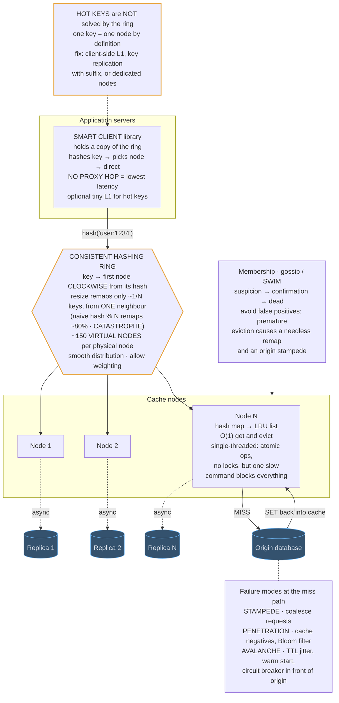

# 14 — Distributed Cache (Design Redis/Memcached)

## API / Model

```api
@commands
GET key || || value | NOT_FOUND
SET key value [EX ttl] || || OK
DEL key || || count
INCR key || || int || atomic, no read-modify-write race
MGET k1 k2 k3 || || values || batching cuts round trips
```

```schema
# Per node · in memory
hash_map || || key → node in doubly-linked list || O(1) lookup
LRU list || || MRU ◄──►◄──►◄──► LRU || O(1) reorder and evict
entry || || {key, value, expires_at, prev, next} ||
# Cluster state
ring || || hash position → physical node, via virtual nodes ||
membership || || node → alive | suspect | dead || gossip-propagated
```

---

## High-level architecture



<details>
<summary>Plain-text version of this diagram</summary>

```text
  ┌──────────────────────────────────────────────────────────────┐
  │                    APPLICATION SERVERS                         │
  │                                                                │
  │   ┌────────────────────────────────────────────────────┐      │
  │   │  SMART CLIENT (library)                             │      │
  │   │   · holds a copy of the ring                        │      │
  │   │   · hashes key → picks node → direct connection     │      │
  │   │   · NO PROXY HOP  ← lowest latency                  │      │
  │   │   · retries/failover on node error                  │      │
  │   │   · optional tiny L1 in-process cache for hot keys  │      │
  │   └───────────────────┬────────────────────────────────┘      │
  └───────────────────────┼───────────────────────────────────────┘
                           │  key "user:1234" → hash → 0x8A3F…
                           ▼
  ┌───────────────────────────────────────────────────────────────┐
  │                   CONSISTENT HASHING RING                       │
  │                                                                 │
  │                        0 / 2^32                                 │
  │                            │                                    │
  │              ┌─────────────┼─────────────┐                      │
  │        N3-v7 │             │             │ N1-v2                │
  │              │      ● key "user:1234"    │                      │
  │        N2-v4 │             │             │ N4-v9                │
  │              │             │             │                      │
  │        N1-v5 │             │             │ N3-v1                │
  │              └─────────────┼─────────────┘                      │
  │                       N2-v8│N4-v3                               │
  │                                                                 │
  │   key belongs to the FIRST node CLOCKWISE from its hash         │
  │                                                                 │
  │   VIRTUAL NODES: each physical node placed at ~150 ring         │
  │   positions. Without them, 4 random placements give wildly      │
  │   uneven arcs → uneven load. Averaging over 150 smooths it,     │
  │   and lets bigger machines take MORE vnodes (weighting).        │
  │                                                                 │
  │   ┌─────────────────────────────────────────────────────┐      │
  │   │ ADD A NODE:                                          │      │
  │   │   hash % N  →  ~80% of keys remap. CATASTROPHE.      │      │
  │   │   consistent hashing → only ~1/N keys remap,         │      │
  │   │   and only from the ONE neighbour clockwise.         │      │
  │   │   ← this is the entire reason the ring exists        │      │
  │   └─────────────────────────────────────────────────────┘      │
  └───────────┬──────────────┬──────────────┬─────────────────────┘
               ▼              ▼              ▼
     ┌──────────────┐ ┌──────────────┐ ┌──────────────┐
     │   NODE 1      │ │   NODE 2      │ │   NODE N      │
     │               │ │               │ │               │
     │ ┌───────────┐ │ │ ┌───────────┐ │ │ ┌───────────┐ │
     │ │ HASH MAP  │ │ │ │ HASH MAP  │ │ │ │ HASH MAP  │ │
     │ │ key→node* │ │ │ │           │ │ │ │           │ │
     │ └─────┬─────┘ │ │ └───────────┘ │ │ └───────────┘ │
     │       ▼        │ │               │ │               │
     │ ┌───────────┐ │ │               │ │               │
     │ │ LRU LIST  │ │ │               │ │               │
     │ │ MRU◄─►LRU │ │ │               │ │               │
     │ │ evict from│ │ │               │ │               │
     │ │ tail when │ │ │               │ │               │
     │ │ full      │ │ │               │ │               │
     │ └───────────┘ │ │               │ │               │
     │               │ │               │ │               │
     │ single-thread │ │               │ │               │
     │ command exec  │ │               │ │               │
     │ → atomic ops, │ │               │ │               │
     │   no locks    │ │               │ │               │
     │ ⚠ one slow    │ │               │ │               │
     │   command     │ │               │ │               │
     │   blocks ALL  │ │               │ │               │
     └──────┬───────┘ └──────┬───────┘ └──────┬───────┘
             │                 │                 │
             │  replica        │  replica        │
             ▼                 ▼                 ▼
     ┌──────────────┐ ┌──────────────┐ ┌──────────────┐
     │  N1 replica   │ │  N2 replica   │ │  Nn replica   │
     │  (async)      │ │               │ │               │
     └──────────────┘ └──────────────┘ └──────────────┘

  ┌───────────────────────────────────────────────────────────────┐
  │  MEMBERSHIP / FAILURE DETECTION (gossip, SWIM-style)            │
  │   nodes randomly probe peers; suspicion → confirmation →        │
  │   dead. Ring update propagates to clients.                      │
  │   ⚠ Avoid false positives: prematurely evicting a healthy node  │
  │     causes a needless mass remap and an origin stampede.        │
  └───────────────────────────────────────────────────────────────┘

  ═══════════════ ON A MISS ═══════════════
        client → cache MISS → origin database → SET back
        ⚠ this is where stampede/penetration/avalanche bite
```

</details>

There is no proxy tier: a smart client library inside each application server routes every request straight to a cache node. The origin database sits behind the nodes and is only read on a miss.

1. The application calls the smart client, which hashes the key, such as `user:1234`, against its own copy of the ring. Before that, it can answer the hottest keys from its optional tiny L1 cache.
2. On the consistent hashing ring, the key belongs to the first node clockwise from its hash. Every physical node sits at about 150 virtual node positions, so keys spread evenly and a resize remaps only about 1/N of them.
3. The client connects directly to that node, with no proxy hop in between.
4. The node finds the key in its hash map and moves the entry to the front of its LRU list, both in O(1). It runs commands on a single thread and evicts from the tail of the list when memory is full.
5. On a hit, the value goes straight back to the client.
6. On a MISS, the value is read from the origin database and SET back into the same node, so the next read for that key hits.

Two flows run beside the request path. Each node streams writes asynchronously to its own replica, and membership uses gossip in the SWIM style, moving a node through suspicion and confirmation before declaring it dead and changing the ring the clients use. The stampede, penetration and avalanche failure modes all surface at the miss path, as extra load on the origin database.

---
