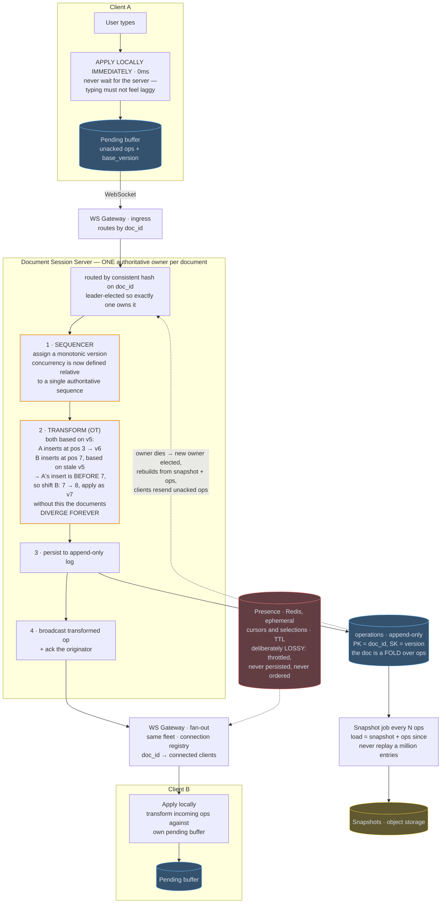

# 15 — Google Docs / Collaborative Editing

## API / Model

```api
# WebSocket
WS /v1/docs/{id}/connect || || 101
+ → client sends: {type:"op", doc_id, base_version, op, client_id, seq}
+ ← server sends: {type:"op", version, op, origin_client}
+                 {type:"ack", client_seq, version}
+                 {type:"presence", user_id, cursor, selection}
# REST
GET /v1/docs/{id} || || 200 latest snapshot + version
GET /v1/docs/{id}/history?from= || || 200 op history
POST /v1/docs/{id}/restore || {version} || 200
```

```schema
documents || PK: doc_id || title, owner, current_version, latest_snapshot_ref ||
operations || PK: doc_id SK: version || op (insert|delete, position, content), author_id, client_seq, ts || append-only with a monotonic, server-assigned version; the doc is a fold over ops
snapshots || PK: doc_id SK: version || content blob (object storage), created_at || taken every N ops so loading doesn't replay millions of entries
presence || || Redis, ephemeral: doc_id → {user_id: {cursor, selection, ts}} || TTL
```

---

## High-level architecture



<details>
<summary>Plain-text version of this diagram</summary>

```text
  ┌────────────────────────┐            ┌────────────────────────┐
  │      CLIENT A           │            │      CLIENT B           │
  │                         │            │                         │
  │  user types "X"         │            │  user types "Y"         │
  │        │                │            │        │                │
  │        ▼                │            │        ▼                │
  │  ┌──────────────────┐  │            │  ┌──────────────────┐  │
  │  │ APPLY LOCALLY     │  │            │  │ APPLY LOCALLY     │  │
  │  │ IMMEDIATELY (0ms) │  │            │  │ IMMEDIATELY       │  │
  │  │ ← never wait for  │  │            │  │                   │  │
  │  │   the server      │  │            │  │                   │  │
  │  └────────┬─────────┘  │            │  └────────┬─────────┘  │
  │           │             │            │           │             │
  │  ┌────────▼─────────┐  │            │  ┌────────▼─────────┐  │
  │  │ PENDING BUFFER   │  │            │  │ PENDING BUFFER   │  │
  │  │ unacked ops +    │  │            │  │                  │  │
  │  │ base_version     │  │            │  │                  │  │
  │  └────────┬─────────┘  │            │  └────────┬─────────┘  │
  └───────────┼────────────┘            └───────────┼────────────┘
               │  WebSocket                          │  WebSocket
               └──────────────┬──────────────────────┘
                               ▼
              ┌────────────────────────────────────┐
              │        WS GATEWAY (stateful)         │
              │   connection registry: doc_id →      │
              │   connected clients                  │
              └──────────────┬─────────────────────┘
                              ▼
  ┌──────────────────────────────────────────────────────────────┐
  │        DOCUMENT SESSION SERVER                                 │
  │        ⚠ ONE AUTHORITATIVE OWNER PER DOCUMENT                  │
  │        (routed by consistent hash on doc_id;                   │
  │         leader-elected so exactly one owns it)                 │
  │                                                                │
  │  ┌─────────────────────────────────────────────────────┐     │
  │  │  1. SEQUENCER — assign a total order                  │     │
  │  │     every op gets a monotonic version number.         │     │
  │  │     Concurrency is now defined relative to a single   │     │
  │  │     authoritative sequence, which is what makes       │     │
  │  │     convergence tractable at all.                     │     │
  │  └────────────────────┬────────────────────────────────┘     │
  │                        ▼                                       │
  │  ┌─────────────────────────────────────────────────────┐     │
  │  │  2. TRANSFORM (OT)                                    │     │
  │  │                                                       │     │
  │  │   Both clients based their op on version 5.           │     │
  │  │   A: insert "X" at pos 3     (arrives first → v6)     │     │
  │  │   B: insert "Y" at pos 7     (based on v5, stale)     │     │
  │  │                                                       │     │
  │  │   B's op must be TRANSFORMED against A's:             │     │
  │  │     A inserted 1 char at pos 3, which is BEFORE 7     │     │
  │  │     → shift B's position: 7 → 8                       │     │
  │  │     → apply as v7                                     │     │
  │  │                                                       │     │
  │  │   Without transformation, B's "Y" lands in the wrong  │     │
  │  │   place and the two documents DIVERGE FOREVER.        │     │
  │  └────────────────────┬────────────────────────────────┘     │
  │                        ▼                                       │
  │  ┌─────────────────────────────────────────────────────┐     │
  │  │  3. PERSIST op to append-only log                     │     │
  │  └────────────────────┬────────────────────────────────┘     │
  │                        ▼                                       │
  │  ┌─────────────────────────────────────────────────────┐     │
  │  │  4. BROADCAST transformed op to all other clients     │     │
  │  │     + ACK to the originator (with its version)        │     │
  │  └─────────────────────────────────────────────────────┘     │
  └──────────┬─────────────────────────────────┬─────────────────┘
              ▼                                 ▼
  ┌────────────────────────┐        ┌──────────────────────────┐
  │  operations (append-    │        │  PRESENCE (Redis)         │
  │  only log, Cassandra)   │        │  cursors, selections      │
  │  PK=doc_id SK=version   │        │  ephemeral, TTL, lossy    │
  └──────────┬─────────────┘        │  ← best-effort, NOT        │
              │                       │    persisted, NOT ordered  │
              │ every N ops           └──────────────────────────┘
              ▼
  ┌────────────────────────┐
  │  SNAPSHOT JOB           │
  │  fold ops → blob → S3   │
  │  load = snapshot +      │
  │         ops since       │
  │  (never replay 1M ops)  │
  └────────────────────────┘

  ═══════ CLIENT RECEIVES A REMOTE OP ═══════
   incoming op must be transformed against the client's OWN
   pending unacked ops before being applied locally.
   Transformation happens on BOTH ends — this symmetry is what
   makes everyone converge.
```

</details>

Each client edits its own copy immediately and syncs through the one Document Session Server that owns the document. WS Gateways carry ops in and out, and the operations log is the durable record everything else is rebuilt from.

1. Client A applies the keystroke locally at once and keeps the op, with its `base_version`, in its pending buffer. The op travels over the WebSocket to the WS Gateway, which routes it by `doc_id` to the Document Session Server that owns the document, and the sequencer there assigns it the next monotonic version.
2. If the op was based on an older version, the transform step adjusts it against the ops applied since, shifting its positions so it still lands where the user meant.
3. The session server persists the op to the append-only operations log, keyed by `doc_id` and `version`.
4. It broadcasts the transformed op through the WS Gateway, whose connection registry maps `doc_id` to connected clients, and acks Client A, which drops the op from its pending buffer.
5. Client B transforms the incoming op against its own pending buffer and applies it locally.

Two background flows keep the log usable. Every N ops, a snapshot job writes the folded document to object storage, so a load reads the latest snapshot plus the ops after it. If the owner dies, a new owner is elected, rebuilds from snapshot and ops, and clients resend their unacked ops. Presence takes its own path: cursors and selections live in Redis with a TTL and reach collaborators through the gateway, never through the operations log.

---
