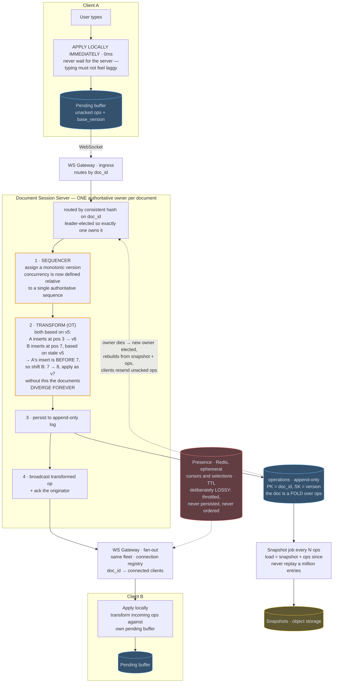
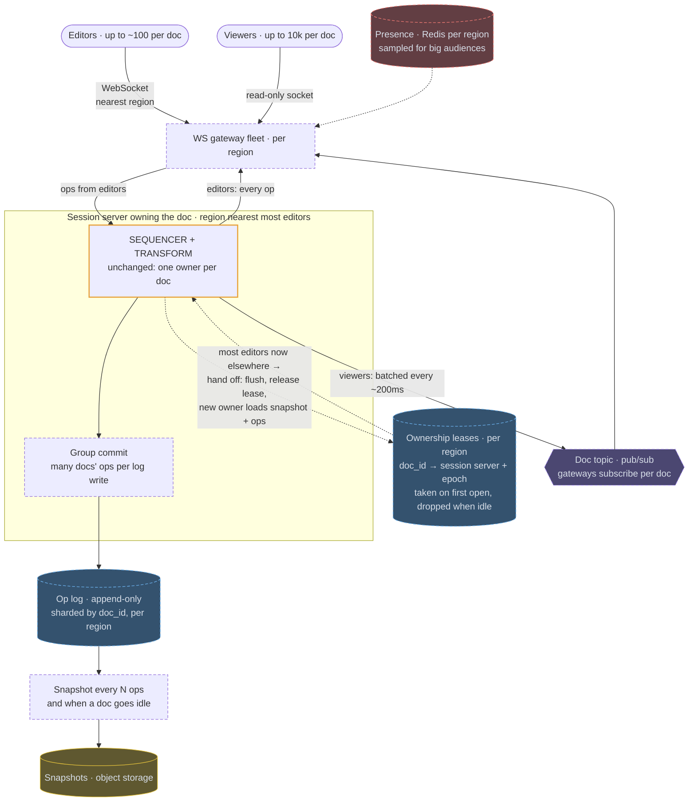

# 15 — Google Docs / Collaborative Editing

## API / Model

```api
# WebSocket
WS /v1/docs/{id}/connect || || 101
+ → client sends: {type:"op", doc_id, base_version, op, client_id, seq}
+ ← server sends: {type:"op", version, op, origin_client}
+                 {type:"ack", client_seq, version}
+                 {type:"presence", user_id, cursor, selection}
# REST
GET /v1/docs/{id} || || 200 latest snapshot + version
GET /v1/docs/{id}/history?from= || || 200 op history
POST /v1/docs/{id}/restore || {version} || 200
```

```schema
documents || PK: doc_id || title, owner, current_version, latest_snapshot_ref ||
operations || PK: doc_id SK: version || op (insert|delete, position, content), author_id, client_seq, ts || append-only with a monotonic, server-assigned version; the doc is a fold over ops
snapshots || PK: doc_id SK: version || content blob (object storage), created_at || taken every N ops so loading doesn't replay millions of entries
presence || || Redis, ephemeral: doc_id → {user_id: {cursor, selection, ts}} || TTL
```

---

## High-level architecture

<!-- tab: Today · 1M sessions -->



Each client edits its own copy immediately and syncs through the one Document Session Server that owns the document. WS Gateways carry ops in and out, and the operations log is the durable record everything else is rebuilt from.

1. Client A applies the keystroke locally at once and keeps the op, with its `base_version`, in its pending buffer. The op travels over the WebSocket to the WS Gateway, which routes it by `doc_id` to the Document Session Server that owns the document, and the sequencer there assigns it the next monotonic version.
2. If the op was based on an older version, the transform step adjusts it against the ops applied since, shifting its positions so it still lands where the user meant.
3. The session server persists the op to the append-only operations log, keyed by `doc_id` and `version`.
4. It broadcasts the transformed op through the WS Gateway, whose connection registry maps `doc_id` to connected clients, and acks Client A, which drops the op from its pending buffer.
5. Client B transforms the incoming op against its own pending buffer and applies it locally.

Two background flows keep the log usable. Every N ops, a snapshot job writes the folded document to object storage, so a load reads the latest snapshot plus the ops after it. If the owner dies, a new owner is elected, rebuilds from snapshot and ops, and clients resend their unacked ops. Presence takes its own path: cursors and selections live in Redis with a TTL and reach collaborators through the gateway, never through the operations log.

<!-- tab: At 10x · 10M sessions -->



Same product at 10x. Documents are still independent, so raw session count is the easy part; what 10x really adds is users in every region and documents with audiences today's design never planned for. Dashed outlines mark what's new or reshaped compared with today's design.

| | Today | At 10x |
|---|---|---|
| Concurrent edit sessions | 1M | 10M |
| Documents | 1B | ~10B |
| Op rate at peak | a few M/sec | tens of M/sec |
| Largest live audience on one doc | ~50 editors | ~100 editors + 10k viewers |
| Regions | 1 | several |

**What changes, and the number that forces it**

1. **Viewers stop costing the owner.** A company-wide doc with 10k people watching would make the owning server write every op to 10k sockets. Editors still receive every op directly, but viewers read from a per-document pub/sub topic that gateways subscribe to, receiving ops batched every ~200ms. The owner's work now grows with the number of editors, not the size of the audience.
2. **Ownership lives near the editors.** With users in every region, an owner on another continent adds a long round trip to every remote edit and ack. Optimistic local application hides it while typing, but collaborators' changes arrive late. The owner runs in the region closest to most active editors and hands off when that majority moves: flush, release the lease, and the new owner loads snapshot plus ops. It's the existing failover path, run on purpose.
3. **Leases replace per-document elections.** Running leader election for each of millions of open documents is a lot of coordination. A regional lease service maps `doc_id` to a session server; ownership is taken on first open and dropped once the doc goes idle, so the ~10B mostly idle documents cost nothing. A fencing epoch on the lease keeps a paused old owner from writing after a handoff.
4. **Op writes are group-committed.** Tens of millions of ops/sec as individual appends would be tens of millions of log writes. Each session server batches ops from every document it owns into one write every few milliseconds, then acks, well inside the 200ms remote-visibility budget.
5. **Snapshots follow activity.** Snapshotting every N ops still applies, plus a snapshot whenever a doc goes idle, so the next open, possibly on a different owner in a different region, loads quickly.
6. **Presence is sampled.** Ten thousand viewer cursors is noise, not collaboration. Large audiences show editors' cursors plus a count ("and 9,400 others"), and presence stays in each region's Redis without ever crossing regions.

**What stays the same**

Edits apply locally at 0ms. There is still one authoritative sequencer per document, convergence still comes from OT (or a CRDT), the op log is still append-only and never garbage-collected, snapshots remain an optimization on top of it, and presence stays deliberately lossy. The correctness core is untouched; 10x only changes who pays for the audience and where the owner sits.

<!-- /tabs -->

---
