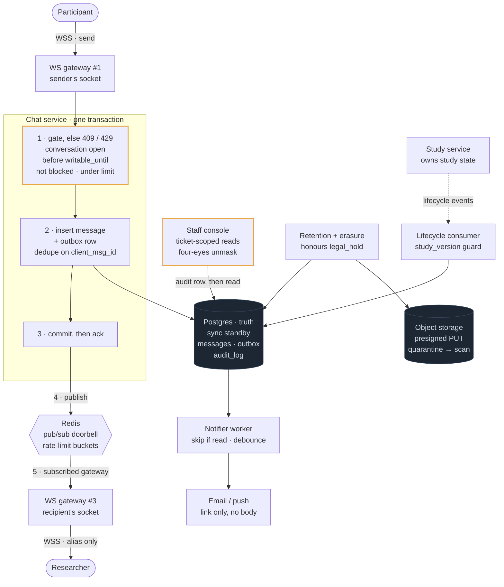

# 16 — Researcher–Participant Chat (Prolific-style)

## API / Model

```api
# WebSocket · session checked in the handshake
WS wss://chat.example.com/connect || || 101
+ → client sends: {type:"send", client_msg_id, conversation_id, body, attachment_ids[]}
+ → client sends: {type:"read", conversation_id, up_to_msg_id}
+ ← server sends: {type:"message"|"receipt"|"state", ...}
# REST · conversations and history
POST /v1/conversations || {study_id, submission_id} || 201 200 conversation_id, alias || upsert on the (study, researcher, participant) triple; nobody sends a participant_id
GET /v1/conversations?cursor= || || 200 conversation list || researcher-facing payloads carry aliases only
GET /v1/conversations/{id}/messages?before=&limit=50 || || 200 message page || ?after={message_id} for reconnect resync
POST /v1/conversations/{id}/messages || {client_msg_id, body, attachment_ids[]} || 201 409 429 message_id || socket fallback; 409 when the conversation isn't writable
POST /v1/conversations/{id}/attachments || {filename, content_type, size} || 201 attachment_id, upload_url || presigned PUT into quarantine
# Safety
POST /v1/conversations/{id}/report || {reason, message_ids[]} || 201 report_id || snapshots evidence, sets legal_hold
POST /v1/conversations/{id}/block || || 204
# Staff · separate service, support role only, every call audited
GET /staff/v1/tickets/{ticket_id}/conversations/{id} || || 200 403 full history || only conversations linked to the ticket
POST /staff/v1/conversations/{id}/unmask || {ticket_id, reason, approver_id} || 200 403 participant identity || four-eyes; audit row written before the response
```

```schema
# Postgres · primary + synchronous standby
conversations || PK: conversation_id UNIQUE: (study_id, researcher_id, participant_id) || participant_alias, state (open | frozen), writable_until, study_version, retention_deadline, legal_hold || the triple is the identity; state is materialized from lifecycle events
messages || PK: (conversation_id, message_id) UNIQUE: (conversation_id, client_msg_id) || sender_role, body (nullable), attachment_id, created_at, erased_at || message_id from a sequence: one writer, no Snowflake needed
receipts || PK: (conversation_id, role) || last_delivered_msg_id, last_read_msg_id || two rows per conversation; pointers only move forward
blocks || PK: (conversation_id, blocker_role) || created_at || checked inside the send transaction
attachments || PK: attachment_id || conversation_id, object_key, content_type, size, status (quarantined | clean | rejected) || bytes live in object storage; download URLs minted per request
notification_outbox || PK: outbox_id || recipient_id, conversation_id, message_id, not_before, sent_at || committed with the message; the worker debounces
# Safety and compliance
reports || PK: report_id || conversation_id, reporter_role, category, evidence_snapshot, status || opening a report sets legal_hold
audit_log || PK: audit_id || actor_id, ticket_id, conversation_id, action (view | unmask), reason, created_at || INSERT-only grant; shipped to write-once storage
```

Two columns on `conversations` carry most of the design. The `(study_id, researcher_id, participant_id)` triple is the identity, which makes creation idempotent and scopes every rule to one study. `state` plus `writable_until` is the gate every send passes through, in the same transaction as the insert.

---

## High-level architecture



<details>
<summary>Plain-text version of this diagram</summary>

```text
 [Participant]                                          [Researcher]
       │ WSS · send                                          ▲ WSS · alias only,
       ▼                                                     │ never participant_id
┌──────────────────────┐                          ┌──────────┴───────────┐
│ WS GATEWAY #1        │   3 nodes, N+1 spare     │ WS GATEWAY #3        │
│ holds sender socket  │   sockets only           │ subscribed to        │
└──────────┬───────────┘                          │ user:<researcher>    │
           │ 1. send frame                        └──────────────────────┘
           ▼                                                   ▲
┌────────────────────────────────────────────┐                 │ 5. push
│ CHAT SERVICE · one transaction per send    │                 │
│                                            │                 │
│ 2. token bucket in Redis, else 429         │                 │
│ 3. BEGIN                                   │                 │
│      state = open, now < writable_until,   │                 │
│      sender not blocked, else 409          │                 │
│      INSERT message, dedupe client_msg_id  │                 │
│      INSERT notification_outbox            │                 │
│    COMMIT, then ack "sent" to sender       │                 │
└──────────┬──────────────────────┬──────────┘                 │
           │ durable              │ 4. publish                 │
           ▼                      ▼                            │
┌─────────────────────────┐  ┌──────────────────────────────┐  │
│ POSTGRES · truth        │  │ REDIS pub/sub                │  │
│ primary + sync standby  │  │ doorbell only: a missed      ├──┘
└─────────────────────────┘  │ publish is repaired by       │
                             │ cursor resync on reconnect   │
                             └──────────────────────────────┘

 STUDY SERVICE ──lifecycle events──► LIFECYCLE CONSUMER
                 late, repeated or   UPDATE conversations SET state = …
                 out of order        WHERE study_version < event_version

 notification_outbox ──► NOTIFIER WORKER ──────────────► email / push
                         SKIP LOCKED · skip if read      link only,
                         debounce per conversation       no message body

 client ──presigned PUT──► OBJECT STORAGE · UK region
                           quarantine → AV scan, sniff type, strip EXIF
                           → clean → short-lived GET URL per request

 STAFF CONSOLE ──► 1. INSERT audit_log (if this fails, the read fails)
                   2. read a conversation linked to the ticket
                   3. unmask only with a reason + a second approver

 RETENTION + ERASURE ──► past retention_deadline, no legal_hold
                         → NULL bodies, delete objects, keep tombstones
```

</details>

---
