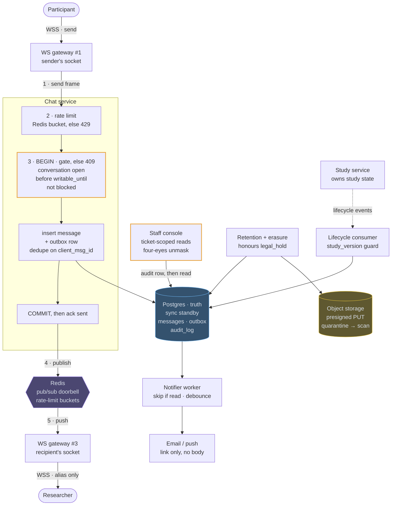
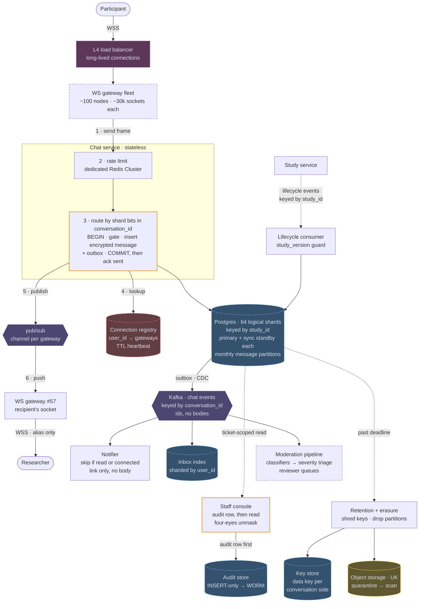

# 16 — Researcher–Participant Chat (Prolific-style)

## API / Model

```api
# WebSocket · session checked in the handshake
WS wss://chat.example.com/connect || || 101
+ → client sends: {type:"send", client_msg_id, conversation_id, body, attachment_ids[]}
+ → client sends: {type:"read", conversation_id, up_to_msg_id}
+ ← server sends: {type:"message"|"receipt"|"state", ...}
# REST · conversations and history
POST /v1/conversations || {study_id, submission_id} || 201 200 conversation_id, alias || upsert on the (study, researcher, participant) triple; nobody sends a participant_id
GET /v1/conversations?cursor= || || 200 conversation list || researcher-facing payloads carry aliases only
GET /v1/conversations/{id}/messages?before=&limit=50 || || 200 message page || ?after={message_id} for reconnect resync
POST /v1/conversations/{id}/messages || {client_msg_id, body, attachment_ids[]} || 201 409 429 message_id || socket fallback; 409 when the conversation isn't writable
POST /v1/conversations/{id}/attachments || {filename, content_type, size} || 201 attachment_id, upload_url || presigned PUT into quarantine
# Safety
POST /v1/conversations/{id}/report || {reason, message_ids[]} || 201 report_id || snapshots evidence, sets legal_hold
POST /v1/conversations/{id}/block || || 204
# Staff · separate service, support role only, every call audited
GET /staff/v1/tickets/{ticket_id}/conversations/{id} || || 200 403 full history || only conversations linked to the ticket
POST /staff/v1/conversations/{id}/unmask || {ticket_id, reason, approver_id} || 200 403 participant identity || four-eyes; audit row written before the response
```

All of it lives in one Postgres primary with a synchronous standby.

```erd
# Access and safety · who may send, who may see
conversations || the triple is the identity; state is materialized from lifecycle events
+ conversation_id || bigint || PK
+ study_id || uuid
+ researcher_id || uuid
+ participant_id || uuid
+ participant_alias || text
+ state || open | frozen
+ writable_until || timestamptz || null
+ study_version || bigint
+ retention_deadline || timestamptz || null
+ legal_hold || boolean
+ UNIQUE (study_id, researcher_id, participant_id)
blocks || checked inside the send transaction
+ conversation_id || bigint || PK → conversations
+ blocker_role || role || PK
+ created_at || timestamptz
reports || opening a report sets legal_hold
+ report_id || bigint || PK
+ conversation_id || bigint || → conversations
+ reporter_role || role
+ category || text
+ evidence_snapshot || jsonb
+ status || text
audit_log || INSERT-only grant; shipped to write-once storage
+ audit_id || bigint || PK
+ actor_id || uuid
+ ticket_id || uuid
+ conversation_id || bigint || → conversations
+ action || view | unmask
+ reason || text
+ created_at || timestamptz
# Messages and delivery
messages || message_id from a sequence: one writer, no Snowflake needed
+ conversation_id || bigint || PK → conversations
+ message_id || bigint || PK
+ client_msg_id || uuid
+ sender_role || role
+ body || text || null
+ attachment_id || bigint || null → attachments
+ created_at || timestamptz
+ erased_at || timestamptz || null
+ UNIQUE (conversation_id, client_msg_id)
attachments || bytes live in object storage; download URLs minted per request
+ attachment_id || bigint || PK
+ conversation_id || bigint || → conversations
+ object_key || text
+ content_type || text
+ size || bigint
+ status || quarantined | clean | rejected
receipts || two rows per conversation; pointers only move forward
+ conversation_id || bigint || PK → conversations
+ role || role || PK
+ last_delivered_msg_id || bigint || null → messages.message_id
+ last_read_msg_id || bigint || null → messages.message_id
notification_outbox || committed with the message; the worker debounces
+ outbox_id || bigint || PK
+ recipient_id || uuid
+ conversation_id || bigint || → conversations
+ message_id || bigint || → messages.message_id
+ not_before || timestamptz
+ sent_at || timestamptz || null
```

Two columns on `conversations` carry most of the design. The `(study_id, researcher_id, participant_id)` triple is the identity, which makes creation idempotent and scopes every rule to one study. `state` plus `writable_until` is the gate every send passes through, in the same transaction as the insert.

---

## High-level architecture

<!-- tab: Today · ~200 msg/s -->



Everything durable lives in Postgres. The WS gateways hold sockets, Redis rings the recipient's gateway and holds rate-limit buckets, and the remaining boxes are side flows that read or write the same database.

1. The participant sends a frame over WSS to WS gateway #1, which forwards it to the Chat service.
2. The Chat service checks the sender's token bucket in Redis and rejects the send with 429 if it's empty, before any database work.
3. Inside one transaction, the gate rejects the send with 409 unless the conversation is open, still before `writable_until`, and not blocked. Otherwise the service inserts the message and a `notification_outbox` row, deduping on `client_msg_id`, commits, and only then acks `sent` to the participant with the new `message_id`.
4. It publishes to the recipient's Redis channel, `user:<id>`.
5. Redis delivers the publish to the subscribed gateway, WS gateway #3, which pushes the message to the researcher over WSS with the participant's alias only.

The side flows all meet at Postgres. The lifecycle consumer applies study service events to conversation state, guarded by `study_version`. The notifier worker drains the outbox into an email or push that carries a link but no message body. The staff console writes an audit row before each ticket-scoped read. Retention + erasure clears expired message bodies and attachment objects unless `legal_hold` is set, and attachments reach object storage through a presigned PUT into quarantine.

<!-- tab: At 100x · ~20k msg/s -->



Same product and the same rules, at 100x the traffic. Dashed outlines mark what's new or reshaped compared with today's design; every other box is the same component doing the same job.

| | Today | At 100x |
|---|---|---|
| Concurrent connections | ~30k | ~3M |
| Messages at peak | ~200/sec | ~20k/sec |
| Database writes at peak, receipts included | ~600/sec | ~60k/sec |
| Message rows inside retention | ~400 GB | ~40 TB |
| Attachments | ~20 GB/day | ~2 TB/day |
| Gateway nodes | 3 | ~100 |

**What changes, and the number that forces it**

1. **Gateways: 3 nodes → ~100 behind an L4 load balancer.** 3M sockets at ~30k per node, deliberately below the ~50k ceiling so a dead node's clients fit on its neighbours when they reconnect. Reconnect storms after a deploy or an outage size this tier more than steady traffic does, so deploys drain a few nodes at a time and clients back off with jitter.
2. **Per-user channels → a connection registry.** Three million per-user subscriptions no longer sit comfortably on one Redis, and Redis Cluster's classic pub/sub broadcasts every publish to every node. The chat service looks up `user_id → gateways` in a TTL'd registry and publishes to each gateway's own channel, which is the Slack design's shape. The registry also answers questions that used to be free: which of a user's devices are online, and whether the notifier can skip an email because the recipient is connected. Rate-limit buckets move to a separate Redis Cluster so registry churn during a reconnect storm can't stall sends.
3. **One Postgres → 64 logical shards keyed by `study_id`.** ~20k inserts/sec would squeeze onto a large primary. What doesn't fit is ~60k writes/sec once receipts are counted, and 40 TB on one box: restores measured in hours, vacuum that falls behind, and retention fighting live sends. Logical shards start on a few physical primaries, each still with a synchronous standby, and move as they grow. The shard number is embedded in `conversation_id`, so every request routes without a lookup, and lifecycle events keyed by `study_id` land in order on the shard that owns the study.
4. **The send transaction still touches one shard.** Everything the gate reads (`state`, `writable_until`, blocks) and everything a send writes (message, outbox, receipts) is keyed by the conversation, so it's co-located. No distributed transaction, no saga: the gate is still a column read inside one `BEGIN … COMMIT`. This is what *"shardable by `study_id`, but not sharded on day one"* was buying. Message IDs stay per-shard sequences, because ordering only matters within a conversation.
5. **Conversation lists need an inbox index.** Keying by study scatters one person's conversations across shards, so *my conversations* would fan out to all 64. An inbox index sharded by `user_id` is built from the event stream and lags by about a second, which a list can tolerate. Erasure uses the same index to find every shard holding a user's messages.
6. **Outbox polling → CDC into Kafka.** Three consumers now need every send (notifier, inbox index, moderation), and polling 64 outbox tables once per consumer doesn't scale. Logical decoding streams each shard's outbox into Kafka, keyed by `conversation_id` to keep per-conversation order. Events carry IDs, not bodies, so Kafka never becomes another copy to erase. The doorbell still fires straight after commit: routing it through CDC would add a second of latency and no durability, since clients resync from Postgres anyway.
7. **Moderation becomes a pipeline.** Reports grow with users and reviewers don't autoscale, which is why moderation breaks before any database does. Classifiers score messages from the stream, severity triage orders the reviewer queues, and confident hits in severe categories freeze the conversation right away, pending a human.
8. **Retention shreds keys instead of rewriting rows.** ~200M bodies expire every day, and nulling them row by row is a second write workload as large as the average send rate. Instead, each conversation side's messages are encrypted with their own data key, held in a small key store outside the shards. Retention and erasure delete the key, which makes those bodies unreadable everywhere at once, backups and replicas included. Space comes back later: copy the few rows under `legal_hold` forward, then detach whole monthly partitions. The cost is a key fetch on sends and history reads, cached briefly in the service.
9. **Audit gets its own store.** With conversations spread across shards, the audit log can't share their transaction. Staff reads commit the audit row to a dedicated append-only store first, then read the shard. It still fails closed; the ordering is now the guarantee rather than a shared database.

**What stays the same**

The hard parts don't grow with traffic, so they don't change. The gate is still a column read inside the send transaction, every researcher-facing payload still passes through the alias serializer, staff reads are still ticket-scoped and audited before any data returns, and emails still carry a link and no body. Attachments keep the presigned, quarantined flow; only the scan workers autoscale. And it's still one UK region, spread across availability zones, because residency outranks latency for this company.

In an interview, tie every new box to the row in the table that forces it. At today's numbers none of them clears the bar, which is exactly why today's design doesn't have them.

<!-- /tabs -->

---
