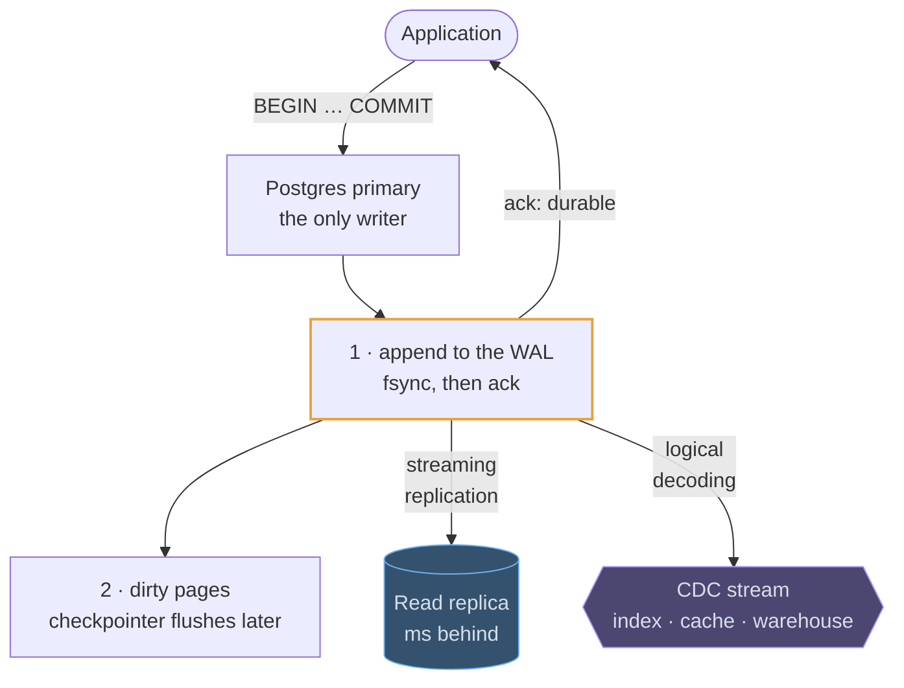

# PostgreSQL

## How it works

Postgres is a single-primary relational database. One node accepts writes; read
replicas stream changes from it. Every write first goes to the **write-ahead log**
(WAL) and is only then applied to data pages, which is what makes a crash
recoverable and what replicas replay to stay current.

Concurrency is handled by **MVCC**: an update writes a new version of the row and
leaves the old one visible to transactions that started earlier. Readers never
block writers and writers never block readers. The cost is garbage — dead row
versions that `VACUUM` reclaims later.



The WAL is why one durable write is cheap: an append and an `fsync`, not a
random page write. It is also the seam every derived store hangs off, so a
search index or a cache is fed by the same log rather than by a second write
from the application.

## The scaling path

Say it in this order, and stop at the step the numbers justify:

1. **Vertical.** A modern box handles tens of thousands of simple writes per second. Most interview systems never leave this step.
2. **Read replicas.** Reads scale out; writes do not. Replicas lag, usually by milliseconds.
3. **Partitioning.** One table split by range or hash inside the same database, so queries and vacuum touch less data.
4. **Sharding.** Many independent Postgres clusters keyed by tenant or user id, with routing in the application or a proxy such as Citus. Cross-shard transactions and joins stop being free — this is the step you justify carefully.

## Where it fits in a design

Postgres is the natural **source of truth**: the row that must be right lives
here, and everything else is derived from it. A worked example — orders paid for
exactly once, with the idempotency key and the money in the same transaction:

```erd
# Orders · Postgres
orders || one row per order; state moves forward only
+ order_id || bigint || PK
+ customer_id || bigint || → customers
+ state || pending | paid | refunded
+ total_minor_units || bigint
+ created_at || timestamptz
# Customers and payments
customers
+ customer_id || bigint || PK
+ email || citext
+ created_at || timestamptz
+ UNIQUE (email)
payment_attempts || the UNIQUE key is the whole idempotency mechanism
+ attempt_id || bigint || PK
+ order_id || bigint || → orders
+ idempotency_key || uuid
+ psp_ref || text || null
+ state || text
+ UNIQUE (order_id, idempotency_key)
```

> The strongest move is to make Postgres your default and then argue your way
> off it. *"Postgres holds the orders because I want a transaction across the
> payment row and the order row; the feed is Cassandra because it is append-only
> and needs multi-region writes"* is a much better answer than reaching for a
> distributed database on the first slide.
