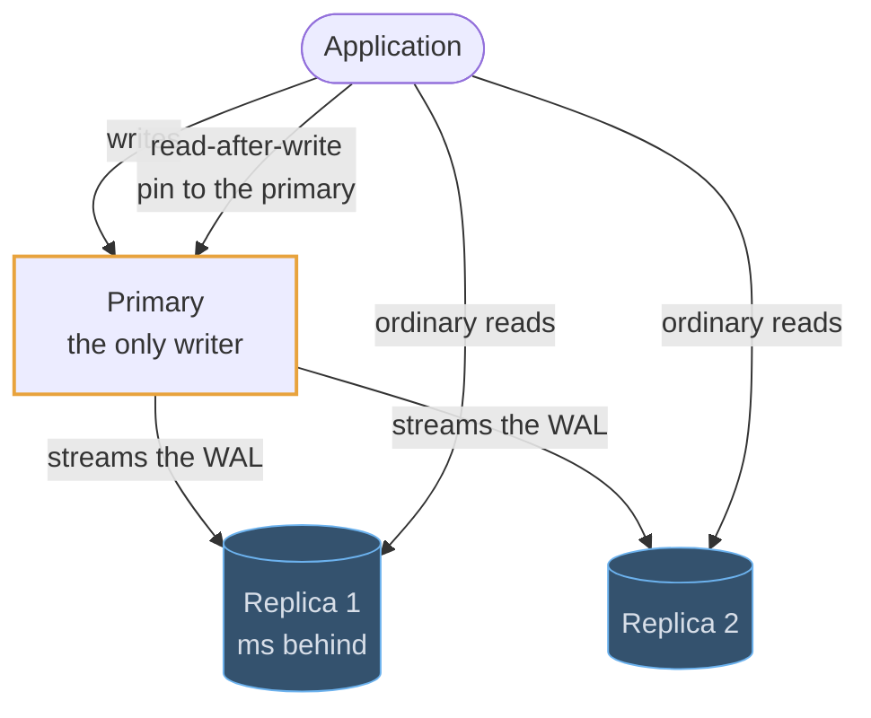
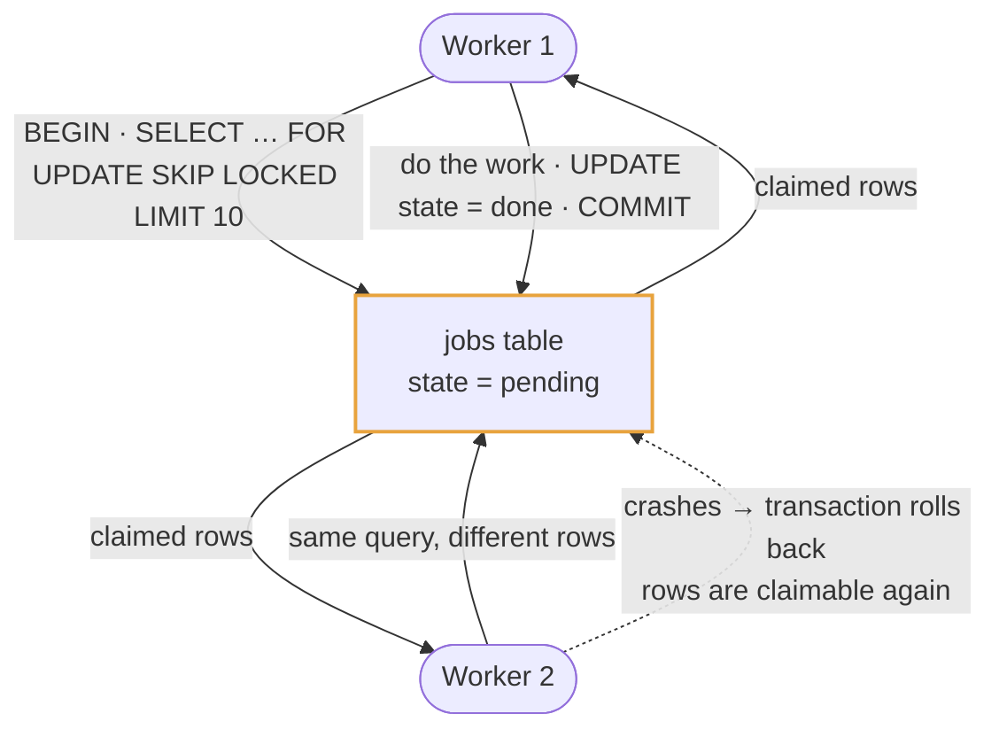
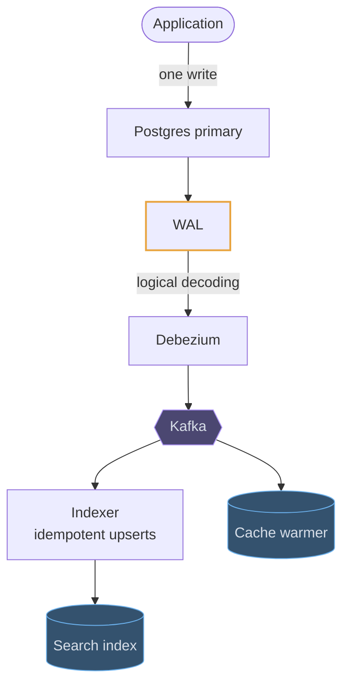
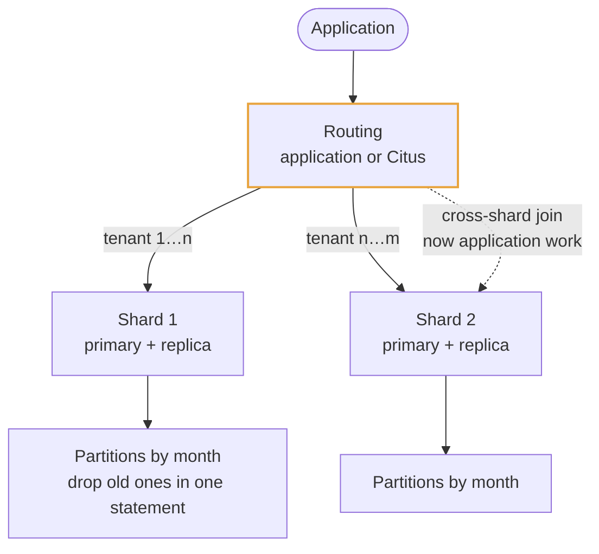

# PostgreSQL

## Use cases

### Orders and money, in one transaction

The reason to reach for Postgres first. An order row and its payment attempt are
written in the same transaction, so a crash between them is impossible, and the
`UNIQUE (order_id, idempotency_key)` index means a retried checkout returns the
original result instead of charging twice.

```erd
# Orders · Postgres
orders || one row per order; the state column only moves forward
+ order_id || bigint || PK
+ customer_id || bigint || → customers
+ state || pending | paid | refunded
+ total_minor_units || bigint
+ created_at || timestamptz
customers
+ customer_id || bigint || PK
+ email || citext
+ UNIQUE (email)
# Payments
payment_attempts || the UNIQUE key is the whole idempotency mechanism
+ attempt_id || bigint || PK
+ order_id || bigint || → orders
+ idempotency_key || uuid
+ psp_ref || text || null
+ state || text
+ UNIQUE (order_id, idempotency_key)
```

### Read scaling, and the read-after-write trap

Reads scale out on replicas; writes do not. The catch is the user who posts and
immediately reloads: their own write may not have arrived on the replica yet.
Route that one read to the primary, or return the write's own result.



### A work queue, without a queue

`SELECT … FOR UPDATE SKIP LOCKED` lets several workers drain one table safely:
each claims rows nobody else holds, and a worker that dies rolls back and the
rows become claimable again. Good enough for outbox rows, scheduled emails and
retries — and one fewer system than Kafka.



### Feeding a search index from the WAL

Logical decoding turns the same write-ahead log into a stream of row changes, so
a search index, a cache or a warehouse is fed from the database's own log rather
than by a second write from the application. That is what makes the index
rebuildable, and what keeps it from silently diverging.



### Growing past one primary

Partitioning splits one table by range or hash inside the same database, so
queries and vacuum touch less data. Sharding splits it across independent
clusters keyed by tenant or user id — at which point transactions become sagas
and joins become application-side fan-out, so it is the step you justify.


