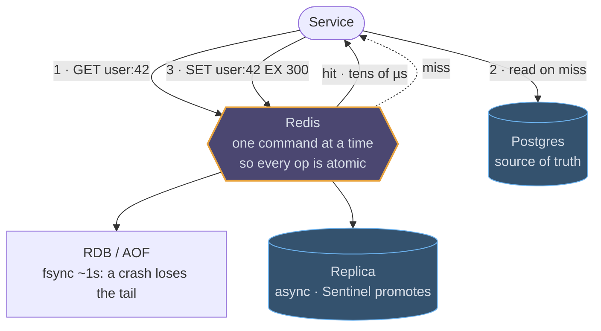

# Redis

## How it works

Redis keeps its whole dataset in memory and serves commands from a single thread
per shard. That sounds like a limitation and is actually the feature: because one
command runs at a time, every operation is atomic without you taking a lock.
Reads and writes land in the tens of microseconds; a network round trip is the
dominant cost.

Durability is optional and worth understanding, because it decides whether Redis
is a cache or a store. **RDB** takes periodic point-in-time snapshots; **AOF**
appends every write to a log, fsynced every second by default. Either way a crash
can lose the last second of writes. Treat Redis as authoritative only for data
you can afford to lose or rebuild.

For availability, a primary replicates asynchronously to replicas and Sentinel
promotes one on failure. For size, **Redis Cluster** hashes keys into 16,384 slots
spread over shards; multi-key operations only work when the keys live in the same
slot, which is what hash tags (`user:{123}:feed`) are for.

## Cache-aside, the shape you will draw



Three steps, and the third one is where the interview goes: what TTL, who
deletes the key on write, and what a thousand simultaneous misses do to the
database behind it.

## The rate limiter, in one Lua script

The token bucket is the canonical multi-step operation, and it is why Lua
scripts exist: read the bucket, refill it by elapsed time, spend a token and
re-arm the TTL, all as one unit on the server with no lock and no race.

```erd
# Rate limiting · Redis
rl:{identity}:{endpoint} || refilled lazily on read; TTL = the window, so idle keys evict themselves || Redis hash
+ tokens || int
+ last_refill_ts || timestamp
window:{identity} || one member per request; ZREMRANGEBYSCORE trims the window before counting || sorted set
+ member || request_id
+ score || timestamp
```
