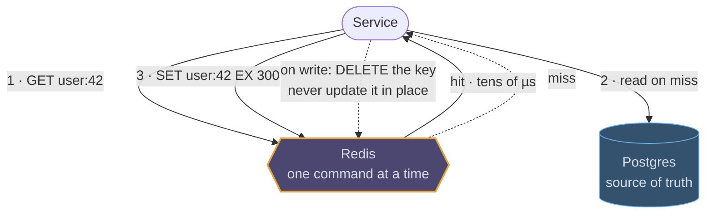
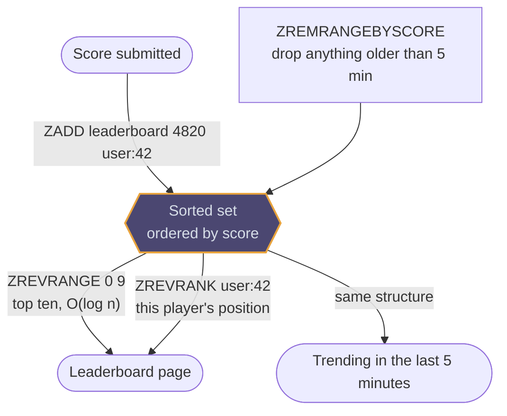
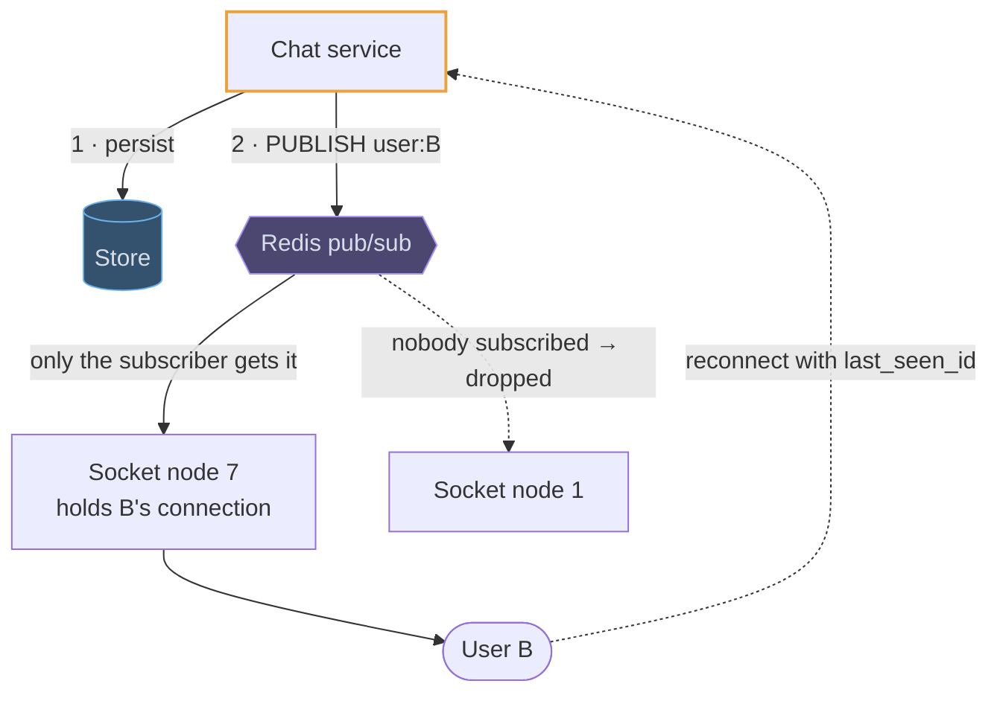

# Redis

## Use cases

### Cache-aside in front of a database

The most common use by far, and the interesting part is never the cache itself:
it is the TTL, who deletes the key on write, and what a thousand simultaneous
misses do to the database behind it.



### Rate limiting that is actually global

Counters in each application instance let through N times your limit. One Redis
holds the bucket for every instance, and a Lua script makes refill-and-spend a
single atomic step. The TTL is the window, so idle keys evict themselves and
there is no cleanup job.

```erd
# Token bucket · Redis
rl:{identity}:{endpoint} || refilled lazily on read, spent in one Lua script; TTL = the window || Redis hash
+ tokens || int
+ last_refill_ts || timestamp
# Sliding window · the alternative
window:{identity} || one member per request; ZREMRANGEBYSCORE trims the window before counting || sorted set
+ member || request_id
+ score || timestamp
```

### Leaderboards, trending and "the last N"

A sorted set keeps members ordered by score for free, so the top ten is a range
read rather than a scan and a sort. The same structure holds a time window: score
by timestamp, trim the old end, and the set is always "the last five minutes".



### A doorbell for a socket tier

Pub/sub is how a message reaches the one server holding a user's connection
without a registry lookup. It is a doorbell, not a delivery guarantee: the
message is already durable before the publish, and a missed publish is repaired
by the client's reconnect.


