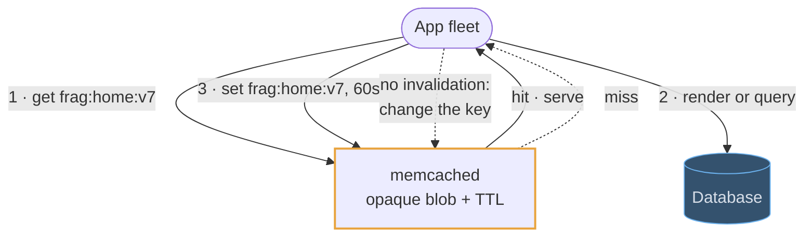
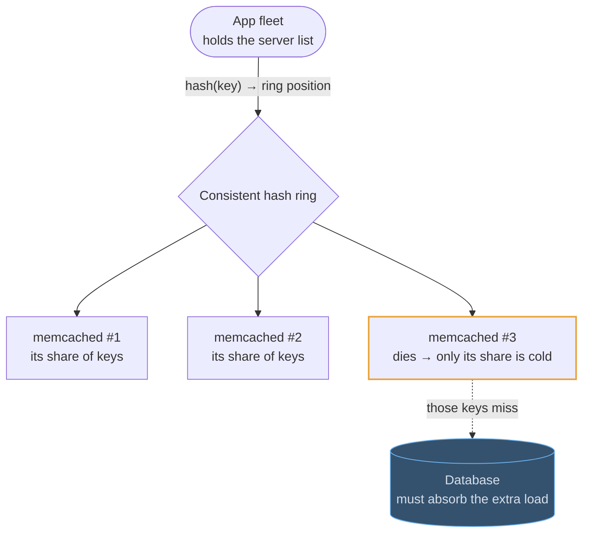
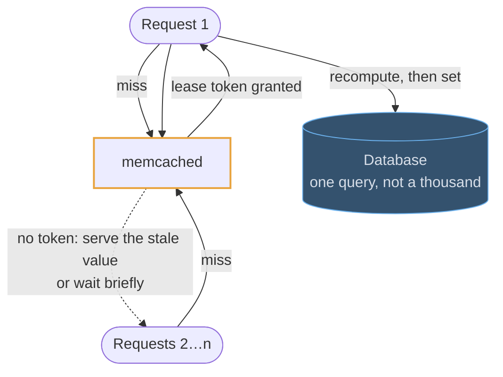

# Memcached

## Use cases

### A look-aside cache for rendered fragments

The shape Memcached exists for: an opaque blob under a key, read far more often
than it is written, cheap enough per byte that a huge fleet of cache nodes is
affordable. A rendered HTML fragment, a serialized API response, a query result.

### Surviving a dead node

There is no cluster: the client holds the server list and picks a node by
consistent hashing. A node dying costs you its share of the keys and nothing
else — provided the database behind it can absorb that share of misses, which is
the question you will be asked.

### Stopping a stampede with leases

A popular key expires and every request misses at once. The lease is the named
technique: exactly one client is handed the token to recompute, and the rest
serve the stale value for the moment it takes.

