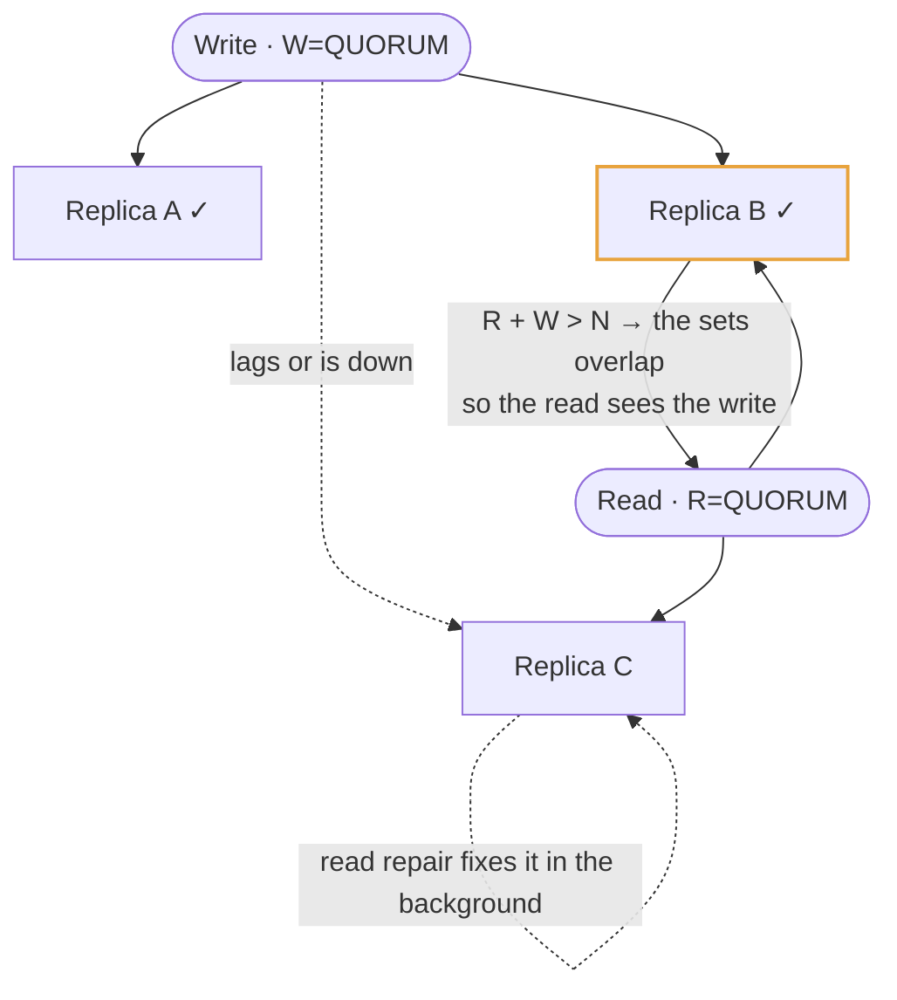
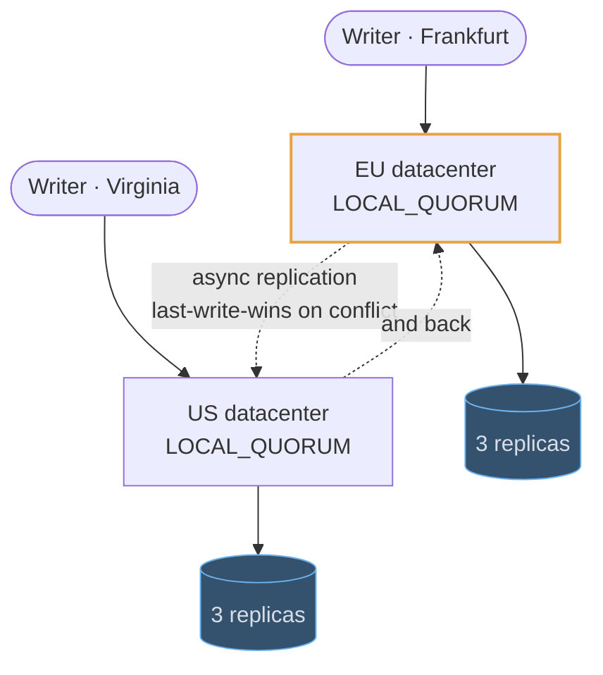

# Cassandra

## Use cases

### Chat messages and feeds, keyed for the query

The canonical shape. `channel_id` picks the node, `day_bucket` stops one busy
channel growing an unbounded partition, and `created_at DESC` makes "the last 50
messages" one contiguous read. A second query means a second table holding the
same rows, written at the same time.

```erd
# Messages · Cassandra
messages_by_channel || one partition per channel per day; "the last 50" is one contiguous read || Cassandra
+ channel_id || uuid || PK
+ day_bucket || date || PK
+ created_at || timestamp || SK DESC
+ message_id || timeuuid || SK
+ sender_id || uuid
+ body || text
# The same rows, keyed for a second query
messages_by_sender || duplicated on write, because writes are the cheap part || Cassandra
+ sender_id || uuid || PK
+ created_at || timestamp || SK DESC
+ channel_id || uuid || → messages_by_channel
+ message_id || timeuuid
```

### Absorbing a firehose of writes

Every node accepts every request, and a write is durable after a sequential
append plus a memory write — no read-before-write and no random disk IO. That is
why the answer to "two million writes a second, append-only" is this shape rather
than a bigger primary.


### Choosing freshness per query

Consistency is a dial you set per statement, not a property of the cluster. Work
the arithmetic out loud: with N=3, QUORUM writes and QUORUM reads overlap on at
least one replica, so a read sees the latest acknowledged write and one node can
be down. `ONE` is faster and may be stale — fine for a view counter, not for a
balance.



### Writing in two regions without a leader

Replicas are placed per datacenter, and each side commits on a **local quorum**,
so a write in Frankfurt does not wait for Virginia. Cross-region replication is
asynchronous, and conflicts resolve last-write-wins — which is exactly why this
suits feeds and messages, and not balances.


