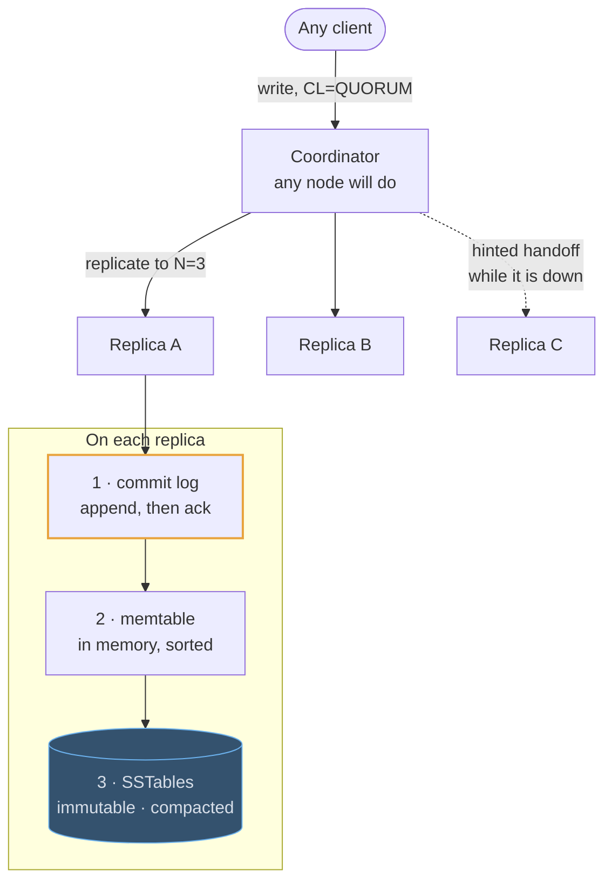

# Cassandra

## How it works

Cassandra is a wide-column store built for one thing: absorbing enormous write
volume across many nodes with no single point of failure.

Every node is equal. Keys are placed on a ring by **consistent hashing** — each
node owns many small token ranges (vnodes), so adding a node takes a slice from
everyone rather than re-splitting one neighbour. Any node can serve any request by
forwarding it to the replicas that own the key. Nodes learn about each other by
gossip; there is no leader to elect and nothing to fail over.

Writes are fast because of the **LSM tree**. A write goes to a commit log and an
in-memory memtable and is immediately acknowledged. Memtables are flushed to
immutable SSTables on disk, and background compaction merges them. Nothing is
updated in place, so there are no random disk writes and no read-before-write.



Consistency is a per-query dial. With replication factor `N`, you choose how many
replicas must answer a read (`R`) and a write (`W`). When `R + W > N`, the two sets
overlap and a read is guaranteed to see the latest acknowledged write. `QUORUM`
for both is the usual pick; `ONE` buys latency and gives up freshness.

## The table you will be asked to design

A messages table is the canonical shape: `PRIMARY KEY ((channel_id, day_bucket),
created_at, message_id)`.

```erd
# Messages · Cassandra
messages_by_channel || one partition per channel per day; "the last 50" is one contiguous read || Cassandra
+ channel_id || uuid || PK
+ day_bucket || date || PK
+ created_at || timestamp || SK DESC
+ message_id || timeuuid || SK
+ sender_id || uuid
+ body || text
# The same rows, keyed for a second query
messages_by_sender || duplicated on write, because writes are the cheap part || Cassandra
+ sender_id || uuid || PK
+ created_at || timestamp || SK DESC
+ channel_id || uuid || → messages_by_channel
+ message_id || timeuuid
```

`channel_id` picks the node. `day_bucket` keeps one busy channel from growing an
unbounded partition. `created_at` descending makes "the last 50 messages" a
contiguous disk read. The second table is not an index — it is the same data
written twice, on purpose.

## Where it fits in a design

In feed and chat designs Cassandra typically sits beside Postgres, not instead of
it: Postgres holds users, channels and memberships — the small relational data
with invariants — while Cassandra holds the enormous append-only body of
messages.

> Saying that split out loud, with the reason for each half, is what a strong
> answer sounds like.
