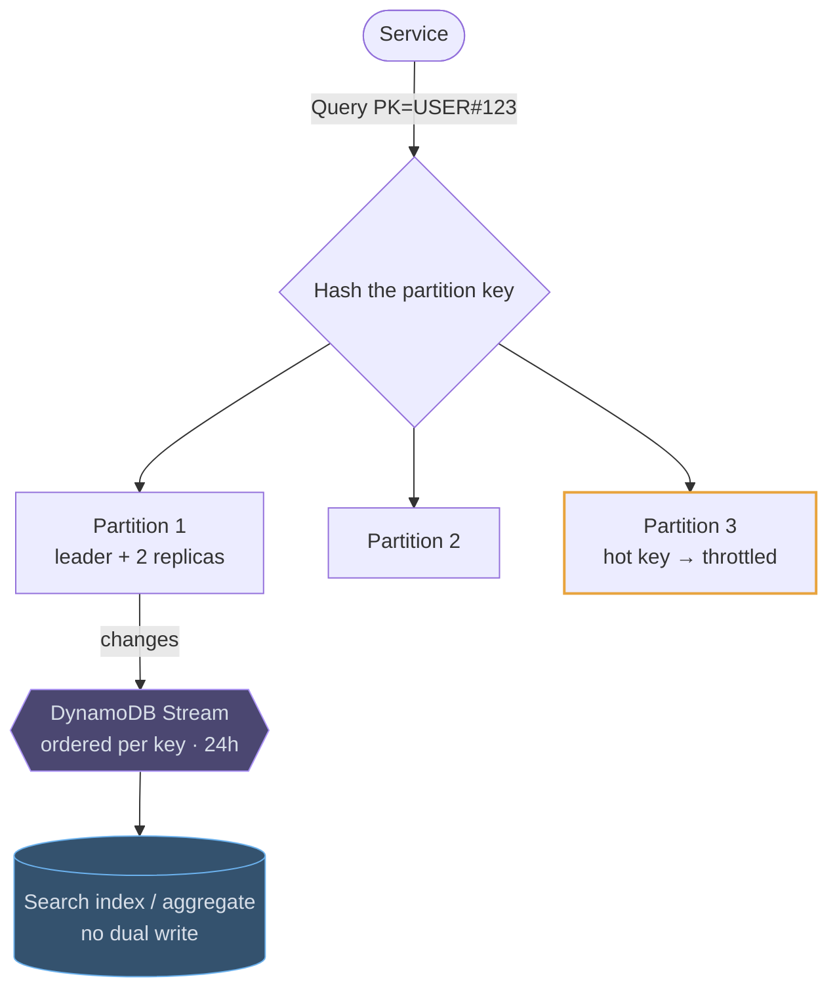

# DynamoDB

## How it works

DynamoDB is a managed key-value and document store. You do not run nodes, choose a
replication factor or plan a resharding: you declare a key and a capacity mode,
and it holds single-digit millisecond latency whether the table has a thousand
items or a trillion.

Every item lives under a **partition key** and, optionally, a **sort key**. The
partition key is hashed to place the item; the sort key orders items inside that
partition and is what makes range queries possible. Data is replicated across
three availability zones, so a read is either **eventually consistent** (the
default, cheaper, may be a moment stale) or **strongly consistent** (reads the
leader replica, costs twice as much).



Capacity comes in two modes. **On-demand** bills per request and absorbs spikes
with no configuration. **Provisioned** reserves read and write units and is
cheaper for steady, predictable traffic; auto-scaling adjusts it over minutes, not
seconds.

## Single-table design, in one picture

Because there are no joins, related entities are packed into one table with a
composite key scheme, so a single `Query` returns a user and their recent orders
in one round trip. It reads strangely, and it is the idiomatic pattern.

```erd
# One table, several entity types
app_table || PK=USER#123 with SK between ORDER# and ORDER#~ returns the user's orders in one Query || DynamoDB
+ PK || text || PK
+ SK || text || SK
+ type || USER | ORDER | SESSION
+ attributes || document
+ ttl || epoch seconds || null
# Item shapes it holds
examples || the same table, three key patterns
+ USER#123 / PROFILE || the profile item
+ USER#123 / ORDER#2026-01-02 || one order, sorted by date
+ ORDER#987 / ITEM#3 || a line item under its order
```

## Where it fits in a design

The comparison worth having ready is with Cassandra: the same wide-column shape
and the same hot-partition risk, but managed, with conditional writes and
transactions built in, and a hard 400 KB item limit.

> "Key-based access, spiky traffic, and I would rather spend the interview on the
> access patterns than on running a ring" is the sentence that earns it.
