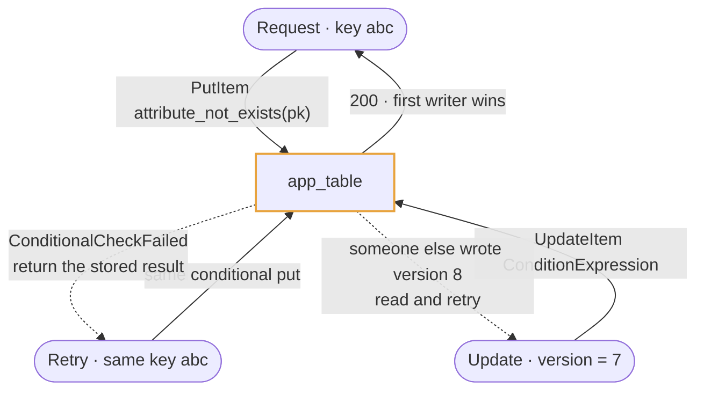
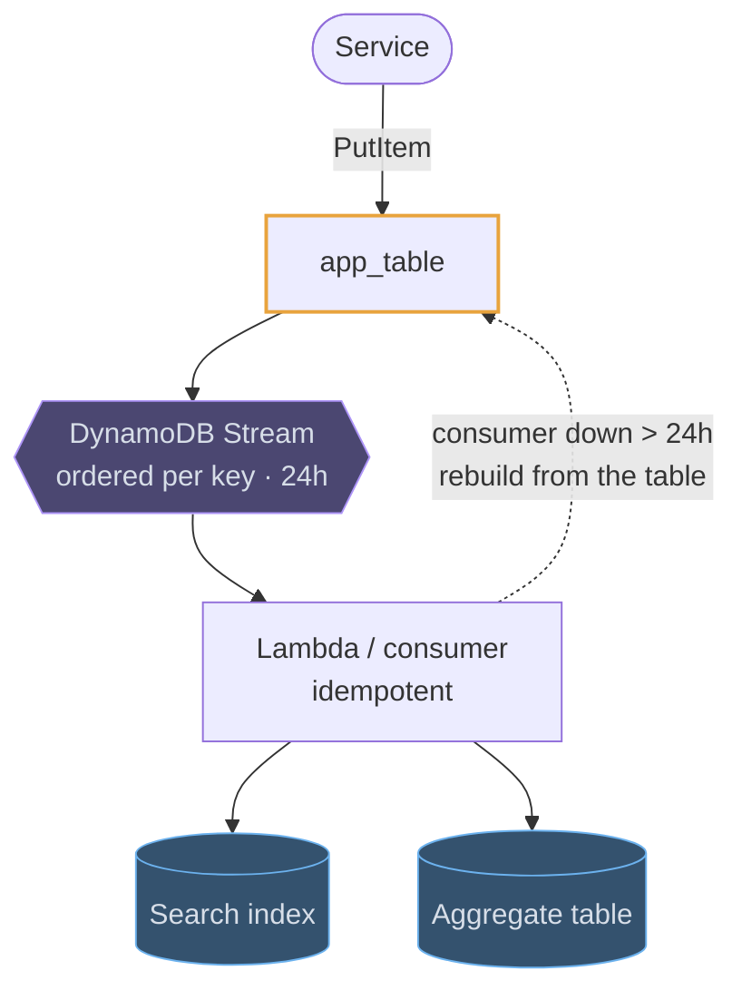
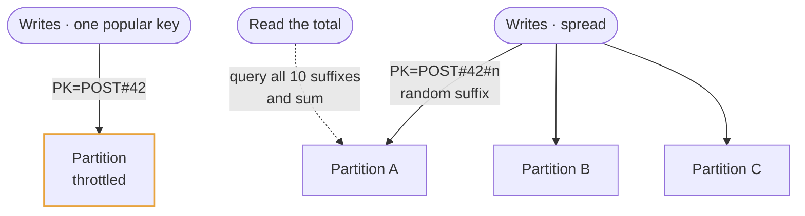

# DynamoDB

## Use cases

### One table, one round trip

There are no joins, so related entities are packed under one partition key and
retrieved together: `PK=USER#123` with a sort key range between `ORDER#` and
`ORDER#~` returns the profile and the recent orders in a single `Query`. It reads
strangely and it is the idiomatic pattern.

```erd
# One table, several entity types
app_table || one Query returns a user and their orders; the SK prefix is the entity type || DynamoDB
+ PK || text || PK
+ SK || text || SK
+ type || USER | ORDER | SESSION
+ attributes || document
+ ttl || epoch seconds || null
# The key patterns it holds
examples || same table, three shapes
+ USER#123 / PROFILE || the profile item
+ USER#123 / ORDER#2026-01-02 || one order, sorted by date
+ ORDER#987 / ITEM#3 || a line item under its order
```

### Exactly-once without a lock

A conditional write is the concurrency primitive: `PutItem` with
`attribute_not_exists(pk)` succeeds for the first caller and fails for every
retry, which is an idempotency key, a username claim or a lock, depending on what
you put in the key.



### Fanning changes out with Streams

Every change can be published in order per partition key and kept for 24 hours.
That stream is how a search index, an aggregate or a notification is driven from
the table without the application writing to two places and getting them out of
step.



### Spreading a hot partition

Traffic concentrated on one partition key is throttled even though the table has
capacity, because a partition has its own ceiling. The fix is in the key: add a
suffix and fan the reads across it, or bucket by time so today's writes are not
all one key.


