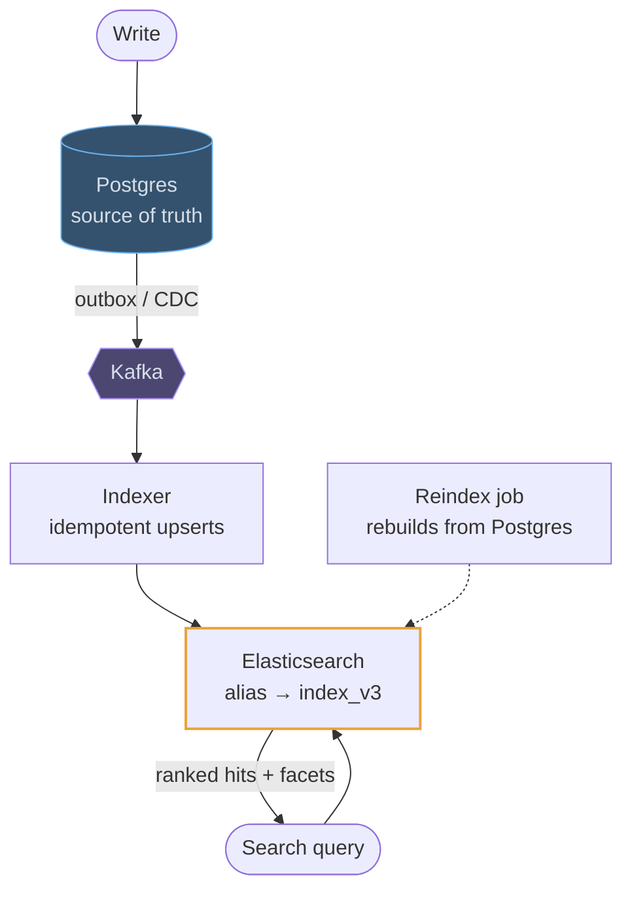

# Elasticsearch

## How it works

Elasticsearch wraps Lucene in a distributed cluster. The idea underneath is the
**inverted index**: instead of storing documents and scanning them, it stores, for
every term, the list of documents containing it. Finding every document with
"distributed" becomes a dictionary lookup, and finding documents with two terms
becomes a list intersection.

An index is split into **shards**, each a self-contained Lucene index, with replica
shards for redundancy and read throughput. Indexing is **near real time**, not real
time: new documents become searchable when a segment is refreshed, by default once
a second. Segments are immutable; updates write a new document and mark the old one
deleted, and background merges clean up.

## The architecture that earns marks

Elasticsearch is a **derived index, not the source of truth**. Writes go to
Postgres or Cassandra; the index is populated from a change stream, and can be
rebuilt from scratch whenever it drifts.

The dashed line matters as much as the solid ones: if you cannot rebuild the
index from the source of truth, a bad mapping or a dropped message is permanent.
Dual-writing from the application to both stores is the anti-pattern the
interviewer is listening for.

## Where it fits in a design

Two shapes come up: full-text search and typeahead over a corpus, and log or
event search with aggregations. Both are read-side systems hanging off a write
store.

> If the corpus is small or the requirement is a simple `LIKE` filter, Postgres
> full-text search is a legitimate answer and saves you a system. Knowing when
> *not* to add Elasticsearch reads as judgement.
